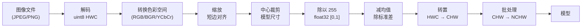
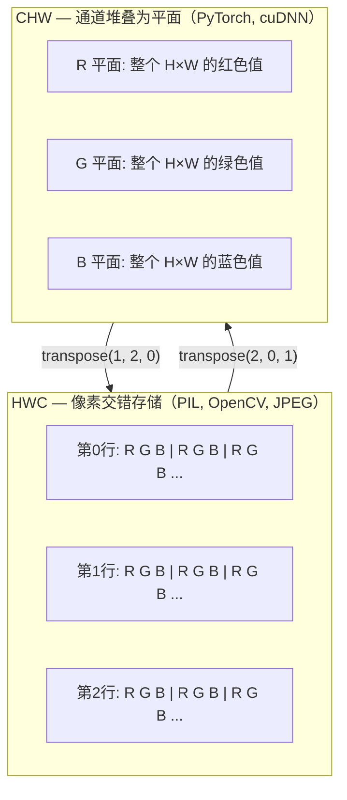

> 图像是光的采样张量。你将来用到的每一个视觉模型，都从这一个事实出发。

## 学习目标

- 解释连续场景如何被离散化为像素，以及采样/量化决策如何给下游所有模型设置了天花板
- 把图像当 NumPy 数组来读取、切片和检查，熟练切换 HWC 和 CHW 布局
- 在 RGB、灰度、HSV 和 YCbCr 之间转换，并解释每种色彩空间存在的原因
- 精确执行像素级预处理（归一化、标准化、缩放、通道优先），完全符合 torchvision 的期望

## 为什么要学这个

你将来读的每篇论文、下载的每个预训练权重、调用的每个视觉 API，都假设输入是特定编码的。把 `uint8` 图片喂给期望 `float32` 的模型——它照样跑，然后默默输出垃圾。把 BGR 送给在 RGB 上训练的网络，准确率掉 10 个百分点。给模型传 channels-last 但它期望 channels-first，第一个卷积层会把高度当特征通道。这些都不报错，只是毁掉你的指标，然后你花一周找一个藏在"图片怎么加载"里的 bug。

卷积本身不复杂——搞清楚它在滑什么才是关键。问题是"一张图片"对相机、JPEG 解码器、PIL、OpenCV、torchvision、CUDA kernel 来说含义不同。每个技术栈有自己的轴顺序、字节范围和通道约定。搞不清这些的视觉工程师，发出去的管道必定是坏的。

这节课把地基打好，让后面所有课都能建在上面。学完你会知道像素是什么、为什么每个像素有三个数而不是一个、"用 ImageNet 统计量归一化"到底在干什么、以及怎么在后续每节课都会用到的两三种布局之间切换。

## 核心概念

### 完整预处理管道一览

每个生产级视觉系统都是同一串可逆变换。搞错一步，模型看到的就不是它训练时看到的东西了。



80% 的静默故障都出在"减均值除标准差"和"转置布局"这两步：标准化缺了或布局弄反了。

### 像素是采样值，不是方块

相机传感器计数落在一个微型探测器网格上的光子。每个探测器积分几分之一秒的光，发出一个与光子数成正比的电压。传感器把这个电压离散化为整数。一个探测器变成一个像素。

```
连续场景                    传感器网格                    数字图像
(无限细节)                  (H × W 个探测器)              (H × W 个整数)

    ~~~~~                   +--+--+--+--+--+              210 198 180 155 120
   ~   ~   ~                |  |  |  |  |  |              205 195 178 152 118
  ~ 光线 ~     ---->        +--+--+--+--+--+    ---->     200 190 175 150 115
   ~~~~~                    |  |  |  |  |  |              195 185 170 148 112
                            +--+--+--+--+--+              188 180 165 145 108
```

这一步有两个选择，它们决定了下游所有事情的天花板：

- **空间采样** 决定每度场景多少个探测器。太少，边缘出锯齿（aliasing）。太多，存储和算力爆炸。
- **亮度量化** 决定电压被分成多少档。8 bit 给 256 级，是显示标准。10、12、16 bit 给更平滑的渐变，在医学成像、HDR 和 RAW 管道中重要。

像素不是有面积的彩色方块。它是一次测量。当你缩放或旋转时，你在重采样这个测量网格。

### 为什么有三个通道

一个探测器计数整个可见光谱的光子——那就是灰度。要得到颜色，传感器在网格上覆盖红、绿、蓝滤光片的马赛克。去马赛克后，每个空间位置有三个整数：红色滤光探测器、绿色滤光探测器、蓝色滤光探测器的响应。这三个整数就是像素的 RGB 三元组。

```
内存中的一个像素：

    (R, G, B) = (210, 140, 30)   ← 偏橙红色

一张 H × W 的 RGB 图像：

    shape (H, W, 3)     存储为   H 行 × W 像素 × 3 个值
                                 每个值 [0, 255]（uint8）
```

三不是什么神奇数字。深度相机加 Z 通道。卫星加红外和紫外波段。医学影像通常是一个通道（X 光、CT）或很多个（高光谱）。通道数是最后一个轴；卷积层学习怎么跨通道混合。

### 两种布局约定：HWC 和 CHW

同一个张量，两种排列。每个库选一种。

```
HWC (高, 宽, 通道)                     CHW (通道, 高, 宽)

   W →                                    H →
  +-----+-----+-----+                   +-----+-----+
H |R G B|R G B|R G B|                 C |R R R R R R|
| +-----+-----+-----+                 | +-----+-----+
↓ |R G B|R G B|R G B|                 ↓ |G G G G G G|
  +-----+-----+-----+                   +-----+-----+
                                         |B B B B B B|
                                         +-----+-----+

  PIL、OpenCV、matplotlib               PyTorch、大多数深度学习
  几乎所有磁盘上的图像文件               框架、cuDNN 内核
```

CHW 存在是因为卷积核在 H 和 W 上滑动。通道轴放第一意味着每个核看到的是每通道一个连续的 2D 平面，向量化效率高。磁盘格式保持 HWC 因为那是扫描线从传感器出来的顺序。

你将打一千遍的一行转换：

```python
img_chw = img_hwc.transpose(2, 0, 1)      # NumPy
img_chw = img_hwc.permute(2, 0, 1)        # PyTorch tensor
```

内存布局示意：



### 字节范围和 dtype

三种约定主导：

| 约定 | dtype | 范围 | 哪里会看到 |
|------|-------|------|-----------|
| 原始 | `uint8` | [0, 255] | 磁盘文件、PIL、OpenCV 输出 |
| 归一化 | `float32` | [0.0, 1.0] | `img.astype('float32') / 255` 之后 |
| 标准化 | `float32` | 大约 [-2, +2] | 减均值除标准差之后 |

卷积网络是在标准化输入上训练的。ImageNet 统计量 `mean=[0.485, 0.456, 0.406]`、`std=[0.229, 0.224, 0.225]` 是在 [0, 1] 归一化后的像素上，对 ImageNet 训练集三个通道算出的均值和标准差。把原始 `uint8` 喂给期望标准化浮点的模型，是应用视觉中最常见的静默错误。

### 色彩空间和它们存在的理由

RGB 是采集格式，但并不总是对模型最有用的表示。

```
 RGB               HSV                       YCbCr / YUV

 R 红              H 色相 (角度 0-360)        Y 亮度
 G 绿              S 饱和度 (0-1)             Cb 蓝黄色度
 B 蓝              V 明度 (0-1)               Cr 红绿色度

 线性对应           把颜色跟亮度分开。          把亮度跟颜色分开。
 传感器输出         用于颜色阈值分割、          JPEG 和大多数视频编解码器
                   UI 滑块、简单滤镜          更猛地压缩色度通道，因为
                                             人眼对色度细节远不如对
                                             亮度敏感。
```

大多数现代 CNN 喂 RGB。遇到其他空间的场景：

- **HSV** — 经典 CV 代码、基于颜色的分割、白平衡。
- **YCbCr** — 读 JPEG 内部结构、视频管道、只在 Y 上做的超分辨率模型。
- **灰度** — OCR、文档模型、颜色是噪声变量而非信号的任何场景。

从 RGB 到灰度是加权求和，不是平均，因为人眼对绿色比对红蓝更敏感：

```
Y = 0.299 R + 0.587 G + 0.114 B       (ITU-R BT.601，经典权重)
```

### 宽高比、缩放和插值

每个模型有固定输入尺寸（大多数 ImageNet 分类器是 224×224，现代检测器是 384×384 或 512×512）。你的图片很少刚好对上。三种缩放选择：

- **缩放短边再中心裁剪** — 标准 ImageNet 方案。保持宽高比，切掉边缘一条。
- **缩放后填充** — 保持宽高比和所有像素，加黑边。检测和 OCR 的标准做法。
- **直接缩放到目标尺寸** — 拉伸图片。便宜，扭曲几何，但很多分类任务够用。

插值方法决定新网格不对齐旧网格时中间像素怎么算：

```
最近邻         最快，有锯齿，mask/标签的唯一选择
双线性         快，平滑，大多数图像缩放的默认选项
双三次         较慢，放大时更清晰
Lanczos       最慢，质量最好，用于最终展示
```

经验法则：训练用双线性，要看的素材用双三次或 Lanczos，任何包含整数类别 ID 的东西用最近邻。

## 从零实现

### 第一步：加载图像并检查形状

用 Pillow 加载 JPEG 或 PNG，转成 NumPy，打印信息。用合成图片做确定性示例。

```python
import numpy as np
from PIL import Image

def synthetic_rgb(h=128, w=192, seed=0):
    rng = np.random.default_rng(seed)
    yy, xx = np.meshgrid(np.linspace(0, 1, h), np.linspace(0, 1, w), indexing="ij")
    r = (np.sin(xx * 6) * 0.5 + 0.5) * 255
    g = yy * 255
    b = (1 - yy) * xx * 255
    rgb = np.stack([r, g, b], axis=-1) + rng.normal(0, 6, (h, w, 3))
    return np.clip(rgb, 0, 255).astype(np.uint8)

arr = synthetic_rgb()
print(f"type:   {type(arr).__name__}")
print(f"dtype:  {arr.dtype}")
print(f"shape:  {arr.shape}     # (H, W, C)")
print(f"min:    {arr.min()}")
print(f"max:    {arr.max()}")
print(f"pixel at (0, 0): {arr[0, 0]}")
```

预期输出：`shape: (H, W, 3)`，`dtype: uint8`，范围 `[0, 255]`。无论字节来自相机、JPEG 解码器还是合成生成器，这都是标准的磁盘表示。

### 第二步：拆分通道和重排布局

分别取出 R、G、B，然后从 HWC 转为 CHW 给 PyTorch 用。

```python
R = arr[:, :, 0]
G = arr[:, :, 1]
B = arr[:, :, 2]
print(f"R shape: {R.shape}, mean: {R.mean():.1f}")
print(f"G shape: {G.shape}, mean: {G.mean():.1f}")
print(f"B shape: {B.shape}, mean: {B.mean():.1f}")

arr_chw = arr.transpose(2, 0, 1)
print(f"\nHWC shape: {arr.shape}")
print(f"CHW shape: {arr_chw.shape}")
```

三个灰度平面，每通道一个。CHW 只是重排轴；当内存布局允许时不需要真正复制数据。

### 第三步：灰度和 HSV 转换

加权求和灰度，然后手动 RGB 转 HSV。

```python
def rgb_to_grayscale(rgb):
    weights = np.array([0.299, 0.587, 0.114], dtype=np.float32)
    return (rgb.astype(np.float32) @ weights).astype(np.uint8)

def rgb_to_hsv(rgb):
    rgb_f = rgb.astype(np.float32) / 255.0
    r, g, b = rgb_f[..., 0], rgb_f[..., 1], rgb_f[..., 2]
    cmax = np.max(rgb_f, axis=-1)
    cmin = np.min(rgb_f, axis=-1)
    delta = cmax - cmin

    h = np.zeros_like(cmax)
    mask = delta > 0
    rmax = mask & (cmax == r)
    gmax = mask & (cmax == g)
    bmax = mask & (cmax == b)
    h[rmax] = ((g[rmax] - b[rmax]) / delta[rmax]) % 6
    h[gmax] = ((b[gmax] - r[gmax]) / delta[gmax]) + 2
    h[bmax] = ((r[bmax] - g[bmax]) / delta[bmax]) + 4
    h = h * 60.0

    s = np.where(cmax > 0, delta / cmax, 0)
    v = cmax
    return np.stack([h, s, v], axis=-1)

gray = rgb_to_grayscale(arr)
hsv = rgb_to_hsv(arr)
print(f"gray shape: {gray.shape}, range: [{gray.min()}, {gray.max()}]")
print(f"hsv  shape: {hsv.shape}")
print(f"hue range: [{hsv[..., 0].min():.1f}, {hsv[..., 0].max():.1f}] degrees")
print(f"sat range: [{hsv[..., 1].min():.2f}, {hsv[..., 1].max():.2f}]")
print(f"val range: [{hsv[..., 2].min():.2f}, {hsv[..., 2].max():.2f}]")
```

### 第四步：归一化、标准化和逆操作

从原始字节变成预训练 ImageNet 模型期望的精确张量，然后反过来。

```python
mean = np.array([0.485, 0.456, 0.406], dtype=np.float32)
std = np.array([0.229, 0.224, 0.225], dtype=np.float32)

def preprocess_imagenet(rgb_uint8):
    x = rgb_uint8.astype(np.float32) / 255.0
    x = (x - mean) / std
    x = x.transpose(2, 0, 1)
    return x

def deprocess_imagenet(chw_float32):
    x = chw_float32.transpose(1, 2, 0)
    x = x * std + mean
    x = np.clip(x * 255.0, 0, 255).astype(np.uint8)
    return x

x = preprocess_imagenet(arr)
print(f"预处理后 shape: {x.shape}     # (C, H, W)")
print(f"预处理后 dtype: {x.dtype}")
print(f"每通道均值: {x.mean(axis=(1, 2)).round(3)}")
print(f"每通道标准差: {x.std(axis=(1, 2)).round(3)}")

roundtrip = deprocess_imagenet(x)
max_diff = np.abs(roundtrip.astype(int) - arr.astype(int)).max()
print(f"往返最大像素差: {max_diff}    # 应该是 0 或 1")
```

每通道均值应该接近零，标准差接近一。preprocess/deprocess 这对操作就是 torchvision `transforms.Normalize` 底层在做的事。

### 第五步：三种插值方法对比

对比放大时最近邻、双线性和双三次的效果。

```python
target = (arr.shape[0] * 3, arr.shape[1] * 3)

nearest = np.asarray(Image.fromarray(arr).resize(target[::-1], Image.NEAREST))
bilinear = np.asarray(Image.fromarray(arr).resize(target[::-1], Image.BILINEAR))
bicubic = np.asarray(Image.fromarray(arr).resize(target[::-1], Image.BICUBIC))

def local_roughness(x):
    gy = np.diff(x.astype(float), axis=0)
    gx = np.diff(x.astype(float), axis=1)
    return float(np.abs(gy).mean() + np.abs(gx).mean())

for name, out in [("nearest", nearest), ("bilinear", bilinear), ("bicubic", bicubic)]:
    print(f"{name:>8}  shape={out.shape}  roughness={local_roughness(out):6.2f}")
```

最近邻粗糙度最高因为保留了硬边缘。双线性最平滑。双三次居中，保持感知锐度同时避免阶梯伪影。

## 实战用法

`torchvision.transforms` 把上面所有东西打包成一个可组合管道。下面的代码精确复现 `preprocess_imagenet` 做的事，加上缩放和裁剪。

```python
import torch
from torchvision import transforms
from PIL import Image

img = Image.fromarray(synthetic_rgb(256, 256))

pipeline = transforms.Compose([
    transforms.Resize(256),
    transforms.CenterCrop(224),
    transforms.ToTensor(),            # 除以255 + HWC→CHW
    transforms.Normalize(mean=[0.485, 0.456, 0.406], std=[0.229, 0.224, 0.225]),
])

x = pipeline(img)
print(f"tensor shape: {tuple(x.shape)}      # (C, H, W)")
print(f"tensor dtype: {x.dtype}")
print(f"每通道均值: {x.mean(dim=(1, 2)).tolist()}")
print(f"每通道标准差: {x.std(dim=(1, 2)).tolist()}")

batch = x.unsqueeze(0)
print(f"\nbatched shape: {tuple(batch.shape)}   # (N, C, H, W) — 可以喂模型了")
```

四步，必须按这个顺序：`Resize(256)` 缩放短边到 256；`CenterCrop(224)` 从中间取 224×224；`ToTensor()` 除以 255 并把 HWC 转成 CHW；`Normalize` 减 ImageNet 均值除标准差。顺序反了就默默改变了到达模型的东西。

## 练习

1. **（简单）** 用 OpenCV（`cv2.imread`）和 Pillow 分别加载同一张 JPEG。打印两者的 shape 和 `(0, 0)` 处的像素值。解释通道顺序的差异，然后写一行转换让 OpenCV 数组和 Pillow 的一样。

2. **（中等）** 写 `standardize(img, mean, std)` 和它的逆函数，让它们对任何 uint8 图像满足 `roundtrip_max_diff <= 1`。你的函数必须既能处理单张 HWC 图像，又能处理一批 NCHW 的张量。

3. **（较难）** 拿一个 3 通道 ImageNet 标准化张量，通过一个 1×1 卷积把 RGB 混合成单通道灰度。用 `[0.299, 0.587, 0.114]` 初始化权重，冻结参数，验证输出在浮点误差内与你手写的 `rgb_to_grayscale` 一致。还有哪些经典色彩空间变换可以写成 1×1 卷积？

## 术语表

| 术语 | 通俗说法 | 真正含义 |
|------|---------|---------|
| Pixel（像素） | "一个彩色方块" | 一个网格位置上的光强度采样值——彩色三个数，灰度一个数 |
| Channel（通道） | "颜色" | 图像张量中平行的空间网格之一；HWC 中是最后一轴，CHW 中是第一轴 |
| HWC / CHW | "图像的 shape" | 图像张量的轴排列方式；磁盘和 PIL 用 HWC，PyTorch 和 cuDNN 用 CHW |
| Normalize（归一化） | "缩放图像" | 除以 255 让像素在 [0, 1]——必要但不够 |
| Standardize（标准化） | "零中心化" | 每通道减均值除标准差，让输入分布匹配模型训练时看到的 |
| 灰度转换 | "取通道平均" | 权重 0.299/0.587/0.114 的加权求和，匹配人眼的亮度感知 |
| Interpolation（插值） | "缩放时怎么选像素" | 新网格不对齐旧网格时决定输出值的规则——标签用最近邻，训练用双线性，展示用双三次 |
| Aspect ratio（宽高比） | "宽除以高" | 区分"缩放+填充"和"缩放+拉伸"的那个比值 |

---

## 自测题

:::quiz
question: 磁盘上的文件解码成一个 shape (224, 224, 3)、dtype uint8 的 NumPy 数组。每个数字代表什么？
options:
  - 该像素是那种颜色的概率，在 0 到 1 之间
  - 每个探测器的光子计数，归一化到传感器的全动态范围
  - 一个网格位置上的光强度采样值，量化为每通道 256 级之一
  - 准备好喂卷积网络的浮点亮度值
correct: 2
explanation: uint8 图像存储 [0, 255] 的 8 位整数。每个整数是一个 (行, 列, 通道) 位置上量化后的光强度采样。它既不是概率也不是浮点；喂预训练模型前必须除以 255 并标准化。
:::

:::quiz
question: 你用 Pillow 加载了一张 shape (480, 640, 3) 的图像，作为 (1, 480, 640, 3) 的 batch 张量传给 PyTorch Conv2d（in_channels=3）。会发生什么？
options:
  - 没事——PyTorch 自动检测布局
  - 第一个卷积层把高度当通道轴，产生无意义的特征图
  - PyTorch 抛出 RuntimeError：Conv2d 期望 NCHW，看到 480 个通道跟权重期望的 3 不匹配，拒绝运行
  - 准确率降几个百分点但推理还能跑
correct: 2
explanation: PyTorch Conv2d 严格检查通道数跟权重张量是否匹配。一个 HWC 的 batch 输入 (1, 480, 640, 3) 被解释为 NCHW 中 C=480，跟权重期望的 3 通道不匹配，PyTorch 在计算前就抛 RuntimeError。这个报错是特性——强迫你修布局。喂 PyTorch 前必须用 `.permute(0, 3, 1, 2)` 转成 NCHW。
:::

:::quiz
question: 为什么 ImageNet 预训练模型期望输入用 mean=[0.485, 0.456, 0.406] 和 std=[0.229, 0.224, 0.225] 标准化？
options:
  - 那些是一个"平均自然场景"的 RGB 值
  - 那些是 ImageNet 训练集在 [0, 1] 空间中每通道的均值和标准差，减它们能让输入分布与模型训练时看到的对齐
  - 它们让任何图像的输入都严格零均值单位方差
  - ReLU 激活函数需要它们
correct: 1
explanation: 这些数字是 ImageNet 训练语料库在像素除以 255 后计算的统计量。用它们让你的输入分布与网络训练时看到的对齐。对于在其他数据集上训练的模型，你需要重新计算那个数据集的统计量。
:::

:::quiz
question: 你把一个语义分割 mask（整数类别 ID 0..20）从 500×500 缩放到 224×224。哪种插值方法是对的？
options:
  - 双线性——它平滑类别边界
  - 双三次——它保持锐度
  - Lanczos——最高质量
  - 最近邻——它保留有效的整数类别 ID，而不是造出小数
correct: 3
explanation: 双线性、双三次和 Lanczos 会对邻域值取平均。在类别 ID mask 上这会产生像 4.7 这样的非整数值（类别 4 和 5 之间），这不是真实的类别。最近邻选最近的原始像素，保持标签空间完整。这条规则也适用于任何编码 ID 或索引的通道。
:::

:::quiz
question: RGB 灰度转换用权重 0.299 R + 0.587 G + 0.114 B 而不是等权 0.333。为什么？
options:
  - 为了补偿每通道的 JPEG 压缩伪影
  - 因为绿色光子携带的能量比红蓝多
  - 因为人眼对绿色最敏感、对蓝色最不敏感，所以加权求和匹配感知亮度
  - 为了匹配相机传感器上 Bayer 滤光阵列的行为
correct: 2
explanation: ITU-R BT.601 权重 0.299/0.587/0.114 来自人眼的光效率。等权平均会让偏绿的图看起来太暗、偏红的太亮。大多数经典 CV 灰度代码用这些权重；BT.709 (0.2126/0.7152/0.0722) 是线性光输入的现代 HDTV 版本。
:::
