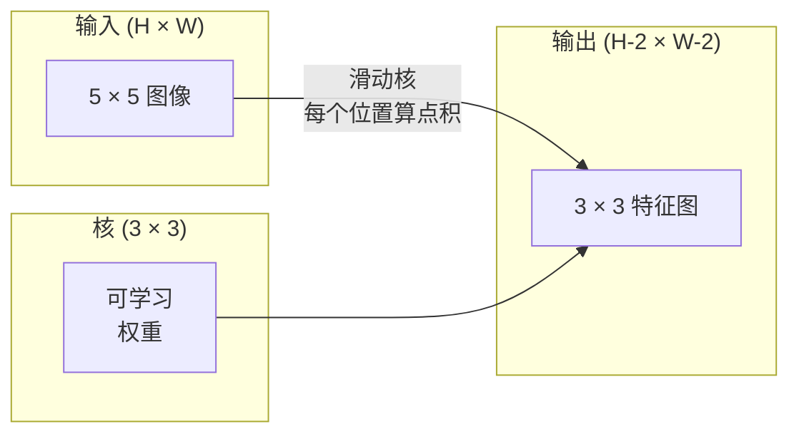
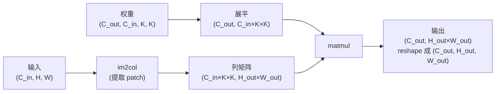

> 卷积就是一个小型全连接层，在图像上滑动，每个位置共享同一组权重。

## 学习目标

- 只用 NumPy 从零实现 2D 卷积，包括嵌套循环版和向量化的 im2col 版
- 对任意输入尺寸、核大小、填充和步幅组合计算输出空间尺寸，理解 `(H - K + 2P) / S + 1` 公式
- 手工设计卷积核（边缘、模糊、锐化、Sobel）并解释每种为什么产生那样的激活模式
- 把卷积堆叠成特征提取器，连接"堆叠深度"和"感受野大小"的关系

## 为什么要学这个

一个全连接层在 224×224 RGB 图像上，每个神经元需要 224×224×3 = 150,528 个输入权重。单隐藏层 1000 个单元就是 1.5 亿参数——什么有用的都还没学到。更糟的是，那个层完全不知道左上角的狗和右下角的狗是同一种模式。它把每个像素位置当独立的，这对图像恰恰是错的：把猫移三个像素不应该强迫网络重新学习"猫"这个概念。

图像模型需要两个属性：**平移等变性**（输入平移，输出跟着移）和**参数共享**（同一个特征检测器在所有位置运行）。全连接层两个都给不了。卷积两个都白送。

卷积不是为深度学习发明的。JPEG 压缩、Photoshop 里的高斯模糊、工业视觉中的边缘检测、所有音频滤波器都用同一个操作。CNN 在 2012–2020 年统治 ImageNet 的原因是：卷积是"邻近值相关、同一模式可出现在任何位置"的数据的正确先验。

## 核心概念

### 一个核，滑动

2D 卷积取一个小权重矩阵叫做核（kernel / filter），在输入上滑动，每个位置计算逐元素乘积之和。那个和就是一个输出像素。



具体的 3×3 示例，在 5×5 输入上（无填充，步幅 1）：

```
输入 X (5 × 5):                核 W (3 × 3):

  1  2  0  1  2                  1  0 -1
  0  1  3  1  0                  2  0 -2
  2  1  0  2  1                  1  0 -1
  1  0  2  1  3
  2  1  1  0  1

核滑过每一个合法的 3×3 窗口。输出 Y 是 3×3：

 Y[0,0] = sum( W * X[0:3, 0:3] )
 Y[0,1] = sum( W * X[0:3, 1:4] )
 Y[0,2] = sum( W * X[0:3, 2:5] )
 Y[1,0] = sum( W * X[1:4, 0:3] )
 ... 以此类推
```

一个公式——**共享权重、局部连接、滑动窗口**——就是全部思想。其他都是簿记工作。

### 输出尺寸公式

给定输入空间尺寸 `H`、核大小 `K`、填充 `P`、步幅 `S`：

```
H_out = floor( (H - K + 2P) / S ) + 1
```

背下来。你设计每个架构时都会算很多遍。

| 场景 | H | K | P | S | H_out |
|------|---|---|---|---|-------|
| Valid conv，无填充 | 32 | 3 | 0 | 1 | 30 |
| Same conv（保持尺寸） | 32 | 3 | 1 | 1 | 32 |
| 2 倍下采样 | 32 | 3 | 1 | 2 | 16 |
| 2×2 池化 | 32 | 2 | 0 | 2 | 16 |
| 大感受野 | 32 | 7 | 3 | 2 | 16 |

"Same padding"意思是选 P 让 S=1 时 H_out == H。对于奇数 K，就是 P = (K - 1) / 2。这就是 3×3 核统治一切的原因——它是最小的奇数核（有中心点）。

### 填充（Padding）

没有填充时，每次卷积都缩小特征图。堆 20 层，224×224 变 184×184，浪费边界计算，还让需要匹配尺寸的残差连接变麻烦。

```
对 5×5 输入做零填充 (P = 1)：

  0  0  0  0  0  0  0
  0  1  2  0  1  2  0
  0  0  1  3  1  0  0
  0  2  1  0  2  1  0       现在核可以中心对准 (0,0) 像素
  0  1  0  2  1  3  0       还有三行三列的值可以乘。
  0  2  1  1  0  1  0
  0  0  0  0  0  0  0
```

实践中常见的模式：`zero`（最常用）、`reflect`（镜像边缘，生成模型中避免硬边）、`replicate`（复制边缘）、`circular`（环绕，用于环面问题）。

### 步幅（Stride）

步幅是滑动的步长。`stride=1` 是默认。`stride=2` 把空间维度减半，是 CNN 内部下采样的经典做法，不需要单独的池化层——每个现代架构（ResNet、ConvNeXt、MobileNet）都在某处用步幅卷积代替 max-pool。

```
步幅 1，5×5 输入，3×3 核：

  起始位置: (0,0) (0,1) (0,2)        → 输出第 0 行
            (1,0) (1,1) (1,2)        → 输出第 1 行
            (2,0) (2,1) (2,2)        → 输出第 2 行

  输出: 3 × 3

步幅 2，同样输入：

  起始位置: (0,0) (0,2)              → 输出第 0 行
            (2,0) (2,2)              → 输出第 1 行

  输出: 2 × 2
```

### 多输入通道

真实图像有三通道。对 RGB 输入做 3×3 卷积实际上是一个 3×3×3 体积：每个输入通道一个 3×3 切片。每个空间位置上，乘积求和跨所有三个切片，再加偏置。

```
输入:    (C_in,  H,  W)        3 × 5 × 5
核:      (C_in,  K,  K)        3 × 3 × 3（一个核）
输出:    (1,     H', W')       2D 特征图

要产生 C_out 个输出通道，堆叠 C_out 个核：

权重:    (C_out, C_in, K, K)   如 64 × 3 × 3 × 3
输出:    (C_out, H', W')       64 × 3 × 3

参数量: C_out × C_in × K × K + C_out   (+ C_out 是偏置)
```

最后一行是你规划模型时要算的。一个 64 通道 3×3 conv 在 3 通道输入上有 `64 × 3 × 3 × 3 + 64 = 1,792` 个参数。很便宜。

### im2col 技巧

嵌套循环好读但慢。GPU 要大矩阵乘法。技巧：把输入的每个感受野窗口展平成大矩阵的一列，核展平成一行，整个卷积就变成一个 matmul。



每个生产级卷积实现都是 im2col 的某种变体加缓存分块技巧。理解 im2col 就理解了核心。

### 感受野（Receptive Field）

一个 3×3 conv 看 9 个输入像素。堆两个 3×3 conv，第二层的神经元看到 5×5 输入像素。三个给 7×7。一般规律：

```
L 个 K×K conv（步幅 1）堆叠后的感受野 = 1 + L × (K - 1)

有步幅时：感受野随步幅乘性增长。
```

"3×3 一路堆到底"之所以管用（VGG、ResNet、ConvNeXt），就是因为两个 3×3 conv 看到的输入区域跟一个 5×5 conv 一样大，但参数更少，中间还多一个非线性。

## 从零实现

### 第一步：填充数组

从最小原语开始：给 H×W 数组周围补零。

```python
import numpy as np

def pad2d(x, p):
    if p == 0:
        return x
    h, w = x.shape[-2:]
    out = np.zeros(x.shape[:-2] + (h + 2 * p, w + 2 * p), dtype=x.dtype)
    out[..., p:p + h, p:p + w] = x
    return out

x = np.arange(9).reshape(3, 3)
print(x)
print()
print(pad2d(x, 1))
```

尾轴技巧 `x.shape[:-2]` 意味着同一个函数对 `(H, W)`、`(C, H, W)` 或 `(N, C, H, W)` 都管用，不用改。

### 第二步：嵌套循环的 2D 卷积

参考实现——慢但无歧义。这就是 `torch.nn.functional.conv2d` 原理上做的事。

```python
def conv2d_naive(x, w, b=None, stride=1, padding=0):
    c_in, h, w_in = x.shape
    c_out, c_in_w, kh, kw = w.shape
    assert c_in == c_in_w

    x_pad = pad2d(x, padding)
    h_out = (h + 2 * padding - kh) // stride + 1
    w_out = (w_in + 2 * padding - kw) // stride + 1

    out = np.zeros((c_out, h_out, w_out), dtype=np.float32)
    for oc in range(c_out):
        for i in range(h_out):
            for j in range(w_out):
                hs = i * stride
                ws = j * stride
                patch = x_pad[:, hs:hs + kh, ws:ws + kw]
                out[oc, i, j] = np.sum(patch * w[oc])
        if b is not None:
            out[oc] += b[oc]
    return out
```

四层嵌套循环。这是你检验每个更快实现的真值。

### 第三步：用手工设计的核验证

搭一个垂直 Sobel 核，应用到合成阶跃图像上，观察垂直边缘亮起来。

```python
def synthetic_step_image():
    img = np.zeros((1, 16, 16), dtype=np.float32)
    img[:, :, 8:] = 1.0
    return img

sobel_x = np.array([
    [[-1, 0, 1],
     [-2, 0, 2],
     [-1, 0, 1]]
], dtype=np.float32)[None]

x = synthetic_step_image()
y = conv2d_naive(x, sobel_x, padding=1)
print(y[0].round(1))
```

预期在第 7 列看到大正值（从左到右亮度增加的边缘），其他地方是零。这一行 print 就是你验证数学对不对的 sanity check。

### 第四步：im2col

把输入中每一个核大小的窗口转成矩阵的一列。对 `C_in=3, K=3`，每列 27 个数。

```python
def im2col(x, kh, kw, stride=1, padding=0):
    c_in, h, w = x.shape
    x_pad = pad2d(x, padding)
    h_out = (h + 2 * padding - kh) // stride + 1
    w_out = (w + 2 * padding - kw) // stride + 1

    cols = np.zeros((c_in * kh * kw, h_out * w_out), dtype=x.dtype)
    col = 0
    for i in range(h_out):
        for j in range(w_out):
            hs = i * stride
            ws = j * stride
            patch = x_pad[:, hs:hs + kh, ws:ws + kw]
            cols[:, col] = patch.reshape(-1)
            col += 1
    return cols, h_out, w_out
```

### 第五步：im2col + matmul 快速卷积

用一次矩阵乘法替代四层循环。

```python
def conv2d_im2col(x, w, b=None, stride=1, padding=0):
    c_out, c_in, kh, kw = w.shape
    cols, h_out, w_out = im2col(x, kh, kw, stride, padding)
    w_flat = w.reshape(c_out, -1)
    out = w_flat @ cols
    if b is not None:
        out += b[:, None]
    return out.reshape(c_out, h_out, w_out)
```

正确性检查：跑两个实现，对比结果。

```python
rng = np.random.default_rng(0)
x = rng.normal(0, 1, (3, 16, 16)).astype(np.float32)
w = rng.normal(0, 1, (8, 3, 3, 3)).astype(np.float32)
b = rng.normal(0, 1, (8,)).astype(np.float32)

y_naive = conv2d_naive(x, w, b, padding=1)
y_im2col = conv2d_im2col(x, w, b, padding=1)

print(f"max abs diff: {np.max(np.abs(y_naive - y_im2col)):.2e}")
```

`max abs diff` 应该在 `1e-5` 左右——差异来自浮点累加顺序，不是 bug。

### 第六步：一组手工设计的核

五个滤波器，展示单层 conv 在训练前就能表达什么。

```python
KERNELS = {
    "identity": np.array([[0, 0, 0], [0, 1, 0], [0, 0, 0]], dtype=np.float32),
    "blur_3x3": np.ones((3, 3), dtype=np.float32) / 9.0,
    "sharpen": np.array([[0, -1, 0], [-1, 5, -1], [0, -1, 0]], dtype=np.float32),
    "sobel_x": np.array([[-1, 0, 1], [-2, 0, 2], [-1, 0, 1]], dtype=np.float32),
    "sobel_y": np.array([[-1, -2, -1], [0, 0, 0], [1, 2, 1]], dtype=np.float32),
}

def apply_kernel(img2d, kernel):
    x = img2d[None].astype(np.float32)
    w = kernel[None, None]
    return conv2d_im2col(x, w, padding=1)[0]
```

应用到任何灰度图上：blur 模糊化，sharpen 锐化边缘，Sobel-x 点亮垂直边，Sobel-y 点亮水平边。这正是 AlexNet 和 VGG 第一个训练好的 conv 层学到的模式——因为好的图像模型不管做什么任务都需要边缘和斑块检测器。

## 实战用法

PyTorch 的 `nn.Conv2d` 包装了同样的操作，加上 autograd、CUDA 内核和 cuDNN 优化。形状语义完全一样。

```python
import torch
import torch.nn as nn

conv = nn.Conv2d(in_channels=3, out_channels=64, kernel_size=3, stride=1, padding=1)
print(conv)
print(f"weight shape: {tuple(conv.weight.shape)}   # (C_out, C_in, K, K)")
print(f"bias shape:   {tuple(conv.bias.shape)}")
print(f"param count:  {sum(p.numel() for p in conv.parameters())}")

x = torch.randn(8, 3, 224, 224)
y = conv(x)
print(f"\ninput  shape: {tuple(x.shape)}")
print(f"output shape: {tuple(y.shape)}")
```

把 `padding=1` 改成 `padding=0`，输出变 222×222。把 `stride=1` 改成 `stride=2`，变 112×112。跟你背的公式一样。

## 练习

1. **（简单）** 给一个 128×128 灰度输入和一组 `[Conv3x3(s=1,p=1), Conv3x3(s=2,p=1), Conv3x3(s=1,p=1), Conv3x3(s=2,p=1)]`，手算每层的输出空间尺寸和感受野。用 PyTorch `nn.Sequential` 验证。

2. **（中等）** 给 `conv2d_naive` 和 `conv2d_im2col` 加一个 `groups` 参数。证明 `groups=C_in=C_out` 复现了 depthwise convolution，参数量是 `C × K × K` 而不是 `C × C × K × K`。

3. **（较难）** 手动实现 `conv2d_im2col` 的反向传播：给定输出的梯度，计算 `x` 和 `w` 的梯度。用 `torch.autograd.grad` 在同样的输入和权重上验证。技巧：im2col 的梯度是 `col2im`，要累加重叠窗口。

## 术语表

| 术语 | 通俗说法 | 真正含义 |
|------|---------|---------|
| Convolution（卷积） | "滑动一个滤波器" | 在每个空间位置用共享权重做的可学习点积；数学上是互相关，但大家都叫卷积 |
| Kernel / Filter（核/滤波器） | "特征检测器" | 形状 (C_in, K, K) 的小权重张量，跟输入窗口做点积产生一个输出像素 |
| Stride（步幅） | "跳多远" | 连续核放置位置之间的步长；stride 2 让每个空间维度减半 |
| Padding（填充） | "边缘补零" | 输入周围添加额外值让核能居中在边界像素上；`same` padding 保持输出尺寸等于输入 |
| Receptive Field（感受野） | "神经元能看到多大" | 某个输出激活值依赖的原始输入区域，随深度和步幅增长 |
| im2col | "GEMM 技巧" | 把每个感受野窗口展平成列，让卷积变成一次大矩阵乘——每个快速 conv 内核的核心 |
| Depthwise Conv（深度可分离卷积） | "每通道一个核" | `groups == C_in` 的卷积，每个输出通道只从对应的输入通道计算；MobileNet 和 ConvNeXt 的骨架 |
| Translation Equivariance（平移等变性） | "移进去移出来" | 输入平移 k 像素，输出也平移 k 像素的性质；共享权重白送的 |

---

## 自测题

:::quiz
question: 你把一张 224×224 RGB 图像喂给一个 kernel_size=3, stride=1, padding=0 的卷积。输出空间尺寸是多少？
options:
  - 224×224
  - 222×222
  - 112×112
  - 74×74
correct: 1
explanation: 输出尺寸 = (H - K + 2P) / S + 1 = (224 - 3 + 0) / 1 + 1 = 222。没有填充时，每个 3×3 卷积在每轴上缩小 2 像素——每边减一。
:::

:::quiz
question: 一个卷积层 in_channels=3, out_channels=64, kernel_size=3, 有偏置。有多少可学习参数？
options:
  - 1,728
  - 1,792
  - 576
  - 192
correct: 1
explanation: C_out × C_in × K × K + C_out = 64 × 3 × 3 × 3 + 64 = 1,728 + 64 = 1,792。+C_out 是每个输出通道一个偏置。对比全连接层在同样输入上（224×224×3 → 64 ≈ 960 万参数），就知道为什么卷积是图像的正确先验。
:::

:::quiz
question: 为什么现代 CNN 更喜欢堆叠 3×3 卷积而不是用一个 5×5 或 7×7？
options:
  - 3×3 有硬件加速；大的没有
  - 两个 3×3 覆盖跟一个 5×5 一样的感受野，但参数更少（2×9 vs 25），中间还多一个非线性
  - 大核会溢出 GPU 寄存器
  - 3×3 是唯一支持填充的核尺寸
correct: 1
explanation: 堆叠 3×3 给一样的感受野但更少参数和更多非线性，增加表达能力。VGG 实验证明了这一点，后续所有现代系列（ResNet、ConvNeXt）都继承了这个设计。
:::

:::quiz
question: im2col 变换实际上做了什么？
options:
  - 压缩图像以适应 GPU 缓存
  - 从输入中提取每个核大小的感受野窗口堆叠为列，让卷积变成一次矩阵乘法
  - 把 float32 像素转成 int8 加速算术
  - 把 batch 中所有图像拼成一个 2D 矩阵
correct: 1
explanation: im2col 重塑输入使每列是一个展平的感受野。把核也展平成行，卷积就变成 w_flat @ cols，一次 GEMM 调用，GPU 执行速度比四层 Python 循环快数千倍。每个生产级 conv 库都是这个的变体。
:::

:::quiz
question: 你堆了四个 3×3 卷积（全部 stride 1，无池化）。最后一层神经元的感受野是多少？
options:
  - 3×3——每个 conv 都是 3×3
  - 5×5——两个 conv 给 5×5，深度没用
  - 9×9——每个 conv 每边加 2：1 + 4×(3-1) = 9
  - 15×15——每个 conv 把感受野翻三倍
correct: 2
explanation: L 个 K×K conv（stride 1）堆叠后，感受野 = 1 + L×(K-1)。L=4, K=3 就是 1 + 4×2 = 9。有步幅时感受野乘性增长，这就是为什么带下采样的深网络能用十几个块覆盖整张图。
:::
