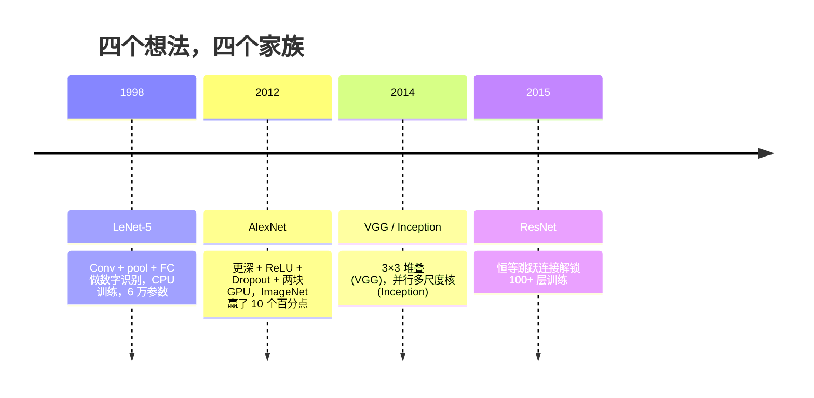
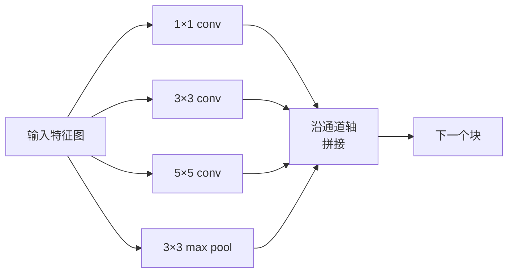
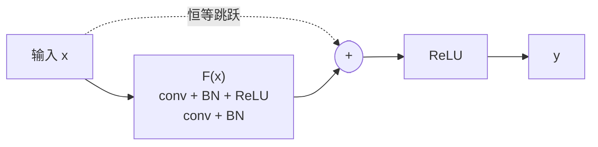

> 过去三十年每个重要的 CNN，都是同一个"卷积-非线性-下采样"配方加上一个新想法。按顺序学这些想法。

## 学习目标

- 追溯 LeNet-5 → AlexNet → VGG → Inception → ResNet 的架构血统，说出每个家族贡献的那一个新想法
- 用 PyTorch 实现 LeNet-5、VGG 风格块和 ResNet BasicBlock，每个不超过 40 行
- 解释为什么残差连接能让 1000 层网络从不可训练变成 SOTA
- 读懂一个现代骨干网络（ResNet-18、ResNet-50）并在看源码前预测其输出形状、感受野和参数量

## 为什么要学这个

2011 年最好的 ImageNet 分类器 top-5 准确率约 74%。2012 年 AlexNet 85%。2015 年 ResNet 96%。数据没变，GPU 没换代。提升来自架构思想。

一个能出活的视觉工程师必须知道哪个想法来自哪篇论文，因为你 2026 年发出去的每个生产骨干网络都是那些组件的重组——而且这些思想一直在迁移：grouped conv 从 CNN 走进了 Transformer，残差连接从 ResNet 走进了所有 LLM，Batch Normalization 活在扩散模型里。

按顺序学习这些网络还能免疫一个常见错误：问题只需要 LeNet 级别的网络时伸手去拿最大的模型。MNIST 不需要 ResNet。知道每个家族的性能曲线，就知道自己该坐在哪。

## 核心概念

### 改变视觉的四个想法



经典视觉中没有别的东西比这四次跳跃更重要。

### LeNet-5 (1998)

Yann LeCun 的数字识别器。6 万参数。两个 conv-pool 块，两个全连接层，tanh 激活。它定义了每个 CNN 继承的模板：

```
输入 (1, 32, 32)
  conv 5×5 → (6, 28, 28)
  avg pool 2×2 → (6, 14, 14)
  conv 5×5 → (16, 10, 10)
  avg pool 2×2 → (16, 5, 5)
  flatten → 400
  dense → 120
  dense → 84
  dense → 10
```

现代世界所谓的 CNN——卷积和下采样交替喂给一个小分类头——就是加了更多层、更大通道、更好激活的 LeNet。

### AlexNet (2012)

三个一起打破了 ImageNet：

1. **ReLU** 替代 tanh。梯度不再消失。训练加速 6 倍。
2. **Dropout** 在全连接头中。正则化变成了一个层，不是一个 trick。
3. **深度和宽度**。五层 conv，三层 dense，6000 万参数，在两块 GPU 上模型并行训练。

### VGG (2014)

VGG 问了一个问题：如果只用 3×3 卷积并且往深里堆，会怎样？

```
块：   conv 3×3 → conv 3×3 → pool 2×2
重复： 16 或 19 个卷积层
```

两个 3×3 conv 看到的输入区域跟一个 5×5 一样大，但参数更少（2×9×C² = 18C² vs 25C²），中间还多一个 ReLU。VGG 把这个观察变成了整个架构。简洁——只有一种块类型，重复——使它成为后来一切的参考点。

代价：1.38 亿参数，训练慢，推理贵。

### Inception (2014，同年)

Google 对"该用多大的核"的回答是：全都用，并行。



每个分支特化——1×1 做通道混合，3×3 做局部纹理，5×5 做更大模式，pool 做平移不变特征——拼接让下一层自己挑有用的。Inception v1 在每个分支里加 1×1 卷积当瓶颈来控制参数量。

### 退化问题

到 2015 年，VGG-19 能跑但 VGG-32 不行。深度本应有帮助，但超过约 20 层，训练和测试 loss 都变差了。这不是过拟合。这是优化器找不到有用的权重，因为梯度通过每层都在乘性缩小。

```
普通深网络：
  y = f_L( f_{L-1}( ... f_1(x) ... ) )

对早期层的梯度：
  dL/dW_1 = dL/dy × df_L/df_{L-1} × ... × df_2/df_1 × df_1/dW_1

每个乘性因子的幅度大约是（权重幅度）×（激活增益）。
100 个增益 < 1 的连乘，梯度实质为零。
```

### ResNet (2015)

何恺明、张祥雨、任少卿、孙剑提出了一个解决一切的改动：

```
标准块：   y = F(x)
残差块：   y = F(x) + x
```

`+ x` 意味着层总是可以选择什么都不做——把 `F(x)` 驱动为零就行。一个 1000 层 ResNet 最差也不会比 1 层网络差，因为每多一个块都有一个平凡的逃生口。有了这个保证，优化器愿意让每个块*稍微*有用——而"稍微有用"堆 100 次就是 SOTA。



两种变体到处都是：

- **BasicBlock**（ResNet-18、ResNet-34）：两个 3×3 conv，skip 绕过两个。
- **Bottleneck**（ResNet-50、-101、-152）：1×1 降维 → 3×3 → 1×1 升维，skip 绕过三个。通道数高时更便宜。

当 skip 要跨越下采样（stride=2）时，恒等路径换成一个 1×1 stride=2 conv 来匹配形状。

### 残差连接为什么超越视觉

这个想法的意义不止于图像分类。它把深网络从"交叉祈祷梯度能活下来"变成了可靠、可扩展的工程工具。你下一个阶段要学的每个 Transformer 每个块里都有完全一样的跳跃连接。没有 ResNet 就没有 GPT。

## 从零实现

### 第一步：LeNet-5

忠实的最简 LeNet。Tanh 激活，平均池化。

```python
import torch
import torch.nn as nn
import torch.nn.functional as F

class LeNet5(nn.Module):
    def __init__(self, num_classes=10):
        super().__init__()
        self.conv1 = nn.Conv2d(1, 6, kernel_size=5)
        self.conv2 = nn.Conv2d(6, 16, kernel_size=5)
        self.pool = nn.AvgPool2d(2)
        self.fc1 = nn.Linear(16 * 5 * 5, 120)
        self.fc2 = nn.Linear(120, 84)
        self.fc3 = nn.Linear(84, num_classes)

    def forward(self, x):
        x = self.pool(torch.tanh(self.conv1(x)))
        x = self.pool(torch.tanh(self.conv2(x)))
        x = torch.flatten(x, 1)
        x = torch.tanh(self.fc1(x))
        x = torch.tanh(self.fc2(x))
        return self.fc3(x)

net = LeNet5()
x = torch.randn(1, 1, 32, 32)
print(f"output: {net(x).shape}")
print(f"params: {sum(p.numel() for p in net.parameters()):,}")
```

预期：`output: torch.Size([1, 10])`，`params: 61,706`。这就是开启现代视觉的整个数字分类器。

### 第二步：VGG 块

一个可复用块：两个 3×3 conv，ReLU，Batch Norm，max pool。

```python
class VGGBlock(nn.Module):
    def __init__(self, in_c, out_c):
        super().__init__()
        self.conv1 = nn.Conv2d(in_c, out_c, kernel_size=3, padding=1)
        self.bn1 = nn.BatchNorm2d(out_c)
        self.conv2 = nn.Conv2d(out_c, out_c, kernel_size=3, padding=1)
        self.bn2 = nn.BatchNorm2d(out_c)
        self.pool = nn.MaxPool2d(2)

    def forward(self, x):
        x = F.relu(self.bn1(self.conv1(x)))
        x = F.relu(self.bn2(self.conv2(x)))
        return self.pool(x)

class MiniVGG(nn.Module):
    def __init__(self, num_classes=10):
        super().__init__()
        self.stack = nn.Sequential(
            VGGBlock(3, 32),
            VGGBlock(32, 64),
            VGGBlock(64, 128),
        )
        self.head = nn.Sequential(
            nn.AdaptiveAvgPool2d(1),
            nn.Flatten(),
            nn.Linear(128, num_classes),
        )

    def forward(self, x):
        return self.head(self.stack(x))

net = MiniVGG()
x = torch.randn(1, 3, 32, 32)
print(f"output: {net(x).shape}")
print(f"params: {sum(p.numel() for p in net.parameters()):,}")
```

三个 VGG 块在 CIFAR 尺寸输入上，adaptive pool，一个线性层。约 29 万参数，CIFAR-10 足够了。

### 第三步：ResNet BasicBlock

ResNet-18 和 ResNet-34 的核心构建块。

```python
class BasicBlock(nn.Module):
    def __init__(self, in_c, out_c, stride=1):
        super().__init__()
        self.conv1 = nn.Conv2d(in_c, out_c, kernel_size=3, stride=stride, padding=1, bias=False)
        self.bn1 = nn.BatchNorm2d(out_c)
        self.conv2 = nn.Conv2d(out_c, out_c, kernel_size=3, stride=1, padding=1, bias=False)
        self.bn2 = nn.BatchNorm2d(out_c)
        if stride != 1 or in_c != out_c:
            self.shortcut = nn.Sequential(
                nn.Conv2d(in_c, out_c, kernel_size=1, stride=stride, bias=False),
                nn.BatchNorm2d(out_c),
            )
        else:
            self.shortcut = nn.Identity()

    def forward(self, x):
        out = F.relu(self.bn1(self.conv1(x)))
        out = self.bn2(self.conv2(out))
        out = out + self.shortcut(x)
        return F.relu(out)
```

conv 层上 `bias=False` 是 BN 的惯例——BN 的 beta 参数已经充当了偏置，再带 conv bias 是浪费。shortcut 只在步幅或通道数变化时需要真正的 conv，否则是恒等。

### 第四步：小型 ResNet

堆四组 BasicBlock，做一个能在 CIFAR 尺寸输入上工作的 ResNet。

```python
class TinyResNet(nn.Module):
    def __init__(self, num_classes=10):
        super().__init__()
        self.stem = nn.Sequential(
            nn.Conv2d(3, 32, kernel_size=3, stride=1, padding=1, bias=False),
            nn.BatchNorm2d(32),
            nn.ReLU(inplace=True),
        )
        self.layer1 = self._make_group(32, 32, num_blocks=2, stride=1)
        self.layer2 = self._make_group(32, 64, num_blocks=2, stride=2)
        self.layer3 = self._make_group(64, 128, num_blocks=2, stride=2)
        self.layer4 = self._make_group(128, 256, num_blocks=2, stride=2)
        self.head = nn.Sequential(
            nn.AdaptiveAvgPool2d(1),
            nn.Flatten(),
            nn.Linear(256, num_classes),
        )

    def _make_group(self, in_c, out_c, num_blocks, stride):
        blocks = [BasicBlock(in_c, out_c, stride=stride)]
        for _ in range(num_blocks - 1):
            blocks.append(BasicBlock(out_c, out_c, stride=1))
        return nn.Sequential(*blocks)

    def forward(self, x):
        x = self.stem(x)
        x = self.layer1(x)
        x = self.layer2(x)
        x = self.layer3(x)
        x = self.layer4(x)
        return self.head(x)

net = TinyResNet()
x = torch.randn(1, 3, 32, 32)
print(f"output: {net(x).shape}")
print(f"params: {sum(p.numel() for p in net.parameters()):,}")
```

四组各两块。第 2、3、4 组开头 stride 2。每次下采样通道翻倍。约 280 万参数。这就是能干净扩展到 ResNet-152 的标准配方。

## 实战用法

`torchvision.models` 提供上面所有网络的预训练版。调用签名跨家族一致——这正是骨干抽象的意义。

```python
from torchvision.models import resnet18, ResNet18_Weights

r18 = resnet18(weights=ResNet18_Weights.IMAGENET1K_V1)
r18.eval()
print(f"ResNet-18 params: {sum(p.numel() for p in r18.parameters()):,}")
```

ResNet-18 有 1170 万参数。VGG-16 有 1.38 亿。ImageNet top-1 准确率接近（69.8% vs 71.6%）。残差连接买来 12 倍参数效率。这就是为什么 ResNet 变体从 2016 年统治到 ViT 2021 年出现——在算力受限的实际部署中至今仍然统治。

迁移学习的配方永远一样：加载预训练 → 冻结骨干 → 替换分类头。

```python
for p in r18.parameters():
    p.requires_grad = False
r18.fc = nn.Linear(r18.fc.in_features, 10)
```

三行代码。你现在有了一个 10 类 CIFAR 分类器，继承了 ImageNet 买单的特征表示。

## 练习

1. **（简单）** 逐层手算 `TinyResNet` 的参数量，与 `sum(p.numel() ...)` 对比。参数预算大头花在哪里——conv、BN 还是分类头？

2. **（中等）** 实现 Bottleneck 块（1×1 → 3×3 → 1×1 + skip），用它搭一个 ResNet-50 风格的 CIFAR 网络。参数量与 `TinyResNet` 对比。

3. **（较难）** 从 `BasicBlock` 中去掉 skip connection，训练一个 34 块的"普通"网络和一个 34 块的 ResNet 在 CIFAR-10 上各跑 10 epoch。画训练 loss vs epoch。复现 He et al. 论文 Figure 1 中普通深网络收敛到比浅网络更高 loss 的结果。

## 术语表

| 术语 | 通俗说法 | 真正含义 |
|------|---------|---------|
| Backbone（骨干） | "那个模型" | 产生喂给任务头的特征图的卷积块堆叠 |
| Residual Connection（残差连接） | "跳跃连接" | `y = F(x) + x`；让优化器通过把 F 设为零来学恒等，使任意深度可训练 |
| BasicBlock | "两个 3×3 conv 带 skip" | ResNet-18/34 的构建块：conv-BN-ReLU-conv-BN-加-ReLU |
| Bottleneck | "1×1 降，3×3，1×1 升" | ResNet-50/101/152 的块；通道数高时便宜，因为 3×3 跑在缩减的宽度上 |
| 退化问题 | "越深越差" | 超过约 20 层普通 conv，训练和测试误差都上升；被残差连接解决 |
| Stem | "第一层" | 把 3 通道输入转成基础特征宽度的初始 conv；ImageNet 通常 7×7 stride 2，CIFAR 通常 3×3 stride 1 |
| Head（头） | "分类器" | 最后骨干块之后的层：adaptive pool、flatten、linear |
| Transfer Learning（迁移学习） | "预训练权重" | 加载在 ImageNet 上训练的骨干，只在你的任务上微调头部 |

---

## 自测题

:::quiz
question: AlexNet（2012）引入的让深层 CNN 在 GPU 上可训练的关键架构想法是什么？
options:
  - 残差连接
  - 用 ReLU 替代 tanh——不饱和且加速收敛约 6 倍
  - Batch Normalization
  - 深度可分离卷积
correct: 1
explanation: AlexNet 最大的训练加速来自 ReLU。Tanh 对大正负输入会饱和，杀死梯度，限制可训练的深度。ReLU 是分段线性的，正输入不饱和。Dropout 和 GPU 并行也重要，但 ReLU 才是解锁深度的那个。
:::

:::quiz
question: 为什么 VGG 偏好堆叠 3×3 而不是用一个大核？
options:
  - 小核在 CPU 上跑得更快
  - 两个 3×3 覆盖跟一个 5×5 一样的感受野，但参数更少（18C² vs 25C²），中间还多一个 ReLU
  - 3×3 是旋转不变的；5×5 不是
  - 大核不能用 SGD 训练
correct: 1
explanation: 两个堆叠的 3×3 看到跟一个 5×5 一样的区域，但参数更少并且多一个非线性增加表达力。VGG 把这个观察变成了一整个只有一种块类型的架构。
:::

:::quiz
question: ResNet 引入 y = F(x) + x 的残差连接解决了什么问题？
options:
  - 分类头的过拟合
  - ReLU 层的激活值消失
  - 退化问题——超过约 20 层普通 conv，训练 loss 反而变大，因为优化器难以通过多个非线性层学习恒等映射
  - 反向传播时的内存消耗
correct: 2
explanation: ResNet 之前，超过约 20 层训练 loss 就开始上升——退化问题。残差块能简单地通过把 F 驱为零来表示恒等，给优化器一个安全的默认值。有了这个逃生口，每多一个块都能让网络稍好一点。
:::

:::quiz
question: 在 in_channels=64, out_channels=128, stride=2 的 ResNet BasicBlock 中，shortcut 分支的作用是什么？
options:
  - 永远是恒等；主分支处理形状变化
  - 是一个 stride=2 的 1×1 conv，匹配主分支的输出通道和空间尺寸，使两者可以相加
  - 是一个 max-pool 把空间维度减半
  - 是推理时会被移除的占位符
correct: 1
explanation: 当块改变通道数或空间步幅时，恒等路径不能直接跟主分支相加因为形状不同。shortcut 变成一个 stride=2、C_out 输出通道的 1×1 conv（可选后接 BN）。只有 in_c == out_c 且 stride == 1 时才用直通恒等。
:::

:::quiz
question: ResNet-18 有约 1170 万参数，在 ImageNet 上匹配或超过 VGG-16（1.38 亿参数）。这对 VGG 意味着什么？
options:
  - VGG 的核太小学不到好特征
  - VGG 的大部分参数浪费在巨大的全连接头和超过残差连接能让每层有效贡献的冗余深度上
  - VGG 用了更差的优化器
  - VGG 在 ImageNet 上的准确率被测错了
correct: 1
explanation: VGG-16 的参数量被巨大的全连接分类器（25088 个激活值上的三个 dense 层）主导，它的纯堆叠不能像残差堆叠那样高效加层。ResNet-18 用全局平均池化加一个线性层替换 FC 头，用残差块，两者加起来在相近准确率下给出约 12 倍参数效率。
:::
