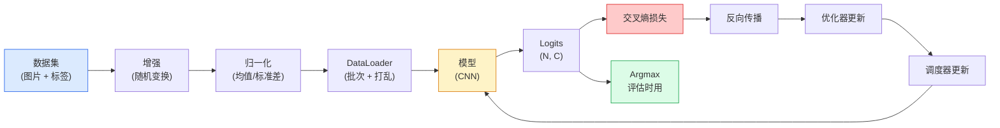

> 分类器就是一个函数：输入像素，输出类别概率分布。其余都是管道工程。


## 学习目标

- 在 CIFAR-10 上搭建完整的图像分类流水线：数据集、数据增强、模型、训练循环、评估
- 解释流水线中每个组件（dataloader、损失函数、优化器、学习率调度、数据增强）的作用，并能预判任何一个组件出错时损失曲线会怎么变
- 从零实现 mixup、cutout 和标签平滑（label smoothing），说明每种技术在什么场景下值得加
- 通过混淆矩阵和逐类别 precision/recall 表格来诊断数据集和模型的问题，而不是只看整体准确率

## 为什么要学这个

所有上线的视觉任务，底层都是图像分类。检测是对区域做分类，分割是对像素做分类，检索是按类别中心的相似度排序。把分类搞对——数据循环、增强策略、损失函数、评估方式——这套技能可以迁移到后续所有任务。

大多数分类的 bug 不在模型里，而是藏在流水线中：归一化搞错了、训练集没 shuffle、增强操作把标签搞乱了、验证集混入了训练数据、学习率在第 30 个 epoch 后悄悄发散。一个本该在 CIFAR-10 上达到 93% 的 CNN，换个有问题的流水线可能只有 70-75%，而且损失曲线看起来还很正常。

这节课我们手动搭建整条流水线，让每个环节都可检查。不会用任何 `torchvision.datasets` 中可能隐藏 bug 的东西。

## 核心概念

### 分类流水线（Classification Pipeline）



这个循环里每一条线都可能藏 bug。交叉熵（Cross-entropy）接收的是原始 logits，不是 softmax 输出——如果你在 loss 之前写了 `model(x).softmax()`，梯度就悄悄算错了。数据增强只作用于输入，不动标签——除了 mixup，它同时混合两者。`optimizer.zero_grad()` 每步必须调一次；忘了的话梯度会累加，看起来就像学习率不稳定。这些 bug 都不会报错，只是让学习曲线变平。

### 交叉熵、Logits 和 Softmax

分类器对每张图输出 `C` 个数字，叫做 logits（对数几率）。对它做 softmax 就变成概率分布：

```
softmax(z)_i = exp(z_i) / sum_j exp(z_j)
```

交叉熵衡量的是正确类别的负对数概率：

```
CE(z, y) = -log( softmax(z)_y )
        = -z_y + log( sum_j exp(z_j) )
```

右边那个形式就是数值稳定版（log-sum-exp）。PyTorch 的 `nn.CrossEntropyLoss` 把 softmax + NLL 融合成一个操作，直接接收原始 logits。如果你自己先做了 softmax 再传进去，实际上是在算 log(softmax(softmax(z)))——一个毫无意义的东西。

### 为什么数据增强有效

CNN 的归纳偏置（Inductive Bias）只给了平移不变性（来自权重共享），但它天生不具备对裁剪、翻转、颜色抖动或遮挡的不变性。唯一能让它学会这些不变性的方法就是——给它看经过这些变换的像素。每一个训练时的随机变换都在告诉模型："这两张图标签一样，学会忽略它们之间的差异。"

```
原图:           "朝左的狗"
水平翻转:       "朝右的狗"         <- 同标签，不同像素
旋转(+15°):    "微微歪头的狗"
颜色抖动:       "暖光下的狗"
随机擦除:       "被遮了一块的狗"
```

原则：增强操作必须保持标签不变。对数字做 cutout 和旋转可能把 "6" 变成 "9"——这种数据集你要用更小的旋转角度，选择尊重数字特有不变性的增强方式。

### Mixup 和 Cutmix

普通数据增强只变像素，标签还是 one-hot。**Mixup** 和 **Cutmix** 打破了这一点——它们同时插值图片和标签。

```
Mixup:
  lambda ~ Beta(a, a)
  x = lambda * x_i + (1 - lambda) * x_j
  y = lambda * y_i + (1 - lambda) * y_j

Cutmix:
  把 x_j 的一个随机矩形区域贴到 x_i 上
  y = 按面积加权混合 y_i 和 y_j
```

为什么有用：模型不再死记 one-hot 目标，而是学会在类别之间平滑插值。训练损失会升高，但测试准确率反而提高。这是任何分类器最便宜的鲁棒性升级。

### 标签平滑（Label Smoothing）

Mixup 的近亲。不再对着 `[0, 0, 1, 0, 0]` 训练，而是用 `[eps/C, eps/C, 1-eps, eps/C, eps/C]`，`eps` 一般取 0.1 这样的小值。好处是阻止模型产生极端尖锐的 logits，改善校准（calibration），几乎没有额外成本。PyTorch 1.10 起内置：`nn.CrossEntropyLoss(label_smoothing=0.1)`。

### 超越准确率的评估

整体准确率会掩盖不平衡。一个 90/10 的二分类器，如果永远预测多数类，准确率就是 90%。真正能告诉你发生了什么的工具：

- **逐类准确率** — 每个类一个数字；立刻暴露表现差的类别。
- **混淆矩阵（Confusion Matrix）** — C × C 的网格，第 i 行第 j 列 = 真实类别 i 被预测为 j 的次数；对角线是对的，非对角线就是模型犯错的地方。
- **Top-1 / Top-5** — 正确类别是否在概率最高的 1 个或 5 个预测中；Top-5 对 ImageNet 很重要，因为像 "Norwich terrier" 和 "Norfolk terrier" 这种类别确实模糊。
- **校准度（ECE）** — 模型给出 0.8 的置信度时，实际正确率是 80% 吗？现代网络普遍过度自信；用温度缩放（temperature scaling）或标签平滑来修。

## 从零实现

### 第一步：确定性合成数据集

CIFAR-10 是磁盘上的真实数据。为了让这节课可复现又快速，我们先造一个合成数据集——32×32 的 RGB 图片，每个类有独特的结构让模型去学。等流水线跑通了，换成真正的 CIFAR-10 一行代码都不用改。

```python
import numpy as np
import torch
from torch.utils.data import Dataset


def synthetic_cifar(num_per_class=1000, num_classes=10, seed=0):
    rng = np.random.default_rng(seed)
    X = []
    Y = []
    for c in range(num_classes):
        centre = rng.uniform(0, 1, (3,))
        freq = 2 + c
        for _ in range(num_per_class):
            yy, xx = np.meshgrid(np.linspace(0, 1, 32), np.linspace(0, 1, 32), indexing="ij")
            r = np.sin(xx * freq) * 0.5 + centre[0]
            g = np.cos(yy * freq) * 0.5 + centre[1]
            b = (xx + yy) * 0.5 * centre[2]
            img = np.stack([r, g, b], axis=-1)
            img += rng.normal(0, 0.08, img.shape)
            img = np.clip(img, 0, 1)
            X.append(img.astype(np.float32))
            Y.append(c)
    X = np.stack(X)
    Y = np.array(Y)
    idx = rng.permutation(len(X))
    return X[idx], Y[idx]


class ArrayDataset(Dataset):
    def __init__(self, X, Y, transform=None):
        self.X = X
        self.Y = Y
        self.transform = transform

    def __len__(self):
        return len(self.X)

    def __getitem__(self, i):
        img = self.X[i]
        if self.transform is not None:
            img = self.transform(img)
        img = torch.from_numpy(img).permute(2, 0, 1)
        return img, int(self.Y[i])
```

每个类有自己的颜色调板和频率模式，外加高斯噪声——迫使模型学信号而不是死记像素。十个类，每类一千张，打乱顺序。

### 第二步：归一化和数据增强

每个视觉流水线都少不了的两个变换。

```python
def standardize(mean, std):
    mean = np.array(mean, dtype=np.float32)
    std = np.array(std, dtype=np.float32)
    def _fn(img):
        return (img - mean) / std
    return _fn


def random_hflip(p=0.5):
    def _fn(img):
        if np.random.random() < p:
            return img[:, ::-1, :].copy()
        return img
    return _fn


def random_crop(pad=4):
    def _fn(img):
        h, w = img.shape[:2]
        padded = np.pad(img, ((pad, pad), (pad, pad), (0, 0)), mode="reflect")
        y = np.random.randint(0, 2 * pad)
        x = np.random.randint(0, 2 * pad)
        return padded[y:y + h, x:x + w, :]
    return _fn


def compose(*fns):
    def _fn(img):
        for fn in fns:
            img = fn(img)
        return img
    return _fn
```

裁剪前用 reflect-pad（镜像填充），不用 zero-pad（零填充），因为黑色边框是一种模型会学到但没用的信号。

### 第三步：Mixup

在训练步骤中混合两张图和两个标签。实现为 batch 级变换，放在前向传播旁边，而不是藏在 dataset 里面。

```python
def mixup_batch(x, y, num_classes, alpha=0.2):
    if alpha <= 0:
        return x, torch.nn.functional.one_hot(y, num_classes).float()
    lam = float(np.random.beta(alpha, alpha))
    idx = torch.randperm(x.size(0), device=x.device)
    x_mixed = lam * x + (1 - lam) * x[idx]
    y_onehot = torch.nn.functional.one_hot(y, num_classes).float()
    y_mixed = lam * y_onehot + (1 - lam) * y_onehot[idx]
    return x_mixed, y_mixed


def soft_cross_entropy(logits, soft_targets):
    log_probs = torch.log_softmax(logits, dim=-1)
    return -(soft_targets * log_probs).sum(dim=-1).mean()
```

`soft_cross_entropy` 是针对软标签分布的交叉熵。当目标恰好是 one-hot 时，它退化为普通交叉熵。

### 第四步：训练循环

完整配方：每个 batch 过一遍数据、算一次梯度，scheduler 每个 epoch 更新一次。

```python
import torch
import torch.nn as nn
from torch.utils.data import DataLoader
from torch.optim import SGD
from torch.optim.lr_scheduler import CosineAnnealingLR

def train_one_epoch(model, loader, optimizer, device, num_classes, use_mixup=True):
    model.train()
    total, correct, loss_sum = 0, 0, 0.0
    for x, y in loader:
        x, y = x.to(device), y.to(device)
        if use_mixup:
            x_m, y_soft = mixup_batch(x, y, num_classes)
            logits = model(x_m)
            loss = soft_cross_entropy(logits, y_soft)
        else:
            logits = model(x)
            loss = nn.functional.cross_entropy(logits, y, label_smoothing=0.1)
        optimizer.zero_grad()
        loss.backward()
        optimizer.step()
        loss_sum += loss.item() * x.size(0)
        total += x.size(0)
        # 开了 mixup 时训练准确率只是近似值（模型看到的是软目标，不是 y）
        # 把它当粗略进度信号就行；真正的性能看验证集准确率
        with torch.no_grad():
            pred = logits.argmax(dim=-1)
            correct += (pred == y).sum().item()
    return loss_sum / total, correct / total


@torch.no_grad()
def evaluate(model, loader, device, num_classes):
    model.eval()
    total, correct = 0, 0
    loss_sum = 0.0
    cm = torch.zeros(num_classes, num_classes, dtype=torch.long)
    for x, y in loader:
        x, y = x.to(device), y.to(device)
        logits = model(x)
        loss = nn.functional.cross_entropy(logits, y)
        pred = logits.argmax(dim=-1)
        for t, p in zip(y.cpu(), pred.cpu()):
            cm[t, p] += 1
        loss_sum += loss.item() * x.size(0)
        total += x.size(0)
        correct += (pred == y).sum().item()
    return loss_sum / total, correct / total, cm
```

每次写训练循环都要检查的五个不变量：

1. 训练前 `model.train()`，评估前 `model.eval()` — 控制 dropout 和 batchnorm 的行为。
2. `.backward()` 之前调 `.zero_grad()`。
3. 累积指标时用 `.item()`，别让计算图活着。
4. 评估时加 `@torch.no_grad()` — 省内存省时间，防止意外。
5. argmax 作用于原始 logits，不要先 softmax — 结果一样，少一步运算。

### 第五步：组装起来

用上一节课的 `TinyResNet`，训练几个 epoch，评估。

```python
from main import synthetic_cifar, ArrayDataset
from main import standardize, random_hflip, random_crop, compose
from main import mixup_batch, soft_cross_entropy
from main import train_one_epoch, evaluate
# TinyResNet 来自上一节课（03-cnns-lenet-to-resnet）
# 根据你保存上节代码的位置调整 import 路径
from cnns_lenet_to_resnet import TinyResNet  # example placeholder

X, Y = synthetic_cifar(num_per_class=500)
split = int(0.9 * len(X))
X_train, Y_train = X[:split], Y[:split]
X_val, Y_val = X[split:], Y[split:]

mean = [0.5, 0.5, 0.5]
std = [0.25, 0.25, 0.25]
train_tf = compose(random_hflip(), random_crop(pad=4), standardize(mean, std))
eval_tf = standardize(mean, std)

train_ds = ArrayDataset(X_train, Y_train, transform=train_tf)
val_ds = ArrayDataset(X_val, Y_val, transform=eval_tf)

train_loader = DataLoader(train_ds, batch_size=128, shuffle=True, num_workers=0)
val_loader = DataLoader(val_ds, batch_size=256, shuffle=False, num_workers=0)

device = "cuda" if torch.cuda.is_available() else "cpu"
model = TinyResNet(num_classes=10).to(device)
optimizer = SGD(model.parameters(), lr=0.1, momentum=0.9, weight_decay=5e-4, nesterov=True)
scheduler = CosineAnnealingLR(optimizer, T_max=10)

for epoch in range(10):
    tr_loss, tr_acc = train_one_epoch(model, train_loader, optimizer, device, 10, use_mixup=True)
    va_loss, va_acc, _ = evaluate(model, val_loader, device, 10)
    scheduler.step()
    print(f"epoch {epoch:2d}  lr {scheduler.get_last_lr()[0]:.4f}  "
          f"train {tr_loss:.3f}/{tr_acc:.3f}  val {va_loss:.3f}/{va_acc:.3f}")
```

在合成数据集上，五个 epoch 内就能达到接近完美的验证准确率——这正是关键：流水线是对的，模型能学会可学的东西。把数据集换成真正的 CIFAR-10，同样的循环不改一行代码就能训到 ~90%。

### 第六步：读懂混淆矩阵

光看准确率永远不知道模型在哪里犯错。混淆矩阵告诉你。

```python
def print_confusion(cm, labels=None):
    c = cm.shape[0]
    labels = labels or [str(i) for i in range(c)]
    print(f"{'':>6}" + "".join(f"{l:>5}" for l in labels))
    for i in range(c):
        row = cm[i].tolist()
        print(f"{labels[i]:>6}" + "".join(f"{v:>5}" for v in row))
    print()
    tp = cm.diag().float()
    fp = cm.sum(dim=0).float() - tp
    fn = cm.sum(dim=1).float() - tp
    prec = tp / (tp + fp).clamp_min(1)
    rec = tp / (tp + fn).clamp_min(1)
    f1 = 2 * prec * rec / (prec + rec).clamp_min(1e-9)
    for i in range(c):
        print(f"{labels[i]:>6}  prec {prec[i]:.3f}  rec {rec[i]:.3f}  f1 {f1[i]:.3f}")

_, _, cm = evaluate(model, val_loader, device, 10)
print_confusion(cm)
```

行是真实类别，列是预测。如果类 3 和类 5 之间有大量非对角线计数，说明模型搞混了这两类——这就给了你一个起点：要么针对性地收集数据，要么为这两个类设计专门的增强策略。

## 实战用法

`torchvision` 把上面所有东西封装成了标准组件。真正用 CIFAR-10 时，四行代码加一个训练循环就搞定。

```python
from torchvision.datasets import CIFAR10
from torchvision.transforms import Compose, RandomCrop, RandomHorizontalFlip, ToTensor, Normalize

mean = (0.4914, 0.4822, 0.4465)
std = (0.2470, 0.2435, 0.2616)
train_tf = Compose([
    RandomCrop(32, padding=4, padding_mode="reflect"),
    RandomHorizontalFlip(),
    ToTensor(),
    Normalize(mean, std),
])
eval_tf = Compose([ToTensor(), Normalize(mean, std)])

train_ds = CIFAR10(root="./data", train=True,  download=True, transform=train_tf)
val_ds   = CIFAR10(root="./data", train=False, download=True, transform=eval_tf)
```

注意两件事：mean/std 是**针对数据集的** —— 在 CIFAR-10 训练集上算出来的，不是 ImageNet 的数字 —— 而且 reflect pad 是社区默认的裁剪策略。把 ImageNet 的统计量复制粘贴到这里会造成 ~1% 的准确率泄漏，没人会发现直到有人去 profile。

## Ship It

这节课产出：

- `outputs/prompt-classifier-pipeline-auditor.md` — 一个 prompt，用于审计训练脚本中上述五个不变量，找出第一个违规。
- `outputs/skill-classification-diagnostics.md` — 一个 skill，输入混淆矩阵和类名列表，总结逐类失败模式并提出最有影响力的单一修复建议。

## 练习

1. **（简单）** 在合成数据集上，分别用开 mixup 和不开 mixup 训练同一个模型五个 epoch。画出两种情况的 train loss 和 val loss 曲线。解释为什么开了 mixup 后训练损失更高，但验证准确率相近甚至更好。
2. **（中等）** 实现 Cutout — 在每张训练图上随机置零一个 8×8 的方块 — 然后做消融实验：无增强 vs 翻转+裁剪 vs 翻转+裁剪+cutout vs 翻转+裁剪+mixup。报告每种配置的验证准确率。
3. **（困难）** 搭建 CIFAR-100 流水线（100 个类，输入尺寸不变），复现 ResNet-34 的训练结果，与公开数字相差不超过 1%。加分项：扫三个学习率和两个 weight decay，记录到本地 CSV，输出最终的"最容易混淆的类别对"表格。

## 术语表

| 术语 | 口语说法 | 真正含义 |
|------|---------|---------|
| Logits（对数几率） | "原始输出" | softmax 之前的 C 维向量；交叉熵需要这个，不是 softmax 之后的值 |
| Cross-entropy（交叉熵） | "那个 loss" | 正确类别的负对数概率；把 log-softmax 和 NLL 融合成一个数值稳定的操作 |
| DataLoader | "打批次的" | 对 dataset 做打乱、分批和（可选）多进程加载；一半的训练 bug 都怪它 |
| Augmentation（数据增强） | "随机变换" | 训练时对像素做的任何保持标签不变的变换；教会 CNN 它天生没有的不变性 |
| Mixup / Cutmix | "混两张图" | 同时混合输入和标签，让分类器学平滑插值而不是硬边界 |
| Label smoothing（标签平滑） | "软目标" | 把 one-hot 换成 (1-eps, eps/(C-1), ...)；改善校准，还能稍微提升准确率 |
| Top-k accuracy | "Top-5" | 正确类别在概率最高的 k 个预测里；用于类别确实模糊的数据集 |
| Confusion matrix（混淆矩阵） | "错在哪里" | C × C 的表格，(i, j) 格子记录真实类别 i 被预测为 j 的次数；对角线是对的，非对角线告诉你该修什么 |

## 延伸阅读

- [CS231n: Training Neural Networks](https://cs231n.github.io/neural-networks-3/) — 至今最清晰的训练流水线入门，一页讲完
- [Bag of Tricks for Image Classification (He et al., 2019)](https://arxiv.org/abs/1812.01187) — 所有小技巧加在一起给 ImageNet 上的 ResNet 提升 3-4%
- [mixup: Beyond Empirical Risk Minimization (Zhang et al., 2017)](https://arxiv.org/abs/1710.09412) — mixup 原论文；三页理论加令人信服的实验
- [Why temperature scaling matters (Guo et al., 2017)](https://arxiv.org/abs/1706.04599) — 证明了现代网络校准不好，并用一个标量参数修好了

---

## 自测题

:::quiz
question: 你的模型输出 shape 为 (N, C) 的原始 logits。你写了 `loss = cross_entropy(softmax(logits), y)`。会出什么问题？
options:
  - 没问题 — 这是正确的 API 用法
  - cross_entropy 内部会再做一次 softmax，所以你实际上算的是 softmax(softmax(logits))，产生接近均匀的概率和无用的梯度
  - cross_entropy 会因为 shape 不对报 ValueError
  - 准确率恰好下降 1/C
correct: 1
explanation: PyTorch 的 cross_entropy 接收原始 logits — 它内部融合了 log_softmax 和 NLL 来保证数值稳定。自己先做 softmax 等于算了 softmax(softmax(x))，把 logits 压向均匀分布，梯度几乎为零。训练损失前几步看起来还行，然后就卡住了。永远传原始 logits。
:::

:::quiz
question: 你评估一个 10 分类器，得到 92% 准确率。类别 0 有 9,000 个样本；类别 1-9 共 1,000 个样本（每类约 111 个，总计 10,000）。这个数字掩盖了什么？
options:
  - 没掩盖什么 — 准确率就是准确率
  - 模型可能对所有输入都预测类别 0，就能拿 90%（9000/10000）；剩下 2% 可能来自任何其他类。逐类 precision/recall 才能告诉你真实情况
  - 验证损失算错了
  - 模型一定过拟合了
correct: 1
explanation: 在 9000/1000 的分布下（10,000 个样本中 90/10 不平衡），永远预测多数类就能拿 9000/10000 = 90% 准确率。92% 这个数字可能掩盖了九个少数类各自只有 20% 左右的准确率。逐类 precision、recall、F1 和混淆矩阵才是能暴露问题的诊断工具——这就是为什么光看整体准确率永远不够。
:::

:::quiz
question: Mixup 把 one-hot 标签替换成插值后的软目标，比如 lambda * y_i + (1-lambda) * y_j。为什么这对泛化有帮助？
options:
  - 它让有效批量大小翻倍了
  - 模型被迫在类别之间输出平滑预测，而不是死记硬 one-hot 目标，既改善了校准也提升了测试准确率
  - 它可以让你用更大的学习率
  - 它保证训练损失为零
correct: 1
explanation: 对着硬 one-hot 目标训练会把 logits 推到极端尖锐，伤害校准还容易过拟合。Mixup 对输入和标签做凸组合，迫使分类器在训练点之间表现平滑——对自然图像类别来说这是合理的先验，一直能稳定提升测试准确率，不需要额外数据。
:::

:::quiz
question: 你把 `RandomCrop(32, padding=4, padding_mode='zeros')` 换成了 `padding_mode='reflect'`。为什么 reflect 更好？
options:
  - Reflect pad 更快
  - 零填充会产生明显的黑色边框，模型会学着依赖它；reflect pad 镜像边缘像素，裁剪后的图看起来还是自然照片
  - Reflect pad 会改变输出尺寸
  - Batch normalization 要求用 reflect pad
correct: 1
explanation: 零填充的裁剪有明显的黑色边框，会把裁剪位置的信息泄漏到特征里。网络可以学着看角落，隐式地撤销增强。Reflect pad 镜像真实内容，每次裁剪后还像自然图片，网络没法在增强上作弊。
:::

:::quiz
question: 你训练了一个分类器，混淆矩阵显示大多数错误是类 3 被预测为类 5，以及类 5 被预测为类 3。最有效的下一步是什么？
options:
  - 对所有类均匀地增加训练数据
  - 增大 batch size
  - 看一批被模型搞混的类 3 和类 5 图片；这两个类可能确实模糊、标注错了，或者在视觉上相似到需要针对性增强或重新标注训练集
  - 从 SGD 换成 Adam
correct: 2
explanation: 混淆矩阵集中在某一对非对角线上，说明失败模式是特定的。正确做法是看那些图片：你经常会发现标注错误、几乎重复的类别，或者模型没学到的某种简单不变性。笼统的改动（加数据、换优化器）在失败模式这么局部时很少有帮助。
:::
