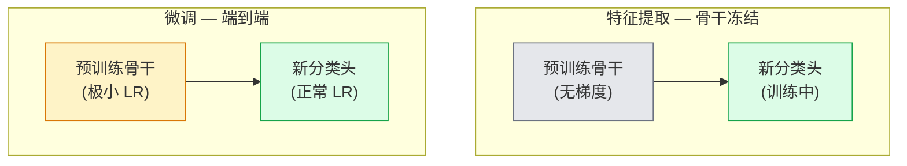

> 别人花了上百万 GPU 小时教网络认识边缘、纹理和物体部件。你应该先借用这些特征，再训练自己的模型。


## 学习目标

- 区分特征提取（Feature Extraction）和微调（Fine-Tuning），根据数据集大小、领域距离和算力预算选择合适策略
- 加载预训练骨干网络，替换分类头，20 行代码内只训练头部跑出一个能用的 baseline
- 渐进式解冻层，配合判别式学习率（Discriminative Learning Rate），让早期通用特征更新幅度小、后期任务特征更新幅度大
- 诊断三种常见翻车：对解冻层用了过高 LR 导致特征漂移、BN 统计量在小数据集上崩溃、灾难性遗忘

## 为什么要学这个

从零训练一个 ResNet-50 在 ImageNet 上大约要 2,000 GPU 小时。绝大多数团队没有这个预算给每一个任务都从头来。实际发布的几乎都是：拿一个预训练骨干，换个新头，用几百到几千张任务图片训一下就上线了。

这不是偷懒。ImageNet 训出来的 CNN，第一层卷积学的是边缘和类 Gabor 滤波器，接下来几层学纹理和简单图案，中间层学物体部件，最后几层学的才是跟 ImageNet 那 1000 类强相关的组合特征。前 90% 的特征层级几乎原封不动地迁移到医学影像、工业检测、卫星遥感以及你能想到的其它视觉任务——因为自然界的边缘和纹理词汇是有限的。你真正要训的只是最后那 10%。

但迁移做不好有三个坑等着你：学习率太高把预训练特征炸了、冻得太多导致模型吃不到信息、BatchNorm 的统计量漂移到一个跟网络其余部分完全不匹配的小数据集上。这节课会带你故意踩一遍这三个坑。

## 核心概念

### 特征提取 vs 微调

两种方案，取决于你对预训练特征的信任程度和你手头有多少数据。



经验法则：

| 数据集大小 | 与 ImageNet 的领域距离 | 策略 |
|-----------|----------------------|------|
| < 1k 张 | 近 | 冻结骨干，只训头部 |
| 1k-10k | 近 | 冻结前 2-3 个 stage，微调剩余 |
| 10k-100k | 任意 | 端到端微调 + 判别式学习率 |
| 100k+ | 远 | 全部微调；如果领域足够远，考虑从头训 |

"接近 ImageNet" 大致意味着自然 RGB 照片、包含物体类内容。医学 CT、遥感卫星图、显微镜图像属于远领域——预训练特征仍然有帮助，但你需要解冻更多层。

### 为什么冻结能生效

CNN 在 ImageNet 上学到的特征并不是针对那 1000 类的。它们针对的是自然图像的统计规律：特定方向的边缘、纹理、对比度模式、形状基元。这些统计规律在几乎所有视觉领域都稳定存在。所以一个 ImageNet 训好的模型，骨干完全冻住、只加一个线性头做零样本评估（zero-shot linear probe），在 CIFAR-10 上就能拿到 80%+ 的准确率。头部只是在学：已经学好的这些特征，该怎么加权组合来做这个新任务。

### 判别式学习率（Discriminative Learning Rate）

解冻之后，早期层应该训得比后期层慢。早期层编码的是你想保留的通用特征；后期层编码的是需要大幅调整的任务相关结构。

```
典型配置：

  stage 0（stem + 第一组）: lr = base_lr / 100    （几乎不动）
  stage 1:                   lr = base_lr / 10
  stage 2:                   lr = base_lr / 3
  stage 3（最后一组骨干）:    lr = base_lr
  head:                      lr = base_lr（或稍高）
```

在 PyTorch 里就是给 optimizer 传一个参数组列表。一个模型，五个学习率，零额外代码。

### BatchNorm 的坑

BN 层内部保存着 `running_mean` 和 `running_var` 缓冲区，这些是在 ImageNet 上算出来的。如果你的任务像素分布不一样——光照不同、传感器不同、色彩空间不同——那这些缓冲区就是错的。按优先级排列有三种处理方式：

1. **让 BN 在 train 模式下微调。** 让 BN 和其他层一起更新统计量。数据量中等（>= 5k 样本）时的默认选择。
2. **冻结 BN 在 eval 模式。** 保留 ImageNet 的统计量，只训权重。适用于数据集太小、BN 的滑动平均会被噪声带歪的情况。
3. **用 GroupNorm 替换 BN。** 彻底消除滑动平均的问题。在检测和分割骨干中常用，因为每 GPU 的 batch size 很小。

搞错这一步会让准确率默默掉 5-15%。

### 分类头设计

分类头就是 1-3 个线性层加一个可选的 dropout。torchvision 的骨干自带一个默认头，你要做的是替换它：

```
backbone.fc = nn.Linear(backbone.fc.in_features, num_classes)          # ResNet
backbone.classifier[1] = nn.Linear(..., num_classes)                    # EfficientNet, MobileNet
backbone.heads.head = nn.Linear(..., num_classes)                       # torchvision ViT
```

数据集小的时候，一个线性层通常就够了。加一个隐藏层（Linear -> ReLU -> Dropout -> Linear）在任务分布离骨干训练分布较远时有帮助。

### 逐层学习率衰减（Layer-wise LR Decay）

判别式 LR 的平滑版本，用在现代微调场景（BEiT、DINOv2、ViT-B 微调）。不是按 stage 分组，而是给每一层的 LR 都比上一层稍小一点：

```
lr_layer_k = base_lr * decay^(L - k)
```

当 decay = 0.75、L = 12 个 transformer block 时，第一个 block 的 LR 是头部的 `0.75^11 ≈ 0.04x`。对 transformer 微调比对 CNN 更重要——CNN 用 stage 分组的方式通常就够了。

### 该关注什么指标

迁移学习的实验需要跟踪两个从零训练时不会看的数字：

- **仅预训练准确率** — 骨干冻结时，头部的准确率。这是你的下限。
- **微调后准确率** — 端到端训练后的准确率。这是你的上限。

如果微调后反而比纯预训练低，说明你有学习率或 BN 的 bug。两个数一定要都打印出来。

## 从零实现

### 第一步：加载预训练骨干并查看结构

```python
import torch
import torch.nn as nn
from torchvision.models import resnet18, ResNet18_Weights

backbone = resnet18(weights=ResNet18_Weights.IMAGENET1K_V1)
print(backbone)
print()
print("classifier head:", backbone.fc)
print("feature dim:", backbone.fc.in_features)
```

`ResNet18` 有四个 stage（`layer1..layer4`）加一个 stem 和一个 `fc` 头。所有 torchvision 分类骨干都有类似的结构。

### 第二步：特征提取 — 冻住一切，只换头

```python
def make_feature_extractor(num_classes=10):
    model = resnet18(weights=ResNet18_Weights.IMAGENET1K_V1)
    # 冻结所有参数
    for p in model.parameters():
        p.requires_grad = False
    # 替换分类头
    model.fc = nn.Linear(model.fc.in_features, num_classes)
    return model

model = make_feature_extractor(num_classes=10)
trainable = sum(p.numel() for p in model.parameters() if p.requires_grad)
frozen = sum(p.numel() for p in model.parameters() if not p.requires_grad)
print(f"trainable: {trainable:>10,}")
print(f"frozen:    {frozen:>10,}")
```

只有 `model.fc` 是可训练的。骨干就是一个冻结的特征提取器。

### 第三步：判别式微调

一个工具函数，按 stage 构建不同学习率的参数组。

```python
def discriminative_param_groups(model, base_lr=1e-3, decay=0.3):
    stages = [
        ["conv1", "bn1"],
        ["layer1"],
        ["layer2"],
        ["layer3"],
        ["layer4"],
        ["fc"],
    ]
    groups = []
    for i, names in enumerate(stages):
        lr = base_lr * (decay ** (len(stages) - 1 - i))
        params = [p for n, p in model.named_parameters()
                  if any(n.startswith(k) for k in names)]
        if params:
            groups.append({"params": params, "lr": lr, "name": "_".join(names)})
    return groups

model = resnet18(weights=ResNet18_Weights.IMAGENET1K_V1)
model.fc = nn.Linear(model.fc.in_features, 10)
for p in model.parameters():
    p.requires_grad = True

groups = discriminative_param_groups(model)
for g in groups:
    print(f"{g['name']:>10s}  lr={g['lr']:.2e}  params={sum(p.numel() for p in g['params']):>8,}")
```

`decay=0.3` 意味着每个 stage 的学习率是下一个 stage 的 30%。`fc` 拿到 `base_lr`，`layer4` 拿到 `0.3 * base_lr`，`conv1` 拿到 `0.3^5 * base_lr ≈ 0.00243 * base_lr`。听起来很极端，但实验证明确实好使。

### 第四步：处理 BatchNorm

一个辅助函数，冻结 BN 的运行统计量但不冻结其权重。

```python
def freeze_bn_stats(model):
    """冻结 BN 的 running_mean/var，但保留 gamma/beta 可训练"""
    for m in model.modules():
        if isinstance(m, (nn.BatchNorm1d, nn.BatchNorm2d, nn.BatchNorm3d)):
            m.eval()
            for p in m.parameters():
                p.requires_grad = False
    return model
```

在每个 epoch 开头 `model.train()` 之后调用它。`model.train()` 会把所有层切到训练模式；这个函数只对 BN 层反转回来。

### 第五步：最小化端到端微调循环

```python
from torch.optim import SGD
from torch.utils.data import DataLoader
from torch.optim.lr_scheduler import CosineAnnealingLR
import torch.nn.functional as F

def fine_tune(model, train_loader, val_loader, device, epochs=5, base_lr=1e-3, freeze_bn=False):
    model = model.to(device)
    groups = discriminative_param_groups(model, base_lr=base_lr)
    optimizer = SGD(groups, momentum=0.9, weight_decay=1e-4, nesterov=True)
    scheduler = CosineAnnealingLR(optimizer, T_max=epochs)

    for epoch in range(epochs):
        model.train()
        if freeze_bn:
            freeze_bn_stats(model)
        tr_loss, tr_correct, tr_total = 0.0, 0, 0
        for x, y in train_loader:
            x, y = x.to(device), y.to(device)
            logits = model(x)
            loss = F.cross_entropy(logits, y, label_smoothing=0.1)
            optimizer.zero_grad()
            loss.backward()
            optimizer.step()
            tr_loss += loss.item() * x.size(0)
            tr_total += x.size(0)
            tr_correct += (logits.argmax(-1) == y).sum().item()
        scheduler.step()

        model.eval()
        va_total, va_correct = 0, 0
        with torch.no_grad():
            for x, y in val_loader:
                x, y = x.to(device), y.to(device)
                pred = model(x).argmax(-1)
                va_total += x.size(0)
                va_correct += (pred == y).sum().item()
        print(f"epoch {epoch}  train {tr_loss/tr_total:.3f}/{tr_correct/tr_total:.3f}  "
              f"val {va_correct/va_total:.3f}")
    return model
```

用上面这套配置在 CIFAR-10 上跑 5 个 epoch，`ResNet18-IMAGENET1K_V1` 可以从 ~70% 的零样本线性探测准确率提升到 ~93% 的微调准确率。如果只训头部不动骨干，大概在 86% 就到顶了。

### 第六步：渐进式解冻

一个调度策略，每个 epoch 从后往前解冻一个 stage。能缓解特征漂移，代价是多跑几个 epoch。

```python
def progressive_unfreeze_schedule(model):
    """每个 epoch 从后往前解冻一个 stage"""
    stages = ["layer4", "layer3", "layer2", "layer1"]
    yielded = set()

    def start():
        # 初始状态：冻住一切，只开放头部
        for p in model.parameters():
            p.requires_grad = False
        for p in model.fc.parameters():
            p.requires_grad = True

    def unfreeze(epoch):
        if epoch < len(stages):
            name = stages[epoch]
            yielded.add(name)
            for n, p in model.named_parameters():
                if n.startswith(name):
                    p.requires_grad = True
            return name
        return None

    return start, unfreeze
```

第一个 epoch 之前调用 `start()`。每个 epoch 开头调用 `unfreeze(epoch)`。每次可训练参数集变了之后要重建 optimizer，否则被冻结的参数还留着缓存的动量值会把优化搞乱。

## 实战用法

大多数真实任务用 `torchvision.models` + 三行代码就够了。上面那些重型工具是在你踩到库默认配置解决不了的问题时才需要的。

```python
from torchvision.models import resnet50, ResNet50_Weights

model = resnet50(weights=ResNet50_Weights.IMAGENET1K_V2)
model.fc = nn.Linear(model.fc.in_features, num_classes)
optimizer = torch.optim.AdamW(model.parameters(), lr=1e-4, weight_decay=1e-4)
```

另外两个生产级默认选择：

- `timm` 提供约 800 个预训练视觉骨干，API 统一（`timm.create_model("resnet50", pretrained=True, num_classes=10)`）。超出 torchvision 范围的微调任务，它是标准选择。
- 对于 transformer，`transformers.AutoModelForImageClassification.from_pretrained(name, num_labels=N)` 给你 ViT / BEiT / DeiT，加载语义跟文本模型一样。

## Ship It

这节课产出：

- `outputs/prompt-fine-tune-planner.md` — 一个 prompt，根据数据集大小、领域距离和算力预算帮你选择特征提取 vs 渐进式解冻 vs 端到端微调。
- `outputs/skill-freeze-inspector.md` — 一个 skill，给定一个 PyTorch 模型，报告哪些参数可训练、哪些 BN 层处于 eval 模式、optimizer 是否真的在接收可训练参数。

## 练习

1. **（简单）** 分别用 `ResNet18` 做线性探测（骨干冻结）和完整微调，跑同一个合成 CIFAR 数据集。并排报告两个准确率。解释哪个差距说明特征迁移效果好，哪个说明不好。
2. **（中等）** 故意制造 bug：把骨干 stage 的 `base_lr` 设成 `1e-1`（而不是头部才用的大 LR）。展示训练 loss 爆炸，然后用 `discriminative_param_groups` 辅助函数恢复。记录每个 stage 开始发散的 LR 临界值。
3. **（困难）** 拿一个医学影像数据集（比如 CheXpert-small、PatchCamelyon 或 HAM10000），比较三种方案：(a) ImageNet 预训练冻结骨干 + 线性头；(b) ImageNet 预训练端到端微调；(c) 从零训练。报告每种方案的准确率和算力开销。在什么数据量下从零训练才开始有竞争力？

## 术语表

| 术语 | 通俗说法 | 实际含义 |
|------|---------|---------|
| 特征提取（Feature Extraction） | "冻住骨干训头部" | 骨干参数冻结，只有新分类头接收梯度 |
| 微调（Fine-Tuning） | "端到端重新训" | 所有参数可训练，但学习率通常比从零训小得多 |
| 判别式学习率（Discriminative LR） | "前面的层 LR 小一点" | Optimizer 的参数组中，早期 stage 的 LR 是后期 stage 的几分之一 |
| 逐层学习率衰减（Layer-wise LR Decay） | "平滑的 LR 梯度" | 每一层的 LR 乘以 decay^(L - k)；在 transformer 微调中常见 |
| 灾难性遗忘（Catastrophic Forgetting） | "模型把 ImageNet 忘了" | LR 太高，新任务的信号还没学到，预训练特征就已经被覆盖了 |
| BN 统计量漂移 | "running mean 算错了" | BatchNorm 的 running_mean/var 是在不同分布上算的，跟当前任务不匹配，默默拖低准确率 |
| 线性探测（Linear Probe） | "冻住骨干 + 线性头" | 评估预训练特征质量的方法——在冻结表示上训练最佳线性分类器的准确率 |
| 灾难性坍塌（Catastrophic Collapse） | "全预测同一类" | LR 高到在头部梯度能稳住之前就把特征毁了 |

## 延伸阅读

- [How transferable are features in deep neural networks? (Yosinski et al., 2014)](https://arxiv.org/abs/1411.1792) — 量化了不同层特征可迁移性的开创性论文
- [Universal Language Model Fine-tuning (ULMFiT, Howard & Ruder, 2018)](https://arxiv.org/abs/1801.06146) — 判别式 LR / 渐进式解冻的原始方案；思路直接迁移到视觉领域
- [timm 文档](https://huggingface.co/docs/timm) — 现代视觉骨干的参考手册，包含训练时的精确微调配置
- [A Simple Framework for Linear-Probe Evaluation (Kornblith et al., 2019)](https://arxiv.org/abs/1805.08974) — 为什么线性探测准确率重要以及如何正确报告

---

## 自测题

:::quiz
question: 你有 500 张新任务的标注图片，任务领域接近 ImageNet 分布。哪种方案最合理？
options:
  - 从零训练一个 ResNet-50
  - 冻结 ImageNet 预训练骨干，只训练一个新线性头
  - 全部层用同一个大 LR 进行微调
  - 不用预训练权重；小数据集配小模型效果最好
correct: 1
explanation: 500 张图片不够从零训一个深度网络，也不够安全地端到端微调所有层（会把预训练特征毁掉）。冻结骨干、只训头部（线性探测）直接利用了预训练特征，是小规模、近领域数据集的标准方案。
:::

:::quiz
question: 为什么 ImageNet 预训练网络的早期卷积层能迁移到医学影像，即使 ImageNet 里没有 X 光片？
options:
  - PyTorch 会自动重新初始化早期层
  - 早期层编码的是通用视觉基元——边缘、方向、对比度——几乎所有视觉领域都共享；只有后期层才会特化到 ImageNet 的类别
  - ImageNet 里其实暗含了医学数据
  - 迁移学习只在领域一致时才有用
correct: 1
explanation: 类 Gabor 滤波器和简单纹理检测器是 CNN 早期层在任何自然图像语料上都会学到的特征。它们反映了光线、阴影和边缘的统计规律，这些规律在摄影、医学影像、显微图像和卫星数据中都成立。后期层逐渐特化，所以微调重点放在最后几个 block。
:::

:::quiz
question: 端到端微调用判别式学习率时，为什么早期层的 LR 要比后期层小？
options:
  - 早期层参数量更少
  - 早期层编码的是你想保留的通用特征，后期层编码的是需要大幅调整的任务特征；早期层用小 LR 可以防止特征漂移和灾难性遗忘
  - PyTorch 要求按层设置 LR 才能正确运行
  - 早期层 LR 小可以加速训练
correct: 1
explanation: 早期层已经编码了正确的视觉基元，你只想做微小更新来保留它们。后期层需要朝新任务大幅移动。如果整个模型用同一个 LR，就被迫折中，两头都受损。判别式 LR 让每个 stage 按自己的节奏调整，这是微调的经验最优解。
:::

:::quiz
question: 你在一个 10 类医学数据集（800 张灰度图，复制到 3 通道）上微调 ResNet。准确率是 10%（10 类的随机水平）。最可能的原因是什么？
options:
  - 你用错了损失函数
  - BatchNorm 的运行统计量来自 ImageNet RGB 照片，跟灰度医学图像的分布严重不匹配，导致前几个 BN 层输出噪声并向后传播
  - ResNet 不能处理灰度输入
  - 800 张图片对任何迁移学习来说都太少了
correct: 1
explanation: BatchNorm 保存着在 ImageNet 上计算的 running_mean 和 running_var。在一个小的、分布偏移严重的数据集上，短暂的微调中这些缓冲区来不及适应，BN 用错误的统计量做归一化。解决方案：冻结 BN 统计量、换成 GroupNorm、或者先在目标数据集上跑一轮只更新 BN 的预热。
:::

:::quiz
question: 你比较了两次实验：(a) 冻结 ImageNet 骨干做线性探测，82% 准确率；(b) 端到端微调，78% 准确率。你应该得出什么结论？
options:
  - 微调没用；直接上线线性探测版本
  - 微调结果低于线性探测，几乎一定是训练 bug——LR 太高、BN 处理不当、或 scheduler/optimizer 配置错误；先排查再下结论
  - 数据集太大了
  - 预训练权重质量差
correct: 1
explanation: 微调的结果应该始终等于或超过线性探测，因为线性探测就是骨干 LR = 0 的微调特例。如果微调反而更差，说明训练流程在主动破坏预训练特征。修复方法是降低骨干 LR、应用判别式 LR、或冻结 BN——而不是放弃微调。
:::
