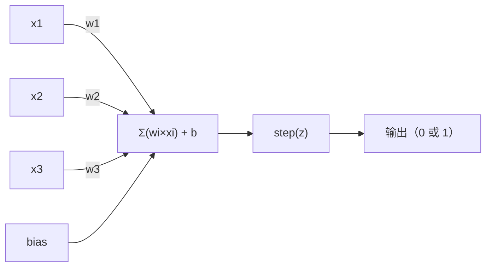
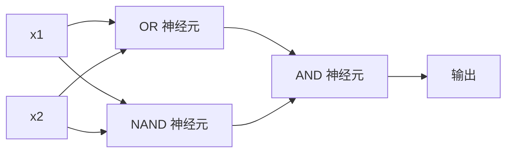

> 感知机是神经网络的原子。掰开看里面就是权重、偏置和一个决策。

## 学习目标

- 用 Python 从零实现感知机，包括权重更新规则和阶跃激活函数
- 解释为什么单个感知机只能解决线性可分问题，演示 XOR 失败案例
- 通过组合 OR、NAND、AND 门构造多层感知机解决 XOR
- 训练一个两层 sigmoid 网络用反向传播自动学会 XOR

## 为什么要学这个

你已经知道向量和点积了。你知道矩阵能把输入变成输出。但机器怎么**学会**该用哪个变换？

感知机回答了这个问题。它是最简单的学习机器：接收输入、乘以权重、加 bias、做出二元判断，然后调整。就这样。历史上所有神经网络都是这个想法一层层堆出来的。

理解感知机意味着理解"学习"在代码中到底是什么：**调整数字直到输出跟现实匹配**。

## 核心概念

### 一个神经元，一个决策

感知机接收 n 个输入，每个乘以一个权重，求和，加 bias，然后通过激活函数。



阶跃函数很粗暴：加权和加 bias ≥ 0 就输出 1，否则输出 0。

```
step(z) = 1  如果 z ≥ 0
           0  如果 z < 0
```

这就是一个线性分类器。权重和 bias 定义了一条线（高维空间中是超平面），把输入空间切成两半。

### 决策边界

对于两个输入，感知机在二维空间里画一条线：

```
  x2
  ┤
  │  类别 0         /
  │    (0)          /
  │                /
  │               / w1·x1 + w2·x2 + b = 0
  │              /
  │             /     类别 1
  │            /        (1)
  ┼───────────/──────────── x1
```

线一边输出 0，另一边输出 1。训练就是移动这条线直到它正确分开两类。

### 学习规则

感知机学习规则非常简单：

```
对每个训练样本 (x, y_true)：
    y_pred = predict(x)
    error = y_true - y_pred

    对每个权重：
        w_i = w_i + learning_rate × error × x_i
    bias = bias + learning_rate × error
```

预测对了，error = 0，什么都不变。预测 0 但应该是 1，权重增大。预测 1 但应该是 0，权重减小。学习率控制每次调整有多大。

### XOR 问题

到这就崩了。看看这些逻辑门：

```
AND 门：           OR 门：            XOR 门：
x1  x2  out       x1  x2  out       x1  x2  out
0   0   0         0   0   0         0   0   0
0   1   0         0   1   1         0   1   1
1   0   0         1   0   1         1   0   1
1   1   1         1   1   1         1   1   0
```

AND 和 OR 是线性可分的——能画一条线把 0 和 1 分开。XOR 不行。没有任何一条线能把 [0,1] 和 [1,0] 跟 [0,0] 和 [1,1] 分开。

```
AND（可分）：           XOR（不可分）：

  x2                      x2
  1 ┤  0     1            1 ┤  1     0
    │     /                 │
  0 ┤  0 / 0              0 ┤  0     1
    ┼──/──────── x1         ┼──────────── x1
       一条线搞定！           没有一条线能搞定！
```

这是根本性限制。单个感知机只能解决线性可分问题。1969 年 Minsky 和 Papert 证明了这一点，差点杀死了神经网络研究十年。

**解决方案**：把感知机堆成层。多层感知机可以通过组合两个线性决策来解决非线性问题。

## 从零实现

### 第一步：Perceptron 类

```python
class Perceptron:
    def __init__(self, n_inputs, learning_rate=0.1):
        self.weights = [0.0] * n_inputs
        self.bias = 0.0
        self.lr = learning_rate

    def predict(self, inputs):
        total = sum(w * x for w, x in zip(self.weights, inputs))
        total += self.bias
        return 1 if total >= 0 else 0

    def train(self, training_data, epochs=100):
        for epoch in range(epochs):
            errors = 0
            for inputs, target in training_data:
                prediction = self.predict(inputs)
                error = target - prediction
                if error != 0:
                    errors += 1
                    for i in range(len(self.weights)):
                        self.weights[i] += self.lr * error * inputs[i]
                    self.bias += self.lr * error
            if errors == 0:
                print(f"第 {epoch + 1} 轮收敛")
                return
        print(f"{epochs} 轮后未收敛")
```

### 第二步：在逻辑门上训练

```python
and_data = [([0,0], 0), ([0,1], 0), ([1,0], 0), ([1,1], 1)]
or_data  = [([0,0], 0), ([0,1], 1), ([1,0], 1), ([1,1], 1)]

print("=== AND 门 ===")
p_and = Perceptron(2)
p_and.train(and_data)
for inputs, _ in and_data:
    print(f"  {inputs} → {p_and.predict(inputs)}")

print("\n=== OR 门 ===")
p_or = Perceptron(2)
p_or.train(or_data)
for inputs, _ in or_data:
    print(f"  {inputs} → {p_or.predict(inputs)}")
```

### 第三步：看 XOR 失败

```python
xor_data = [([0,0], 0), ([0,1], 1), ([1,0], 1), ([1,1], 0)]

print("\n=== XOR 门（单层感知机）===")
p_xor = Perceptron(2)
p_xor.train(xor_data, epochs=1000)
for inputs, expected in xor_data:
    result = p_xor.predict(inputs)
    status = "✓" if result == expected else "✗"
    print(f"  {inputs} → {result}（期望 {expected}）{status}")
```

永远不会收敛。这就是单感知机解不了 XOR 的铁证。

### 第四步：用两层解决 XOR

技巧：XOR = (x1 OR x2) AND NOT(x1 AND x2)。组合三个感知机：



```python
def xor_network(x1, x2):
    """手动搭建的两层 XOR 网络"""
    or_neuron = Perceptron(2)
    or_neuron.weights = [1.0, 1.0]
    or_neuron.bias = -0.5

    nand_neuron = Perceptron(2)
    nand_neuron.weights = [-1.0, -1.0]
    nand_neuron.bias = 1.5

    and_neuron = Perceptron(2)
    and_neuron.weights = [1.0, 1.0]
    and_neuron.bias = -1.5

    hidden1 = or_neuron.predict([x1, x2])
    hidden2 = nand_neuron.predict([x1, x2])
    output = and_neuron.predict([hidden1, hidden2])
    return output

print("\n=== XOR 门（多层网络）===")
for inputs, expected in xor_data:
    result = xor_network(inputs[0], inputs[1])
    print(f"  {inputs} → {result}（期望 {expected}）")
```

四个情况全对。把感知机堆成层，就能产生单层做不到的决策边界。

### 第五步：训练一个两层网络

第四步是手动设定权重的。这对 XOR 管用，但真实问题你不知道正确的权重。解决方案：把阶跃函数换成 sigmoid（光滑的，梯度存在），然后通过反向传播自动学习权重。

```python
import random
import math

class TwoLayerNetwork:
    def __init__(self, learning_rate=0.5):
        random.seed(0)
        # 隐藏层：2 个神经元，每个 2 个输入
        self.w_hidden = [[random.uniform(-1, 1), random.uniform(-1, 1)] for _ in range(2)]
        self.b_hidden = [random.uniform(-1, 1), random.uniform(-1, 1)]
        # 输出层：1 个神经元，2 个输入（来自隐藏层）
        self.w_output = [random.uniform(-1, 1), random.uniform(-1, 1)]
        self.b_output = random.uniform(-1, 1)
        self.lr = learning_rate

    def sigmoid(self, x):
        x = max(-500, min(500, x))
        return 1.0 / (1.0 + math.exp(-x))

    def forward(self, inputs):
        self.inputs = inputs
        # 隐藏层
        self.hidden_outputs = []
        for i in range(2):
            z = sum(w * x for w, x in zip(self.w_hidden[i], inputs)) + self.b_hidden[i]
            self.hidden_outputs.append(self.sigmoid(z))
        # 输出层
        z_out = sum(w * h for w, h in zip(self.w_output, self.hidden_outputs)) + self.b_output
        self.output = self.sigmoid(z_out)
        return self.output

    def train(self, training_data, epochs=10000):
        for epoch in range(epochs):
            total_error = 0
            for inputs, target in training_data:
                output = self.forward(inputs)
                error = target - output
                total_error += error ** 2

                # 输出层梯度
                d_output = error * output * (1 - output)

                # 隐藏层梯度（链式法则！）
                hidden_deltas = []
                for i in range(2):
                    h = self.hidden_outputs[i]
                    hd = d_output * self.w_output[i] * h * (1 - h)
                    hidden_deltas.append(hd)

                # 更新输出层权重
                for i in range(2):
                    self.w_output[i] += self.lr * d_output * self.hidden_outputs[i]
                self.b_output += self.lr * d_output

                # 更新隐藏层权重
                for i in range(2):
                    for j in range(len(inputs)):
                        self.w_hidden[i][j] += self.lr * hidden_deltas[i] * inputs[j]
                    self.b_hidden[i] += self.lr * hidden_deltas[i]

            if epoch % 2000 == 0:
                print(f"  epoch {epoch}: loss = {total_error:.6f}")

# 训练
net = TwoLayerNetwork(learning_rate=2.0)
net.train(xor_data, epochs=10000)

print("\n训练后的预测：")
for inputs, expected in xor_data:
    result = net.forward(inputs)
    predicted = 1 if result >= 0.5 else 0
    print(f"  {inputs} → {result:.4f}（四舍五入: {predicted}，期望 {expected}）")
```

跟第四步的两个关键区别：一、sigmoid 代替阶跃函数——它是光滑的，梯度存在。二、`train` 方法把误差从输出层反向传播到隐藏层，按每个权重对误差的贡献来调整。这就是 20 行代码的反向传播。

这是通往第 3 课的桥梁。`d_output` 和 `hidden_deltas` 背后的数学就是链式法则应用到网络图上。那边会正式推导。

## 用库做同样的事

```python
from sklearn.linear_model import Perceptron as SkPerceptron
import numpy as np

X = np.array([[0,0], [0,1], [1,0], [1,1]])
y = np.array([0, 0, 0, 1])  # AND 门

clf = SkPerceptron(max_iter=100, tol=1e-3)
clf.fit(X, y)
print([clf.predict([x])[0] for x in X])  # [0, 0, 0, 1]
```

五行。你的 30 行 `Perceptron` 类做的是同样的事。sklearn 版加了收敛检查、多种损失函数和稀疏输入支持——但核心循环一模一样。

真正的飞跃在于规模。生产网络的变化：
- 阶跃函数变成 sigmoid、ReLU 或其他光滑激活
- 权重通过反向传播自动学习（第 3 课）
- 层变深：3 层、10 层、100+ 层
- 核心原则不变：每层从前一层的输出创建新特征

单个感知机只能画直线。堆起来，你能画任何形状。

## 练习

1. 训练一个 NAND 门感知机（万能门——任何逻辑电路都能用 NAND 搭）。验证它的权重和 bias 形成合法的决策边界。
2. 修改 Perceptron 类，在每个 epoch 追踪决策边界 (w1×x1 + w2×x2 + b = 0)。打印 AND 门训练过程中这条线的移动。
3. 搭一个 3 输入感知机，只在至少 2 个输入为 1 时输出 1（多数投票）。这是线性可分的吗？为什么？

## 术语表

| 术语 | 通俗说法 | 真正含义 |
|------|---------|---------|
| Perceptron（感知机） | "假神经元" | 线性分类器：输入和权重的点积加 bias，通过阶跃函数 |
| Weight（权重） | "输入有多重要" | 缩放每个输入对决策贡献的乘数 |
| Bias（偏置） | "阈值" | 平移决策边界的常数，让感知机在输入为零时也能激活 |
| Activation function（激活函数） | "压缩值的东西" | 加权和之后应用的函数。感知机用阶跃函数，现代网络用 sigmoid/ReLU |
| Linearly separable（线性可分） | "能画一条线分开" | 一个超平面能完美分开两类的数据集 |
| XOR problem | "感知机做不到的事" | 证明单层网络无法学习非线性可分函数 |
| Decision boundary（决策边界） | "分类器切换的地方" | 超平面 w·x + b = 0，把输入空间分成两类 |
| MLP（多层感知机） | "真正的神经网络" | 感知机堆成层，每层的输出作为下一层的输入 |

---

## 自测题

:::quiz
question: 感知机在应用激活函数之前对输入做了什么数学运算？
options:
  - 矩阵求逆
  - 加权求和加偏置
  - 傅里叶变换
  - 特征值分解
correct: 1
explanation: 感知机计算输入和权重的点积，加上 bias，然后通过阶跃函数。加权求和加偏置是核心计算。
:::

:::quiz
question: "线性可分"对分类问题意味着什么？
options:
  - 数据可以按顺序排列
  - 一条直线（或超平面）可以完美分开两类
  - 特征跟标签有线性关系
  - 数据只有两个维度
correct: 1
explanation: 线性可分意味着能画一个超平面完美把输入空间分成正确的类别。AND 和 OR 是线性可分的；XOR 不是。
:::

:::quiz
question: 为什么单个感知机学不了 XOR？
options:
  - 学习率太低
  - XOR 输入太多
  - XOR 不是线性可分的——没有一条直线能分开这些类
  - 阶跃函数阻止了梯度流动
correct: 2
explanation: XOR 把 [0,1] 和 [1,0] 放一边，[0,0] 和 [1,1] 放另一边。没有一条直线能分开这两组，所以只能画一条线性边界的单感知机解不了 XOR。
:::

:::quiz
question: 感知机学习规则中，预测正确时会发生什么？
options:
  - 权重翻倍
  - 权重归零
  - 什么都不变——error 为零所以更新量为零
  - 学习率减半
correct: 2
explanation: 更新规则是 w_i = w_i + lr × error × x_i。预测等于目标时 error = 0，所有权重更新为零。感知机只在犯错时才调整。
:::

:::quiz
question: 多个感知机怎么解决 XOR？
options:
  - 对单个感知机用更大的学习率
  - 用 OR、NAND 和 AND 感知机组合成两层
  - 给单个感知机加更多输入
  - 去掉 bias 项
correct: 1
explanation: XOR = (x1 OR x2) AND NOT(x1 AND x2)。隐藏层放一个 OR 神经元和一个 NAND 神经元，输出层是 AND 神经元——从线性组件构造出非线性决策边界。
:::
