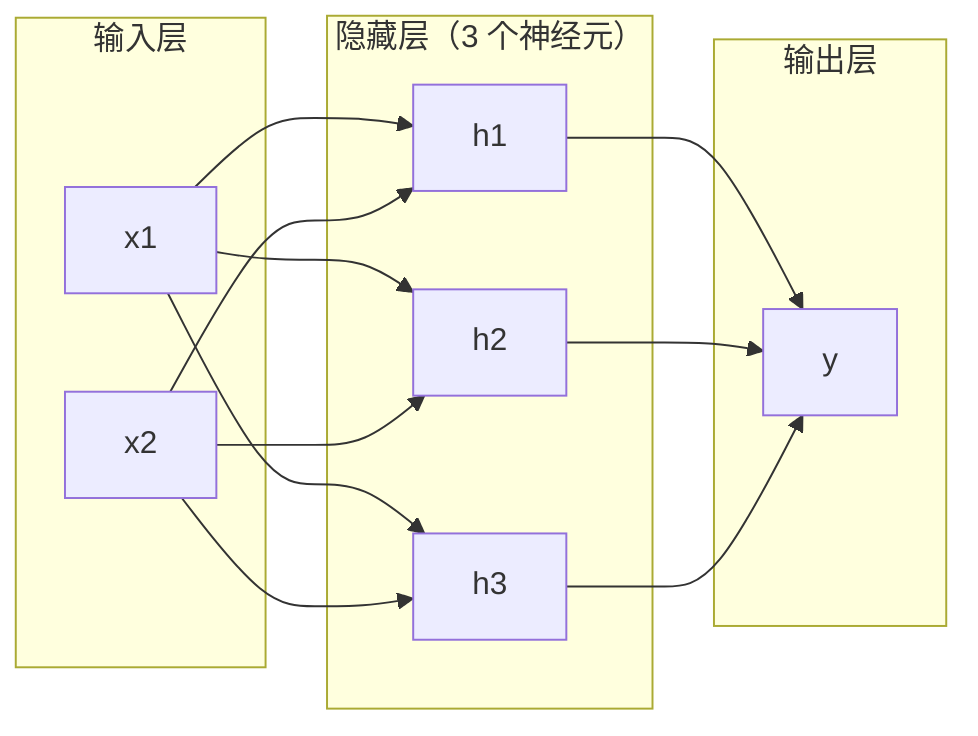
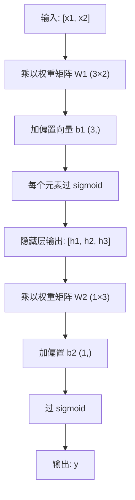

> 一个神经元画直线。堆起来，你能画任何东西。

## 学习目标

- 从零搭建 Layer 和 Network 类，完成完整的前向传播
- 跟踪每一层的矩阵维度，识别形状不匹配的 bug
- 解释为什么堆叠非线性激活让网络能学习弯曲的决策边界
- 用 2-2-1 架构配合手调 sigmoid 权重解决 XOR

## 为什么要学这个

单个神经元是画线器——就这。一条直线穿过数据。AI 里的每个真实问题——图像识别、语言理解、下围棋——都需要曲线。把神经元堆成层就是获得曲线的方法。

1969 年 Minsky 和 Papert 证明了单层网络数学上不可能学 XOR。这让神经网络研究冻结了十年。解决方案事后看很明显：不要只用一层。把神经元堆成层。让第一层把输入空间切出新特征，让第二层组合这些特征做出单条直线做不到的决策。

这个堆叠就是多层网络。今天生产中的每个深度学习模型都建立在它之上。前向传播——数据从输入流经隐藏层到输出——是你需要搭建的第一个东西。

## 核心概念

### 三种层：输入、隐藏、输出



这是一个 2-3-1 网络：2 个输入，3 个隐藏神经元，1 个输出。每条连接带一个权重，每个神经元（除输入）带一个 bias。

**输入层**——不是真正的"层"。存原始数据。没有计算。

**隐藏层**——工作在这里发生。每个神经元取前一层的所有输出，应用权重和 bias，通过激活函数。"隐藏"是因为训练数据里看不到这些值。

**输出层**——最终答案。二分类用一个 sigmoid 神经元，多分类用每类一个神经元。

### 前向传播：数据怎么流

前向传播把输入数据逐层推过网络直到输出。不学习。纯计算：乘，加，激活，重复。



每层三步：

```
z = W × input + b       （线性变换）
a = sigmoid(z)           （激活）
```

一层的输出变成下一层的输入。这就是整个前向传播。

### 矩阵维度追踪

追踪维度是深度学习中最重要的调试技能。2-3-1 网络：

| 步骤 | 操作 | 维度 | 结果形状 |
|------|------|------|---------|
| 输入 | x | — | (2,) |
| 隐藏层线性 | W1 × x + b1 | W1: (3, 2), b1: (3,) | (3,) |
| 隐藏层激活 | sigmoid(z1) | — | (3,) |
| 输出层线性 | W2 × h + b2 | W2: (1, 3), b2: (1,) | (1,) |
| 输出层激活 | sigmoid(z2) | — | (1,) |

**规则**：第 k 层的权重矩阵形状是 (本层神经元数, 上一层神经元数)。行对应当前层，列对应前一层。形状对不上就有 bug。

### 万能近似定理

1989 年 Cybenko 证明：一个隐藏层 + 足够多神经元的网络可以逼近任何连续函数到任意精度。

这不意味着一层总是最好的。它意味着这个架构理论上有能力。实际中更深的网络（更多层、每层更少神经元）用更少的总参数就能学到一样的函数——这就是为什么深度学习有效。

直觉：隐藏层的每个神经元学一个"小凸起"。凸起放对位置就能逼近任何光滑曲线。神经元越多，凸起越多，逼近越好。


## 从零实现

纯 Python，不用 NumPy。每个矩阵操作从零写。

### 第一步：Sigmoid 激活

```python
import math

def sigmoid(x):
    x = max(-500.0, min(500.0, x))  # 防止 overflow
    return 1.0 / (1.0 + math.exp(-x))
```

### 第二步：Layer 类

深度学习中最重要的运算是矩阵乘法。每一层、每个 attention head、每次前向传播——全是 matmul。线性层就是 y = Wx + b。这一个方程占了神经网络 90% 的计算量。

```python
class Layer:
    def __init__(self, n_inputs, n_neurons, weights=None, biases=None):
        if weights is not None:
            self.weights = weights
        else:
            import random
            self.weights = [
                [random.uniform(-1, 1) for _ in range(n_inputs)]
                for _ in range(n_neurons)
            ]
        self.biases = biases if biases is not None else [0.0] * n_neurons

    def forward(self, inputs):
        """前向传播：z = Wx + b，然后 sigmoid"""
        self.last_input = inputs
        self.last_output = []
        for neuron_idx in range(len(self.weights)):
            z = sum(w * x for w, x in zip(self.weights[neuron_idx], inputs))
            z += self.biases[neuron_idx]
            self.last_output.append(sigmoid(z))
        return self.last_output
```

权重矩阵形状是 (n_neurons, n_inputs)。每行是一个神经元对所有输入的权重。forward 遍历神经元，算加权和加 bias，过 sigmoid，收集结果。

### 第三步：Network 类

网络就是一列 Layer。前向传播就是链式调用：第 k 层的输出喂入第 k+1 层。

```python
class Network:
    def __init__(self, layers):
        self.layers = layers

    def forward(self, inputs):
        current = inputs
        for layer in self.layers:
            current = layer.forward(current)
        return current
```

整个前向传播，四行逻辑。数据进去，逐层流过，从另一头出来。

### 第四步：手调权重解 XOR

用 Layer 和 Network 类。2-2-1 架构：2 输入，2 个隐藏神经元，1 输出。

```python
# 大权重让 sigmoid 表现得像阶跃函数
hidden = Layer(
    n_inputs=2, n_neurons=2,
    weights=[[20.0, 20.0], [-20.0, -20.0]],  # 第一个≈OR，第二个≈NAND
    biases=[-10.0, 30.0],
)
output = Layer(
    n_inputs=2, n_neurons=1,
    weights=[[20.0, 20.0]],  # ≈AND
    biases=[-30.0],
)

xor_net = Network([hidden, output])

xor_data = [([0,0], 0), ([0,1], 1), ([1,0], 1), ([1,1], 0)]

for inputs, expected in xor_data:
    result = xor_net.forward(inputs)
    predicted = 1 if result[0] >= 0.5 else 0
    print(f"  {inputs} → {result[0]:.6f}（四舍五入: {predicted}，期望: {expected}）")
```

### 第五步：圆形分类

更难的问题：分类二维点是否在半径 0.5 的圆内。需要弯曲的决策边界——单感知机不可能。

```python
import random

random.seed(42)

data = []
for _ in range(200):
    x = random.uniform(-1, 1)
    y = random.uniform(-1, 1)
    label = 1 if (x*x + y*y) < 0.25 else 0
    data.append(([x, y], label))

# 2-8-1 网络（随机权重）
circle_net = Network([
    Layer(n_inputs=2, n_neurons=8),
    Layer(n_inputs=8, n_neurons=1),
])

# 随机权重的准确率
correct = sum(1 for inputs, expected in data
              if (1 if circle_net.forward(inputs)[0] >= 0.5 else 0) == expected)
print(f"随机权重准确率: {correct}/{len(data)} ({100*correct/len(data):.1f}%)")
```

随机权重准确率很差——通常比猜多数类还差。训练后（第 3 课），同样的 8 个隐藏神经元架构就能画出弯曲边界分开圆内外。

## 用库做同样的事

PyTorch 四行搞定以上所有：

```python
import torch
import torch.nn as nn

model = nn.Sequential(
    nn.Linear(2, 8),   # 你的 Layer 类：权重 (8,2) + bias (8,)
    nn.Sigmoid(),       # 你的 sigmoid 函数
    nn.Linear(8, 1),   # 又一层
    nn.Sigmoid(),
)

x = torch.tensor([[0.0, 0.0], [0.0, 1.0], [1.0, 0.0], [1.0, 1.0]])
output = model(x)
print(output)
```

`nn.Linear(2, 8)` 就是你的 Layer 类。`nn.Sequential` 就是你的 Network 类。区别在于速度和规模——PyTorch 在 GPU 上跑，处理几百万样本的 batch，自动算反向传播的梯度。但前向传播逻辑跟你从零写的一模一样。

## 练习

1. 搭一个 2-4-2-1 网络（两个隐藏层），用随机权重在 XOR 数据上跑前向传播。打印中间隐藏层输出看表示如何逐层变换。
2. 把圆形分类器的隐藏层大小从 8 改成 2、再改成 32。每次用随机权重跑前向传播。隐藏神经元数量改变了输出的范围或分布吗？为什么？
3. 给 Network 类实现 `count_parameters` 方法，返回总的可训练权重和 bias 数量。在 784-256-128-10 网络（经典 MNIST 架构）上测试，多少参数？
4. 把 sigmoid 换成"leaky step"：z < 0 返回 0.01×z，否则返回 1.0。用第四步同样的手调权重跑 XOR。还能用吗？为什么光滑的 sigmoid 优于硬切换？

## 术语表

| 术语 | 通俗说法 | 真正含义 |
|------|---------|---------|
| Forward pass（前向传播） | "跑一下模型" | 把输入逐层推过——乘权重、加 bias、过激活——产生输出 |
| Hidden layer（隐藏层） | "中间部分" | 输入和输出之间的任何层，其值在训练数据中不直接可见 |
| Activation function（激活函数） | "非线性" | 线性变换之后的函数，引入曲线到决策边界中 |
| Sigmoid | "S 形曲线" | σ(z) = 1/(1+e⁻ᶻ)，把任何实数压到 (0,1)，光滑可微 |
| Weight matrix（权重矩阵） | "参数" | 形状 (本层神经元, 上层神经元) 的矩阵，包含可学习的连接强度 |
| Universal approximation（万能近似） | "神经网络什么都能学" | 一个隐藏层加足够多神经元能逼近任何连续函数——但"足够多"可能是几十亿 |
| Linear transformation（线性变换） | "矩阵乘那步" | z = Wx + b，激活之前的计算，把输入映射到新空间 |
| Decision boundary（决策边界） | "分类器切换的地方" | 输入空间中网络输出跨过分类阈值的曲面 |

---

## 自测题

:::quiz
question: 隐藏层在多层网络中的作用是什么？
options:
  - 存储训练数据
  - 把输入变换成新的特征表示，使非线性决策边界成为可能
  - 减少参数数量
  - 应用损失函数
correct: 1
explanation: 隐藏层通过权重、bias 和激活函数创建新的特征表示。这些中间特征让网络能学到单层做不到的非线性映射。
:::

:::quiz
question: 前向传播做什么？
options:
  - 用梯度更新权重
  - 为反向传播计算梯度
  - 把输入逐层推过网络产生输出
  - 打乱训练数据
correct: 2
explanation: 前向传播是纯计算：每层乘权重、加 bias、过激活，把结果传给下一层。前向传播不学习。
:::

:::quiz
question: 一层有 3 个神经元，接收来自 2 个神经元的输入，权重矩阵形状是？
options:
  - (2, 3)
  - (3, 2)
  - (3, 3)
  - (2, 2)
correct: 1
explanation: 权重矩阵形状是 (当前层神经元数, 上一层神经元数) = (3, 2)。每行包含一个神经元对所有输入的权重。
:::

:::quiz
question: 万能近似定理保证了什么？
options:
  - 任何网络都能在多项式时间内训练
  - 一个隐藏层加足够多神经元可以逼近任何连续函数
  - 更深的网络总是比浅网络好
  - 神经网络能解决任何计算问题
correct: 1
explanation: Cybenko (1989) 证明了一个隐藏层加足够多神经元的网络可以逼近任何连续函数到任意精度。实际中更深的网络用更少的总参数达到同样效果。
:::

:::quiz
question: 为什么 sigmoid 激活函数让学习成为可能，而感知机的阶跃函数不行？
options:
  - Sigmoid 输出更大的值
  - Sigmoid 算得更快
  - Sigmoid 光滑可微，到处有梯度，反向传播需要梯度
  - Sigmoid 输出负值
correct: 2
explanation: 阶跃函数几乎到处梯度为零，在阈值处梯度未定义。Sigmoid 光滑，在每个点都有明确的导数 s×(1-s)，这对基于梯度的学习是必需的。
:::
