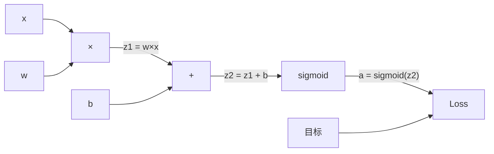
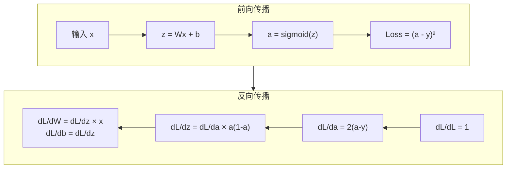
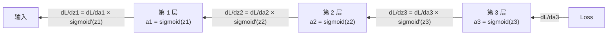

> 反向传播是让学习成为可能的算法。没有它，神经网络只是昂贵的随机数生成器。

## 学习目标

- 实现基于 Value 类的 autograd 引擎，构建计算图并通过拓扑排序计算梯度
- 用链式法则推导加法、乘法和 sigmoid 的反向传播
- 只用手写的反向传播引擎在 XOR 和圆形分类上训练多层网络
- 识别深层 sigmoid 网络中的梯度消失问题，解释为什么梯度指数衰减

## 为什么要学这个

你的网络有一层：768 个输入，3072 个输出。那是 2,359,296 个权重。它做了一个错误预测。哪些权重导致了错误？

朴素方法：逐个权重试——微调一个，跑前向传播看 loss 变了没。230 万个权重就需要 230 万次前向传播。乘以几千步训练和几百万数据点，你需要地质时间尺度才能训练出任何有用的东西。

反向传播解决了这个问题。**一次前向，一次反向，所有梯度算完。** 技巧是链式法则系统地应用到计算图上。这个算法让深度学习变成实际可行的。没有它我们还在做玩具问题。

## 核心概念

### 链式法则应用到网络

回忆：如果 y = f(g(x))，则 dy/dx = f'(g(x)) × g'(x)。沿链条乘导数。

在神经网络中，"链"是从输入到 loss 的操作序列。每层施加权重、加 bias、通过激活函数。Loss 函数比较最终输出和目标。反向传播就是沿这条链反向追踪，计算每个操作对误差的贡献。

### 计算图

每次前向传播都建一个图。每个节点是操作（乘、加、sigmoid），每条边前向携带值、反向携带梯度。



**前向**：值从左到右流。x 和 w 产生 z1 = w×x。加 b 得 z2。Sigmoid 给出激活 a。跟目标 y 比较算 loss。

**反向**：梯度从右到左流。从 dL/da 开始，乘以 sigmoid 导数得 dL/dz2，然后分裂：dL/db = dL/dz2（加法的导数是 1），dL/dw = dL/dz1 × x，dL/dx = dL/dz1 × w。

每个节点在反向传播中只有一个工作：接收上游梯度，乘以自己的局部导数，往下传。

### 前向 vs 反向



前向传播存储所有中间值（z、a、每层的输入）。反向传播需要这些存储值来计算梯度。这是反向传播核心的**内存-计算权衡**：用内存（存激活值）换速度（一次遍历替代几百万次）。

### 梯度在网络中的流动

3 层网络中，梯度链式穿过每一层：



每经过一层，梯度被乘以 sigmoid 导数。Sigmoid 导数是 a×(1-a)，最大值 0.25（当 a = 0.5 时）。三层深，梯度最多被乘以 0.25³ = 0.0156。十层深：0.25¹⁰ = 0.000001。

### 梯度消失问题

这就是**梯度消失问题**。Sigmoid 把输出压在 0 到 1 之间，它的导数永远小于 0.25。堆够多的 sigmoid 层，梯度缩小到几乎为零。前面的层几乎学不到任何东西。

```
sigmoid(z):     输出范围 [0, 1]
sigmoid'(z):    最大值 0.25（在 z = 0 时）

5 层后：    梯度 × 0.25⁵ = 原来的 0.001
10 层后：   梯度 × 0.25¹⁰ = 原来的 0.000001
```

这就是为什么深层 sigmoid 网络几乎不可训练。解决方案——ReLU 及其变体——是第 4 课的主题。现在要理解的是：反向传播本身工作完美，问题在于它穿过什么。

### 推导 2 层网络的梯度

具体数学。输入 x，带 sigmoid 的隐藏层，带 sigmoid 的输出层，MSE loss。

**前向**：
```
z1 = W1 × x + b1
a1 = sigmoid(z1)
z2 = W2 × a1 + b2
a2 = sigmoid(z2)
L = (a2 - y)²
```

**反向**（逐步应用链式法则）：
```
dL/da2 = 2(a2 - y)
da2/dz2 = a2 × (1 - a2)
dL/dz2 = dL/da2 × da2/dz2 = 2(a2 - y) × a2 × (1 - a2)

dL/dW2 = dL/dz2 × a1
dL/db2 = dL/dz2

dL/da1 = dL/dz2 × W2
da1/dz1 = a1 × (1 - a1)
dL/dz1 = dL/da1 × da1/dz1

dL/dW1 = dL/dz1 × x
dL/db1 = dL/dz1
```

每个梯度都是局部导数从 loss 往回追踪的乘积。反向传播就是这样。

## 从零实现

### 第一步：Value 类（autograd 引擎）

```python
import math

class Value:
    def __init__(self, data, children=(), op=''):
        self.data = data
        self.grad = 0.0
        self._backward = lambda: None
        self._prev = set(children)
        self._op = op

    def __repr__(self):
        return f"Value(data={self.data:.4f}, grad={self.grad:.4f})"

    def __add__(self, other):
        other = other if isinstance(other, Value) else Value(other)
        out = Value(self.data + other.data, (self, other), '+')
        def _backward():
            self.grad += out.grad      # ∂(a+b)/∂a = 1
            other.grad += out.grad     # ∂(a+b)/∂b = 1
        out._backward = _backward
        return out

    def __mul__(self, other):
        other = other if isinstance(other, Value) else Value(other)
        out = Value(self.data * other.data, (self, other), '*')
        def _backward():
            self.grad += other.data * out.grad   # ∂(ab)/∂a = b
            other.grad += self.data * out.grad   # ∂(ab)/∂b = a
        out._backward = _backward
        return out

    def __pow__(self, n):
        out = Value(self.data ** n, (self,), f'**{n}')
        def _backward():
            self.grad += n * (self.data ** (n-1)) * out.grad
        out._backward = _backward
        return out

    def __neg__(self):
        return self * -1

    def __sub__(self, other):
        return self + (-other)

    def __radd__(self, other):
        return self + other

    def __rmul__(self, other):
        return self * other

    def sigmoid(self):
        s = 1.0 / (1.0 + math.exp(-max(-500, min(500, self.data))))
        out = Value(s, (self,), 'sigmoid')
        def _backward():
            self.grad += (s * (1 - s)) * out.grad  # sigmoid' = s(1-s)
        out._backward = _backward
        return out

    def tanh(self):
        t = math.tanh(self.data)
        out = Value(t, (self,), 'tanh')
        def _backward():
            self.grad += (1 - t**2) * out.grad
        out._backward = _backward
        return out

    def backward(self):
        """拓扑排序后反向传播"""
        topo = []
        visited = set()
        def build_topo(v):
            if v not in visited:
                visited.add(v)
                for child in v._prev:
                    build_topo(child)
                topo.append(v)
        build_topo(self)

        self.grad = 1.0  # 种子：dL/dL = 1
        for v in reversed(topo):
            v._backward()
```

### 第二步：用它搭网络

```python
import random

class Neuron:
    def __init__(self, n_in):
        self.w = [Value(random.uniform(-1, 1)) for _ in range(n_in)]
        self.b = Value(0.0)

    def __call__(self, x):
        act = sum((wi * xi for wi, xi in zip(self.w, x)), self.b)
        return act.sigmoid()

    def parameters(self):
        return self.w + [self.b]

class Layer:
    def __init__(self, n_in, n_out):
        self.neurons = [Neuron(n_in) for _ in range(n_out)]

    def __call__(self, x):
        return [n(x) for n in self.neurons]

    def parameters(self):
        return [p for n in self.neurons for p in n.parameters()]

class MLP:
    def __init__(self, sizes):
        self.layers = [Layer(sizes[i], sizes[i+1]) for i in range(len(sizes)-1)]

    def __call__(self, x):
        for layer in self.layers:
            x = layer(x)
        return x[0] if len(x) == 1 else x

    def parameters(self):
        return [p for layer in self.layers for p in layer.parameters()]
```

### 第三步：在 XOR 上训练

```python
random.seed(42)
model = MLP([2, 4, 1])  # 2 输入 → 4 隐藏 → 1 输出

xs = [[0, 0], [0, 1], [1, 0], [1, 1]]
ys = [0.0, 1.0, 1.0, 0.0]

for step in range(500):
    # 前向
    preds = [model(x) for x in xs]
    loss = sum((p - Value(y)) ** 2 for p, y in zip(preds, ys))

    # 梯度清零
    for p in model.parameters():
        p.grad = 0.0

    # 反向
    loss.backward()

    # 更新
    lr = 0.5
    for p in model.parameters():
        p.data -= lr * p.grad

    if step % 100 == 0:
        print(f"step {step:3d}  loss = {loss.data:.6f}")

print("\n训练结果：")
for x, y in zip(xs, ys):
    pred = model(x)
    print(f"  输入={x}  目标={y}  预测={pred.data:.4f}")
```

### 第四步：演示梯度消失

```python
random.seed(0)
# 10 层深的网络
deep_model = MLP([2, 4, 4, 4, 4, 4, 4, 4, 4, 4, 1])

# 做一次前向+反向
x = [Value(0.5), Value(0.5)]
pred = deep_model(x)
loss = (pred - Value(1.0)) ** 2
for p in deep_model.parameters():
    p.grad = 0.0
loss.backward()

# 看每层的梯度大小
for i, layer in enumerate(deep_model.layers):
    grad_magnitudes = [abs(p.grad) for p in layer.parameters()]
    avg_grad = sum(grad_magnitudes) / len(grad_magnitudes)
    print(f"  Layer {i}: 平均梯度大小 = {avg_grad:.8f}")
```

你会看到：靠近输出的层梯度正常，靠近输入的层梯度几乎为零。这就是梯度消失——前面的层学不到东西。

### 第五步：梯度检查

```python
def gradient_check(model, x, y, h=1e-5):
    """验证 autodiff 梯度跟数值梯度一致"""
    # 先算 autodiff 梯度
    pred = model(x)
    loss = (pred - Value(y)) ** 2
    for p in model.parameters():
        p.grad = 0.0
    loss.backward()

    # 挑几个参数做数值检查
    params = model.parameters()[:5]
    print("梯度检查：")
    for i, p in enumerate(params):
        # 数值梯度
        original = p.data
        p.data = original + h
        loss_plus = (model([Value(xi.data) for xi in x]) - Value(y)).data ** 2 if isinstance(x[0], Value) else (model(x) - Value(y)).data ** 2
        p.data = original - h
        loss_minus = (model([Value(xi.data) for xi in x]) - Value(y)).data ** 2 if isinstance(x[0], Value) else (model(x) - Value(y)).data ** 2
        p.data = original
        numerical = (loss_plus - loss_minus) / (2 * h)

        diff = abs(p.grad - numerical) / max(abs(p.grad), abs(numerical), 1e-8)
        status = "✓" if diff < 1e-4 else "✗"
        print(f"  param[{i}]: autodiff={p.grad:.6f}  数值={numerical:.6f}  误差={diff:.2e} {status}")
```

## 用库做同样的事

```python
import torch
import torch.nn as nn

# PyTorch 版 XOR 训练
model = nn.Sequential(nn.Linear(2, 4), nn.Sigmoid(), nn.Linear(4, 1), nn.Sigmoid())
optimizer = torch.optim.SGD(model.parameters(), lr=2.0)
loss_fn = nn.MSELoss()

X = torch.tensor([[0,0],[0,1],[1,0],[1,1]], dtype=torch.float32)
Y = torch.tensor([[0],[1],[1],[0]], dtype=torch.float32)

for step in range(1000):
    pred = model(X)
    loss = loss_fn(pred, Y)
    optimizer.zero_grad()
    loss.backward()        # 一行搞定反向传播
    optimizer.step()

print("PyTorch 预测:")
with torch.no_grad():
    for x, y in zip(X, Y):
        print(f"  {x.tolist()} → {model(x).item():.4f} (目标 {y.item()})")
```

你的 Value 类和 PyTorch 的 autograd 做的是同一件事：在计算图上反向应用链式法则。PyTorch 加了 GPU 加速、高效内存管理和几千种预实现的操作，但核心算法一模一样。

## 练习

1. 给 Value 类加 `relu()` 操作（z > 0 时导数为 1，否则为 0）。用 ReLU 替代 sigmoid 训练 XOR，比较收敛速度。
2. 在 10 层网络上跑前向+反向，打印每层的平均梯度大小。验证梯度确实指数衰减。然后把 sigmoid 换成 tanh，观察是否改善。
3. 实现 `Value.exp()` 和 `Value.log()`。用它们实现交叉熵 loss：`-y*log(pred) - (1-y)*log(1-pred)`。跟 MSE 比较 XOR 训练的收敛速度。

## 术语表

| 术语 | 通俗说法 | 真正含义 |
|------|---------|---------|
| Backpropagation（反向传播） | "误差往回传" | 在计算图上用链式法则从输出到输入逐节点计算梯度 |
| Computational graph（计算图） | "操作的图" | 有向无环图，前向传值，反向传梯度 |
| Vanishing gradient（梯度消失） | "前面的层学不到" | 梯度经过多层 sigmoid 后指数衰减，导致深层网络的前面几层无法更新 |
| Gradient accumulation（梯度累加） | "加不要覆盖" | 一个值参与多个操作时，梯度是所有路径贡献之和 |
| Topological sort（拓扑排序） | "按依赖顺序" | 确保反向传播时每个节点的梯度在传给子节点前已完全累加 |
| Activation memory（激活值内存） | "中间结果要存着" | 前向时存的中间值（用于反向），是内存-速度的权衡 |

---

## 自测题

:::quiz
question: 反向传播比逐参数数值梯度快多少？
options:
  - 2 倍
  - 跟参数数量成正比——百万参数就快百万倍
  - 10 倍
  - 速度一样，只是更精确
correct: 1
explanation: 数值梯度每个参数需要一次前向传播。N 个参数需要 N 次。反向传播一次反向传播算出所有 N 个梯度。百万参数就快百万倍。
:::

:::quiz
question: 梯度消失问题的根本原因是什么？
options:
  - 学习率太小
  - Sigmoid 的导数最大值只有 0.25，经过多层连乘后梯度指数衰减
  - 网络参数太多
  - Loss 函数选择不当
correct: 1
explanation: Sigmoid 导数在 z=0 时最大为 0.25。每层梯度最多保留 25%。10 层后梯度只剩原来的 0.25¹⁰ ≈ 0.000001，前面的层几乎收不到有效信号。
:::

:::quiz
question: 反向传播中为什么用 '+=' 而不是 '=' 累加梯度？
options:
  - 为了平均多个样本的梯度
  - 因为一个值可能参与多个操作，每个操作都贡献一份梯度，必须求和
  - 防止数值溢出
  - Python 闭包不支持 '='
correct: 1
explanation: 当一个变量被用在多个操作中（如 x 同时出现在 x×y 和 x+z 中），它的总梯度是所有来路贡献之和。'=' 会覆盖之前的贡献。
:::

:::quiz
question: 前向传播为什么要存储中间值？
options:
  - 为了调试方便
  - 反向传播需要这些值来计算局部导数
  - 为了节省计算时间
  - 为了数据增强
correct: 1
explanation: 比如 sigmoid 的反向需要 sigmoid 的输出 s 来算 s×(1-s)。矩阵乘法的反向需要输入值。没有前向存储的中间值，反向传播无法计算。
:::

:::quiz
question: 拓扑排序在反向传播中为什么必要？
options:
  - 让代码更整洁
  - 确保每个节点的梯度在传播给子节点之前已经从所有下游路径完全累加
  - 加速前向传播
  - 减少内存使用
correct: 1
explanation: 拓扑排序保证我们按正确顺序处理节点：一个节点的梯度必须从所有下游路径完全收集后才能往前传。没有这个顺序，梯度就是不完整的。
:::
