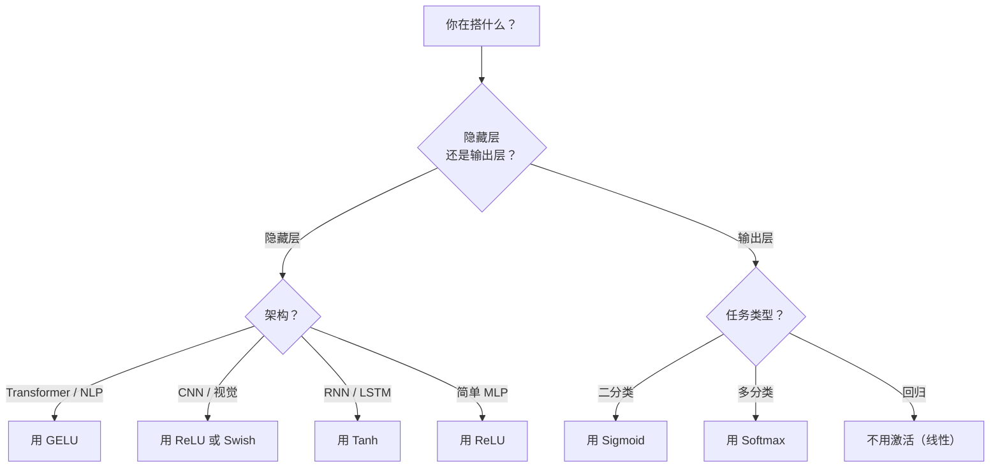

> 没有非线性，你的 100 层网络只是一个花哨的矩阵乘法。激活函数是让神经网络能画曲线的门。

## 学习目标

- 从零实现 sigmoid、tanh、ReLU、Leaky ReLU、GELU、Swish 和 softmax 及其导数
- 通过测量 10+ 层中的激活值大小来诊断梯度消失问题
- 检测 ReLU 网络中的死神经元，解释为什么 GELU 避免了这个问题
- 为不同架构选择正确的激活函数（Transformer、CNN、RNN、输出层）

## 为什么要学这个

堆两个线性变换：y = W2(W1x + b1) + b2。展开：y = (W2W1)x + (W2b1 + b2) = Ax + c。还是一个线性变换。不管你堆多少线性层，结果坍缩成一次矩阵乘。你的 100 层网络跟 1 层的表达能力一样。

这不是理论好奇心。它意味着纯线性深度网络连 XOR 都学不了，螺旋数据分不开，人脸识不了。没有激活函数，深度是幻觉。

激活函数打破线性。它们把每层输出扭过一个非线性函数，让网络能弯曲决策边界、逼近任意函数、真正学习。但选错了：sigmoid 让梯度消失，ReLU 让神经元死掉。激活函数的选择直接决定网络能不能学。

## 核心概念

### 为什么非线性是必须的

证明。线性层计算 f(x) = Wx + b。堆两层：

```
h = W1 × x + b1
y = W2 × h + b2
```

代入：

```
y = W2 × (W1 × x + b1) + b2
  = (W2×W1) × x + (W2×b1 + b2)
  = A × x + c
```

一层。在层间插入非线性激活 g()：

```
h = g(W1 × x + b1)
y = W2 × h + b2
```

现在代入就断了。W2 × g(W1 × x + b1) + b2 不能化简成单次线性变换。网络能表示非线性函数了。

### Sigmoid

最早的神经网络激活函数。

```
sigmoid(x) = 1 / (1 + e⁻ˣ)
输出范围: (0, 1)
导数: sigmoid'(x) = sigmoid(x) × (1 - sigmoid(x))
导数最大值: 0.25（在 x = 0 时）
```

问题：10 层 sigmoid，梯度最多被乘以 0.25¹⁰ = 0.000001。前面的层收不到有效信号。这就是梯度消失。

另一个问题：输出总是正的 (0,1)，导致权重梯度永远同号，梯度下降时锯齿前进。

### Tanh

Sigmoid 的居中版。

```
tanh(x) = (eˣ - e⁻ˣ) / (eˣ + e⁻ˣ)
输出范围: (-1, 1)
导数: tanh'(x) = 1 - tanh(x)²
导数最大值: 1.0（在 x = 0 时）
```

零中心化消除了锯齿问题。导数最大值 1.0，比 sigmoid 好 4 倍。但大输入时导数仍然趋近零，梯度消失仍然存在，只是没那么严重。

### ReLU：突破

Rectified Linear Unit。2010 年被 Nair 和 Hinton 推广后改变了一切。

```
relu(x) = max(0, x)
输出范围: [0, ∞)
导数: relu'(x) = 1 如果 x > 0，0 如果 x ≤ 0
```

正输入不消失梯度——导数恰好是 1，直接传过去。这就是为什么深度网络变得可训练：ReLU 跨层保持梯度大小。

但有失败模式：**死神经元**。如果一个神经元的加权输入永远是负的（因为大的负 bias 或不幸的初始化），它的输出永远是 0，梯度永远是 0，永远不更新。永久死亡。实际中 ReLU 网络 10-40% 的神经元可能在训练中死掉。

### Leaky ReLU

死神经元最简单的修复。

```
leaky_relu(x) = x         如果 x > 0
                alpha × x  如果 x ≤ 0  （alpha 通常 = 0.01）
```

负侧有小斜率而非零，死神经元仍能收到梯度信号并可能恢复。

### GELU：现代默认

Gaussian Error Linear Unit。BERT、GPT 和大多数现代 Transformer 的默认激活。

```
gelu(x) = x × Φ(x)    （Φ 是标准正态的 CDF）

近似公式：
gelu(x) ≈ 0.5 × x × (1 + tanh(√(2/π) × (x + 0.044715 × x³)))
```

GELU 处处光滑，允许小的负值（不像 ReLU 硬切到零），有概率解释：用输入在高斯分布下为正的概率来加权。这种平滑门控在 Transformer 中优于 ReLU，提供更好的梯度流并完全避免死神经元。

### Swish / SiLU

自门控激活，2017 年 Google 通过自动搜索发现。

```
swish(x) = x × sigmoid(x)
```

跟 GELU 一样光滑、非单调、允许小负值。区别细微：Swish 用 sigmoid 做门控，GELU 用高斯 CDF。实际性能几乎一样。Swish 用在 EfficientNet，GELU 统治语言模型。

### 选哪个激活函数



## 从零实现

### 第一步：所有激活函数及其导数

```python
import math

def sigmoid(x):
    x = max(-500, min(500, x))
    return 1.0 / (1.0 + math.exp(-x))

def sigmoid_derivative(x):
    s = sigmoid(x)
    return s * (1 - s)

def tanh_act(x):
    return math.tanh(x)

def tanh_derivative(x):
    t = math.tanh(x)
    return 1 - t * t

def relu(x):
    return max(0.0, x)

def relu_derivative(x):
    return 1.0 if x > 0 else 0.0

def leaky_relu(x, alpha=0.01):
    return x if x > 0 else alpha * x

def leaky_relu_derivative(x, alpha=0.01):
    return 1.0 if x > 0 else alpha

def gelu(x):
    return 0.5 * x * (1 + math.tanh(math.sqrt(2/math.pi) * (x + 0.044715 * x**3)))

def gelu_derivative(x):
    phi = 0.5 * (1 + math.erf(x / math.sqrt(2)))
    pdf = math.exp(-0.5 * x * x) / math.sqrt(2 * math.pi)
    return phi + x * pdf

def swish(x):
    return x * sigmoid(x)

def swish_derivative(x):
    s = sigmoid(x)
    return s + x * s * (1 - s)

def softmax(xs):
    max_x = max(xs)
    exps = [math.exp(x - max_x) for x in xs]
    total = sum(exps)
    return [e / total for e in exps]
```

### 第二步：梯度死区扫描

```python
def gradient_scan(name, derivative_fn, start=-5, end=5, n=100):
    """扫描激活函数在 [-5, 5] 范围内的梯度死区比例"""
    step = (end - start) / n
    near_zero = sum(1 for i in range(n) if abs(derivative_fn(start + i * step)) < 0.01)
    pct_dead = near_zero / n * 100
    print(f"{name:15s}: {n - near_zero:3d} 健康, {near_zero:3d} 近零 ({pct_dead:.0f}% 死区)")

gradient_scan("Sigmoid", sigmoid_derivative)
gradient_scan("Tanh", tanh_derivative)
gradient_scan("ReLU", relu_derivative)
gradient_scan("Leaky ReLU", leaky_relu_derivative)
gradient_scan("GELU", gelu_derivative)
gradient_scan("Swish", swish_derivative)
```

### 第三步：梯度消失实验

把信号穿过 N 层 sigmoid vs ReLU，看激活值怎么变。

```python
import random

def vanishing_gradient_experiment(activation_fn, name, n_layers=10, n_inputs=5):
    random.seed(42)
    values = [random.gauss(0, 1) for _ in range(n_inputs)]

    print(f"\n{name} 穿过 {n_layers} 层：")
    for layer in range(n_layers):
        weights = [random.gauss(0, 1) for _ in range(n_inputs)]
        z = sum(w * v for w, v in zip(weights, values))
        activated = activation_fn(z)
        magnitude = abs(activated)
        bar = "█" * int(magnitude * 20)
        print(f"  Layer {layer+1:2d}: magnitude = {magnitude:.6f} {bar}")
        values = [activated] * n_inputs

vanishing_gradient_experiment(sigmoid, "Sigmoid")
vanishing_gradient_experiment(relu, "ReLU")
vanishing_gradient_experiment(gelu, "GELU")
```

### 第四步：死神经元检测器

```python
def dead_neuron_detector(n_inputs=5, hidden_size=20, n_samples=1000):
    """检测 ReLU 网络中有多少神经元从不激活"""
    random.seed(0)
    weights = [[random.gauss(0, 1) for _ in range(n_inputs)] for _ in range(hidden_size)]
    biases = [random.gauss(0, 1) for _ in range(hidden_size)]

    fire_counts = [0] * hidden_size
    for _ in range(n_samples):
        inputs = [random.gauss(0, 1) for _ in range(n_inputs)]
        for i in range(hidden_size):
            z = sum(w * x for w, x in zip(weights[i], inputs)) + biases[i]
            if relu(z) > 0:
                fire_counts[i] += 1

    dead = sum(1 for c in fire_counts if c == 0)
    print(f"\n死神经元报告（{hidden_size} 个神经元，{n_samples} 个样本）：")
    print(f"  死亡（从未激活）: {dead}")
    print(f"  死亡率: {dead/hidden_size*100:.1f}%")

dead_neuron_detector()
```

## 用库做同样的事

```python
import torch
import torch.nn as nn
import torch.nn.functional as F

x = torch.randn(4, 10)

relu_out = F.relu(x)
gelu_out = F.gelu(x)
sigmoid_out = torch.sigmoid(x)
swish_out = F.silu(x)       # SiLU = Swish

logits = torch.randn(4, 5)
probs = F.softmax(logits, dim=1)

# Transformer 风格的隐藏层
model = nn.Sequential(
    nn.Linear(10, 64),
    nn.GELU(),
    nn.Linear(64, 32),
    nn.GELU(),
    nn.Linear(32, 5),
)
```

**实用默认值**：Transformer 隐藏层用 GELU。CNN 隐藏层用 ReLU。分类输出用 softmax。回归输出不用激活（线性）。概率输出用 sigmoid。从这些默认值开始，只在有证据时才换。

## 练习

1. 实现 Parametric ReLU (PReLU)：负侧斜率 alpha 是可学习参数。在圆形数据集上训练，跟固定 Leaky ReLU 比较。
2. 把梯度消失实验扩展到 50 层。逐层打印 sigmoid、tanh、ReLU、GELU 的信号大小。每种激活在第几层信号有效归零？
3. 实现 ELU：elu(x) = x if x > 0, alpha×(eˣ-1) if x ≤ 0。跟 ReLU 比较死神经元率。
4. 搭一个"梯度健康监控器"：训练过程中每个 epoch 计算各层平均梯度大小。梯度低于 0.001 或超过 100 时打印警告。

## 术语表

| 术语 | 通俗说法 | 真正含义 |
|------|---------|---------|
| Activation function（激活函数） | "非线性那部分" | 施加在每个神经元输出上打破线性的函数 |
| Vanishing gradient（梯度消失） | "前面的层学不到" | 激活函数导数 < 1 时梯度逐层指数衰减 |
| Dead neuron（死神经元） | "不学了的神经元" | ReLU 神经元输入永远为负，输出永远为零，梯度永远为零 |
| Sigmoid | "把值压到 0-1" | 1/(1+e⁻ˣ)，历史重要但深层网络中导致梯度消失 |
| ReLU | "负数变零" | max(0, x)，让深度学习成为实际可行的激活函数 |
| GELU | "Transformer 的激活" | 高斯误差线性单元，光滑，避免死神经元，现代默认 |
| Softmax | "分数变概率" | 把 logits 归一化为概率分布，值在 (0,1) 且和为 1 |
| Saturation（饱和） | "sigmoid 的平坦区" | 激活函数导数趋近零的区域，阻断梯度流 |

---

## 自测题

:::quiz
question: 为什么纯线性层（没有激活函数）的深度网络没用？
options:
  - 线性层太慢
  - 堆叠线性层坍缩成一次线性变换，深度带来不了任何好处
  - 线性层没有 bias
  - 线性层不能处理批量数据
correct: 1
explanation: y = W2(W1×x + b1) + b2 化简为 y = Ax + c。不管堆多少线性层，结果等价于一层。激活函数打破了这种可组合性。
:::

:::quiz
question: ReLU 激活函数的输出范围是什么？
options:
  - (-1, 1)
  - (0, 1)
  - [0, ∞)
  - (-∞, ∞)
correct: 2
explanation: ReLU(x) = max(0, x)。负输入输出 0，正输入原样通过。范围是 [0, ∞)。
:::

:::quiz
question: ReLU 网络中的"死神经元"问题是什么？
options:
  - 计算太慢的神经元
  - 输入永远为负的神经元，输出永远为零、梯度永远为零、永远不更新
  - 产生 NaN 的神经元
  - bias 为零的神经元
correct: 1
explanation: 如果 ReLU 神经元的加权输入永远是负的（坏的初始化或大的负 bias），它输出 0 梯度 0。零梯度意味着零更新，它永远不能恢复。
:::

:::quiz
question: 现代 Transformer（GPT、BERT）隐藏层默认用什么激活函数？
options:
  - Sigmoid
  - ReLU
  - GELU
  - Tanh
correct: 2
explanation: GELU 是 Transformer 的默认激活。它提供平滑的梯度流，避免死神经元，在语言模型中表现优于 ReLU。
:::

:::quiz
question: 为什么 softmax 只用在输出层而不用在隐藏层？
options:
  - 太慢了
  - 它把向量转成概率分布（值和为 1），这是分类输出需要的，但不适合中间表示
  - 会导致梯度爆炸
  - 只能处理两个类别
correct: 1
explanation: Softmax 归一化向量让所有值在 (0,1) 且和为 1，创建概率分布。隐藏层需要保留和变换信息，不是把它压缩成概率。
:::
