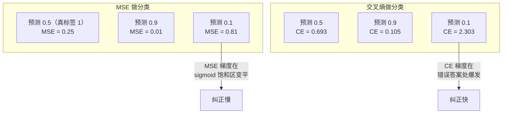
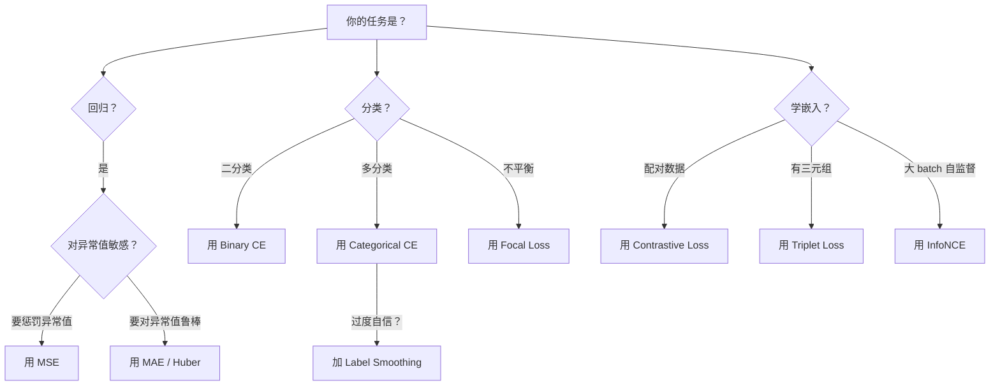

> 网络做了预测，真实值说不对。差多少？那个数就是 loss。选错 loss 函数，模型会优化完全错误的目标。

## 学习目标

- 从零实现 MSE、二元交叉熵、分类交叉熵和对比损失（InfoNCE），包含梯度
- 解释为什么 MSE 用于分类会失败——演示"全部预测 0.5"的失败模式
- 对交叉熵应用 label smoothing，描述它如何防止过度自信
- 为回归、二分类、多分类、嵌入学习任务选择正确的 loss 函数

## 为什么要学这个

一个在分类问题上用 MSE 的模型会自信地对所有输入预测 0.5。它确实在最小化 loss，但完全没用。

Loss 函数是模型唯一真正在优化的东西。不是准确率，不是 F1，不是你汇报给领导的那个指标。优化器对 loss 求梯度，调整权重让这个数字变小。如果 loss 函数没有捕捉到你关心的东西，模型会找到数学上最省力的方式满足它——几乎从不是你想要的。

具体例子：二分类任务，两类各 50%。用 MSE。模型对每个输入都预测 0.5。平均 MSE 是 0.25——这是不学任何东西时的最小可能值。模型零区分能力但确实最小化了 loss。换成交叉熵，同样的模型被迫把预测推向 0 或 1，因为 -log(0.5) = 0.693 是糟糕的 loss，而 -log(0.99) = 0.01 奖励自信的正确预测。

## 核心概念

### MSE（均方误差）

回归的默认 loss。计算预测和目标的差的平方，对所有样本取平均。

```
MSE = (1/n) × Σ(y_pred - y_true)²
```

为什么要平方：二次惩罚大误差。误差为 2 代价是误差为 1 的 4 倍。误差为 10 代价是 100 倍。这让 MSE 对异常值敏感——一个离谱的预测会主导整个 loss。

梯度：

```
∂MSE/∂y_pred = (2/n) × (y_pred - y_true)
```

梯度跟误差成正比。大误差得到大梯度。对回归这是优点（大错需要大纠正），对分类是缺点（你想指数地惩罚自信的错误答案，不是线性地）。

### 交叉熵 Loss

分类的 loss 函数。源自信息论——衡量预测概率分布和真实分布的差异。

**二元交叉熵 (BCE)：**

```
BCE = -(y × log(p) + (1-y) × log(1-p))
```

y 是真实标签（0 或 1），p 是预测概率。

为什么 -log(p) 有效：真实标签是 1 时，预测 p = 0.99 → loss = 0.01。预测 p = 0.01 → loss = 4.6。460 倍的差距。交叉熵残忍地惩罚自信的错误预测，几乎不惩罚自信的正确预测。

梯度：

```
∂BCE/∂p = -(y/p) + (1-y)/(1-p)
```

当 y=1 且 p 接近零时，梯度是 -1/p → 趋近负无穷。模型收到巨大的信号来纠正错误。当 p 接近 1 时梯度很小——已经对了，没什么要修的。

**分类交叉熵 (CCE)：**

多分类，one-hot 编码目标。

```
CCE = -Σ(yᵢ × log(pᵢ))
```

只有真实类别贡献 loss（其他 yᵢ 都是零）。10 个类别中正确类别概率 0.1（随机猜），loss = -log(0.1) = 2.3。正确类别概率 0.9，loss = -log(0.9) = 0.105。模型学会把概率集中到正确答案上。

### 为什么 MSE 用于分类会失败



MSE 梯度在预测接近 0 或 1 时变平（sigmoid 饱和）。交叉熵梯度补偿了这个——-log 抵消了 sigmoid 的平坦区域，在最需要梯度的地方给出强信号。

### Label Smoothing

标准 one-hot 标签说"这 100% 是类别 3，0% 其他"。这是很强的断言。Label smoothing 把它软化：

```
smooth_label = (1 - α) × one_hot + α / num_classes
```

α = 0.1，10 个类别：目标从 [0, 0, 1, 0, ...] 变成 [0.01, 0.01, 0.91, 0.01, ...]。

为什么有效：模型要通过 softmax 输出精确的 1.0 需要把 logits 推到无穷大。这导致过度自信、泛化差、对分布偏移脆弱。Label smoothing 把目标封顶在 0.9，让 logits 保持在合理范围。GPT 和大多数现代模型都用 label smoothing 或等价方案。

### 对比损失

没有标签，没有类别。只有输入对和问题：这两个相似还是不同？

**InfoNCE（SimCLR 风格）：**

取一张图，创建两个增强视图（裁剪、旋转、色彩抖动）。这是"正对"——应该有相似的嵌入。batch 中所有其他图片组成"负对"——应该有不同的嵌入。

```
L = -log(exp(sim(zᵢ, zⱼ) / τ) / Σ exp(sim(zᵢ, zₖ) / τ))
```

sim() 是余弦相似度，τ（温度）控制分布有多尖锐。温度越低 = 更难的负样本 = 更激进的分离。

**Focal Loss（焦点损失）：**

用于不平衡数据集。标准交叉熵平等对待所有正确分类的样本。Focal loss 降低简单样本的权重：

```
FL = -α × (1 - pₜ)^γ × log(pₜ)
```

γ = 2 时：容易的样本（pₜ = 0.9）权重 = 0.01，几乎忽略。困难的样本（pₜ = 0.1）权重 = 0.81，完整梯度信号。

### 怎么选 Loss 函数



## 从零实现

### 第一步：MSE 及其梯度

```python
import math

def mse(predictions, targets):
    n = len(predictions)
    return sum((p - t) ** 2 for p, t in zip(predictions, targets)) / n

def mse_gradient(predictions, targets):
    """每个预测的梯度"""
    n = len(predictions)
    return [(2 / n) * (p - t) for p, t in zip(predictions, targets)]

# 测试
preds = [0.9, 0.1, 0.8]
targets = [1.0, 0.0, 1.0]
print(f"MSE = {mse(preds, targets):.4f}")
print(f"梯度 = {mse_gradient(preds, targets)}")
```

### 第二步：二元交叉熵

```python
def binary_cross_entropy(predictions, targets, eps=1e-8):
    """稳定版 BCE，加 eps 防 log(0)"""
    loss = 0
    for p, t in zip(predictions, targets):
        p = max(eps, min(1 - eps, p))  # 裁剪防 log(0)
        loss += -(t * math.log(p) + (1 - t) * math.log(1 - p))
    return loss / len(predictions)

def bce_gradient(predictions, targets, eps=1e-8):
    grads = []
    for p, t in zip(predictions, targets):
        p = max(eps, min(1 - eps, p))
        grad = -(t / p) + (1 - t) / (1 - p)
        grads.append(grad / len(predictions))
    return grads
```

### 第三步：分类交叉熵（从 logits）

```python
def softmax(logits):
    max_l = max(logits)
    exps = [math.exp(l - max_l) for l in logits]
    total = sum(exps)
    return [e / total for e in exps]

def categorical_cross_entropy(logits, target_index):
    """从 logits 直接计算 CCE（数值稳定）"""
    probs = softmax(logits)
    return -math.log(max(probs[target_index], 1e-8))

def cce_gradient(logits, target_index):
    """CCE 对 logits 的梯度 = softmax(logits) - one_hot(target)"""
    probs = softmax(logits)
    grads = probs[:]
    grads[target_index] -= 1.0
    return grads

# 测试
logits = [2.0, 1.0, 0.1]
target = 0  # 正确类别是 index 0
print(f"CCE loss = {categorical_cross_entropy(logits, target):.4f}")
print(f"梯度 = {cce_gradient(logits, target)}")
```

### 第四步：Label Smoothing

```python
def label_smoothing_ce(logits, target_index, alpha=0.1):
    """带 label smoothing 的交叉熵"""
    n_classes = len(logits)
    probs = softmax(logits)
    # 平滑后的目标
    smooth_target = [alpha / n_classes] * n_classes
    smooth_target[target_index] = 1.0 - alpha + alpha / n_classes
    # 交叉熵
    loss = -sum(t * math.log(max(p, 1e-8)) for t, p in zip(smooth_target, probs))
    return loss

# 对比
print(f"标准 CCE:        {categorical_cross_entropy([5.0, 1.0, 0.1], 0):.4f}")
print(f"Label smoothing: {label_smoothing_ce([5.0, 1.0, 0.1], 0, alpha=0.1):.4f}")
```

### 第五步：对比损失（InfoNCE）

```python
def cosine_similarity(a, b):
    dot = sum(x * y for x, y in zip(a, b))
    norm_a = sum(x**2 for x in a) ** 0.5
    norm_b = sum(x**2 for x in b) ** 0.5
    return dot / (norm_a * norm_b + 1e-8)

def info_nce_loss(anchor, positive, negatives, temperature=0.07):
    """InfoNCE 对比损失"""
    pos_sim = cosine_similarity(anchor, positive) / temperature
    neg_sims = [cosine_similarity(anchor, neg) / temperature for neg in negatives]

    # log-sum-exp trick
    all_sims = [pos_sim] + neg_sims
    max_sim = max(all_sims)
    log_sum_exp = max_sim + math.log(sum(math.exp(s - max_sim) for s in all_sims))

    loss = -(pos_sim - log_sum_exp)
    return loss

# 测试
import random
random.seed(42)
anchor = [random.gauss(0, 1) for _ in range(64)]
positive = [a + random.gauss(0, 0.1) for a in anchor]  # 相似
negatives = [[random.gauss(0, 1) for _ in range(64)] for _ in range(255)]

loss = info_nce_loss(anchor, positive, negatives)
print(f"InfoNCE loss = {loss:.4f}")
```

### 第六步：演示 MSE 的分类失败

```python
print("\n=== MSE vs CE 在二分类上 ===")
# 模型对所有输入预测 0.5
preds_lazy = [0.5, 0.5, 0.5, 0.5]
targets_binary = [1, 0, 1, 0]

mse_lazy = mse(preds_lazy, targets_binary)
bce_lazy = binary_cross_entropy(preds_lazy, targets_binary)
print(f"全预测 0.5:  MSE = {mse_lazy:.4f}  BCE = {bce_lazy:.4f}")

# 模型学到了正确答案
preds_good = [0.9, 0.1, 0.9, 0.1]
mse_good = mse(preds_good, targets_binary)
bce_good = binary_cross_entropy(preds_good, targets_binary)
print(f"预测正确:    MSE = {mse_good:.4f}  BCE = {bce_good:.4f}")

print(f"\nMSE 改善倍数: {mse_lazy / mse_good:.1f}x")
print(f"BCE 改善倍数: {bce_lazy / bce_good:.1f}x")
print("BCE 给正确预测的奖励远大于 MSE！")
```

## 用库做同样的事

```python
import torch
import torch.nn.functional as F

# MSE
pred = torch.tensor([0.9, 0.1, 0.8])
target = torch.tensor([1.0, 0.0, 1.0])
mse_loss = F.mse_loss(pred, target)

# 二元交叉熵（从 logits，更稳定）
logits = torch.tensor([2.0, -1.0, 1.5])
targets = torch.tensor([1.0, 0.0, 1.0])
bce_loss = F.binary_cross_entropy_with_logits(logits, targets)

# 分类交叉熵（从 logits，内部自动 softmax）
logits = torch.tensor([[2.0, 1.0, 0.1]])  # (batch=1, classes=3)
target = torch.tensor([0])                  # 正确类别 index
ce_loss = F.cross_entropy(logits, target)

# Label smoothing
ce_smooth = F.cross_entropy(logits, target, label_smoothing=0.1)
```

注意 PyTorch 的 `F.cross_entropy` 接受**原始 logits**，不是概率。它内部自动做 log-softmax。如果你先手动过了 softmax 再送进去，结果是错的。

## 练习

1. 实现 Huber loss（MSE 和 MAE 的混合：小误差用平方，大误差用绝对值）。在有异常值的回归数据上比较它和纯 MSE。
2. 实现 Focal loss。在 95% 负样本 5% 正样本的不平衡数据上，对比它和标准 BCE。
3. 用不同温度 τ = [0.01, 0.07, 0.5, 1.0] 跑 InfoNCE，观察 loss 大小变化。解释温度对训练的影响。
4. 创造一个 MSE 分类失败的具体场景：两类数据各 100 个样本，训练后模型对所有输入预测接近 0.5。然后换成 BCE 看它正确学习。

## 术语表

| 术语 | 通俗说法 | 真正含义 |
|------|---------|---------|
| MSE（均方误差） | "预测差了多少" | (预测-真实)² 的平均。回归默认，对异常值敏感 |
| Cross-entropy（交叉熵） | "分类的 loss" | 衡量预测分布和真实分布的差异。正确类别的 -log(p) |
| Label smoothing | "标签软化" | 把 one-hot 目标从 [0,0,1,0] 变成 [0.025, 0.025, 0.925, 0.025]，防止过度自信 |
| Contrastive loss（对比损失） | "拉近推远" | 让相似样本的嵌入靠近，不同样本的嵌入远离 |
| InfoNCE | "对比学习的 loss" | 把正对的相似度当作 softmax 分类问题——在所有负样本中识别正对 |
| Focal loss（焦点损失） | "关注难样本" | 降低简单样本的权重，让模型集中精力在困难/模糊的样本上 |
| Temperature（温度） | "分布有多尖" | 对比损失中控制相似度分布锐度的超参数。越低分布越尖 |
| Logits | "softmax 之前的原始分数" | 未归一化的输出，可正可负可很大 |

---

## 自测题

:::quiz
question: 为什么 MSE 用于分类时模型会对所有输入预测 0.5？
options:
  - 学习率太小
  - MSE 在 0.5 处有全局最小值，模型不需要区分类别就能最小化 loss
  - 数据有问题
  - 模型太小
correct: 1
explanation: 二分类中 50/50 分布时，预测 0.5 的 MSE 是 0.25——不用学任何区分能力就达到了。MSE 梯度在 sigmoid 饱和区又变平，阻止模型推向 0 或 1。交叉熵没有这个问题。
:::

:::quiz
question: 交叉熵 loss 对"自信的错误预测"和"自信的正确预测"分别怎么处理？
options:
  - 两者惩罚一样
  - 自信的错误预测受到极大惩罚（-log(0.01)=4.6），自信的正确预测几乎不受惩罚（-log(0.99)=0.01）
  - 只惩罚错误预测，不管自信度
  - 自信度越高惩罚越大，不管对错
correct: 1
explanation: -log(p) 在 p→0 时趋向无穷大（巨大惩罚），在 p→1 时趋向 0（几乎无惩罚）。这给模型极强的动力纠正自信的错误。
:::

:::quiz
question: Label smoothing 解决什么问题？
options:
  - 训练速度太慢
  - 模型试图输出精确的 1.0 导致 logits 趋向无穷、过度自信、泛化差
  - 类别数量太多
  - 梯度消失
correct: 1
explanation: 标准 one-hot 让模型追求输出 1.0，需要把 logits 推到无穷大。Label smoothing 把目标封顶在 ~0.9，让 logits 保持合理范围，提升泛化。
:::

:::quiz
question: InfoNCE 对比损失中温度 τ 的作用是什么？
options:
  - 控制学习率大小
  - 控制相似度分布的锐度——越低越尖锐，正对需要跟负对差距更大
  - 控制 batch size
  - 控制嵌入维度
correct: 1
explanation: 除以 τ 相当于给 softmax 调"温度"。τ 越小分布越尖，模型必须更明确地区分正负对。τ 越大分布越平，要求更宽松。
:::

:::quiz
question: Focal loss 跟标准交叉熵有什么不同？
options:
  - Focal loss 用于回归
  - Focal loss 加入 (1-pₜ)^γ 因子降低简单样本的权重，让模型聚焦在困难样本上
  - Focal loss 去掉了 log
  - Focal loss 只适用于二分类
correct: 1
explanation: (1-pₜ)^γ 因子在样本容易（pₜ 高）时很小，让 loss 几乎为零。在样本困难（pₜ 低）时接近 1，保留完整梯度。模型自动聚焦在有意义的困难案例上。
:::
