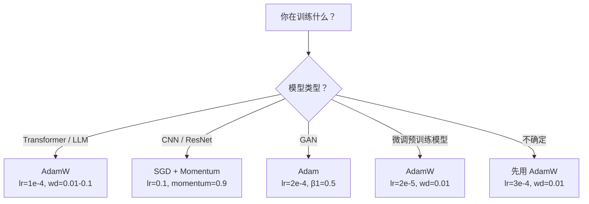

> 梯度下降告诉你往哪走。但走多远、走多快，它什么都没说。SGD 是指南针，Adam 是带实时路况的导航。

## 学习目标

- 从零实现 SGD、SGD with momentum、Adam、AdamW
- 解释 Adam 的偏差修正如何补偿早期步骤中零初始化的矩估计
- 演示为什么 AdamW 比 Adam + L2 正则化在同一任务上泛化更好
- 为 Transformer、CNN、GAN 和微调选择合适的优化器和默认超参数

## 为什么要学这个

你算出了梯度。你知道权重 #4721 应该减少 0.003 来降低 loss。但 0.003 是什么单位？乘以什么？第 1 步和第 1000 步该走一样远吗？

Vanilla 梯度下降对每个参数每一步用同样的学习率。这带来三个问题：

**振荡**。Loss 面通常是窄长的山谷。梯度指向谷壁（陡方向）而不是沿着谷底（浅方向）。梯度下降在窄方向来回弹跳，在有用的方向上只有微小进展。

**一刀切学习率**。有些权重需要大更新（还在欠拟合），有些需要小更新（已经接近最优值）。一个学习率满足不了所有。

**鞍点**。高维空间中大片的平坦区域梯度接近零。SGD 在这里爬行速度就是梯度大小——几乎为零。

Adam 三个都解决了。它给每个参数维护两个移动平均——梯度均值（momentum，处理振荡）和梯度平方均值（自适应学习率，处理不同尺度）。加上前几步的偏差修正，你得到一个默认超参数就能覆盖 80% 问题的优化器。

## 核心概念

### SGD（随机梯度下降）

最简单的优化器。在 mini-batch 上算梯度，往反方向走一步。

```
w = w - lr × gradient
```

"随机"指你用数据的随机子集估计梯度，不是全部数据。这个噪声其实有用——帮助逃离尖锐的局部最小值。但也导致振荡。

### Momentum（动量）

不只看当前梯度，而是维护一个积累过去梯度的速度项。

```
m_t = β × m_{t-1} + gradient
w = w - lr × m_t
```

β（通常 0.9）控制保留多少历史。β = 0.9 时，动量大约是最近 10 步梯度的平均。

**为什么修复振荡**：同方向的梯度积累放大，翻转方向的梯度互相抵消。在窄谷里，"横穿"的分量每步翻号被抑制，"沿着"的分量保持一致被放大。结果是有用方向上的平滑加速。

### Adam：Momentum + 自适应学习率

每个参数维护两个指数移动平均：

```
m_t = β1 × m_{t-1} + (1 - β1) × gradient       （一阶矩：均值）
v_t = β2 × v_{t-1} + (1 - β2) × gradient²       （二阶矩：方差）
```

**偏差修正**是大多数解释跳过的关键细节。第 1 步时 m_1 = (1 - β1) × gradient。β1 = 0.9 的话就是 0.1 × gradient——小了 10 倍。移动平均还没热起来。偏差修正补偿：

```
m_hat = m_t / (1 - β1^t)
v_hat = v_t / (1 - β2^t)
```

第 1 步 β1 = 0.9：m_hat = m_1 / 0.1 = 实际梯度。第 100 步：(1 - 0.9¹⁰⁰) ≈ 1.0，修正消失。偏差修正对前 ~10 步重要，~50 步后无关紧要。

更新：

```
w = w - lr × m_hat / (√v_hat + ε)
```

**Adam 默认值**：lr = 0.001, β1 = 0.9, β2 = 0.999, ε = 1e-8。80% 的问题用这套默认就行。不行时先调 lr，再调 β2。几乎不用动 β1 和 ε。

### AdamW：权重衰减做对了

L2 正则化在 loss 里加 λ×w²。在 vanilla SGD 里这等价于权重衰减（每步减 λ×w）。在 Adam 里这个等价性打破了。

Loshchilov & Hutter 的 insight：当你把 L2 加到 loss 然后让 Adam 处理梯度时，自适应学习率把正则化项也缩放了。梯度方差大的参数得到更少正则化，方差小的得到更多。这不是你想要的——你想要均匀正则化。

**AdamW 把权重衰减直接应用到权重上，在 Adam 更新之后**：

```
w = w - lr × m_hat / (√v_hat + ε) - lr × λ × w
```

权重衰减项不被 Adam 的自适应因子缩放。每个参数得到相同比例的收缩。

这看起来是小细节。不是。AdamW 在几乎所有任务上都比 Adam + L2 收敛到更好的解。BERT、GPT、LLaMA、Stable Diffusion——全用 AdamW 训练。

### 什么时候用哪个



## 从零实现

### 第一步：Vanilla SGD

```python
class SGD:
    def __init__(self, lr=0.01):
        self.lr = lr

    def step(self, params, grads):
        for i in range(len(params)):
            params[i] -= self.lr * grads[i]
```

### 第二步：SGD with Momentum

```python
class SGDMomentum:
    def __init__(self, lr=0.01, beta=0.9):
        self.lr = lr
        self.beta = beta
        self.velocities = None

    def step(self, params, grads):
        if self.velocities is None:
            self.velocities = [0.0] * len(params)
        for i in range(len(params)):
            self.velocities[i] = self.beta * self.velocities[i] + grads[i]
            params[i] -= self.lr * self.velocities[i]
```

### 第三步：Adam

```python
import math

class Adam:
    def __init__(self, lr=0.001, beta1=0.9, beta2=0.999, epsilon=1e-8):
        self.lr = lr
        self.beta1 = beta1
        self.beta2 = beta2
        self.epsilon = epsilon
        self.m = None
        self.v = None
        self.t = 0

    def step(self, params, grads):
        if self.m is None:
            self.m = [0.0] * len(params)
            self.v = [0.0] * len(params)

        self.t += 1
        for i in range(len(params)):
            self.m[i] = self.beta1 * self.m[i] + (1 - self.beta1) * grads[i]
            self.v[i] = self.beta2 * self.v[i] + (1 - self.beta2) * grads[i] ** 2

            m_hat = self.m[i] / (1 - self.beta1 ** self.t)  # 偏差修正
            v_hat = self.v[i] / (1 - self.beta2 ** self.t)

            params[i] -= self.lr * m_hat / (math.sqrt(v_hat) + self.epsilon)
```

### 第四步：AdamW

```python
class AdamW:
    def __init__(self, lr=0.001, beta1=0.9, beta2=0.999, epsilon=1e-8, weight_decay=0.01):
        self.lr = lr
        self.beta1 = beta1
        self.beta2 = beta2
        self.epsilon = epsilon
        self.wd = weight_decay
        self.m = None
        self.v = None
        self.t = 0

    def step(self, params, grads):
        if self.m is None:
            self.m = [0.0] * len(params)
            self.v = [0.0] * len(params)

        self.t += 1
        for i in range(len(params)):
            self.m[i] = self.beta1 * self.m[i] + (1 - self.beta1) * grads[i]
            self.v[i] = self.beta2 * self.v[i] + (1 - self.beta2) * grads[i] ** 2

            m_hat = self.m[i] / (1 - self.beta1 ** self.t)
            v_hat = self.v[i] / (1 - self.beta2 ** self.t)

            # Adam 更新
            params[i] -= self.lr * m_hat / (math.sqrt(v_hat) + self.epsilon)
            # 解耦的权重衰减（不经过 Adam 的自适应缩放）
            params[i] -= self.lr * self.wd * params[i]
```

## 用库做同样的事

```python
import torch
import torch.optim as optim

model = torch.nn.Sequential(
    torch.nn.Linear(784, 256),
    torch.nn.ReLU(),
    torch.nn.Linear(256, 10),
)

# 优化器
optimizer = optim.AdamW(model.parameters(), lr=3e-4, weight_decay=0.01)

# 学习率调度
scheduler = optim.lr_scheduler.CosineAnnealingLR(optimizer, T_max=100)

# 训练循环
for epoch in range(100):
    optimizer.zero_grad()
    output = model(torch.randn(32, 784))
    loss = torch.nn.functional.cross_entropy(output, torch.randint(0, 10, (32,)))
    loss.backward()
    torch.nn.utils.clip_grad_norm_(model.parameters(), max_norm=1.0)  # 梯度裁剪
    optimizer.step()
    scheduler.step()
```

训练循环的顺序永远是：**zero_grad → forward → loss → backward → (clip) → step → (schedule)**。顺序搞错（比如 scheduler.step() 放在 optimizer.step() 前面）是常见的隐蔽 bug。

**经验法则**：
- CNN 经常用 SGD + momentum (lr=0.1, momentum=0.9)，它找到的平坦最小值泛化更好
- Transformer / LLM 用 AdamW + warmup + cosine decay，是无争议的默认
- 不知道用什么就先 AdamW，lr=3e-4，weight_decay=0.01
- 如果只调一个超参，调学习率。10× 的学习率变化比任何架构决策都重要

## 练习

1. 实现 Nesterov momentum：在"前瞻"位置 (w - lr×β×v) 而不是当前位置算梯度。跟标准 momentum 比较收敛速度。
2. 实现学习率 warmup：前 10% 步线性从 0 升到 max_lr，然后 cosine 衰减到 0。跟无 warmup 的 Adam 比较。
3. 在 Adam 训练中跟踪每个参数的有效学习率 (lr × m_hat / (√v_hat + ε))。第 10、50、200 步时打印有效学习率的分布。所有参数是同速更新的吗？
4. 实现梯度裁剪（按全局范数裁剪，max_norm=1.0）。用高学习率 (lr=0.01 for Adam) 分别有裁剪和无裁剪训练，用 10 个随机种子统计多少次发散（loss 变 NaN）。

## 术语表

| 术语 | 通俗说法 | 真正含义 |
|------|---------|---------|
| Learning rate（学习率） | "步长" | 梯度更新的缩放因子；训练中最有影响力的单个超参数 |
| SGD | "基础梯度下降" | 在 mini-batch 上算梯度，减去 lr × gradient 更新权重 |
| Momentum（动量） | "滚球" | 过去梯度的指数移动平均，抑制振荡、加速一致方向 |
| Adam | "默认优化器" | 结合 momentum（一阶矩）和 RMSProp（二阶矩），加偏差修正 |
| AdamW | "Adam 做对了" | Adam + 解耦权重衰减；直接对权重做正则化而不是通过梯度 |
| Bias correction（偏差修正） | "移动平均的热启动" | 除以 (1-β^t) 补偿 Adam 零初始化矩估计导致的偏差 |
| Weight decay（权重衰减） | "让权重变小" | 每步减去权重的一个比例；惩罚大权重的正则化器 |
| Gradient clipping（梯度裁剪） | "梯度封顶" | 梯度向量范数超过阈值时等比缩小，防止爆炸性更新 |

---

## 自测题

:::quiz
question: Momentum 解决了梯度下降的什么问题？
options:
  - 减少内存使用
  - 通过积累过去梯度抑制振荡，加速一致方向的运动
  - 消除了对学习率的需要
  - 防止过拟合
correct: 1
explanation: 窄谷中梯度横穿振荡，沿谷缓慢前进。Momentum 积累过去梯度：一致方向放大、振荡方向抵消，收敛更快更平滑。
:::

:::quiz
question: Adam 和 AdamW 的核心区别是什么？
options:
  - AdamW 用更高的学习率
  - AdamW 把权重衰减直接应用到权重上而非通过梯度，给出正确的正则化
  - AdamW 不用 momentum
  - AdamW 只能用于 Transformer
correct: 1
explanation: Adam + L2 中，自适应学习率对正则化项也做了不同的缩放。AdamW 把权重衰减从梯度更新中解耦，不管梯度统计如何都应用均匀收缩。
:::

:::quiz
question: 为什么 Adam 在早期训练步骤中需要偏差修正？
options:
  - 防止过拟合
  - 矩估计初始化为零，早期值偏向零；偏差修正补偿这个冷启动
  - 裁剪大梯度
  - 加速收敛
correct: 1
explanation: 第 1 步 β1=0.9 时 m_1 = 0.1 × gradient（小了 10 倍）。除以 (1 - 0.9¹) = 0.1 修正回实际梯度。~50 步后修正变得可忽略。
:::

:::quiz
question: Adam 的标准默认超参数是什么？
options:
  - lr=0.1, β1=0.5, β2=0.5
  - lr=0.001, β1=0.9, β2=0.999, ε=1e-8
  - lr=0.01, β1=0.99, β2=0.99
  - lr=0.0001, β1=0.8, β2=0.9
correct: 1
explanation: 原论文 (Kingma & Ba, 2014) 推荐 lr=0.001, β1=0.9, β2=0.999, ε=1e-8。对大多数问题都好使。
:::

:::quiz
question: 训练 Transformer 和 LLM 的现代默认优化器是哪个？
options:
  - Vanilla SGD
  - SGD with momentum
  - RMSProp
  - AdamW
correct: 3
explanation: AdamW（解耦权重衰减的 Adam）用于训练 BERT、GPT、LLaMA 和几乎所有现代 Transformer。它结合了自适应学习率和正确的权重衰减正则化。
:::
