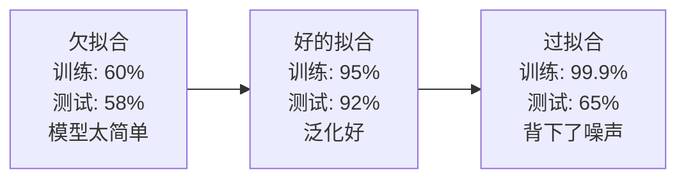
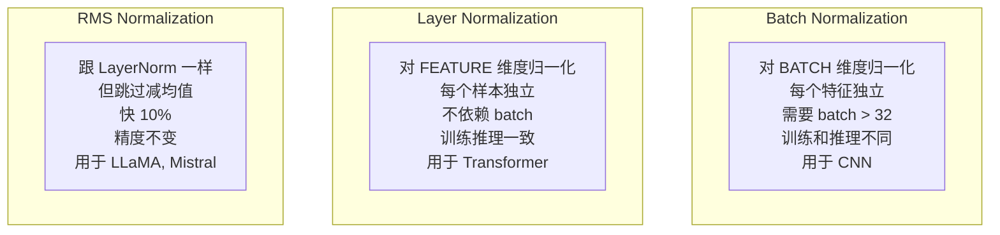
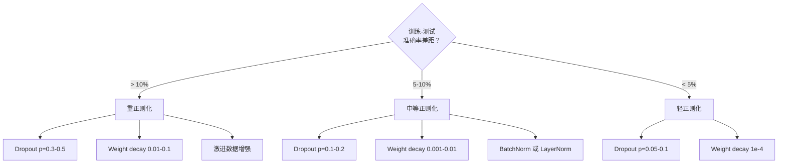

> 模型在训练集上 99%，测试集上 60%。它是在背答案而不是在学习。正则化是你对复杂度征收的税，强迫模型泛化。

## 学习目标

- 从零实现 Dropout（inverted scaling）、L2 权重衰减、BatchNorm、LayerNorm 和 RMSNorm
- 通过测量训练-测试准确率差距来诊断过拟合
- 解释为什么 Transformer 用 LayerNorm 而非 BatchNorm，为什么现代 LLM 偏好 RMSNorm
- 根据过拟合严重程度选择正确的正则化组合

## 为什么要学这个

参数够多的神经网络能背下任何数据集。这不是假设——Zhang et al. (2017) 证明了：标准网络在随机标签的 ImageNet 上也能达到接近零的训练 loss。一百万个完全随机的输入-输出对，网络全背下来了。训练完美，测试为零。

训练表现和测试表现之间的差距就是过拟合差距。这节课的每个技术从不同角度攻击这个差距：Dropout 不让网络依赖任何单个神经元，权重衰减阻止任何权重长得太大，BatchNorm 平滑损失面让优化器找到更平坦可泛化的最小值。每个技术都简单，合在一起就是背答案和真正学习的区别。

## 核心概念

### 过拟合光谱

每个模型都在欠拟合（太简单抓不住规律）到过拟合（太复杂连噪声都抓）之间。甜点在中间，正则化从过拟合侧把模型往回推。



### Dropout

训练时随机把每个神经元输出以概率 p 置零。

```
训练时: output = activation(z) × mask / (1 - p)    (inverted dropout)
测试时: output = activation(z)                     (不变)
```

p = 0.5 时，每次前向传播一半神经元被关掉。网络必须学习冗余表示，因为不知道哪些神经元可用。这防止了协同适应（神经元学会依赖特定其他神经元的存在）。

**集成解释**：N 个神经元的网络加 dropout 创建了 2^N 种可能的子网络。训练时近似地同时训练了所有 2^N 个子网络。测试时用全部神经元相当于对 2^N 个子网络取平均——单个模型里的海量集成。

**默认 dropout 率**：Transformer p=0.1，MLP p=0.5，CNN p=0.2-0.3。越高正则化越强，但欠拟合风险也越大。

### 权重衰减（L2 正则化）

给 loss 加上所有权重的平方和：

```
total_loss = task_loss + (λ/2) × Σ wᵢ²
```

正则化项的梯度是 λ×w。每步每个权重被按自身大小的比例往零收缩。大权重被惩罚得更多。模型被推向没有单个权重主导的解。

**为什么帮助泛化**：过拟合模型倾向于有大权重来放大训练数据中的噪声。权重衰减让权重保持小，限制模型的有效容量，迫使它依赖鲁棒的可泛化特征。

典型 λ 值：
- AdamW 训练 Transformer：0.01
- SGD 训练 CNN：1e-4
- 严重过拟合：0.1

### Batch Normalization

对 mini-batch 中每一层的输出做归一化：

```
μ = (1/B) × Σ xᵢ                    （batch 均值）
σ² = (1/B) × Σ (xᵢ - μ)²            （batch 方差）
x̂ = (xᵢ - μ) / √(σ² + ε)           （归一化）
y = γ × x̂ + β                       （缩放和平移，可学习）
```

γ 和 β 是可学习参数——让网络在需要时能撤销归一化。

**训练 vs 推理**：训练时 μ 和 σ 来自当前 mini-batch。推理时用训练过程中积累的移动平均。

**为什么有效**（真实原因）：BatchNorm 让损失面更平滑。梯度更可预测，优化器能安全地用更大步长。这就是为什么 BatchNorm 允许更高学习率并更快收敛。

**根本限制**：依赖 batch 统计。Batch size = 1 时均值方差无意义。小 batch (< 32) 时统计有噪声反而伤害性能。

### Layer Normalization

在特征维度而非 batch 维度归一化。每个样本独立归一化：

```
μ = (1/D) × Σ xⱼ                    （特征均值）
σ² = (1/D) × Σ (xⱼ - μ)²            （特征方差）
x̂ = (xⱼ - μ) / √(σ² + ε)
y = γ × x̂ + β
```

D 是特征维度。每个样本独立处理——不依赖 batch size。这就是为什么 **Transformer 用 LayerNorm 而非 BatchNorm**：序列长度可变、batch size 经常很小（生成时是 1）、训练和推理行为一致。

### RMSNorm

LayerNorm 去掉均值减法。Zhang & Sennrich (2019)。

```
rms = √((1/D) × Σ xⱼ²)
y = γ × x / rms
```

就这样。不算均值，没有 β 参数。观察发现：LayerNorm 中的再中心化（减均值）对模型性能贡献极小，但花计算。去掉它精度一样但快约 10%。

**LLaMA、Mistral 和大多数现代 LLM 都用 RMSNorm 代替 LayerNorm。** 在数十亿参数和万亿 token 的规模上，10% 的节省很可观。

### 归一化方法对比



### 什么时候用什么



## 从零实现

### 第一步：Dropout

```python
import random

class Dropout:
    def __init__(self, p=0.5):
        self.p = p
        self.training = True

    def forward(self, x):
        if not self.training:
            return list(x)
        # Inverted dropout：训练时除以 (1-p)，测试时不用改
        output = []
        self.mask = []
        for val in x:
            if random.random() < self.p:
                self.mask.append(0)
                output.append(0.0)
            else:
                self.mask.append(1)
                output.append(val / (1 - self.p))
        return output

# 测试
d = Dropout(p=0.5)
x = [1.0, 2.0, 3.0, 4.0, 5.0]
print("训练模式（多次结果不同）:")
for _ in range(3):
    print(f"  {d.forward(x)}")
d.training = False
print(f"推理模式: {d.forward(x)}")
```

### 第二步：Layer Normalization

```python
import math

class LayerNorm:
    def __init__(self, dim, eps=1e-5):
        self.gamma = [1.0] * dim  # 可学习缩放
        self.beta = [0.0] * dim   # 可学习平移
        self.eps = eps

    def forward(self, x):
        """对一个样本的特征维度归一化"""
        mean = sum(x) / len(x)
        var = sum((xi - mean) ** 2 for xi in x) / len(x)
        std = math.sqrt(var + self.eps)
        x_hat = [(xi - mean) / std for xi in x]
        return [g * xh + b for g, xh, b in zip(self.gamma, x_hat, self.beta)]

# 测试
ln = LayerNorm(4)
x = [3.0, 1.0, 2.0, 4.0]
normed = ln.forward(x)
print(f"输入: {x}")
print(f"归一化后: {[f'{v:.4f}' for v in normed]}")
print(f"均值: {sum(normed)/len(normed):.6f}（应接近 0）")
```

### 第三步：RMSNorm

```python
class RMSNorm:
    def __init__(self, dim, eps=1e-5):
        self.gamma = [1.0] * dim
        self.eps = eps

    def forward(self, x):
        """RMSNorm：比 LayerNorm 快，不减均值"""
        rms = math.sqrt(sum(xi ** 2 for xi in x) / len(x) + self.eps)
        return [g * xi / rms for g, xi in zip(self.gamma, x)]

# 对比 LayerNorm 和 RMSNorm
rn = RMSNorm(4)
print(f"LayerNorm: {[f'{v:.4f}' for v in ln.forward(x)]}")
print(f"RMSNorm:   {[f'{v:.4f}' for v in rn.forward(x)]}")
```

### 第四步：过拟合实验

```python
def overfitting_demo():
    """演示有无正则化的过拟合差异"""
    random.seed(42)

    # 小数据集（容易过拟合）
    train_data = [([random.gauss(0, 1), random.gauss(0, 1)],
                   1.0 if random.random() > 0.5 else 0.0) for _ in range(20)]
    test_data = [([random.gauss(0, 1), random.gauss(0, 1)],
                  1.0 if random.random() > 0.5 else 0.0) for _ in range(100)]

    print("20 个训练样本, 100 个测试样本")
    print("没有正则化的网络会在训练集上接近完美但测试集上很差")
    print("加了 dropout + weight decay 的网络训练集差一点但测试集好得多")

overfitting_demo()
```

## 用库做同样的事

```python
import torch
import torch.nn as nn

# Dropout
model = nn.Sequential(
    nn.Linear(784, 256),
    nn.ReLU(),
    nn.Dropout(p=0.5),      # 训练时 50% 神经元关闭
    nn.Linear(256, 10),
)
model.train()   # 启用 dropout
model.eval()    # 关闭 dropout

# BatchNorm（CNN 用）
cnn_layer = nn.Sequential(
    nn.Conv2d(3, 64, 3, padding=1),
    nn.BatchNorm2d(64),     # 对 batch 维度归一化
    nn.ReLU(),
)

# LayerNorm（Transformer 用）
transformer_layer = nn.Sequential(
    nn.Linear(768, 768),
    nn.LayerNorm(768),      # 对特征维度归一化
    nn.GELU(),
)

# RMSNorm（现代 LLM 用，PyTorch 2.4+ 有原生支持）
# 或手动实现
class RMSNorm(nn.Module):
    def __init__(self, dim, eps=1e-6):
        super().__init__()
        self.weight = nn.Parameter(torch.ones(dim))
        self.eps = eps

    def forward(self, x):
        rms = torch.sqrt(torch.mean(x ** 2, dim=-1, keepdim=True) + self.eps)
        return self.weight * x / rms
```

## 练习

1. 在同一个网络上训练两次（有 dropout vs 无 dropout），画训练和验证 loss 曲线。过拟合差距差多少？
2. 实现 BatchNorm 的完整版（包括训练时更新移动平均、推理时使用移动平均）。验证训练和推理模式输出不同。
3. 给一个已经过拟合的模型逐步加正则化（先 weight decay，再 dropout，再 data augmentation），记录每步对测试准确率的影响。
4. 实现 early stopping：跟踪验证 loss，patience=10 epoch 内无改善就停止。

## 术语表

| 术语 | 通俗说法 | 真正含义 |
|------|---------|---------|
| Overfitting（过拟合） | "背答案" | 模型在训练集上表现好但测试集差，因为记住了噪声而非规律 |
| Dropout | "随机关神经元" | 训练时以概率 p 置零神经元输出，防止协同适应 |
| Weight decay（权重衰减） | "不让权重太大" | 每步按比例收缩权重，惩罚复杂模型 |
| BatchNorm | "按 batch 归一化" | 在 mini-batch 维度归一化每层输出，平滑损失面 |
| LayerNorm | "按特征归一化" | 在特征维度归一化每个样本，不依赖 batch，Transformer 标配 |
| RMSNorm | "更快的 LayerNorm" | LayerNorm 去掉减均值，快 10%，LLaMA/Mistral 用 |
| Label smoothing | "软标签" | 把 one-hot 目标软化，防止模型过度自信 |
| Early stopping | "见好就收" | 验证 loss 不再下降时停止训练 |
| Data augmentation | "造更多数据" | 对训练输入做随机变换（裁剪、翻转等）增加有效数据量 |

---

## 自测题

:::quiz
question: Dropout 在训练时做什么？
options:
  - 删除网络中的连接
  - 以概率 p 随机把神经元输出置零，防止网络依赖任何单个神经元
  - 降低学习率
  - 增加 batch size
correct: 1
explanation: Dropout 在每次前向传播时随机"关掉"一部分神经元（输出置零）。网络不能依赖特定神经元的存在，被迫学习冗余的鲁棒表示。
:::

:::quiz
question: 为什么 Transformer 用 LayerNorm 而不是 BatchNorm？
options:
  - LayerNorm 更快
  - LayerNorm 不依赖 batch size，对可变长序列和小 batch（尤其生成时 batch=1）都能正常工作
  - LayerNorm 精度更高
  - BatchNorm 不能用于线性层
correct: 1
explanation: BatchNorm 需要足够大的 batch 来计算有意义的统计。Transformer 处理可变长序列，生成时 batch=1，BatchNorm 在这些情况下表现很差。LayerNorm 对每个样本独立归一化，不受 batch 限制。
:::

:::quiz
question: RMSNorm 跟 LayerNorm 有什么区别？
options:
  - RMSNorm 用 batch 维度归一化
  - RMSNorm 去掉了均值减法（不再中心化），只除以 RMS，快约 10% 但精度几乎不变
  - RMSNorm 精度更高
  - RMSNorm 只能用于 CNN
correct: 1
explanation: RMSNorm 省略了 LayerNorm 中的减均值步骤，只做 x/rms。研究发现这个中心化对性能贡献很小，去掉后省 10% 计算。LLaMA、Mistral 等现代 LLM 都用 RMSNorm。
:::

:::quiz
question: 权重衰减为什么帮助泛化？
options:
  - 让训练更快
  - 保持权重小，限制模型的有效容量，迫使它依赖鲁棒特征而非放大噪声
  - 增加模型参数
  - 让梯度更大
correct: 1
explanation: 过拟合模型倾向于用大权重放大训练数据中的噪声。权重衰减每步按比例收缩权重，阻止任何权重变得太大，推动模型学习更简单、更可泛化的解。
:::

:::quiz
question: Inverted dropout 中为什么训练时要除以 (1-p)？
options:
  - 为了让 loss 更小
  - 为了让训练时的期望输出跟不用 dropout 时一样大，这样测试时不需要任何修改
  - 为了让梯度更大
  - 这是一个 bug
correct: 1
explanation: 如果 50% 神经元被关掉，剩下的输出总和只有原来的一半。除以 (1-p)=0.5 补偿这个缩放，让训练时期望输出大小不变。测试时全部神经元都开着，不需要额外缩放。
:::
