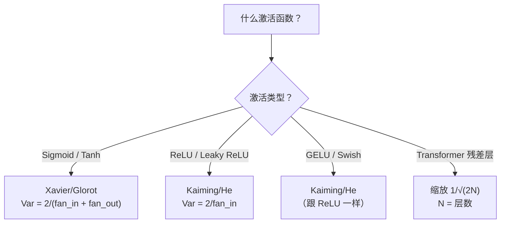

> 初始化错了训练永远不会开始。初始化对了，50 层跟 3 层一样顺畅。

## 学习目标

- 实现零初始化、随机初始化、Xavier/Glorot、Kaiming/He 策略，测量它们在 50 层中对激活值大小的影响
- 推导为什么 Xavier 用 Var(w) = 2/(fan_in + fan_out)，Kaiming 用 Var(w) = 2/fan_in
- 演示零初始化的对称性问题，解释为什么光随机还不够
- 把正确的初始化策略匹配到激活函数：Xavier 配 sigmoid/tanh，Kaiming 配 ReLU/GELU

## 为什么要学这个

全部权重初始化为零——什么都学不了。每个神经元算同样的函数、收到同样的梯度、做同样的更新。512 个神经元训练 10000 轮后还是 512 份拷贝。你付了 512 个参数的钱但只得到了 1 个。

初始化太大——激活值逐层爆炸。到第 10 层达到 1e15，第 20 层溢出到 inf。

从标准正态随机初始化——3 层没问题。50 层时信号要么塌到零要么爆到无穷，取决于随机尺度是稍微偏小还是偏大。能用和不能用之间的边界薄如刀锋。

权重初始化是深度学习中最被低估的决策。架构能发论文，优化器有博客写，初始化只得到一个脚注。但搞错了其他都不重要——网络还没开始训练就死了。

## 核心概念

### 对称性问题

如果所有权重从同一个值开始（零是极端情况），每个神经元算出同样的输出、收到同样的梯度、做同样的更新。全部参数在锁步中移动。这叫对称性——随机初始化是暴力打破它的方式。但"随机"还不够，随机的**尺度**决定网络能不能训练。

### 方差在层间的传播

单层有 fan_in 个输入：

```
z = w1×x1 + w2×x2 + ... + wₙ×xₙ
```

如果每个 wᵢ 方差为 Var(w)，每个 xᵢ 方差为 Var(x)，输出方差是：

```
Var(z) = fan_in × Var(w) × Var(x)
```

- Var(w) = 1，fan_in = 512 → 每层输出方差是输入的 512 倍。10 层后：512¹⁰ = 1.2e27。爆炸。
- Var(w) = 0.001 → 每层缩小 0.512 倍。10 层后：0.512¹⁰ = 0.00013。消失。

**目标**：选 Var(w) 使得 Var(z) = Var(x)。信号大小跨层保持恒定。

### Xavier/Glorot 初始化

Glorot and Bengio (2010) 为 sigmoid/tanh 推导的方案。前向和反向传播都保持方差恒定：

```
Var(w) = 2 / (fan_in + fan_out)

w ~ Normal(0, √(2 / (fan_in + fan_out)))
```

有效因为 sigmoid 和 tanh 在零附近近似线性——正确初始化的激活值就落在这个线性区。方差通过几十层保持稳定。

### Kaiming/He 初始化

ReLU 杀掉一半输出（负值变零）。有效 fan_in 减半。Xavier 没考虑这个——会低估需要的方差。

He et al. (2015) 调整了公式：

```
Var(w) = 2 / fan_in

w ~ Normal(0, √(2 / fan_in))
```

那个 2 补偿了 ReLU 把一半激活置零的效果。没有它，信号每层缩小 ~0.5 倍。50 层：0.5⁵⁰ = 8.8e-16。

### Transformer 的初始化

残差连接把每个子层的输出加到输入上：`x = x + sublayer(x)`。每次加法增加方差。N 个残差层后方差按 N 增长。GPT-2 把残差层权重缩放 1/√(2N)。

LLaMA 3（4050 亿参数，126 层）用类似方案。不缩放的话残差流会在 126 层 attention 和 FFN 中无界增长。

### 选哪个初始化



## 从零实现

### 第一步：四种初始化策略

```python
import math
import random

def zero_init(fan_in, fan_out):
    return [[0.0] * fan_in for _ in range(fan_out)]

def random_init(fan_in, fan_out, scale=1.0):
    return [[random.gauss(0, scale) for _ in range(fan_in)] for _ in range(fan_out)]

def xavier_init(fan_in, fan_out):
    std = math.sqrt(2.0 / (fan_in + fan_out))
    return [[random.gauss(0, std) for _ in range(fan_in)] for _ in range(fan_out)]

def kaiming_init(fan_in, fan_out):
    std = math.sqrt(2.0 / fan_in)
    return [[random.gauss(0, std) for _ in range(fan_in)] for _ in range(fan_out)]
```

### 第二步：50 层信号传播实验

```python
def forward_deep(init_fn, activation_fn, n_layers=50, width=64, n_samples=50):
    """测量信号穿过 N 层后的激活值大小"""
    random.seed(42)
    inputs = [[random.gauss(0, 1) for _ in range(width)] for _ in range(n_samples)]

    magnitudes = []
    for layer_idx in range(n_layers):
        weights = init_fn(width, width)
        new_inputs = []
        for sample in inputs:
            output = []
            for neuron in range(width):
                z = sum(weights[neuron][j] * sample[j] for j in range(width))
                output.append(activation_fn(z))
            new_inputs.append(output)
        inputs = new_inputs
        # 计算平均激活值大小
        avg_mag = sum(sum(abs(v) for v in s) / width for s in inputs) / n_samples
        magnitudes.append(avg_mag)

    return magnitudes

def sigmoid(x):
    x = max(-500, min(500, x))
    return 1.0 / (1.0 + math.exp(-x))

def relu(x):
    return max(0.0, x)

# 跑实验
configs = [
    ("Random N(0,1) + ReLU", lambda fi, fo: random_init(fi, fo, 1.0), relu),
    ("Random N(0,0.01) + ReLU", lambda fi, fo: random_init(fi, fo, 0.01), relu),
    ("Xavier + Sigmoid", xavier_init, sigmoid),
    ("Kaiming + ReLU", kaiming_init, relu),
]

print(f"{'策略':<30} {'L1':>8} {'L10':>8} {'L25':>8} {'L50':>8}")
print("-" * 62)
for name, init_fn, act_fn in configs:
    mags = forward_deep(init_fn, act_fn)
    vals = [mags[0], mags[9], mags[24], mags[49]]
    row = f"{name:<30}"
    for v in vals:
        if v > 1e6: row += f" {'爆炸':>8}"
        elif v < 1e-6: row += f" {'消失':>8}"
        else: row += f" {v:>8.4f}"
    print(row)
```

### 第三步：对称性演示

```python
def symmetry_demo():
    """证明零初始化让所有神经元完全一样"""
    weights = zero_init(2, 4)
    inputs = [0.5, -0.3]
    outputs = []
    for neuron in range(4):
        z = sum(weights[neuron][j] * inputs[j] for j in range(2))
        outputs.append(sigmoid(z))

    print("对称性演示（4 个神经元，零初始化）:")
    for i, out in enumerate(outputs):
        print(f"  Neuron {i}: output = {out:.6f}")
    print(f"  全部相同: {all(abs(o - outputs[0]) < 1e-10 for o in outputs)}")
    print(f"  有效参数: 1 个（不是 {4 * 2} 个）")

symmetry_demo()
```

## 用库做同样的事

```python
import torch.nn as nn

layer = nn.Linear(512, 256)

# Xavier（配 sigmoid/tanh）
nn.init.xavier_normal_(layer.weight)

# Kaiming（配 ReLU/GELU）
nn.init.kaiming_normal_(layer.weight, nonlinearity='relu')

# bias 通常初始化为零
nn.init.zeros_(layer.bias)
```

PyTorch 的 `nn.Linear` 默认用 Kaiming uniform 初始化。大多数简单网络"直接能跑"就是因为 PyTorch 已经做了正确选择。但超过 20 层或自定义架构时，你需要理解发生了什么并可能覆盖默认值。

## 练习

1. 实现 GPT-2 的残差缩放：每层输出乘以 1/√(2N) 再加到残差流。50 层有无缩放的对比。
2. 创建"初始化健康检查"函数：输入层维度和激活类型，推荐正确初始化并在当前初始化会出问题时发出警告。
3. 用 fan_in = 16 vs fan_in = 1024 跑实验。Xavier 和 Kaiming 会适应 fan_in，但固定尺度的随机初始化不会。展示层越大"能用"和"崩溃"的边界越窄。

## 术语表

| 术语 | 通俗说法 | 真正含义 |
|------|---------|---------|
| Weight initialization（权重初始化） | "随机设起始权重" | 选择初始权重值的策略，决定网络能否训练 |
| Symmetry breaking（打破对称性） | "让神经元不同" | 用随机初始化确保神经元学到不同特征 |
| Fan-in | "输入数" | 神经元的输入连接数，决定加权和中方差如何积累 |
| Xavier/Glorot init | "sigmoid 的初始化" | Var(w) = 2/(fan_in + fan_out)，为 sigmoid/tanh 设计 |
| Kaiming/He init | "ReLU 的初始化" | Var(w) = 2/fan_in，补偿 ReLU 把一半激活置零 |
| Residual scaling（残差缩放） | "GPT-2 的初始化 trick" | 残差层权重乘 1/√(2N) 防止方差随层数增长 |

---

## 自测题

:::quiz
question: 把神经网络所有权重初始化为零会怎样？
options:
  - 正常训练但慢一点
  - 所有神经元算出相同输出、收到相同梯度，网络每层只有 1 个有效神经元
  - 网络发散
  - 零初始化是推荐的默认值
correct: 1
explanation: 零权重时，一层中每个神经元计算相同函数、收到相同梯度、做相同更新。这种"对称性"意味着几百个参数表现得像一个。
:::

:::quiz
question: 为什么随机初始化的尺度很重要？
options:
  - 大权重训练更快
  - 方差太高激活爆炸，太低激活消失——两种都阻止训练
  - 尺度只对输出层重要
  - 只要非零就无所谓
correct: 1
explanation: 每层把方差乘以 fan_in × Var(w)。这个乘积 > 1 信号逐层指数爆炸，< 1 逐层指数消失。正确初始化让这个乘积恰好等于 1。
:::

:::quiz
question: Kaiming/He 初始化的方差公式是什么？
options:
  - Var(w) = 1/fan_in
  - Var(w) = 2/fan_in
  - Var(w) = 2/(fan_in + fan_out)
  - Var(w) = 1/(fan_in + fan_out)
correct: 1
explanation: Kaiming 用 Var(w) = 2/fan_in。那个 2 补偿了 ReLU 把一半激活置零（负值变 0），等效地减半了 fan_in。
:::

:::quiz
question: 什么时候用 Xavier 而不是 Kaiming？
options:
  - 永远——Xavier 普遍更好
  - 用 sigmoid 或 tanh 激活函数时，它们不像 ReLU 那样把一半输出置零
  - 小数据集时
  - 用 Adam 优化器时
correct: 1
explanation: Xavier 用 Var(w) = 2/(fan_in+fan_out)，为接近零时近似线性的激活（sigmoid、tanh）设计。Kaiming 多出的 2 倍因子补偿 ReLU 的半置零，Xavier 不需要这个。
:::

:::quiz
question: GPT-2 为什么把残差层权重缩放 1/√(2N)？
options:
  - 加速训练
  - 每次残差加法增加方差，缩放防止累积信号在 N 层中无界增长
  - 减少参数量
  - 改善 tokenization
correct: 1
explanation: 残差连接 x = x + sublayer(x) 每次加法增加方差。N 个残差层后方差按 N 增长。缩放 1/√(2N) 让信号保持稳定。
:::
