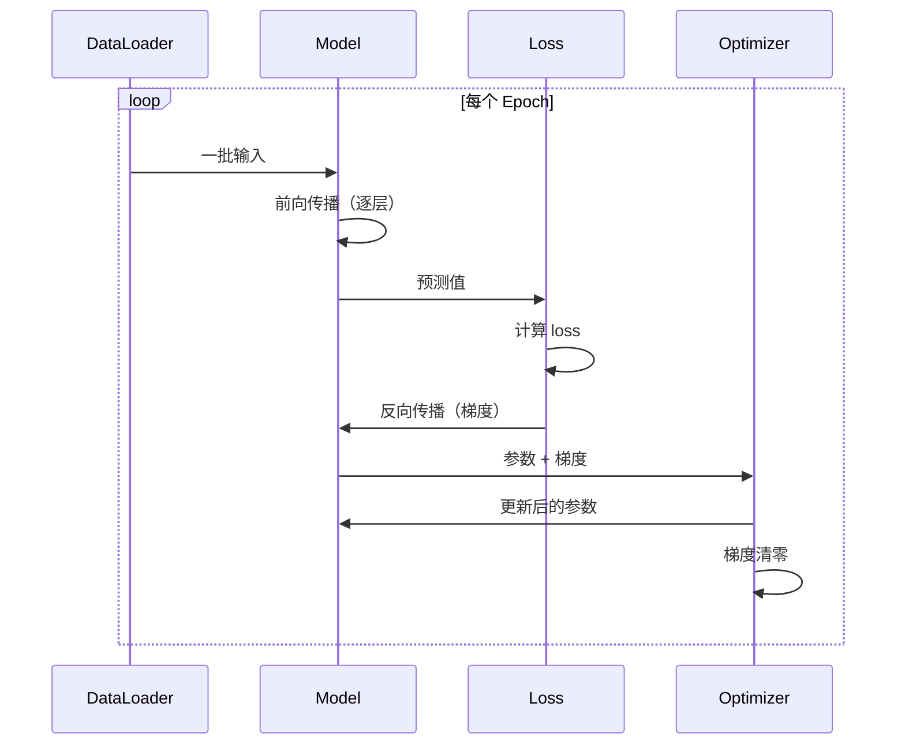
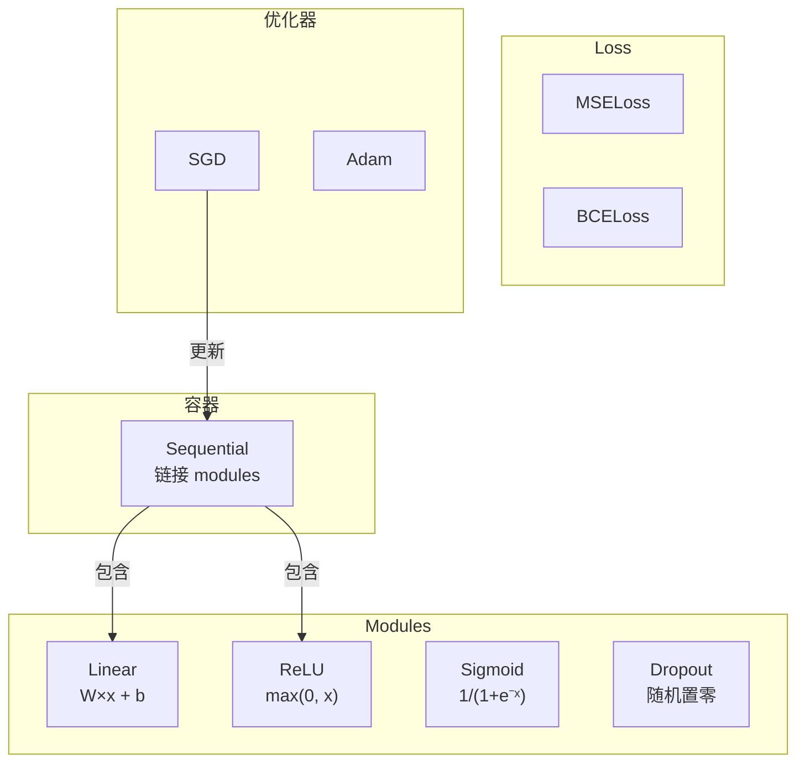

> 你已经造了所有零件。现在把它们焊在一起变成一个框架。不是 PyTorch，不是 TensorFlow，是你自己的。

## 学习目标

- 搭建一个完整的深度学习框架（~500 行）：Module、Linear、ReLU、Sigmoid、Dropout、BatchNorm、Sequential、损失函数、优化器、DataLoader
- 理解 Module 抽象（forward / backward / parameters）和为什么需要 train/eval 模式切换
- 把所有组件接入一个可运行的训练循环，训练 4 层网络做圆形分类
- 把你框架的每个组件映射到 PyTorch 等价物

## 为什么要学这个

你有十节课的零件散在各处。Value 类在这，训练循环在那，初始化在另一个文件，调度在又一个。训练一个网络要从五个地方复制粘贴然后手动接线。

框架解决的就是这个问题。PyTorch 给你 `nn.Module`、`nn.Sequential`、`optim.Adam`、`DataLoader`——这些不是魔法，是组织模式。你要用 ~500 行纯 Python 搭同样的东西。

搭完之后，你会精确理解 `model = nn.Sequential(...)` 背后发生了什么。你会明白为什么 `model.train()` 和 `model.eval()` 存在。你会明白为什么 `optimizer.zero_grad()` 是单独的调用。因为你自己造了这一切。

## 核心概念

### Module 抽象

PyTorch 中每个层都继承自 `nn.Module`。一个 Module 有三个职责：

1. **forward()** — 给定输入计算输出
2. **parameters()** — 返回所有可训练权重
3. **backward()** — 计算梯度（PyTorch 中由 autograd 处理，我们的框架中手动实现）

Linear 层是 Module。ReLU 是 Module。Dropout 是 Module。BatchNorm 是 Module。它们都有相同的接口。

### Sequential 容器

`nn.Sequential` 链接 Module。前向：数据依次通过 Module 1 → Module 2 → Module 3。反向：反过来。容器本身也是 Module——组合模式：一组 Module 的序列本身就是 Module。

### 训练 vs 评估模式

- Dropout 训练时随机置零，评估时全部通过
- BatchNorm 训练时用 batch 统计，评估时用移动平均

`train()` 和 `eval()` 切换这个行为。每个 Module 有 `training` 标志。

### 训练循环



### 框架架构



## 从零实现

### Module 基类

```python
class Module:
    def __init__(self):
        self.training = True

    def forward(self, x):
        raise NotImplementedError

    def backward(self, grad):
        raise NotImplementedError

    def parameters(self):
        return []

    def train(self):
        self.training = True

    def eval(self):
        self.training = False
```

### Linear 层

```python
import math, random

class Linear(Module):
    def __init__(self, fan_in, fan_out):
        super().__init__()
        std = math.sqrt(2.0 / fan_in)  # Kaiming 初始化
        self.weights = [[random.gauss(0, std) for _ in range(fan_in)] for _ in range(fan_out)]
        self.biases = [0.0] * fan_out
        self.weight_grads = [[0.0] * fan_in for _ in range(fan_out)]
        self.bias_grads = [0.0] * fan_out
        self.fan_in = fan_in
        self.fan_out = fan_out

    def forward(self, x):
        self.input = x
        output = []
        for i in range(self.fan_out):
            val = self.biases[i]
            for j in range(self.fan_in):
                val += self.weights[i][j] * x[j]
            output.append(val)
        return output

    def backward(self, grad):
        input_grad = [0.0] * self.fan_in
        for i in range(self.fan_out):
            self.bias_grads[i] += grad[i]
            for j in range(self.fan_in):
                self.weight_grads[i][j] += grad[i] * self.input[j]
                input_grad[j] += grad[i] * self.weights[i][j]
        return input_grad
```

### 激活函数 Modules

```python
class ReLU(Module):
    def forward(self, x):
        self.mask = [1.0 if v > 0 else 0.0 for v in x]
        return [max(0.0, v) for v in x]

    def backward(self, grad):
        return [g * m for g, m in zip(grad, self.mask)]

class Sigmoid(Module):
    def forward(self, x):
        self.output = [1.0/(1.0+math.exp(-max(-500,min(500,v)))) for v in x]
        return self.output

    def backward(self, grad):
        return [g * o * (1-o) for g, o in zip(grad, self.output)]
```

### Sequential 容器

```python
class Sequential(Module):
    def __init__(self, *modules):
        super().__init__()
        self.modules = list(modules)

    def forward(self, x):
        for module in self.modules:
            x = module.forward(x)
        return x

    def backward(self, grad):
        for module in reversed(self.modules):
            grad = module.backward(grad)
        return grad

    def parameters(self):
        return [p for m in self.modules for p in m.parameters()]

    def train(self):
        for m in self.modules: m.train()

    def eval(self):
        for m in self.modules: m.eval()
```

### 训练循环

```python
# 定义模型
model = Sequential(
    Linear(2, 16), ReLU(),
    Linear(16, 16), ReLU(),
    Linear(16, 8), ReLU(),
    Linear(8, 1), Sigmoid(),
)

# 训练
model.train()
for epoch in range(100):
    for x, t in data:
        pred = model.forward(x)            # 前向
        loss = bce_loss(pred, t)           # 算 loss
        optimizer.zero_grad()               # 梯度清零
        grad = loss_backward()              # loss 的梯度
        model.backward(grad)                # 反向传播
        optimizer.step()                    # 更新权重

# 评估
model.eval()
for x, t in test_data:
    pred = model.forward(x)                 # 不执行 dropout
```

## 与 PyTorch 的对照

| 你的框架 | PyTorch | 作用 |
|---------|---------|------|
| `Module` | `nn.Module` | 层/组件的基类 |
| `Sequential(...)` | `nn.Sequential(...)` | 链接层 |
| `Linear(2, 16)` | `nn.Linear(2, 16)` | 全连接层 |
| `ReLU()` | `nn.ReLU()` | 激活函数 |
| `model.forward(x)` | `model(x)` | 前向传播 |
| `model.backward(grad)` | `loss.backward()` | 反向传播 |
| `optimizer.zero_grad()` | `optimizer.zero_grad()` | 清梯度 |
| `optimizer.step()` | `optimizer.step()` | 更新参数 |
| `model.train()` | `model.train()` | 启用 dropout 等 |
| `model.eval()` | `model.eval()` | 关闭 dropout 等 |

结构一模一样。你现在看 PyTorch 代码，每一行都知道底下发生了什么。这就是这课的全部意义。

## 练习

1. 加一个 `SoftmaxCrossEntropyLoss` 做多分类。在 3 类螺旋数据集上测试。
2. 给优化器加学习率调度：实现 `set_lr()` 方法，接入第 9 课的 cosine schedule。
3. 给 Sequential 加 `save()` 和 `load()` 方法，把权重序列化到 JSON。验证加载后预测跟原来一样。
4. 在 Adam 中实现 weight decay。对比 decay=0 vs decay=0.01 的训练效果。

## 术语表

| 术语 | 通俗说法 | 真正含义 |
|------|---------|---------|
| Module | "一层" | 框架中的基础抽象——有 forward()、backward()、parameters() 的东西 |
| Sequential | "按顺序堆层" | 把 modules 链起来的容器，前向按顺序，反向倒着来 |
| Parameters | "可训练的权重" | 网络中优化器能更新的所有值 |
| zero_grad | "清梯度" | 更新前把所有参数梯度归零，否则梯度会累加（这也是为什么它是单独调用） |
| DataLoader | "喂数据的" | 把数据集分成 batch、可选 shuffle 的迭代器 |
| train() / eval() | "训练/评估模式" | 切换 dropout 和 batchnorm 等随机行为的开关 |

---

## 自测题

:::quiz
question: Module 抽象有哪三个核心职责？
options:
  - 加载数据、预处理、增强
  - forward() 做计算、backward() 算梯度、parameters() 暴露可训练权重
  - 编译、优化、部署
  - 分词、嵌入、解码
correct: 1
explanation: 每个 Module 实现 forward() 计算输出、backward() 传播梯度、parameters() 暴露可训练权重。统一接口让任何 module 能跟任何其他组合。
:::

:::quiz
question: 为什么 Sequential 在反向传播时要反向遍历 modules？
options:
  - 随便哪个方向都行
  - 梯度从 loss 往回流，最后一层先算梯度再传给前一层
  - 反向用更少内存
  - 防止梯度爆炸
correct: 1
explanation: 反向传播从 loss 开始往输入方向传播梯度。最后一层先收到 loss 梯度，算自己的局部梯度，再传给前一层。
:::

:::quiz
question: 为什么 optimizer.zero_grad() 是单独的调用而不是自动执行？
options:
  - PyTorch 的设计失误
  - 允许跨多个 batch 做梯度累加——多次 backward() 后才做一次 step()
  - 节省内存
  - 方便调试
correct: 1
explanation: 分离 zero_grad 和 step 使梯度累加成为可能：你可以跑多次 backward() 把梯度加起来再调一次 step()，模拟更大的 batch size。
:::

:::quiz
question: 训练循环的正确操作顺序是什么？
options:
  - backward, forward, zero_grad, step
  - forward, loss, zero_grad, backward, step
  - zero_grad, forward, loss, backward, step
  - forward, zero_grad, backward, loss, step
correct: 2
explanation: 标准模式：zero_grad（清旧梯度）→ forward（算预测）→ loss（算标量 loss）→ backward（算梯度）→ step（更新参数）。顺序搞错会有隐蔽 bug。
:::

:::quiz
question: DataLoader 在框架中的角色是什么？
options:
  - 训练模型
  - 把数据分成 batch 并可选地在 epoch 间 shuffle，用于小批量梯度下降
  - 计算损失函数
  - 初始化权重
correct: 1
explanation: DataLoader 处理两个实际问题：分批（大数据放不进内存）和 shuffle（随机顺序防止模型记住数据序列）。
:::
