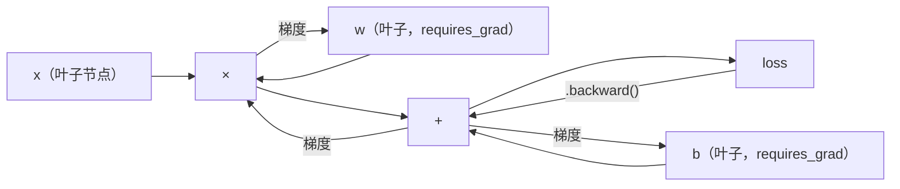
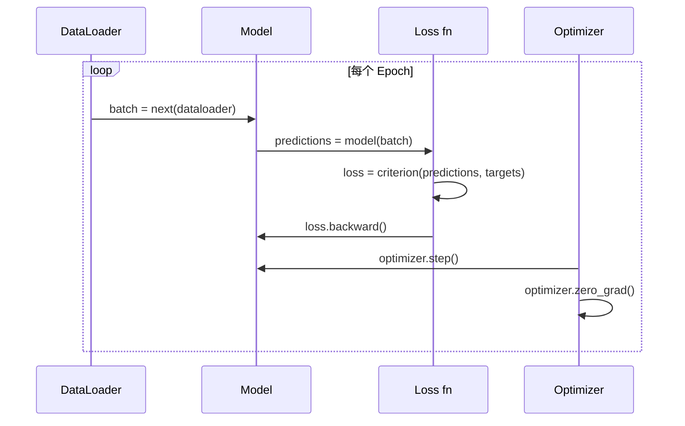

> 你已经从活塞和曲轴开始造了一台引擎。现在来学大家真正开的那辆车。

## 学习目标

- 用 PyTorch 的 nn.Module、nn.Sequential 和 autograd 构建并训练神经网络
- 使用 PyTorch 张量、GPU 加速和标准训练循环（zero_grad → forward → loss → backward → step）
- 把你从零搭建的 mini framework 组件对应到 PyTorch 等价物
- 对比纯 Python 框架和 PyTorch 在同一任务上的训练速度

## 为什么要学这个

你有一个能跑的 mini framework。Linear 层、ReLU、Dropout、BatchNorm、Adam、DataLoader、训练循环。它能在一个圆形分类问题上训练 4 层网络。

它也比 PyTorch 慢 500 倍。

你的 mini framework 用嵌套 Python 循环逐样本处理。PyTorch 把同样的操作派发给优化过的 C++/CUDA 内核，在 GPU 上并行运行。在一块 NVIDIA A100 上，PyTorch 训练一个 ResNet-50（2560 万参数）跑完 ImageNet（128 万张图）只要大约 6 小时。你的框架同样的任务大概需要 3000 小时——如果内存不先爆的话。

速度只是差距之一。你的框架没有 GPU 支持，没有自动微分（你给每个模块手写了 backward()），没有序列化，没有分布式训练，没有混合精度，没有调试梯度流的方法。

PyTorch 填补了所有这些空白。而且它的接口跟你搭的那个完全一样：Module、forward()、parameters()、backward()、optimizer.step()。概念一一对应，语法几乎相同。区别在于 PyTorch 把十年的系统工程藏在了你从零设计的同一套接口后面。

## 核心概念

### 为什么 PyTorch 赢了

2015 年，TensorFlow 要求你先定义一个静态计算图，再运行。你构建图、编译图，然后往里喂数据。调试意味着盯着图的可视化发呆。改网络结构等于从头建图。

PyTorch 在 2017 年带着不同的哲学登场：即时执行（eager execution）。你写 Python，它立刻运行。`y = model(x)` 是真的在算 y，不是"往图里加一个节点以后再算 y"。这意味着标准 Python 调试工具都能用。print() 能用，pdb 能用，forward 里写 if/else 也能用。

到 2020 年，市场已经给出答案。PyTorch 在 ML 论文中的占比从 7%（2017）涨到 75% 以上（2022）。Meta、Google DeepMind、OpenAI、Anthropic、Hugging Face 都把 PyTorch 当主力框架。TensorFlow 2.x 跟着也采用了 eager execution——等于默认承认 PyTorch 的设计是对的。

教训：开发者体验有复利效应。一个慢 10% 但调试快 50% 的框架，每次都赢。

### 张量（Tensor）

张量是多维数组，有三个关键属性：shape（形状）、dtype（数据类型）、device（设备）。

```python
import torch

x = torch.zeros(3, 4)           # shape: (3, 4), dtype: float32, device: cpu
x = torch.randn(2, 3, 224, 224) # 一批 2 张 RGB 图片，224×224
x = torch.tensor([1, 2, 3])     # 从 Python 列表创建
```

**Shape** 是维度信息。标量的 shape 是 ()，向量是 (n,)，矩阵是 (m, n)，一批图片是 (batch, channels, height, width)。

**Dtype** 控制精度和内存。

| dtype | 位数 | 范围 | 用途 |
|-------|------|------|------|
| float32 | 32 | 约 7 位有效数字 | 默认训练精度 |
| float16 | 16 | 约 3.3 位有效数字 | 混合精度训练 |
| bfloat16 | 16 | 范围同 float32，精度更低 | LLM 训练 |
| int8 | 8 | -128 到 127 | 量化推理 |

**Device** 决定计算在哪里发生。

```python
device = torch.device("cuda" if torch.cuda.is_available() else "cpu")
x = torch.randn(3, 4, device=device)
x = x.to("cuda")
x = x.cpu()
```

所有运算要求张量在同一个设备上。这是初学者遇到的 PyTorch 第一大报错：`RuntimeError: Expected all tensors to be on the same device`。解决方法：计算前把所有东西移到同一个设备。

**Reshape** 是常数时间操作——改的是元数据，不是数据本身。

```python
x = torch.randn(2, 3, 4)
x.view(2, 12)      # 变形为 (2, 12)——要求连续内存
x.reshape(6, 4)    # 变形为 (6, 4)——总是能用
x.permute(2, 0, 1) # 重排维度顺序
x.unsqueeze(0)     # 加一维: (1, 2, 3, 4)
x.squeeze()        # 去掉大小为 1 的维度
```

### 自动微分（Autograd）

你的 mini framework 要求你给每个模块实现 backward()。PyTorch 不需要。它把张量上的每一步运算记录进一个有向无环图（计算图），然后反向遍历这个图来自动计算梯度。



跟你的框架的核心区别：PyTorch 用基于 tape 的自动微分。前向传播时每个操作都追加到一条"磁带"上。调用 `.backward()` 就是倒放这条磁带。

```python
x = torch.randn(3, requires_grad=True)
y = x ** 2 + 3 * x
z = y.sum()
z.backward()
print(x.grad)  # dz/dx = 2x + 3
```

Autograd 三条规则：

1. 只有 `requires_grad=True` 的叶子张量才会积累梯度
2. 梯度默认是累加的——每次 backward 前要调 `optimizer.zero_grad()`
3. `torch.no_grad()` 关闭梯度追踪（评估时用）

### nn.Module

`nn.Module` 是 PyTorch 中所有神经网络组件的基类。你在第 10 课已经搭过这个抽象了。PyTorch 的版本额外提供：自动参数注册、递归模块发现、设备管理和 state dict 序列化。

```python
import torch.nn as nn

class MLP(nn.Module):
    def __init__(self, input_dim, hidden_dim, output_dim):
        super().__init__()
        self.layer1 = nn.Linear(input_dim, hidden_dim)
        self.relu = nn.ReLU()
        self.layer2 = nn.Linear(hidden_dim, output_dim)

    def forward(self, x):
        x = self.layer1(x)
        x = self.relu(x)
        x = self.layer2(x)
        return x
```

当你在 `__init__` 中把 `nn.Module` 或 `nn.Parameter` 赋值为属性时，PyTorch 自动注册它。`model.parameters()` 会递归收集所有注册的参数。这就是为什么你不再需要像 mini framework 里那样手动收集权重。

核心构建块：

| 模块 | 作用 | 参数量 |
|------|------|--------|
| nn.Linear(in, out) | Wx + b | in×out + out |
| nn.Conv2d(in_ch, out_ch, k) | 二维卷积 | in_ch×out_ch×k×k + out_ch |
| nn.BatchNorm1d(features) | 归一化激活值 | 2 × features |
| nn.Dropout(p) | 随机置零 | 0 |
| nn.ReLU() | max(0, x) | 0 |
| nn.GELU() | 高斯误差线性单元 | 0 |
| nn.Embedding(vocab, dim) | 查找表 | vocab × dim |
| nn.LayerNorm(dim) | 逐样本归一化 | 2 × dim |

### 损失函数和优化器

PyTorch 自带你之前手搭的所有组件的生产级版本。

**损失函数**（来自 `torch.nn`）：

| 损失函数 | 任务 | 输入 |
|----------|------|------|
| nn.MSELoss() | 回归 | 任意形状 |
| nn.CrossEntropyLoss() | 多分类 | Logits（不是 softmax） |
| nn.BCEWithLogitsLoss() | 二分类 | Logits（不是 sigmoid） |
| nn.L1Loss() | 回归（鲁棒） | 任意形状 |
| nn.CTCLoss() | 序列对齐 | 对数概率 |

注意：`CrossEntropyLoss` 内部合并了 `LogSoftmax` + `NLLLoss`。传原始 logits，不要传 softmax 输出。这是一个常见错误——传了 softmax 之后梯度会默默算错。

**优化器**（来自 `torch.optim`）：

| 优化器 | 适用场景 | 典型学习率 |
|--------|----------|-----------|
| SGD(params, lr, momentum) | CNN、精调过的流水线 | 0.01–0.1 |
| Adam(params, lr) | 默认起步选择 | 1e-3 |
| AdamW(params, lr, weight_decay) | Transformer、微调 | 1e-4–1e-3 |
| LBFGS(params) | 小规模、二阶方法 | 1.0 |

### 训练循环

每个 PyTorch 训练循环都遵循同一个 5 步模式。你在第 10 课就见过了。



标准写法：

```python
for epoch in range(num_epochs):
    model.train()
    for inputs, targets in train_loader:
        inputs, targets = inputs.to(device), targets.to(device)
        optimizer.zero_grad()
        outputs = model(inputs)
        loss = criterion(outputs, targets)
        loss.backward()
        optimizer.step()
```

batch 循环里五行代码。训练 GPT-4、Stable Diffusion 和 LLaMA 的就是这五行。架构会变，数据会变，这五行不变。

### Dataset 和 DataLoader

PyTorch 的 `Dataset` 是一个抽象类，需要实现两个方法：`__len__` 和 `__getitem__`。`DataLoader` 在它外面包一层，提供批处理、打乱和多进程数据加载。

```python
from torch.utils.data import Dataset, DataLoader

class MNISTDataset(Dataset):
    def __init__(self, images, labels):
        self.images = images
        self.labels = labels

    def __len__(self):
        return len(self.labels)

    def __getitem__(self, idx):
        return self.images[idx], self.labels[idx]

loader = DataLoader(dataset, batch_size=64, shuffle=True, num_workers=4)
```

`num_workers=4` 启动 4 个进程并行加载数据，在 GPU 训练当前 batch 的同时预读下一批。对磁盘瓶颈型任务（大图片、音频），光这一项就能让训练速度翻倍。

### GPU 训练

把模型移到 GPU：

```python
device = torch.device("cuda" if torch.cuda.is_available() else "cpu")
model = model.to(device)
```

这会递归地把每个参数和 buffer 都移到 GPU 上。然后训练时把每个 batch 也移过去：

```python
inputs, targets = inputs.to(device), targets.to(device)
```

**混合精度训练（Mixed Precision）** 在现代 GPU（A100、H100、RTX 4090）上把显存占用减半、吞吐量翻倍。原理是前向/反向用 float16 算，主权重用 float32 存：

```python
from torch.amp import autocast, GradScaler

scaler = GradScaler()
for inputs, targets in loader:
    with autocast(device_type="cuda"):
        outputs = model(inputs)
        loss = criterion(outputs, targets)
    scaler.scale(loss).backward()
    scaler.step(optimizer)
    scaler.update()
    optimizer.zero_grad()
```

### 对比：Mini Framework vs PyTorch vs JAX

| 特性 | Mini Framework（第10课） | PyTorch | JAX |
|------|--------------------------|---------|-----|
| 自动微分 | 手写 backward() | 基于 tape 的 autograd | 函数式变换 |
| 执行方式 | Eager（Python 循环） | Eager（C++ 内核） | Traced + JIT 编译 |
| GPU 支持 | 无 | 有（CUDA, ROCm, MPS） | 有（CUDA, TPU） |
| 速度（MNIST MLP） | ~300s/epoch | ~0.5s/epoch | ~0.3s/epoch |
| 模块系统 | 自定义 Module 类 | nn.Module | 无状态函数（Flax/Equinox） |
| 调试 | print() | print(), pdb, breakpoint() | 较难（JIT tracing 破坏 print） |
| 生态 | 无 | Hugging Face, Lightning, timm | Flax, Optax, Orbax |
| 学习曲线 | 你自己搭的 | 中等 | 陡峭（函数式范式） |
| 生产使用 | 玩具问题 | Meta, OpenAI, Anthropic, HF | Google DeepMind, Midjourney |

## 从零实现

一个 3 层 MLP 在 MNIST 上训练，只用 PyTorch 原语。不用高级封装，不用 `torchvision.datasets`。我们自己下载和解析原始数据。

### 第一步：从原始文件加载 MNIST

MNIST 以 4 个 gzip 文件发布：训练图片（60,000 × 28 × 28）、训练标签、测试图片（10,000 × 28 × 28）、测试标签。我们下载并解析二进制格式。

```python
import torch
import torch.nn as nn
import struct
import gzip
import urllib.request
import os

def download_mnist(path="./mnist_data"):
    base_url = "https://storage.googleapis.com/cvdf-datasets/mnist/"
    files = [
        "train-images-idx3-ubyte.gz",
        "train-labels-idx1-ubyte.gz",
        "t10k-images-idx3-ubyte.gz",
        "t10k-labels-idx1-ubyte.gz",
    ]
    os.makedirs(path, exist_ok=True)
    for f in files:
        filepath = os.path.join(path, f)
        if not os.path.exists(filepath):
            urllib.request.urlretrieve(base_url + f, filepath)

def load_images(filepath):
    with gzip.open(filepath, "rb") as f:
        magic, num, rows, cols = struct.unpack(">IIII", f.read(16))
        data = f.read()
        images = torch.frombuffer(bytearray(data), dtype=torch.uint8)
        images = images.reshape(num, rows * cols).float() / 255.0
    return images

def load_labels(filepath):
    with gzip.open(filepath, "rb") as f:
        magic, num = struct.unpack(">II", f.read(8))
        data = f.read()
        labels = torch.frombuffer(bytearray(data), dtype=torch.uint8).long()
    return labels
```

### 第二步：定义模型

3 层 MLP：784 → 256 → 128 → 10。ReLU 激活，Dropout 正则化，不加 BatchNorm 以保持简洁。

```python
class MNISTModel(nn.Module):
    def __init__(self):
        super().__init__()
        self.net = nn.Sequential(
            nn.Linear(784, 256),
            nn.ReLU(),
            nn.Dropout(0.2),
            nn.Linear(256, 128),
            nn.ReLU(),
            nn.Dropout(0.2),
            nn.Linear(128, 10),
        )

    def forward(self, x):
        return self.net(x)
```

输出层产生 10 个原始 logits（每个数字一个）。不加 softmax——`CrossEntropyLoss` 内部处理了。

参数量：784×256 + 256 + 256×128 + 128 + 128×10 + 10 = 235,146。按现代标准很小。GPT-2 small 有 1.24 亿。这个几秒就能训完。

### 第三步：训练循环

标准的 forward → loss → backward → step 模式。

```python
def train_one_epoch(model, loader, criterion, optimizer, device):
    model.train()
    total_loss = 0
    correct = 0
    total = 0
    for images, labels in loader:
        images, labels = images.to(device), labels.to(device)
        optimizer.zero_grad()
        outputs = model(images)
        loss = criterion(outputs, labels)
        loss.backward()
        optimizer.step()
        total_loss += loss.item() * images.size(0)
        _, predicted = outputs.max(1)
        correct += predicted.eq(labels).sum().item()
        total += labels.size(0)
    return total_loss / total, correct / total


def evaluate(model, loader, criterion, device):
    model.eval()
    total_loss = 0
    correct = 0
    total = 0
    with torch.no_grad():
        for images, labels in loader:
            images, labels = images.to(device), labels.to(device)
            outputs = model(images)
            loss = criterion(outputs, labels)
            total_loss += loss.item() * images.size(0)
            _, predicted = outputs.max(1)
            correct += predicted.eq(labels).sum().item()
            total += labels.size(0)
    return total_loss / total, correct / total
```

注意评估时的 `torch.no_grad()`。它关掉了 autograd，减少内存占用并加速推理。不加的话，PyTorch 会建一个你永远不会用到的计算图。

### 第四步：串联一切

```python
def main():
    device = torch.device("cuda" if torch.cuda.is_available() else "cpu")

    download_mnist()
    train_images = load_images("./mnist_data/train-images-idx3-ubyte.gz")
    train_labels = load_labels("./mnist_data/train-labels-idx1-ubyte.gz")
    test_images = load_images("./mnist_data/t10k-images-idx3-ubyte.gz")
    test_labels = load_labels("./mnist_data/t10k-labels-idx1-ubyte.gz")

    train_dataset = torch.utils.data.TensorDataset(train_images, train_labels)
    test_dataset = torch.utils.data.TensorDataset(test_images, test_labels)
    train_loader = torch.utils.data.DataLoader(
        train_dataset, batch_size=64, shuffle=True
    )
    test_loader = torch.utils.data.DataLoader(
        test_dataset, batch_size=256, shuffle=False
    )

    model = MNISTModel().to(device)
    criterion = nn.CrossEntropyLoss()
    optimizer = torch.optim.Adam(model.parameters(), lr=1e-3)

    num_params = sum(p.numel() for p in model.parameters())
    print(f"Device: {device}")
    print(f"Parameters: {num_params:,}")
    print(f"Train samples: {len(train_dataset):,}")
    print(f"Test samples: {len(test_dataset):,}")
    print()

    for epoch in range(10):
        train_loss, train_acc = train_one_epoch(
            model, train_loader, criterion, optimizer, device
        )
        test_loss, test_acc = evaluate(
            model, test_loader, criterion, device
        )
        print(
            f"Epoch {epoch+1:2d} | "
            f"Train Loss: {train_loss:.4f} | Train Acc: {train_acc:.4f} | "
            f"Test Loss: {test_loss:.4f} | Test Acc: {test_acc:.4f}"
        )

    torch.save(model.state_dict(), "mnist_mlp.pt")
    print(f"\nModel saved to mnist_mlp.pt")
    print(f"Final test accuracy: {test_acc:.4f}")
```

10 个 epoch 后预期结果：测试准确率约 97.8%。CPU 上训练时间约 30 秒，GPU 约 5 秒。你的 mini framework 同样架构大约要 45 分钟。

## 实战用法

### 快速对比：Mini Framework vs PyTorch

| Mini Framework（第 10 课） | PyTorch |
|---------------------------|---------|
| `model = Sequential(Linear(784, 256), ReLU(), ...)` | `model = nn.Sequential(nn.Linear(784, 256), nn.ReLU(), ...)` |
| `pred = model.forward(x)` | `pred = model(x)` |
| `optimizer.zero_grad()` | `optimizer.zero_grad()` |
| `grad = criterion.backward()` 然后 `model.backward(grad)` | `loss.backward()` |
| `optimizer.step()` | `optimizer.step()` |
| 没有 GPU | `model.to("cuda")` |
| 每个模块手写 backward | Autograd 全搞定 |

接口几乎一样。区别全在底层。

### 保存和加载模型

```python
torch.save(model.state_dict(), "model.pt")

model = MNISTModel()
model.load_state_dict(torch.load("model.pt", weights_only=True))
model.eval()
```

永远保存 `state_dict()`（参数字典），不要保存模型对象本身。保存模型对象用的是 pickle，一旦你重构代码就会挂。State dict 是可移植的。

### 学习率调度

```python
scheduler = torch.optim.lr_scheduler.CosineAnnealingLR(
    optimizer, T_max=10
)
for epoch in range(10):
    train_one_epoch(model, train_loader, criterion, optimizer, device)
    scheduler.step()
```

PyTorch 自带 15+ 种调度器：StepLR、ExponentialLR、CosineAnnealingLR、OneCycleLR、ReduceLROnPlateau。全都接同一个 optimizer 接口。

## 练习

1. **加 Batch Normalization。** 在每个 Linear 层后面（激活函数前面）插入 `nn.BatchNorm1d`。跟纯 Dropout 版比较准确率和训练速度。加了 BN 应该在更少的 epoch 内达到 98%+。

2. **实现一个 Learning Rate Finder。** 用指数递增的学习率（从 1e-7 到 1.0）训练一个 epoch。画 loss vs LR 图。最优 LR 在 loss 开始上升之前。用它来给 MNIST 模型选一个更好的学习率。

3. **移到 GPU 并用混合精度。** 给训练循环加上 `torch.amp.autocast` 和 `GradScaler`。测量有无混合精度时的吞吐量（样本/秒）。在 A100 上预期约 2 倍加速。

4. **自定义 Dataset。** 下载 Fashion-MNIST（跟 MNIST 格式一样但是衣物图片）。实现一个 `FashionMNISTDataset(Dataset)` 类。训练同样的 MLP 并比较准确率。Fashion-MNIST 更难——预期约 88% vs 约 98%。

5. **用 SGD + momentum 替换 Adam。** 用 `SGD(params, lr=0.01, momentum=0.9)` 训练。对比收敛曲线。然后加上 `CosineAnnealingLR` 调度器，看 SGD 到第 10 个 epoch 时能不能追上 Adam。

## 术语表

| 术语 | 通俗说法 | 真正含义 |
|------|---------|---------|
| Tensor（张量） | "多维数组" | 带类型、设备感知、自动微分支持的数组，每个操作都内置梯度追踪 |
| Autograd（自动微分） | "自动反向传播" | 基于 tape 的系统：前向传播时记录操作，反向传播时倒放计算精确梯度 |
| nn.Module | "一个层" | 所有可微分计算块的基类——注册参数、支持嵌套、处理 train/eval 模式 |
| state_dict | "模型权重" | 参数名到张量的有序字典——训练好的模型的可移植、可序列化表示 |
| .backward() | "计算梯度" | 反向遍历计算图，为每个 requires_grad=True 的叶子张量计算并累加梯度 |
| .to(device) | "移到 GPU" | 递归地把所有参数和 buffer 转移到指定设备（CPU、CUDA、MPS） |
| DataLoader | "数据管道" | 从 Dataset 中批处理、打乱、可选并行加载数据的迭代器 |
| Mixed Precision（混合精度） | "用 float16" | 前向/反向用 float16 加速，同时保持 float32 主权重确保数值稳定 |
| Eager Execution（即时执行） | "立刻跑" | 操作在调用时立即执行，不推迟到后续编译步骤——PyTorch 与 TF 1.x 的核心设计差异 |
| zero_grad | "重置梯度" | 在下一次 backward 前把所有参数梯度归零，因为 PyTorch 默认累加梯度 |

---

## 自测题

:::quiz
question: PyTorch 的 autograd 是什么？
options:
  - 一个数据加载库
  - 一个自动微分引擎，记录操作并自动计算梯度，无需手动实现 backward
  - 一个模型压缩工具
  - 一个超参数调优框架
correct: 1
explanation: PyTorch 的 autograd 在前向计算时构建计算图，调用 .backward() 时自动计算梯度。这消除了在每个模块中手动实现 backward() 的需要。
:::

:::quiz
question: torch.no_grad() 做什么？什么时候该用？
options:
  - 防止过拟合
  - 关闭梯度追踪用于推理，当不需要训练时节省内存和计算
  - 冻结所有模型权重
  - 启用 GPU 加速
correct: 1
explanation: 推理时不需要梯度。torch.no_grad() 关闭梯度追踪，节省存储计算图所需的内存，同时加速计算。
:::

:::quiz
question: nn.Linear(784, 256) 在 PyTorch 中创建了什么？
options:
  - 一个 ReLU 激活层
  - 一个全连接层，有 (256, 784) 的权重矩阵和 (256,) 的偏置向量
  - 一个 p=784/256 的 Dropout 层
  - 一个 Batch Normalization 层
correct: 1
explanation: nn.Linear(in_features, out_features) 创建一个计算 y = x @ W^T + b 的层，其中 W 的形状是 (256, 784)，b 的形状是 (256,)。这就是你从零搭建的 Layer 类的 PyTorch 等价物。
:::

:::quiz
question: 哪个 PyTorch 方法为计算图中的所有参数计算梯度？
options:
  - optimizer.step()
  - model.forward()
  - loss.backward()
  - optimizer.zero_grad()
correct: 2
explanation: loss.backward() 反向遍历计算图，为每个需要梯度的参数 p 计算 dL/dp。optimizer.step() 然后用这些梯度更新参数。
:::

:::quiz
question: 为什么 PyTorch 的训练循环比纯 Python mini framework 快得多？
options:
  - PyTorch 用了不同的算法
  - PyTorch 把运算交给优化过的 C++/CUDA 内核在 GPU 上大规模并行执行，而纯 Python 循环是逐操作解释执行的
  - PyTorch 用了更小的数据类型
  - PyTorch 跳过了反向传播
correct: 1
explanation: PyTorch 把矩阵运算委托给高度优化的 C++ 和 CUDA 内核，在 GPU 上大规模并行运行。纯 Python 则对每个操作都带着解释器开销顺序执行循环。
:::
