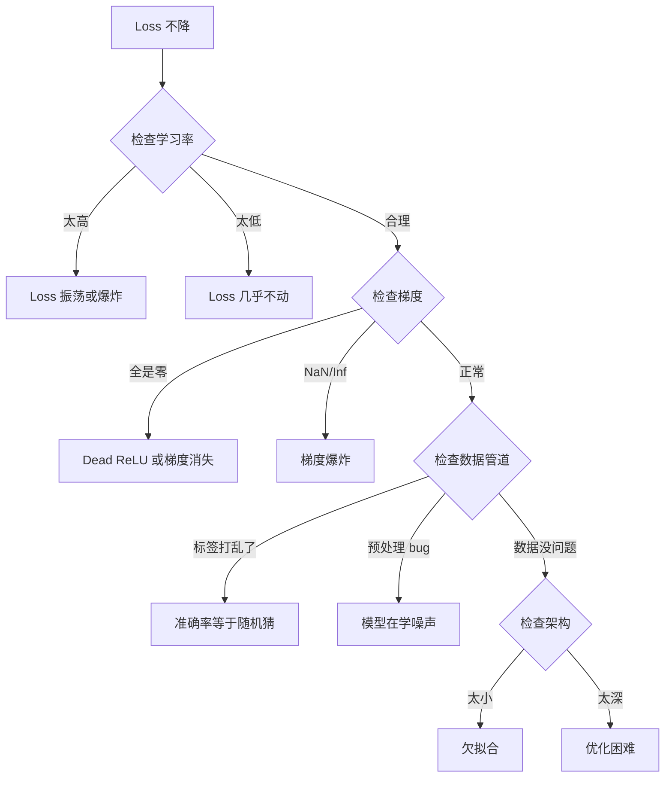
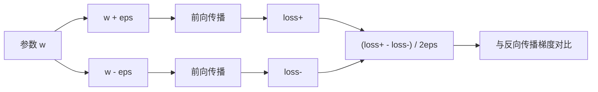
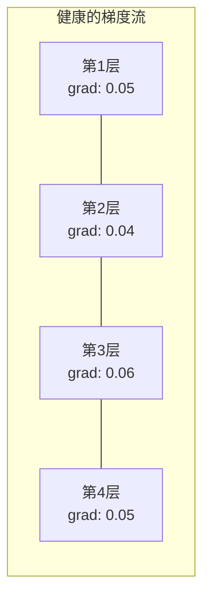
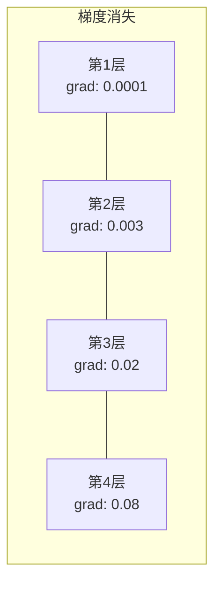
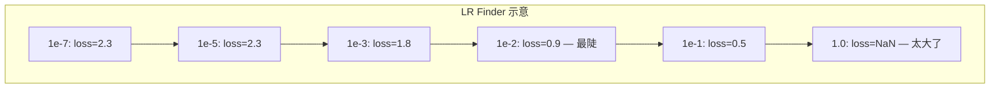

> 你的网络编译通过了，跑起来了，输出了一个数字。这个数字是错的，但什么都没崩。欢迎来到最难的调试——没有报错信息的那种。

## 学习目标

- 用系统化策略诊断常见神经网络故障（NaN loss、loss 不降、过拟合、振荡）
- 用"过拟合单个 batch"技巧验证模型架构和训练循环的正确性
- 检查梯度大小、激活值分布和权重范数来识别梯度消失/爆炸问题
- 建立一份调试清单，覆盖数据管道、模型架构、损失函数、优化器和学习率问题

## 为什么要学这个

传统软件坏了会崩。空指针抛异常，类型不匹配编译失败，越界错误产生明显的错误输出。

神经网络不给你这个待遇。

一个有 bug 的网络会跑完全程，打印 loss 值，输出预测。Loss 可能还在降，预测可能看着也合理。但模型在暗中走偏——学捷径、记噪声、或者收敛到一个没用的局部最小值。Google 的研究人员估计，ML 调试时间的 60–70% 花在"静默"bug 上——不报错但降低模型质量的那种。

一个能用的模型和一个坏掉的模型之间的区别，往往就是一行代码放错了位置：漏了 `zero_grad()`、转置了一个维度、学习率差了 10 倍。Andrej Karpathy 的经典文章"Recipe for Training Neural Networks"（2019）开头就是这句：「最常见的神经网络错误是不会崩溃的 bug。」

这节课教你找到那些 bug。

## 核心概念

### 调试心态

忘掉 print 大法。神经网络调试需要系统化方法，因为反馈循环很慢（一次训练跑几分钟到几小时），而且症状模糊（loss 不好可能意味着 20 种不同的问题）。

金规则：**从简单开始，每次只加一个复杂度，独立验证每一块。**



### 症状一：Loss 不降

最常见的抱怨。训练循环在跑，epoch 在走，loss 一直平的或者疯狂振荡。

**学习率错了。** 太高：loss 振荡或直接 NaN。太低：loss 降得极慢看着像不动。Adam 从 1e-3 开始试，SGD 从 1e-1 或 1e-2 开始。在得出"别的地方有问题"的结论之前，永远先试 3 个差 10 倍的学习率（比如 1e-2、1e-3、1e-4）。

**Dead ReLU。** 如果 ReLU 神经元收到的输入一直是负数，它输出 0、梯度也是 0，永远不会再激活。如果死掉的神经元够多，网络就学不动了。检查方法：打印每个 ReLU 层之后激活值为 0 的比例。如果超过 50% 是死的，换成 LeakyReLU 或降低学习率。

**梯度消失（Vanishing Gradients）。** 在用 sigmoid 或 tanh 激活的深网络中，梯度在反向传播时指数级缩小。到达第一层时已经接近 0，前面的层停止学习。解决：用 ReLU/GELU，加残差连接，或用 Batch Normalization。

**梯度爆炸（Exploding Gradients）。** 反过来——梯度指数级增长。在 RNN 和非常深的网络中常见。Loss 跳到 NaN。解决：梯度裁剪（`torch.nn.utils.clip_grad_norm_`）、降学习率、加归一化。

### 症状二：Loss 在降但模型不行

Loss 在降，训练准确率到了 99%。但测试准确率只有 55%。或者模型在真实数据上输出胡言乱语。

**过拟合。** 模型记住了训练数据而非学到模式。训练和验证 loss 的差距随时间增大。解决：更多数据、Dropout、weight decay、early stopping、数据增强。

**数据泄露（Data Leakage）。** 测试数据跑进了训练集。准确率高得可疑。常见原因：先打乱再分割、用全量数据的统计值做预处理、训练和测试集里有重复样本。解决：先分割再预处理，检查重复。

**标签错误。** 大多数真实数据集有 5–10% 的标签是错的（Northcutt et al., 2021）。模型在学噪声。解决：用 confident learning 找到错标样本修正，或用 loss truncation 忽略高 loss 样本。

### 症状三：Loss 变成 NaN 或 Inf

Loss 值变成 `nan` 或 `inf`。训练直接死亡。

**学习率太高。** 梯度更新过猛，权重爆掉。解决：降 10 倍。

**log(0) 或 log(负数)。** 交叉熵计算 `log(p)`。如果模型输出恰好是 0 或负数，log 就爆了。解决：把预测值 clamp 到 `[eps, 1-eps]`，其中 `eps=1e-7`。

**除以零。** Batch Normalization 除以标准差。如果一个 batch 里的值全一样，std=0。解决：分母加 epsilon（PyTorch 默认会做，但自己写的实现可能没加）。

**数值溢出。** 很大的激活值传进 `exp()` 产生 Inf。Softmax 特别容易出这个问题。解决：指数运算前先减最大值（log-sum-exp trick）。

### 技巧一：梯度检验（Gradient Checking）

拿你的解析梯度（从反向传播得到）跟数值梯度（从有限差分得到）做对比。如果它们不一致，你的 backward 有 bug。

参数 `w` 的数值梯度：

```
grad_numerical = (loss(w + eps) - loss(w - eps)) / (2 * eps)
```

一致性度量（相对差异）：

```
rel_diff = |grad_analytical - grad_numerical| / max(|grad_analytical|, |grad_numerical|, 1e-8)
```

`rel_diff < 1e-5`：正确。`rel_diff > 1e-3`：几乎肯定有 bug。



### 技巧二：激活值统计

训练过程中监控每层激活值的均值和标准差。健康的网络保持激活值均值接近 0、标准差接近 1（归一化后），或至少有界。

| 健康指标 | 均值 | 标准差 | 诊断 |
|----------|------|--------|------|
| 健康 | ≈0 | ≈1 | 网络正常学习 |
| 饱和 | 远大于或远小于 0 | ≈0 | 激活值卡在极端值 |
| 死亡 | 0 | 0 | 神经元全死了（全零） |
| 爆炸 | >>10 | >>10 | 激活值无限增长 |

### 技巧三：梯度流可视化

画出每层的平均梯度大小。健康的网络中，各层梯度大小应该大致相近。如果前面的层梯度比后面的小 1000 倍，你有梯度消失问题。





### 技巧四：过拟合单个 Batch 测试

深度学习中最重要的单一调试技巧。

取一小批样本（8–32 个），训练 100+ 次迭代。Loss 应该降到接近 0，训练准确率应该到 100%。如果做不到，你的模型或训练循环有根本性 bug——不要继续全量训练。

这个测试能抓住：
- 损失函数写错
- 反向传播有 bug
- 架构太小无法表示数据
- 优化器没连上模型参数
- 数据和标签没对齐

跑 30 秒就能省几小时的全量调试时间。

### 技巧五：学习率搜索器（LR Finder）

Leslie Smith（2017）提出：在一个 epoch 内把学习率从极小（1e-7）指数级增加到极大（10），同时记录 loss。画 loss vs 学习率图。最优学习率大约是 loss 开始最快下降那个点的 1/10。



这个例子中最佳 LR：约 1e-3（最陡点前一个数量级）。

### 常见 PyTorch Bug

这些是 PyTorch 社区累计浪费时间最多的 bug：

| Bug | 症状 | 修复 |
|-----|------|------|
| 忘了 `optimizer.zero_grad()` | 梯度跨 batch 累加，loss 振荡 | 在 `loss.backward()` 前加 `optimizer.zero_grad()` |
| 测试时忘了 `model.eval()` | Dropout 和 BN 行为不同，测试准确率每次不一样 | 加 `model.eval()` 和 `torch.no_grad()` |
| 张量形状错误 | 静默广播产生错误结果，没报错 | 调试时每步操作后打印 shape |
| CPU/GPU 不匹配 | `RuntimeError: expected CUDA tensor` | 模型和数据都用 `.to(device)` |
| 没 detach 张量 | 计算图无限增长，OOM | 用 `.detach()` 或 `with torch.no_grad()` |
| 原地操作破坏 autograd | `RuntimeError: modified by in-place operation` | 把 `x += 1` 改成 `x = x + 1` |
| 数据没归一化 | Loss 卡在随机猜的水平 | 输入归一化到 mean=0, std=1 |
| 标签 dtype 错误 | CrossEntropy 要 `Long`，给了 `Float` | 转换：`labels.long()` |

### 终极调试对照表

| 症状 | 可能原因 | 第一步 |
|------|---------|--------|
| Loss 卡在 -log(1/类别数) | 模型在预测均匀分布 | 检查数据管道，确认标签和输入对应 |
| Loss 几步后变 NaN | 学习率太高 | LR 降 10 倍 |
| Loss 立刻 NaN | log(0) 或除以零 | log/除法操作加 epsilon |
| Loss 疯狂振荡 | LR 太高或 batch 太小 | 降 LR，增大 batch size |
| Loss 降了然后平台 | 微调阶段 LR 太高 | 加 LR schedule（cosine 或 step decay） |
| 训练准确率高，测试低 | 过拟合 | 加 Dropout、weight decay、更多数据 |
| 训练=测试=随机水平 | 模型什么都没学 | 跑过拟合单 batch 测试 |
| 训练=测试但都很低 | 欠拟合 | 更大模型、更多层、更多特征 |
| 梯度全是零 | Dead ReLU 或断开的计算图 | 换 LeakyReLU，检查 `.requires_grad` |
| 训练中内存不够 | Batch 太大或图没释放 | 减小 batch size，eval 时用 `torch.no_grad()` |

## 从零实现

一个诊断工具箱：监控激活值、梯度和 loss 曲线。我们会故意弄坏网络，然后用工具箱诊断每个问题。

### 第一步：NetworkDebugger 类

通过 hook 接入 PyTorch 模型，记录每层的激活值和梯度统计。

```python
import torch
import torch.nn as nn
import math


class NetworkDebugger:
    def __init__(self, model):
        self.model = model
        self.activation_stats = {}
        self.gradient_stats = {}
        self.loss_history = []
        self.lr_losses = []
        self.hooks = []
        self._register_hooks()

    def _register_hooks(self):
        for name, module in self.model.named_modules():
            if isinstance(module, (nn.Linear, nn.Conv2d, nn.ReLU, nn.LeakyReLU)):
                hook = module.register_forward_hook(self._make_activation_hook(name))
                self.hooks.append(hook)
                hook = module.register_full_backward_hook(self._make_gradient_hook(name))
                self.hooks.append(hook)

    def _make_activation_hook(self, name):
        def hook(module, input, output):
            with torch.no_grad():
                out = output.detach().float()
                self.activation_stats[name] = {
                    "mean": out.mean().item(),
                    "std": out.std().item(),
                    "fraction_zero": (out == 0).float().mean().item(),
                    "min": out.min().item(),
                    "max": out.max().item(),
                }
        return hook

    def _make_gradient_hook(self, name):
        def hook(module, grad_input, grad_output):
            if grad_output[0] is not None:
                with torch.no_grad():
                    grad = grad_output[0].detach().float()
                    self.gradient_stats[name] = {
                        "mean": grad.mean().item(),
                        "std": grad.std().item(),
                        "abs_mean": grad.abs().mean().item(),
                        "max": grad.abs().max().item(),
                    }
        return hook

    def record_loss(self, loss_value):
        self.loss_history.append(loss_value)

    def check_loss_health(self):
        if len(self.loss_history) < 2:
            return "NOT_ENOUGH_DATA"
        recent = self.loss_history[-10:]
        if any(math.isnan(v) or math.isinf(v) for v in recent):
            return "NAN_OR_INF"
        if len(self.loss_history) >= 20:
            first_half = sum(self.loss_history[:10]) / 10
            second_half = sum(self.loss_history[-10:]) / 10
            if second_half >= first_half * 0.99:
                return "NOT_DECREASING"
        if len(recent) >= 5:
            diffs = [recent[i+1] - recent[i] for i in range(len(recent)-1)]
            if max(diffs) - min(diffs) > 2 * abs(sum(diffs) / len(diffs)):
                return "OSCILLATING"
        return "HEALTHY"

    def check_activations(self):
        issues = []
        for name, stats in self.activation_stats.items():
            if stats["fraction_zero"] > 0.5:
                issues.append(f"DEAD_NEURONS: {name} has {stats['fraction_zero']:.0%} zero activations")
            if abs(stats["mean"]) > 10:
                issues.append(f"EXPLODING_ACTIVATIONS: {name} mean={stats['mean']:.2f}")
            if stats["std"] < 1e-6:
                issues.append(f"COLLAPSED_ACTIVATIONS: {name} std={stats['std']:.2e}")
        return issues if issues else ["HEALTHY"]

    def check_gradients(self):
        issues = []
        grad_magnitudes = []
        for name, stats in self.gradient_stats.items():
            grad_magnitudes.append((name, stats["abs_mean"]))
            if stats["abs_mean"] < 1e-7:
                issues.append(f"VANISHING_GRADIENT: {name} abs_mean={stats['abs_mean']:.2e}")
            if stats["abs_mean"] > 100:
                issues.append(f"EXPLODING_GRADIENT: {name} abs_mean={stats['abs_mean']:.2e}")
        if len(grad_magnitudes) >= 2:
            first_mag = grad_magnitudes[0][1]
            last_mag = grad_magnitudes[-1][1]
            if last_mag > 0 and first_mag / last_mag > 100:
                issues.append(f"GRADIENT_RATIO: first/last = {first_mag/last_mag:.0f}x (vanishing)")
        return issues if issues else ["HEALTHY"]

    def print_report(self):
        print("\n=== 网络调试报告 ===")
        print(f"\nLoss 健康状态: {self.check_loss_health()}")
        if self.loss_history:
            print(f"  最近 5 次 loss: {[f'{v:.4f}' for v in self.loss_history[-5:]]}")
        print("\n激活值诊断:")
        for item in self.check_activations():
            print(f"  {item}")
        print("\n梯度诊断:")
        for item in self.check_gradients():
            print(f"  {item}")
        print("\n各层激活值统计:")
        for name, stats in self.activation_stats.items():
            print(f"  {name}: mean={stats['mean']:.4f} std={stats['std']:.4f} zero={stats['fraction_zero']:.1%}")
        print("\n各层梯度统计:")
        for name, stats in self.gradient_stats.items():
            print(f"  {name}: abs_mean={stats['abs_mean']:.2e} max={stats['max']:.2e}")

    def remove_hooks(self):
        for hook in self.hooks:
            hook.remove()
        self.hooks.clear()
```

### 第二步：过拟合单 Batch 测试

```python
def overfit_one_batch(model, x_batch, y_batch, criterion, lr=0.01, steps=200):
    optimizer = torch.optim.Adam(model.parameters(), lr=lr)
    model.train()
    print("\n=== 过拟合单 Batch 测试 ===")
    print(f"Batch 大小: {x_batch.shape[0]}, 步数: {steps}")

    for step in range(steps):
        optimizer.zero_grad()
        output = model(x_batch)
        loss = criterion(output, y_batch)
        loss.backward()
        optimizer.step()

        if step % 50 == 0 or step == steps - 1:
            with torch.no_grad():
                preds = (output > 0).float() if output.shape[-1] == 1 else output.argmax(dim=1)
                targets = y_batch if y_batch.dim() == 1 else y_batch.squeeze()
                acc = (preds.squeeze() == targets).float().mean().item()
            print(f"  Step {step:3d} | Loss: {loss.item():.6f} | Accuracy: {acc:.1%}")

    final_loss = loss.item()
    if final_loss > 0.1:
        print(f"\n  失败: Loss 没收敛 ({final_loss:.4f})。模型或训练循环有问题。")
        return False
    print(f"\n  通过: Loss 收敛到 {final_loss:.6f}")
    return True
```

### 第三步：学习率搜索器

```python
def find_learning_rate(model, x_data, y_data, criterion, start_lr=1e-7, end_lr=10, steps=100):
    import copy
    original_state = copy.deepcopy(model.state_dict())
    optimizer = torch.optim.SGD(model.parameters(), lr=start_lr)
    lr_mult = (end_lr / start_lr) ** (1 / steps)

    model.train()
    results = []
    best_loss = float("inf")
    current_lr = start_lr

    print("\n=== 学习率搜索器 ===")

    for step in range(steps):
        optimizer.zero_grad()
        output = model(x_data)
        loss = criterion(output, y_data)

        if math.isnan(loss.item()) or loss.item() > best_loss * 10:
            break

        best_loss = min(best_loss, loss.item())
        results.append((current_lr, loss.item()))

        loss.backward()
        optimizer.step()

        current_lr *= lr_mult
        for param_group in optimizer.param_groups:
            param_group["lr"] = current_lr

    model.load_state_dict(original_state)

    if len(results) < 10:
        print("  无法完成 LR 扫描——loss 发散太快")
        return results

    min_loss_idx = min(range(len(results)), key=lambda i: results[i][1])
    suggested_lr = results[max(0, min_loss_idx - 10)][0]

    print(f"  扫描了 {len(results)} 步，从 {start_lr:.0e} 到 {results[-1][0]:.0e}")
    print(f"  最小 loss {results[min_loss_idx][1]:.4f}，对应 lr={results[min_loss_idx][0]:.2e}")
    print(f"  建议学习率: {suggested_lr:.2e}")

    return results
```

### 第四步：梯度检验器

```python
def _flat_to_multi_index(flat_idx, shape):
    multi_idx = []
    remaining = flat_idx
    for dim in reversed(shape):
        multi_idx.insert(0, remaining % dim)
        remaining //= dim
    return tuple(multi_idx)


def gradient_check(model, x, y, criterion, eps=1e-4):
    model.train()
    x_double = x.double()
    y_double = y.double()
    model_double = model.double()

    print("\n=== 梯度检验 ===")
    overall_max_diff = 0
    checked = 0

    for name, param in model_double.named_parameters():
        if not param.requires_grad:
            continue

        layer_max_diff = 0

        model_double.zero_grad()
        output = model_double(x_double)
        loss = criterion(output, y_double)
        loss.backward()
        analytical_grad = param.grad.clone()

        num_checks = min(5, param.numel())
        for i in range(num_checks):
            idx = _flat_to_multi_index(i, param.shape)
            original = param.data[idx].item()

            param.data[idx] = original + eps
            with torch.no_grad():
                loss_plus = criterion(model_double(x_double), y_double).item()

            param.data[idx] = original - eps
            with torch.no_grad():
                loss_minus = criterion(model_double(x_double), y_double).item()

            param.data[idx] = original

            numerical = (loss_plus - loss_minus) / (2 * eps)
            analytical = analytical_grad[idx].item()

            denom = max(abs(numerical), abs(analytical), 1e-8)
            rel_diff = abs(numerical - analytical) / denom

            layer_max_diff = max(layer_max_diff, rel_diff)
            checked += 1

        overall_max_diff = max(overall_max_diff, layer_max_diff)
        status = "OK" if layer_max_diff < 1e-5 else "MISMATCH"
        print(f"  {name}: max_rel_diff={layer_max_diff:.2e} [{status}]")

    model.float()

    print(f"\n  检查了 {checked} 个参数")
    if overall_max_diff < 1e-5:
        print("  通过: 梯度一致 (rel_diff < 1e-5)")
    elif overall_max_diff < 1e-3:
        print("  警告: 有小差异 (1e-5 < rel_diff < 1e-3)")
    else:
        print("  失败: 检测到梯度不匹配 (rel_diff > 1e-3)")
    return overall_max_diff
```

### 第五步：故意弄坏的网络

用工具箱诊断每个故障。

```python
def demo_broken_networks():
    torch.manual_seed(42)
    x = torch.randn(64, 10)
    y = (x[:, 0] > 0).long()

    print("\n" + "=" * 60)
    print("BUG 1: 学习率太高 (lr=10)")
    print("=" * 60)
    model1 = nn.Sequential(nn.Linear(10, 32), nn.ReLU(), nn.Linear(32, 2))
    debugger1 = NetworkDebugger(model1)
    optimizer1 = torch.optim.SGD(model1.parameters(), lr=10.0)
    criterion = nn.CrossEntropyLoss()
    for step in range(20):
        optimizer1.zero_grad()
        out = model1(x)
        loss = criterion(out, y)
        debugger1.record_loss(loss.item())
        loss.backward()
        optimizer1.step()
    debugger1.print_report()
    debugger1.remove_hooks()

    print("\n" + "=" * 60)
    print("BUG 2: 初始化太差导致 Dead ReLU")
    print("=" * 60)
    model2 = nn.Sequential(nn.Linear(10, 32), nn.ReLU(), nn.Linear(32, 32), nn.ReLU(), nn.Linear(32, 2))
    with torch.no_grad():
        for m in model2.modules():
            if isinstance(m, nn.Linear):
                m.weight.fill_(-1.0)
                m.bias.fill_(-5.0)
    debugger2 = NetworkDebugger(model2)
    optimizer2 = torch.optim.Adam(model2.parameters(), lr=1e-3)
    for step in range(50):
        optimizer2.zero_grad()
        out = model2(x)
        loss = criterion(out, y)
        debugger2.record_loss(loss.item())
        loss.backward()
        optimizer2.step()
    debugger2.print_report()
    debugger2.remove_hooks()

    print("\n" + "=" * 60)
    print("BUG 3: 漏了 zero_grad（梯度累加）")
    print("=" * 60)
    model3 = nn.Sequential(nn.Linear(10, 32), nn.ReLU(), nn.Linear(32, 2))
    debugger3 = NetworkDebugger(model3)
    optimizer3 = torch.optim.SGD(model3.parameters(), lr=0.01)
    for step in range(50):
        # 故意不调 zero_grad
        out = model3(x)
        loss = criterion(out, y)
        debugger3.record_loss(loss.item())
        loss.backward()
        optimizer3.step()
    debugger3.print_report()
    debugger3.remove_hooks()

    print("\n" + "=" * 60)
    print("健康网络: 正确配置做对比")
    print("=" * 60)
    model_good = nn.Sequential(nn.Linear(10, 32), nn.ReLU(), nn.Linear(32, 2))
    debugger_good = NetworkDebugger(model_good)
    optimizer_good = torch.optim.Adam(model_good.parameters(), lr=1e-3)
    for step in range(50):
        optimizer_good.zero_grad()
        out = model_good(x)
        loss = criterion(out, y)
        debugger_good.record_loss(loss.item())
        loss.backward()
        optimizer_good.step()
    debugger_good.print_report()
    debugger_good.remove_hooks()
```

## 实战用法

### PyTorch 内置工具

```python
import torch
import torch.nn as nn

model = nn.Sequential(
    nn.Linear(768, 256),
    nn.ReLU(),
    nn.Linear(256, 10),
)

# 自动异常检测：NaN/Inf 出现时回溯到产生它的操作
with torch.autograd.detect_anomaly():
    output = model(input_tensor)
    loss = criterion(output, target)
    loss.backward()

# 手动检查梯度
for name, param in model.named_parameters():
    if param.grad is not None:
        print(f"{name}: grad_mean={param.grad.abs().mean():.2e}")
```

### Weights & Biases 集成

```python
import wandb

wandb.init(project="debug-training")

for epoch in range(100):
    loss = train_one_epoch()
    wandb.log({
        "loss": loss,
        "lr": optimizer.param_groups[0]["lr"],
        "grad_norm": torch.nn.utils.clip_grad_norm_(model.parameters(), float("inf")),
    })

    for name, param in model.named_parameters():
        if param.grad is not None:
            wandb.log({f"grad/{name}": wandb.Histogram(param.grad.cpu().numpy())})
```

### TensorBoard

```python
from torch.utils.tensorboard import SummaryWriter

writer = SummaryWriter("runs/debug_experiment")

for epoch in range(100):
    loss = train_one_epoch()
    writer.add_scalar("Loss/train", loss, epoch)

    for name, param in model.named_parameters():
        writer.add_histogram(f"weights/{name}", param, epoch)
        if param.grad is not None:
            writer.add_histogram(f"gradients/{name}", param.grad, epoch)
```

### 调试清单（全量训练前必做）

1. 跑过拟合单 batch 测试。失败就停下来。
2. 打印模型摘要——确认参数量合理。
3. 用随机数据跑一次前向传播——检查输出形状。
4. 训练 5 个 epoch——确认 loss 在降。
5. 检查激活值统计——没有死层、没有爆炸。
6. 检查梯度流——没有消失、没有爆炸。
7. 验证数据管道——打印 5 个随机样本和标签。

## 练习

1. **加一个梯度爆炸检测器。** 修改 `NetworkDebugger`，当梯度超过阈值时自动建议一个梯度裁剪值。在一个没有归一化的 20 层网络上测试。

2. **搭一个死神经元复活器。** 写一个函数，识别死掉的 ReLU 神经元（输出永远为 0），用 Kaiming 初始化重新初始化它们的输入权重。演示这能恢复一个 >70% 神经元都死掉的网络。

3. **实现带画图的学习率搜索器。** 扩展 `find_learning_rate`，把结果保存为 CSV，另写一个脚本读 CSV 用 matplotlib 画 LR vs loss 曲线。在 CIFAR-10 上的 ResNet-18 上找最优 LR。

4. **创建数据管道验证器。** 写一个函数检查：训练/测试集之间有无重复样本、标签分布是否失衡（>10:1）、输入是否归一化（mean 接近 0，std 接近 1）、数据中有无 NaN/Inf。在一个故意损坏的数据集上跑。

5. **调试一个真实故障。** 拿第 10 课的 mini-framework，故意引入一个微妙的 bug（比如在 backward 里转置了权重矩阵），用梯度检验定位到底哪个参数的梯度不对。记录调试过程。

## 术语表

| 术语 | 通俗说法 | 真正含义 |
|------|---------|---------|
| Silent bug（静默bug） | "能跑但结果不对" | 不报错但降低模型质量的 bug——ML 中的主要失败模式 |
| Dead ReLU | "神经元死了" | 输入永远为负的 ReLU 神经元，输出永远为 0，梯度永远为 0 |
| Vanishing Gradients（梯度消失） | "前面的层不学了" | 梯度逐层指数缩小，前面的层权重实质上被冻结 |
| Exploding Gradients（梯度爆炸） | "Loss 变 NaN 了" | 梯度逐层指数增长，权重更新大到溢出 |
| Gradient Checking（梯度检验） | "验证反向传播对不对" | 拿反向传播的解析梯度跟有限差分的数值梯度对比 |
| Overfit-one-batch（过拟合单 batch） | "最重要的调试测试" | 在一小批样本上训练，验证模型能不能学——如果不能，有根本性bug |
| LR Finder（学习率搜索器） | "扫一遍找最佳学习率" | 在一个 epoch 内指数递增学习率，选 loss 发散前的那个值 |
| Data Leakage（数据泄露） | "测试数据跑进训练了" | 测试集信息污染了训练过程，产生虚高的准确率 |
| Activation Statistics（激活值统计） | "监控各层健康" | 追踪每层输出的均值、标准差和零比例，检测死亡、饱和或爆炸 |
| Gradient Clipping（梯度裁剪） | "限制梯度大小" | 梯度范数超过阈值时等比缩小，防止梯度爆炸 |

---

## 自测题

:::quiz
question: 为什么调试神经网络比调试传统软件难？
options:
  - 神经网络用不同的编程语言
  - 网络可以在不报错不崩溃的情况下输出错误结果——代码能跑但结果是默默错的
  - 神经网络不能被测试
  - 没有神经网络的调试工具
correct: 1
explanation: 传统 bug 会崩或抛异常。神经网络的 bug 产出一个就是不对的数字——loss 不降、准确率平台、输出微妙地错。没有任何错误消息告诉你哪里出了问题。
:::

:::quiz
question: "过拟合单个 batch"调试技巧是什么？
options:
  - 在全量数据上训练直到过拟合
  - 在一小批样本上训练到 loss 接近零，验证模型至少能记住几个样本
  - 用非常大的 batch size
  - 在验证集上过拟合
correct: 1
explanation: 如果你的模型连一小批（比如 4-8 个）样本都记不住（loss 不能降到接近零），说明有根本性问题：架构不对、loss 函数坏了、或训练循环有错。这是应该首先跑的诊断。
:::

:::quiz
question: 你的 loss 在训练几步后变成了 NaN。最可能的原因是什么？
options:
  - 数据集太小
  - 梯度爆炸或数值溢出，通常是学习率太高或没做梯度裁剪
  - 模型参数太少
  - 激活函数选错了
correct: 1
explanation: NaN loss 通常来自数值溢出：梯度爆炸，权重无限增长，log(0) 或 exp(1000) 之类的操作产生 Inf/NaN。降低学习率或加梯度裁剪。
:::

:::quiz
question: 训练 loss 在降，但验证 loss 从一开始就不动。这说明什么？
options:
  - 模型在过拟合
  - 模型在学习训练数据的模式但它们不能泛化——可能是数据管道问题（训练/验证数据分布不同）或严重过拟合
  - 学习率太低
  - 模型需要更多层
correct: 1
explanation: 如果验证 loss 从来不改善，要么模型在记训练噪声（过拟合），要么数据管道有 bug 导致训练和验证的分布根本不同。
:::

:::quiz
question: 当你的 loss 曲线完全是平的（loss 完全不降），应该首先检查什么？
options:
  - 换一个架构
  - 确认梯度非零、学习率够大、loss 函数确实依赖于模型预测
  - 加更多训练数据
  - 换一个优化器
correct: 1
explanation: 平坦的 loss 意味着模型没在更新。常见原因：梯度为零（死神经元、张量 detach 了）、学习率太小、或者 loss 函数没有把梯度流到模型（比如在 .backward() 前用了 .item()）。
:::
