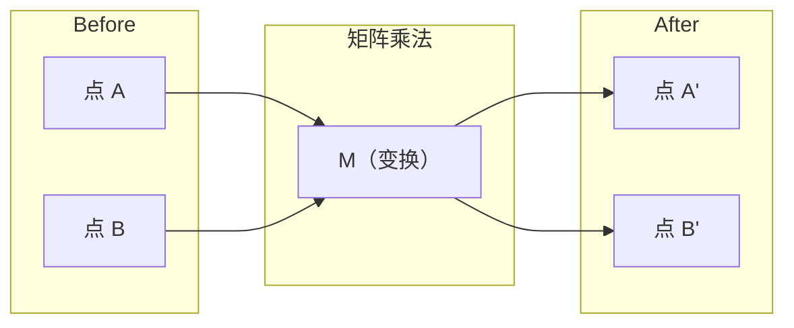
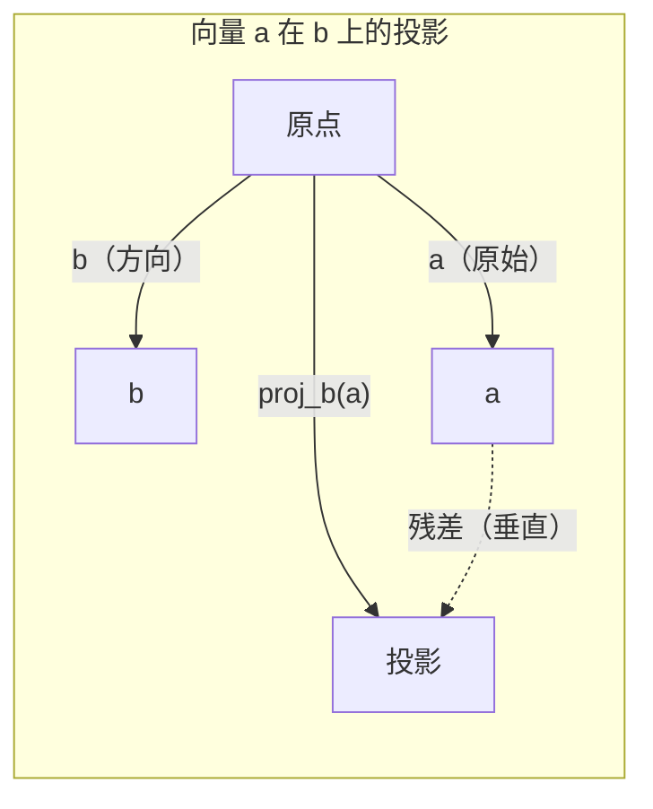

> 所有 AI 模型本质上就是矩阵运算穿了件花衣服。

## 学习目标

- 用 Python 从零实现向量和矩阵运算（加法、点积、矩阵乘法）
- 从几何角度理解点积、投影、Gram-Schmidt 过程在做什么
- 用行化简判断线性无关、秩和基
- 把线性代数概念跟 AI 应用联系起来：embedding、attention score、LoRA

## 为什么要学这个

打开任何一篇 ML 论文，第一页就会看到向量、矩阵、点积、变换。如果没有线性代数的直觉，这些就是一堆看不懂的符号。有了直觉之后，你能看到神经网络到底在做什么——**在空间里移动点**。

你不需要成为数学家。你需要的是理解这些运算在几何上的含义，然后自己写一遍代码。

## 核心概念

### 向量 = 空间中的点（也是方向）

向量就是一串数字。但这些数字有含义——它们是空间中的坐标。

**二维向量 [3, 2]：**

| x | y | 含义 |
|---|---|------|
| 3 | 2 | 从原点 (0,0) 指向 (3, 2) 的箭头 |

这个向量的长度是 sqrt(3² + 2²) = sqrt(13)，方向是右上方。

在 AI 里，向量用来表示一切：
- 一个词 → 768 个数字的向量（它在 embedding 空间里的"含义"）
- 一张图 → 几百万像素值组成的向量
- 一个用户 → 一组偏好数值

### 矩阵 = 变换

矩阵把一个向量变成另一个向量。它可以旋转、缩放、拉伸、投影。



在 AI 里，矩阵**就是**模型：
- 神经网络的权重 → 把输入变换成输出的矩阵
- Attention 分数 → 决定关注什么的矩阵
- Embedding → 把词映射成向量的矩阵

### 点积衡量相似度

两个向量的点积告诉你它们有多相似。

```
a · b = a₁×b₁ + a₂×b₂ + ... + aₙ×bₙ

同方向：      a · b > 0（相似）
垂直：        a · b = 0（无关）
反方向：      a · b < 0（相反）
```

搜索引擎、推荐系统、RAG 就是这么工作的——找到点积最大的那些向量。

### 线性无关

一组向量线性无关 = 其中没有任何一个能被其他向量组合出来。

如果 v1、v2、v3 线性无关，它们撑起一个三维空间。如果有一个能被其余的组合出来，它们只能撑起一个平面。

**这对 AI 意味着什么？** 你的特征矩阵应该有线性无关的列。如果两个特征完美相关（线性相关），模型就无法区分它们各自的贡献。这会导致回归中的多重共线性——权重矩阵变得不稳定，输入微小的变化就会让输出剧烈波动。

**具体例子：**

```
v1 = [1, 0, 0]
v2 = [0, 1, 0]
v3 = [2, 1, 0]   # v3 = 2*v1 + v2
```

v1 和 v2 是独立的——谁也不能写成另一个的倍数或组合。但 v3 = 2×v1 + v2，所以 {v1, v2, v3} 是线性相关的。这三个向量都躺在 xy 平面里，无论怎么组合都够不到 [0, 0, 1]。你有三个向量，但只有两个维度的自由。

换成数据集的语言：如果 feature_3 = 2×feature_1 + feature_2，那加入 feature_3 给模型带来的新信息是零。更糟的是，它会让正规方程变成奇异的——权重没有唯一解。

### 基和秩

**基（Basis）**是能撑起整个空间的最小一组线性无关向量。基向量的个数就是空间的维度。

三维空间的标准基是 {[1,0,0], [0,1,0], [0,0,1]}。但任何三个线性无关的三维向量都能组成一组有效的基。选择不同的基就是选择不同的坐标系。

**秩（Rank）**= 矩阵线性无关列的数量 = 线性无关行的数量。如果秩 < min(行数, 列数)，矩阵就是秩亏的（rank-deficient）。这意味着：
- 方程组有无穷多解（或无解）
- 变换过程中丢失了信息
- 矩阵不可逆

| 情况 | 秩 | 对 ML 的意义 |
|------|-----|-------------|
| 满秩（rank = min(m, n)） | 最大值 | 最小二乘有唯一解，模型状态良好 |
| 秩亏（rank < min(m, n)） | 低于最大 | 特征冗余，权重有无穷多解，需要正则化 |
| 秩为 1 | 1 | 每一列都是同一个向量的缩放，所有数据都在一条直线上 |
| 接近秩亏（有很小的奇异值） | 数值上很低 | 矩阵病态，微小噪声导致巨大输出变化，需要 SVD 截断或 ridge 回归 |

### 投影

把向量 **a** 投影到向量 **b** 上，得到 **a** 在 **b** 方向上的分量：

```
proj_b(a) = (a · b / b · b) × b
```

残差 (a - proj_b(a)) 与 b 垂直。这个正交分解是最小二乘拟合的基础。

投影在 ML 里无处不在：
- 线性回归：最小化观测值到列空间的距离——解本身就是一个投影
- PCA：把数据投影到方差最大的方向上
- Transformer 的 Attention：计算 query 在 key 上的投影



**例子：** a = [3, 4]，b = [1, 0]

proj_b(a) = (3×1 + 4×0) / (1×1 + 0×0) × [1, 0] = 3 × [1, 0] = [3, 0]

投影把 y 分量丢掉了。这就是最简单的降维——扔掉你不关心的方向。

### Gram-Schmidt 过程

把任意一组线性无关的向量变成**正交归一基**（orthonormal basis）。正交归一 = 每个向量长度为 1 + 每对向量互相垂直。

算法：
1. 取第一个向量，归一化
2. 取第二个向量，减去它在第一个上的投影，归一化
3. 取第三个向量，减去它在所有前面向量上的投影，归一化
4. 对剩余向量重复

```
输入：v1, v2, v3, ...（线性无关）

u1 = v1 / |v1|

w2 = v2 - (v2 · u1) × u1
u2 = w2 / |w2|

w3 = v3 - (v3 · u1) × u1 - (v3 · u2) × u2
u3 = w3 / |w3|

输出：u1, u2, u3, ...（正交归一基）
```

这就是 QR 分解内部的工作方式。Q 是正交归一基，R 记录投影系数。QR 分解用在：
- 解线性方程组（比高斯消元更稳定）
- 计算特征值（QR 算法）
- 最小二乘回归（标准的数值方法）

## 从零实现

### 第一步：手写向量类（Python）

```python
class Vector:
    def __init__(self, components):
        self.components = list(components)
        self.dim = len(self.components)

    def __add__(self, other):
        return Vector([a + b for a, b in zip(self.components, other.components)])

    def __sub__(self, other):
        return Vector([a - b for a, b in zip(self.components, other.components)])

    def dot(self, other):
        return sum(a * b for a, b in zip(self.components, other.components))

    def magnitude(self):
        return sum(x**2 for x in self.components) ** 0.5

    def normalize(self):
        mag = self.magnitude()
        return Vector([x / mag for x in self.components])

    def cosine_similarity(self, other):
        return self.dot(other) / (self.magnitude() * other.magnitude())

    def __repr__(self):
        return f"Vector({self.components})"


a = Vector([1, 2, 3])
b = Vector([4, 5, 6])

print(f"a + b = {a + b}")
print(f"a · b = {a.dot(b)}")
print(f"|a| = {a.magnitude():.4f}")
print(f"cosine similarity = {a.cosine_similarity(b):.4f}")
```

### 第二步：手写矩阵类（Python）

```python
class Matrix:
    def __init__(self, rows):
        self.rows = [list(row) for row in rows]
        self.shape = (len(self.rows), len(self.rows[0]))

    def __matmul__(self, other):
        if isinstance(other, Vector):
            return Vector([
                sum(self.rows[i][j] * other.components[j] for j in range(self.shape[1]))
                for i in range(self.shape[0])
            ])
        rows = []
        for i in range(self.shape[0]):
            row = []
            for j in range(other.shape[1]):
                row.append(sum(
                    self.rows[i][k] * other.rows[k][j]
                    for k in range(self.shape[1])
                ))
            rows.append(row)
        return Matrix(rows)

    def transpose(self):
        return Matrix([
            [self.rows[j][i] for j in range(self.shape[0])]
            for i in range(self.shape[1])
        ])

    def __repr__(self):
        return f"Matrix({self.rows})"


# 旋转 90 度的变换矩阵
rotation_90 = Matrix([[0, -1], [1, 0]])
point = Vector([3, 1])

rotated = rotation_90 @ point
print(f"原始点: {point}")
print(f"旋转 90° 后: {rotated}")
```

### 第三步：这跟 AI 有什么关系

```python
import random

random.seed(42)
# 一个 2×3 的权重矩阵，就是神经网络的一层
weights = Matrix([[random.gauss(0, 0.1) for _ in range(3)] for _ in range(2)])
input_vector = Vector([1.0, 0.5, -0.3])

output = weights @ input_vector
print(f"输入 (3D): {input_vector}")
print(f"输出 (2D): {output}")
print("这就是神经网络的一层在做的事——矩阵乘法。")
```

### 第四步：Julia 版本

```julia
a = [1.0, 2.0, 3.0]
b = [4.0, 5.0, 6.0]

println("a + b = ", a + b)
println("a · b = ", a ⋅ b)       # Julia 支持 unicode 运算符
println("|a| = ", √(a ⋅ a))
println("cosine = ", (a ⋅ b) / (√(a ⋅ a) * √(b ⋅ b)))

# 矩阵-向量乘法
W = [0.1 -0.2 0.3; 0.4 0.5 -0.1]
x = [1.0, 0.5, -0.3]
println("Wx = ", W * x)
println("这就是神经网络的一层。")
```

### 第五步：线性无关与投影（Python）

```python
def is_linearly_independent(vectors):
    """通过行化简判断一组向量是否线性无关"""
    n = len(vectors)
    dim = len(vectors[0].components)
    rows = [v.components[:] for v in vectors]
    rank = 0
    for col in range(dim):
        pivot = None
        for row in range(rank, len(rows)):
            if abs(rows[row][col]) > 1e-10:
                pivot = row
                break
        if pivot is None:
            continue
        rows[rank], rows[pivot] = rows[pivot], rows[rank]
        scale = rows[rank][col]
        rows[rank] = [x / scale for x in rows[rank]]
        for row in range(len(rows)):
            if row != rank and abs(rows[row][col]) > 1e-10:
                factor = rows[row][col]
                rows[row] = [rows[row][j] - factor * rows[rank][j] for j in range(dim)]
        rank += 1
    return rank == n


def project(a, b):
    """把向量 a 投影到向量 b 上"""
    scalar = a.dot(b) / b.dot(b)
    return Vector([scalar * x for x in b.components])


def gram_schmidt(vectors):
    """Gram-Schmidt 正交化"""
    orthonormal = []
    for v in vectors:
        w = v
        for u in orthonormal:
            proj = project(w, u)
            w = w - proj
        if w.magnitude() < 1e-10:
            continue
        orthonormal.append(w.normalize())
    return orthonormal


v1 = Vector([1, 0, 0])
v2 = Vector([1, 1, 0])
v3 = Vector([1, 1, 1])
basis = gram_schmidt([v1, v2, v3])
for i, u in enumerate(basis):
    print(f"u{i+1} = {u}")
    print(f"  |u{i+1}| = {u.magnitude():.6f}")

# 验证正交性
print(f"u1 · u2 = {basis[0].dot(basis[1]):.6f}")
print(f"u1 · u3 = {basis[0].dot(basis[2]):.6f}")
print(f"u2 · u3 = {basis[1].dot(basis[2]):.6f}")
```

## 用库做同样的事

写完之后，用 NumPy 一行搞定——但你已经知道底层在发生什么了：

```python
import numpy as np

a = np.array([1, 2, 3], dtype=float)
b = np.array([4, 5, 6], dtype=float)

print(f"a + b = {a + b}")
print(f"a · b = {np.dot(a, b)}")
print(f"|a| = {np.linalg.norm(a):.4f}")
print(f"cosine = {np.dot(a, b) / (np.linalg.norm(a) * np.linalg.norm(b)):.4f}")

# 神经网络的一层
W = np.random.randn(2, 3) * 0.1
x = np.array([1.0, 0.5, -0.3])
print(f"Wx = {W @ x}")
```

### 秩、投影、QR 分解

```python
import numpy as np

# 秩
A = np.array([[1, 2], [2, 4]])
print(f"秩: {np.linalg.matrix_rank(A)}")  # 1，因为第二行是第一行的 2 倍

# 投影
a = np.array([3, 4])
b = np.array([1, 0])
proj = (np.dot(a, b) / np.dot(b, b)) * b
print(f"{a} 在 {b} 上的投影: {proj}")

# QR 分解
Q, R = np.linalg.qr(np.random.randn(3, 3))
print(f"Q 是正交矩阵: {np.allclose(Q @ Q.T, np.eye(3))}")
print(f"R 是上三角矩阵: {np.allclose(R, np.triu(R))}")
```

### PyTorch —— 带自动求导的向量

```python
import torch

x = torch.randn(3, requires_grad=True)
y = torch.tensor([1.0, 0.0, 0.0])

similarity = torch.dot(x, y)
similarity.backward()

print(f"x = {x.data}")
print(f"y = {y.data}")
print(f"点积 = {similarity.item():.4f}")
print(f"d(点积)/dx = {x.grad}")  # 点积对 x 的梯度就是 y
```

点积对 x 的梯度就是 y。PyTorch 自动算出来了。神经网络里的每一个操作都是由这些基本运算构成的——矩阵乘法、点积、投影——而自动求导会跟踪所有梯度。

## 各概念在 AI 中的对应

| 概念 | 在 AI 哪里出现 |
|------|---------------|
| 点积 | Transformer 的 attention score，RAG 的余弦相似度 |
| 矩阵乘法 | 每一层神经网络，每一个线性变换 |
| 线性无关 | 特征选择，避免多重共线性 |
| 秩 | 判断方程是否可解，LoRA（低秩适配） |
| 投影 | 线性回归（投影到列空间），PCA |
| Gram-Schmidt / QR | 数值求解器，特征值计算 |
| 正交归一基 | 稳定的数值计算，白化变换 |

**LoRA 值得单独说一下。** 它通过把权重更新分解成低秩矩阵来微调大语言模型。不是更新一个 4096×4096 的权重矩阵（1600 万参数），而是更新两个矩阵：4096×16 和 16×4096（总共 13.1 万参数）。秩为 16 意味着 LoRA 假设权重更新只住在完整 4096 维空间中的一个 16 维子空间里。这就是线性代数在实际干活。

## 练习

1. 实现 `Vector.angle_between(other)`，返回两个向量之间的夹角（度数）
2. 创建一个 2D 缩放矩阵（x 方向放大 2 倍，y 方向放大 3 倍），然后作用于向量 [1, 1]
3. 随机生成 5 个 50 维的"类词向量"，用余弦相似度找出最相似的一对
4. 验证 Gram-Schmidt 的输出确实是正交归一的：检查每对点积为 0，每个向量长度为 1
5. 构造一个秩为 2 的 3×3 矩阵，用代码验证秩，然后解释列向量张成了什么几何体
6. 把向量 [1, 2, 3] 投影到 [1, 1, 1] 上，结果在几何上代表什么？

## 术语表

| 术语 | 通俗说法 | 真正含义 |
|------|---------|---------|
| Vector（向量） | "一个箭头" | 一串数字，表示 n 维空间中的一个点或方向 |
| Matrix（矩阵） | "一张数字表" | 一个变换，把向量从一个空间映射到另一个空间 |
| Dot product（点积） | "乘起来加一加" | 衡量两个向量有多对齐——相似度搜索的核心 |
| Embedding | "AI 的某种魔法" | 把某个东西（词、图片、用户）的含义表示成一个向量 |
| Linear independence（线性无关） | "它们不重叠" | 集合中没有任何一个向量能被其他向量组合出来 |
| Rank（秩） | "有几个维度" | 矩阵中线性无关的列（或行）的数量 |
| Projection（投影） | "影子" | 一个向量在另一个方向上的分量 |
| Basis（基） | "坐标轴" | 能撑起整个空间的最小一组独立向量 |
| Orthonormal（正交归一） | "互相垂直的单位向量" | 向量两两垂直，且每个长度为 1 |

---

## 自测题

:::quiz
question: 两个向量的点积衡量的是什么？
options:
  - 两个向量之间的距离
  - 两个向量有多相似/对齐
  - 两个向量之间的夹角（度数）
  - 两个向量共有的维度数量
correct: 1
explanation: 点积衡量对齐程度：正值表示同方向（相似），零表示垂直（无关），负值表示反方向（相反）。这就是 AI 中相似度搜索的基础。
:::

:::quiz
question: 在 AI 中，"embedding"指的是什么？
options:
  - 把一个模型嵌入到另一个模型里
  - 用一个向量来表示某个东西（词、图片、用户）的含义
  - 一种压缩模型权重的技术
  - 把代码编译成机器指令的过程
correct: 1
explanation: Embedding 把离散对象（词、图片、用户）映射为高维空间中的连续向量，相似的东西在空间中距离相近。它是现实概念和数学运算之间的桥梁。
:::

:::quiz
question: 给定三个向量 v1=[1,0,0], v2=[0,1,0], v3=[2,1,0]，它们线性无关吗？
options:
  - 是的，因为三维空间里有三个向量
  - 不是，因为 v3 = 2×v1 + v2，v3 是其他向量的线性组合
  - 是的，因为没有两个向量完全相同
  - 不是，因为它们都有一个分量是零
correct: 1
explanation: v3 = 2×v1 + v2，所以这组向量线性相关。三个向量都在 xy 平面内，无法到达 [0,0,1]。虽然有 3 个向量在三维空间中，但它们只张成一个二维子空间。
:::

:::quiz
question: 在机器学习中，矩阵的秩告诉你什么？
options:
  - 矩阵乘法的速度有多快
  - 线性无关列的数量，即包含多少维度的有效信息
  - 矩阵中的最大值
  - 矩阵中非零元素的数量
correct: 1
explanation: 秩 = 线性无关列的数量。在 ML 中，特征矩阵秩亏意味着特征冗余、权重有无穷多解、需要正则化。
:::

:::quiz
question: LoRA（低秩适配）如何利用线性代数来高效微调大语言模型？
options:
  - 删除权重矩阵中不用的行来缩小模型
  - 把权重更新分解成两个小的低秩矩阵，而不是更新整个权重矩阵
  - 把所有权重从 float32 转成 int8
  - 冻结 embedding 层，只训练输出层
correct: 1
explanation: LoRA 把一个 4096×4096 的权重更新分解成两个矩阵：4096×16 和 16×4096（秩为 16），把可训练参数从 1600 万降到 13.1 万，前提假设是更新只存在于一个低维子空间中。
:::
