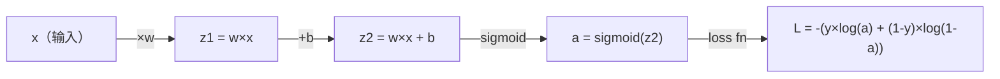
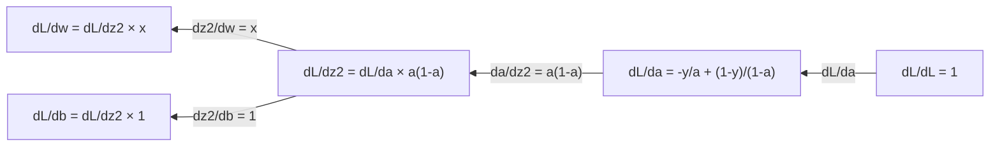
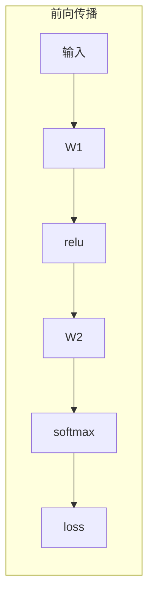
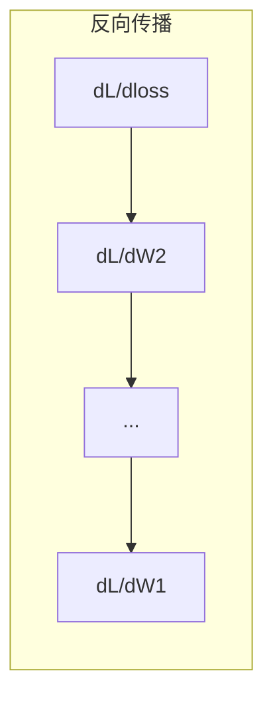

> 导数告诉你哪个方向是下坡。神经网络学习只需要这一件事。

## 学习目标

- 对常见 ML 函数（x²、sigmoid、交叉熵）计算数值和解析导数
- 从零实现梯度下降，在一维和二维上最小化损失函数
- 推导线性回归模型的梯度，通过手动更新权重来训练它
- 理解 Hessian 矩阵、Taylor 级数近似和它们与优化方法的联系

## 为什么要学这个

你有一个几百万权重的神经网络。每个权重是一个旋钮。你需要搞清楚每个旋钮该往哪个方向转，才能让模型少犯一点错。微积分给你的就是这个方向。

没有微积分，训练神经网络就是瞎试随机改动碰运气。有了导数，你精确地知道每个权重如何影响误差。每个旋钮每次都往对的方向转。

## 核心概念

### 什么是导数？

导数衡量变化的速率。对于函数 y = f(x)，导数 f'(x) 告诉你：如果把 x 轻轻推一下，y 会变多少？

几何上，导数就是切线的斜率。

**f(x) = x²：**

| x | f(x) | f'(x)（斜率） |
|---|------|--------------|
| 0 | 0    | 0（平的，在底部） |
| 1 | 1    | 2 |
| 2 | 4    | 4 |
| 3 | 9    | 6 |

在 x=2，斜率是 4。把 x 往右推一点点，y 大概增加 4 倍那个量。在 x=0，斜率是 0——你在碗底。

形式化定义：

```
f'(x) = lim   f(x + h) - f(x)
        h→0   ─────────────────
                     h
```

写代码时不用真的取极限，用一个很小的 h 近似就行，这就是数值导数。

### 偏导数：一次只动一个变量

实际的函数有很多输入。神经网络的 loss 依赖成千上万个权重。偏导数就是把其他变量全当常数，只对一个变量求导。

```
f(x, y) = x² + 3xy + y²

∂f/∂x = 2x + 3y    （把 y 当常数）
∂f/∂y = 3x + 2y    （把 x 当常数）
```

每个偏导数回答的问题是：如果我只动这一个权重，loss 会怎么变？

### 梯度：所有偏导数打包成向量

梯度把每个偏导数收集成一个向量。对于函数 f(x, y, z)，梯度是：

```
∇f = [ ∂f/∂x, ∂f/∂y, ∂f/∂z ]
```

梯度指向函数增长最快的方向。要最小化函数，就往反方向走。

**f(x,y) = x² + y² 的等高线图：**

函数是碗形，等高线是同心圆，最小值在 (0, 0)。

| 点 | ∇f | -∇f（下降方向） |
|----|-----|----------------|
| (1, 1) | [2, 2]（指向上坡，远离最小值） | [-2, -2]（指向下坡，朝向最小值） |
| (0, 0) | [0, 0]（平的，在最小值处） | [0, 0] |

这就是梯度下降的图示。算出梯度，取反，走一步。

### 跟优化的关系

训练神经网络就是优化。你有一个损失函数 L(w1, w2, ..., wn) 衡量模型有多错，你要把它最小化。

```
梯度下降更新规则：

  w_new = w_old - learning_rate × ∂L/∂w

对每个权重：
  1. 计算 loss 对这个权重的偏导数
  2. 从权重中减去它的一个小倍数
  3. 重复
```

学习率控制步长。太大会跳过去，太小会爬得太慢。

### 数值导数 vs 解析导数

两种方式计算导数。

**解析导数**：手动套微积分法则。f(x) = x² 的导数是 f'(x) = 2x。精确、快速。

**数值导数**：用定义来近似。算 f(x+h) 和 f(x-h)，然后用差分。

```
数值导数（中心差分）：

f'(x) ≈ f(x + h) - f(x - h)
         ─────────────────────
                 2h

h = 0.0001 实际中效果很好
```

数值导数慢但对任何函数都管用。解析导数快但你得推公式。神经网络框架用第三种方法：**自动微分**，机械地计算精确导数。Phase 3 会详细讲。

### 常见 ML 函数的导数

这些导数你会反复遇到：

```
函数              导数                用在哪
───────           ──────              ─────
f(x) = x²        f'(x) = 2x         损失函数（MSE）
f(x) = wx + b    f'(w) = x           线性层（对权重的梯度）
                  f'(b) = 1           线性层（对 bias 的梯度）
                  f'(x) = w           线性层（对输入的梯度）
f(x) = eˣ        f'(x) = eˣ         Softmax, attention
f(x) = ln(x)     f'(x) = 1/x        交叉熵 loss
f(x) = sigmoid   f'(x) = f(x)(1-f(x))   Sigmoid 激活函数
```

### 链式法则

当函数嵌套时，链式法则告诉你怎么求导。

```
如果 y = f(g(x))，则 dy/dx = f'(g(x)) × g'(x)

例子：y = (3x + 1)²
  外层：f(u) = u²       f'(u) = 2u
  内层：g(x) = 3x + 1    g'(x) = 3
  dy/dx = 2(3x + 1) × 3 = 6(3x + 1)
```

神经网络就是函数的链条：输入 → 线性 → 激活 → 线性 → 激活 → loss。反向传播就是链式法则从输出到输入反复应用。整个算法就是这样。

### Hessian 矩阵

梯度告诉你斜率。Hessian 告诉你**曲率**。

Hessian 是二阶偏导数组成的矩阵。对于函数 f(x1, x2, ..., xn)，Hessian 的第 (i, j) 项是：

```
H[i][j] = ∂²f / (∂xᵢ × ∂xⱼ)
```

**在临界点（梯度为零的地方），Hessian 告诉你那是什么：**

| Hessian 性质 | 含义 | 曲面形状 |
|-------------|------|---------|
| 正定（所有特征值 > 0） | 局部最小值 | 碗口朝上 |
| 负定（所有特征值 < 0） | 局部最大值 | 碗口朝下 |
| 不定（特征值有正有负） | 鞍点 | 马鞍形 |

**例子：** f(x, y) = x² - y²（鞍面）

```
H = | 2   0 |
    | 0  -2 |

特征值：2 和 -2（一正一负）→ 鞍点
```

对比 f(x, y) = x² + y²（碗面）：

```
H = | 2  0 |
    | 0  2 |

特征值：2 和 2（都是正的）→ 局部最小值
```

**Hessian 对 ML 的意义：**

Newton 法用 Hessian 来走比梯度下降更好的一步。它不只跟着斜率走，还考虑曲率：

```
Newton 更新：    w_new = w_old - H⁻¹ × gradient
梯度下降：      w_new = w_old - lr × gradient
```

问题是：N 个参数的网络，Hessian 是 N×N 的。一百万参数的模型需要一万亿个元素的矩阵，不可能算。所以实际中用近似方法。

| 方法 | 用了什么 | 每步代价 | 收敛速度 |
|------|---------|---------|---------|
| 梯度下降 | 只用一阶导数 | O(N) | 慢（线性） |
| Newton 法 | 完整 Hessian | O(N³) | 快（二次） |
| Adam | 每参数自适应学习率（对角 Hessian 近似） | O(N) | 中等 |

实际深度学习默认用 Adam。它通过跟踪每个参数梯度的均值和方差，廉价地近似了二阶信息。

### Taylor 级数近似

任何光滑函数都可以在某一点附近用多项式近似：

```
f(x + h) = f(x) + f'(x)×h + (1/2)×f''(x)×h² + ...
```

项越多越准——但只在 x 附近有效。

**Taylor 级数跟 ML 的关系：**

- **一阶 Taylor = 梯度下降。** 用 f(x + h) ≈ f(x) + f'(x)×h，你做的是线性近似。梯度下降就是最小化这个线性模型来选择步长。
- **二阶 Taylor = Newton 法。** 加上二阶项后得到二次模型，最小化它给出 Newton 步。
- **Loss 函数设计。** MSE 和交叉熵都是光滑的，它们的 Taylor 展开行为良好——这不是巧合，光滑的 loss 让优化可预测。

核心 insight：所有基于梯度的优化，本质上都是在**局部近似损失函数**，然后走到那个近似的最小值处。

### 计算图中的多变量链式法则

链式法则不只适用于一条直线上的标量函数。在神经网络中，变量会分叉和汇合。下面是一个简单前向传播中导数的流动方式：



反向传播从右到左计算梯度：



每条箭头乘以局部导数。任何参数的梯度 = 从 loss 到该参数路径上所有局部导数的乘积。当路径分叉汇合时，贡献相加（多变量链式法则）。

这就是反向传播的全部：链式法则在计算图中从输出到输入系统地应用。

### 为什么这对神经网络重要

神经网络的每个权重都有一个梯度。梯度告诉你怎么调整这个权重来减少 loss。





每次权重更新：
- `W1 = W1 - lr × dL/dW1`
- `W2 = W2 - lr × dL/dW2`

前向传播算预测和 loss。反向传播算 loss 对每个权重的梯度。然后每个权重往下坡方向走一小步。重复几百万次。这就是深度学习。

## 从零实现

### 第一步：数值导数

```python
def numerical_derivative(f, x, h=1e-7):
    """中心差分法计算导数"""
    return (f(x + h) - f(x - h)) / (2 * h)

def f(x):
    return x ** 2

for x in [-2, -1, 0, 1, 2]:
    numerical = numerical_derivative(f, x)
    analytical = 2 * x  # 手算的解析解
    print(f"x={x:2d}  数值={numerical:.6f}  解析={analytical:.1f}")
```

数值导数和解析导数的结果精确到很多位小数。

### 第二步：偏导数和梯度

```python
def numerical_gradient(f, point, h=1e-7):
    """对多变量函数计算梯度向量"""
    gradient = []
    for i in range(len(point)):
        point_plus = list(point)
        point_minus = list(point)
        point_plus[i] += h
        point_minus[i] -= h
        partial = (f(point_plus) - f(point_minus)) / (2 * h)
        gradient.append(partial)
    return gradient

def f_multi(point):
    x, y = point
    return x**2 + 3*x*y + y**2

grad = numerical_gradient(f_multi, [1.0, 2.0])
print(f"数值梯度 at (1,2): {[f'{g:.4f}' for g in grad]}")
print(f"解析梯度 at (1,2): [2×1+3×2, 3×1+2×2] = [{2*1+3*2}, {3*1+2*2}]")
```

### 第三步：梯度下降最小化 f(x) = x²

```python
x = 5.0       # 起点
lr = 0.1      # 学习率
for step in range(20):
    grad = 2 * x                 # 解析梯度
    x = x - lr * grad           # 更新
    print(f"step {step:2d}  x={x:8.4f}  f(x)={x**2:10.6f}")
```

从 x=5 出发，每一步都更接近 x=0（最小值）。

### 第四步：二维梯度下降

```python
def f_2d(point):
    x, y = point
    return x**2 + y**2

point = [4.0, 3.0]
lr = 0.1
for step in range(30):
    grad = numerical_gradient(f_2d, point)
    point = [p - lr * g for p, g in zip(point, grad)]
    loss = f_2d(point)
    if step % 5 == 0 or step == 29:
        print(f"step {step:2d}  point=({point[0]:7.4f}, {point[1]:7.4f})  f={loss:.6f}")
```

### 第五步：数值计算 Hessian

```python
def hessian_2d(f, x, y, h=1e-5):
    """数值计算二维函数的 Hessian 矩阵"""
    fxx = (f(x + h, y) - 2 * f(x, y) + f(x - h, y)) / (h ** 2)
    fyy = (f(x, y + h) - 2 * f(x, y) + f(x, y - h)) / (h ** 2)
    fxy = (f(x+h, y+h) - f(x+h, y-h) - f(x-h, y+h) + f(x-h, y-h)) / (4*h**2)
    return [[fxx, fxy], [fxy, fyy]]

def saddle(x, y): return x**2 - y**2
def bowl(x, y): return x**2 + y**2

H_saddle = hessian_2d(saddle, 0.0, 0.0)
H_bowl = hessian_2d(bowl, 0.0, 0.0)
print(f"鞍面 Hessian: {H_saddle}")  # [[2, 0], [0, -2]] 正负混合
print(f"碗面 Hessian: {H_bowl}")    # [[2, 0], [0, 2]]  全正
```

### 第六步：Taylor 近似实战

```python
import math

def taylor_approx(f, f_prime, f_double_prime, x0, h, order=2):
    result = f(x0)
    if order >= 1:
        result += f_prime(x0) * h
    if order >= 2:
        result += 0.5 * f_double_prime(x0) * h ** 2
    return result

x0 = 0.0
for h in [0.1, 0.5, 1.0, 2.0]:
    true_val = math.sin(h)
    t1 = taylor_approx(math.sin, math.cos, lambda x: -math.sin(x), x0, h, order=1)
    t2 = taylor_approx(math.sin, math.cos, lambda x: -math.sin(x), x0, h, order=2)
    print(f"h={h:.1f}  sin(h)={true_val:.4f}  一阶={t1:.4f}  二阶={t2:.4f}")
```

在 x0=0 附近，sin(x) ≈ x（一阶 Taylor）。h 小时近似很好，h 大时就不行了。这就是为什么梯度下降用小学习率效果好——每一步都假设线性近似是准确的。

### 第七步：训练一个线性回归

```python
import random

random.seed(42)

w = random.gauss(0, 1)
b = random.gauss(0, 1)
lr = 0.01

# 数据：y = 2x + 1
xs = [1.0, 2.0, 3.0, 4.0, 5.0]
ys = [3.0, 5.0, 7.0, 9.0, 11.0]

for epoch in range(200):
    total_loss = 0
    dw = 0
    db = 0
    for x, y in zip(xs, ys):
        pred = w * x + b
        error = pred - y
        total_loss += error ** 2
        dw += 2 * error * x      # ∂L/∂w
        db += 2 * error          # ∂L/∂b
    dw /= len(xs)
    db /= len(xs)
    total_loss /= len(xs)
    w -= lr * dw
    b -= lr * db
    if epoch % 40 == 0 or epoch == 199:
        print(f"epoch {epoch:3d}  w={w:.4f}  b={b:.4f}  loss={total_loss:.6f}")

print(f"\n学到的: y = {w:.2f}x + {b:.2f}")
print(f"真实的: y = 2x + 1")
```

每个基于梯度的训练循环都是这个模式：预测 → 算 loss → 算梯度 → 更新权重。

## 用库做同样的事

```python
import numpy as np

x = np.array([1, 2, 3, 4, 5], dtype=float)
y = np.array([3, 5, 7, 9, 11], dtype=float)

w, b = np.random.randn(), np.random.randn()
lr = 0.01

for epoch in range(200):
    pred = w * x + b
    error = pred - y
    loss = np.mean(error ** 2)
    dw = np.mean(2 * error * x)
    db = np.mean(2 * error)
    w -= lr * dw
    b -= lr * db

print(f"学到的: y = {w:.2f}x + {b:.2f}")
```

你刚从零写了梯度下降。PyTorch 自动化了梯度计算部分，但更新循环是一模一样的。

## 练习

1. 实现 `numerical_second_derivative(f, x)`，验证 x³ 在 x=2 的二阶导数是 12
2. 用梯度下降找 f(x, y) = (x - 3)² + (y + 1)² 的最小值。从 (0, 0) 出发，答案应收敛到 (3, -1)
3. 给梯度下降加动量（momentum）：维护一个速度向量来积累过去的梯度。在 f(x) = x⁴ - 3x² 上比较有无动量的收敛速度

## 术语表

| 术语 | 通俗说法 | 真正含义 |
|------|---------|---------|
| Derivative（导数） | "斜率" | 函数在某点的变化率。告诉你输入变一点，输出变多少。 |
| Partial derivative（偏导数） | "只对一个变量求导" | 固定其他变量不动，只对一个变量求导。 |
| Gradient（梯度） | "最陡上坡方向" | 所有偏导数组成的向量。指向函数增长最快的方向。 |
| Gradient descent（梯度下降） | "往下坡走" | 从参数中减去梯度（乘以学习率）来减少 loss。神经网络训练的核心。 |
| Learning rate（学习率） | "步长" | 控制每步走多大。太大会发散，太小收敛慢。 |
| Chain rule（链式法则） | "导数乘起来" | 复合函数求导法则：df/dx = df/dg × dg/dx。反向传播的数学基础。 |
| Hessian | "二阶导数矩阵" | 所有二阶偏导数组成的矩阵。描述函数的曲率。在临界点处正定意味着局部最小值。 |
| Taylor series（Taylor 级数） | "多项式近似" | 用导数在某点附近近似函数。理解梯度下降和 Newton 法为什么有效的基础。 |
| Backpropagation（反向传播） | "反向自动求导" | 用链式法则从输出到输入逐层计算梯度。神经网络学习的方式。 |

---

## 自测题

:::quiz
question: 函数在某点的导数告诉你什么？
options:
  - 函数在该点的值
  - 函数在该点的变化率（斜率）
  - 函数到该点的面积
  - 函数能达到的最大值
correct: 1
explanation: 导数 f'(x) 衡量输入变一个单位时输出变多少。几何上就是该点切线的斜率。
:::

:::quiz
question: 在机器学习中，梯度是什么？
options:
  - 模型准确度的度量
  - 所有偏导数组成的向量，指向最陡上升方向
  - 训练时用的学习率
  - 预测值和真实值的差
correct: 1
explanation: 梯度收集了每个偏导数组成一个向量，指向函数增长最快的方向。要最小化 loss，往梯度的反方向走。
:::

:::quiz
question: 梯度下降更新规则 'w = w - lr × ∂L/∂w' 做了什么？
options:
  - 增加 loss 来测试模型鲁棒性
  - 把每个权重往减少 loss 的方向调整，幅度由学习率控制
  - 把权重重置为初始值减梯度
  - 把权重归一化到长度为 1
correct: 1
explanation: ∂L/∂w 告诉你哪个方向会增加 loss。减去它（乘以学习率）就是往减少 loss 的方向移动权重。对模型中的每个权重都这样做。
:::

:::quiz
question: 为什么 Newton 法（用 Hessian 矩阵）不能直接用于百万参数的神经网络？
options:
  - Newton 法只对凸函数有效
  - Hessian 是 N×N 矩阵，需要 O(N²) 存储和 O(N³) 计算，对百万参数来说不可行
  - Newton 法需要解析导数，神经网络算不出来
  - Newton 法对深层网络收敛太慢
correct: 1
explanation: N=100 万参数时，Hessian 有 1 万亿个元素。计算和求逆都不可能。所以实际中用一阶方法（SGD、Adam），它们廉价地近似了二阶信息。
:::

:::quiz
question: 数值导数的中心差分公式是什么？
options:
  - f(x+h) / h
  - (f(x+h) - f(x)) / h
  - (f(x+h) - f(x-h)) / (2×h)
  - f(x) × h
correct: 2
explanation: 中心差分 (f(x+h) - f(x-h)) / (2h) 比前向差分更精确，因为它平均了 x 两侧的斜率，消除了主要误差项。
:::
