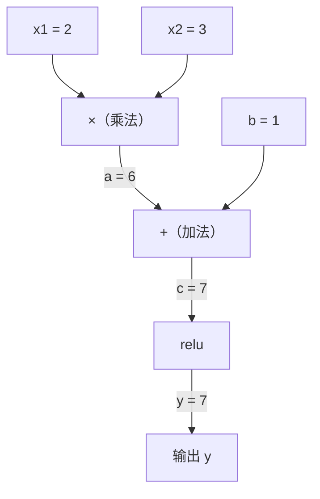
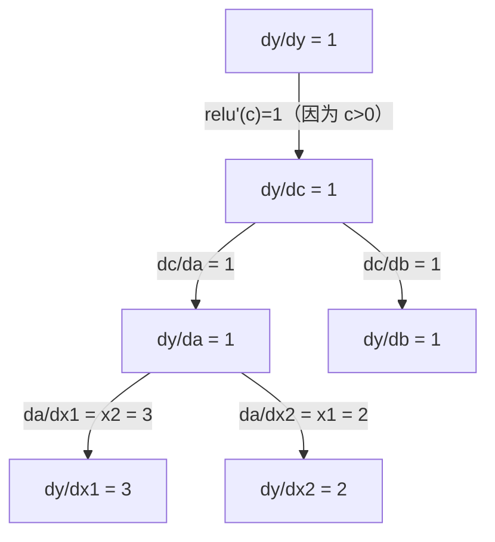

> 链式法则是每个能学习的神经网络背后的引擎。

## 学习目标

- 从零构建一个最小 autograd 引擎（Value 类），记录操作并通过反向模式自动微分计算梯度
- 用拓扑排序实现计算图的前向和反向传播
- 只用手写的 autograd 引擎构建并训练一个多层感知机解决 XOR 问题
- 用数值差分做梯度检查，验证 autodiff 的正确性

## 为什么要学这个

你已经会算简单函数的导数了。但神经网络不是简单函数——它是几百个函数嵌套在一起：矩阵乘、加 bias、过激活函数、再矩阵乘、softmax、交叉熵 loss。输出是函数套函数套函数。

要训练网络，你需要 loss 对每个权重的梯度。手算不可能（几百万参数）。数值差分太慢。

链式法则给你数学。自动微分给你算法。它们一起让你能在跟前向传播相当的时间内，精确计算任意复合函数的梯度。

PyTorch、TensorFlow、JAX 的底层就是这个。你现在要从零搭一个迷你版。

## 核心概念

### 链式法则

如果 `y = f(g(x))`，y 对 x 的导数是：

```
dy/dx = dy/dg × dg/dx = f'(g(x)) × g'(x)
```

沿着链条把导数乘起来。每个环节贡献自己的局部导数。

例子：`y = sin(x²)`

```
g(x) = x²       g'(x) = 2x
f(g) = sin(g)    f'(g) = cos(g)

dy/dx = cos(x²) × 2x
```

更深的嵌套，链条更长：

```
y = f(g(h(x)))

dy/dx = f'(g(h(x))) × g'(h(x)) × h'(x)
```

神经网络的每一层就是这条链上的一环。

### 计算图

计算图让链式法则可视化。每个操作变成一个节点。数据前向流动，梯度反向流动。

**前向传播（计算值）：**



**反向传播（计算梯度）：**



反向传播在每个节点应用链式法则，把梯度从输出传播到输入。

### 前向模式 vs 反向模式

有两种方式在图中应用链式法则。

**前向模式**从输入出发，把导数往前推。适合输入少、输出多的情况。

**反向模式**从输出出发，把梯度往回拉。适合输入多、输出少的情况。

神经网络有几百万个输入（权重）和一个输出（loss）。反向模式一次反向传播就能算出所有梯度。这就是为什么反向传播用反向模式。

| 模式 | 种子 | 方向 | 适合 |
|------|-----|------|------|
| 前向 | `dxᵢ/dxᵢ = 1` | 输入→输出 | 输入少，输出多 |
| 反向 | `dy/dy = 1` | 输出→输入 | 输入多，输出少（神经网络） |

### 构建 Autograd 引擎需要什么

一个 autograd 引擎需要三样东西：

1. **值包装。** 把每个数字包在一个对象里，存它的值和梯度。
2. **图记录。** 每个操作记录它的输入和局部梯度函数。
3. **反向传播。** 对图做拓扑排序，然后逆序遍历，在每个节点应用链式法则。

这就是 PyTorch 的 `autograd` 在做的事。`torch.Tensor` 包装值，`requires_grad=True` 时记录操作，调用 `.backward()` 时计算梯度。

## 从零实现

### 第一步：Value 类

```python
class Value:
    def __init__(self, data, children=(), op=''):
        self.data = data
        self.grad = 0.0
        self._backward = lambda: None
        self._prev = set(children)
        self._op = op

    def __repr__(self):
        return f"Value(data={self.data:.4f}, grad={self.grad:.4f})"
```

每个 `Value` 存它的数值、梯度（初始为零）、一个反向函数、以及产生它的子节点。

### 第二步：带梯度追踪的算术运算

```python
    def __add__(self, other):
        other = other if isinstance(other, Value) else Value(other)
        out = Value(self.data + other.data, (self, other), '+')
        def _backward():
            self.grad += out.grad     # 加法对两个输入的局部导数都是 1
            other.grad += out.grad
        out._backward = _backward
        return out

    def __mul__(self, other):
        other = other if isinstance(other, Value) else Value(other)
        out = Value(self.data * other.data, (self, other), '*')
        def _backward():
            self.grad += other.data * out.grad   # 乘法：对 self 的导数是 other
            other.grad += self.data * out.grad   # 对 other 的导数是 self
        out._backward = _backward
        return out

    def relu(self):
        out = Value(max(0, self.data), (self,), 'relu')
        def _backward():
            self.grad += (1.0 if out.data > 0 else 0.0) * out.grad
        out._backward = _backward
        return out

    def tanh(self):
        import math
        t = math.tanh(self.data)
        out = Value(t, (self,), 'tanh')
        def _backward():
            self.grad += (1 - t ** 2) * out.grad
        out._backward = _backward
        return out

    def __pow__(self, n):
        out = Value(self.data ** n, (self,), f'**{n}')
        def _backward():
            self.grad += n * (self.data ** (n - 1)) * out.grad
        out._backward = _backward
        return out

    def __neg__(self):
        return self * -1

    def __sub__(self, other):
        return self + (-other)

    def __radd__(self, other):
        return self + other

    def __rmul__(self, other):
        return self * other
```

每个操作创建一个闭包，知道怎么算局部梯度并乘以上游梯度（`out.grad`）。`+=` 处理一个值被多个操作使用的情况——梯度要累加，不是覆盖。

### 第三步：反向传播

```python
    def backward(self):
        # 拓扑排序
        topo = []
        visited = set()
        def build_topo(v):
            if v not in visited:
                visited.add(v)
                for child in v._prev:
                    build_topo(child)
                topo.append(v)
        build_topo(self)

        # 种子梯度：dy/dy = 1
        self.grad = 1.0
        # 逆序遍历，在每个节点应用链式法则
        for v in reversed(topo):
            v._backward()
```

拓扑排序确保每个节点的梯度在传播给子节点之前已经完全计算好。种子梯度是 1.0（dy/dy = 1）。

### 第四步：用它搭一个 MLP

有了完整的 Value 类，你可以搭神经网络了。不用 PyTorch，不用 NumPy，只有 Value 和链式法则。

```python
import random

class Neuron:
    def __init__(self, n_inputs):
        self.w = [Value(random.uniform(-1, 1)) for _ in range(n_inputs)]
        self.b = Value(0.0)

    def __call__(self, x):
        # w1*x1 + w2*x2 + ... + b
        act = sum((wi * xi for wi, xi in zip(self.w, x)), self.b)
        return act.tanh()

    def parameters(self):
        return self.w + [self.b]

class Layer:
    def __init__(self, n_in, n_out):
        self.neurons = [Neuron(n_in) for _ in range(n_out)]

    def __call__(self, x):
        return [n(x) for n in self.neurons]

    def parameters(self):
        return [p for n in self.neurons for p in n.parameters()]

class MLP:
    def __init__(self, sizes):
        self.layers = [Layer(sizes[i], sizes[i+1]) for i in range(len(sizes)-1)]

    def __call__(self, x):
        for layer in self.layers:
            x = layer(x)
        return x[0] if len(x) == 1 else x

    def parameters(self):
        return [p for layer in self.layers for p in layer.parameters()]
```

一个 `Neuron` 算 `tanh(w1×x1 + w2×x2 + ... + b)`。一个 `Layer` 是一组神经元。一个 `MLP` 堆叠多层。每个权重都是 `Value`，所以调用 `loss.backward()` 就会把梯度传播到每个参数。

### 第五步：在 XOR 上训练

```python
random.seed(42)
model = MLP([2, 4, 1])  # 2 输入，4 个隐藏神经元，1 输出

xs = [[0, 0], [0, 1], [1, 0], [1, 1]]
ys = [-1, 1, 1, -1]  # XOR（用 -1/1 配合 tanh）

for step in range(100):
    # 前向
    preds = [model(x) for x in xs]
    loss = sum((p - y) ** 2 for p, y in zip(preds, ys))

    # 梯度清零
    for p in model.parameters():
        p.grad = 0.0
    # 反向
    loss.backward()

    # 更新
    lr = 0.05
    for p in model.parameters():
        p.data -= lr * p.grad

    if step % 20 == 0:
        print(f"step {step:3d}  loss = {loss.data:.4f}")

print("\n训练后的预测：")
for x, y in zip(xs, ys):
    print(f"  输入={x}  目标={y:2d}  预测={model(x).data:6.3f}")
```

这就是 micrograd——纯 Python 实现的完整神经网络训练循环，带自动微分。每个商业深度学习框架在大规模上做的是同样的事。

### 第六步：梯度检查

怎么知道你的 autodiff 是对的？跟数值导数比较。这就是梯度检查。

```python
def gradient_check(build_expr, x_val, h=1e-7):
    """比较 autodiff 梯度和数值梯度"""
    x = Value(x_val)
    y = build_expr(x)
    y.backward()
    autodiff_grad = x.grad

    y_plus = build_expr(Value(x_val + h)).data
    y_minus = build_expr(Value(x_val - h)).data
    numerical_grad = (y_plus - y_minus) / (2 * h)

    diff = abs(autodiff_grad - numerical_grad)
    return autodiff_grad, numerical_grad, diff

# 测试复杂表达式
def expr(x):
    return (x ** 3 + x * 2 + 1).tanh()

ad, num, diff = gradient_check(expr, 0.5)
print(f"Autodiff:  {ad:.8f}")
print(f"数值法:    {num:.8f}")
print(f"差异:      {diff:.2e}")  # 应该 < 1e-5
```

梯度检查在实现新操作时必不可少。如果你的反向传播有 bug，数值检查能抓到。

### 第七步：跟手算对照

```python
x1 = Value(2.0)
x2 = Value(3.0)
a = x1 * x2          # a = 6.0
b = a + Value(1.0)   # b = 7.0
y = b.relu()         # y = 7.0

y.backward()

print(f"y = {y.data}")          # 7.0
print(f"dy/dx1 = {x1.grad}")   # 3.0（= x2）
print(f"dy/dx2 = {x2.grad}")   # 2.0（= x1）
```

手算验证：`y = relu(x1×x2 + 1)`。因为 `x1×x2 + 1 = 7 > 0`，relu 是恒等函数。
`dy/dx1 = x2 = 3`。`dy/dx2 = x1 = 2`。引擎算对了。

## 跟 PyTorch 对照

```python
import torch

x1 = torch.tensor(2.0, requires_grad=True)
x2 = torch.tensor(3.0, requires_grad=True)
a = x1 * x2
b = a + 1.0
y = torch.relu(b)
y.backward()

print(f"PyTorch dy/dx1 = {x1.grad.item()}")  # 3.0
print(f"PyTorch dy/dx2 = {x2.grad.item()}")  # 2.0
```

结果一样。你的引擎和 PyTorch 算出相同的梯度，因为底层数学一样：通过链式法则的反向模式自动微分。

## 练习

1. 给 Value 类加 `__pow__` 运算。验证 `d/dx(x³)` 在 x=2 等于 12.0
2. 加 `tanh` 激活函数。验证 `tanh'(0) = 1`，`tanh'(2) ≈ 0.0707`
3. 为单个神经元构建计算图：`y = relu(w1×x1 + w2×x2 + b)`。计算所有五个梯度，跟 PyTorch 对照
4. 用双数（dual numbers）实现前向模式 autodiff。创建一个 `Dual` 类，验证它跟你的反向模式引擎给出相同的导数

## 术语表

| 术语 | 通俗说法 | 真正含义 |
|------|---------|---------|
| Chain rule（链式法则） | "导数乘起来" | 复合函数的导数 = 每个函数局部导数的乘积 |
| Computational graph（计算图） | "网络图" | 有向无环图，节点是操作，边携带值（前向）或梯度（反向） |
| Forward mode（前向模式） | "从输入开始推" | 从输入到输出传播导数。每个输入变量需要一次遍历。 |
| Reverse mode（反向模式） | "反向传播" | 从输出到输入传播梯度。每个输出变量需要一次遍历。 |
| Autograd（自动求导） | "自动算梯度" | 记录值上的操作、建图、通过链式法则计算精确梯度的系统 |
| Topological sort（拓扑排序） | "按依赖顺序排" | 让图中每个节点排在它所有依赖之后。正确传播梯度的前提。 |
| Gradient accumulation（梯度累加） | "加起来，不要覆盖" | 一个值参与多个操作时，它的梯度是所有来路贡献之和 |
| Dynamic graph（动态图） | "边跑边建" | 每次前向传播时重建计算图，允许模型内使用 if/else 和循环（PyTorch 风格） |
| Gradient checking（梯度检查） | "数值验证" | 把 autodiff 梯度跟数值差分梯度对比，验证反向传播的正确性 |

---

## 自测题

:::quiz
question: 链式法则说的是什么？
options:
  - 和的导数等于导数的和
  - 复合函数的导数等于各个函数局部导数的乘积
  - 乘积的积分等于积分的乘积
  - 只有线性函数才能求导
correct: 1
explanation: 对于 y = f(g(x))，链式法则说 dy/dx = f'(g(x)) × g'(x)。沿链条把每环的导数乘起来。这就是反向传播的数学基础。
:::

:::quiz
question: 计算图是什么？
options:
  - loss 随训练步数变化的图
  - 有向图，节点是操作，边前向携带值、反向携带梯度
  - 展示神经网络架构的示意图
  - 存储训练数据的图数据库
correct: 1
explanation: 计算图表示计算中的操作序列。数据前向流过图，梯度在反向传播时反向流动。
:::

:::quiz
question: 为什么 PyTorch 用反向模式 autodiff（反向传播）而不是前向模式？
options:
  - 反向模式数值精度更高
  - 反向模式一次反向传播就能算出所有梯度，而前向模式每个输入变量需要一次——神经网络有百万输入但只有一个 loss 输出
  - 反向模式用的内存更少
  - 前向模式处理不了非线性函数
correct: 1
explanation: 神经网络有百万级的权重输入但只产生一个标量 loss。反向模式总共只需要一次反向传播。前向模式每个权重要一次——几百万次——完全不实际。
:::

:::quiz
question: Value 类的反向函数为什么用 '+=' 而不是 '=' 来累加梯度？
options:
  - 为了在多个样本间平均梯度
  - 因为一个值参与多个操作时，会从每个操作收到梯度贡献，必须求和
  - 为了防止梯度数值溢出
  - 因为 Python 闭包中不支持 '=' 运算符
correct: 1
explanation: 当一个值参与多个操作时（比如 x 同时用在 x×y 和 x+z 中），它的总梯度是所有来路贡献之和。用 '=' 会覆盖掉之前的贡献。
:::

:::quiz
question: 梯度检查是什么？什么时候用？
options:
  - 检查梯度是否低于阈值以防止梯度爆炸
  - 把 autodiff 梯度和数值差分梯度对比，验证反向传播实现的正确性
  - 检查所有参数在训练中是否收到了非零梯度
  - 监控训练过程中的梯度大小以检测梯度消失
correct: 1
explanation: 梯度检查通过 (f(x+h) - f(x-h)) / 2h 计算数值导数，跟 autodiff 梯度对比。在给 autograd 引擎添加新操作或调试训练失败时使用。
:::
