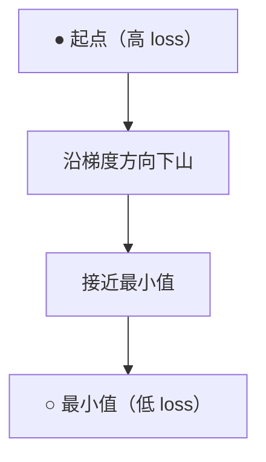
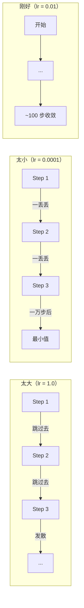
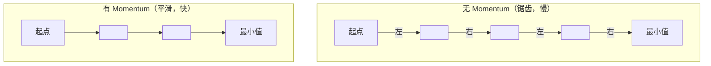
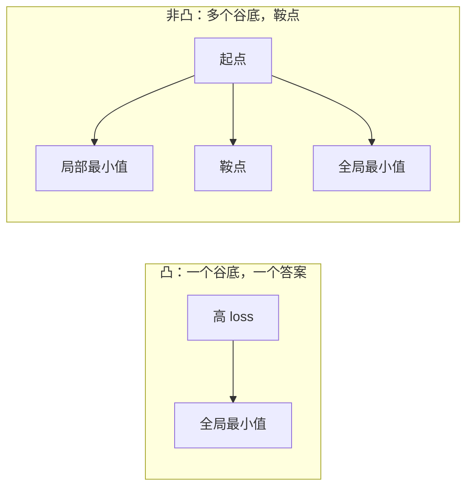

> 训练神经网络就是找山谷的最低点。

## 学习目标

- 从零实现 vanilla 梯度下降、SGD with momentum 和 Adam
- 在 Rosenbrock 函数上比较优化器收敛速度，解释 Adam 为什么给每个权重自适应学习率
- 区分凸和非凸损失面，解释高维空间中鞍点的角色
- 配置学习率调度策略（step decay、cosine annealing、warmup）

## 为什么要学这个

你有一个 loss 函数——告诉你模型有多错。你有梯度——告诉你哪个方向会让 loss 变大。现在你需要一个策略来往下坡走。

最朴素的做法：往梯度反方向走一步，步长乘以一个叫学习率的数。重复。这就是梯度下降，它能用。但"能用"有前提——学习率太大会跳过谷底，太小会爬得巨慢，遇到鞍点会停住明明还没到最小值。

深度学习中的每个优化器都在回答同一个问题：**怎么更快更稳地到达谷底？**

## 核心概念

### 优化是什么

优化 = 找到让函数取最小值（或最大值）的输入。在 ML 中，函数是 loss，输入是模型权重。训练就是优化。

```
最小化 L(w)，其中：
  L = 损失函数
  w = 模型权重（可能有几百万个）
```

### 梯度下降（Vanilla）

最简单的优化器。算 loss 对每个权重的梯度，让每个权重往梯度反方向走一步，步长乘以学习率。

```
w = w - lr × gradient
```

就这一行。整个算法。



### 学习率：最重要的超参数

学习率控制步长，决定了收敛的一切。



没有公式能给出"正确的"学习率，靠实验找。常见起点：Adam 用 0.001，SGD+momentum 用 0.01。

### SGD vs 批量 vs 小批量

| 变体 | 每步用多少数据 | 梯度质量 | 速度 | 噪声 |
|------|-------------|---------|------|------|
| 批量梯度下降 | 整个数据集 | 精确 | 慢 | 无 |
| 随机梯度下降 (SGD) | 1 个样本 | 非常吵 | 快 | 高 |
| 小批量 | 32-256 个样本 | 不错的估计 | 平衡 | 适中 |

SGD 和小批量中的噪声不是 bug——它帮助逃离浅的局部最小值和鞍点。

### Momentum：下坡滚球

Vanilla 梯度下降只看当前梯度。如果梯度来回拐弯（窄山谷中很常见），进展很慢。Momentum 通过积累过去的梯度到一个"速度"项来解决这个问题。

```
v = beta × v + gradient
w = w - lr × v
```

类比：一颗球在山坡上滚。它不会在每个凸起处停下来重新启动，而是在一致的方向上积累速度，在振荡方向上被抑制。



`beta`（通常 0.9）控制保留多少历史。越大动量越强、路径越平滑，但对方向变化的响应越慢。

### Adam：自适应学习率

不同的权重需要不同的学习率。一个很少收到大梯度的权重，终于收到时应该走大步。一个总是收到巨大梯度的权重应该走小步。

Adam（Adaptive Moment Estimation）对每个权重跟踪两样东西：

1. **一阶矩 (m)**：梯度的指数移动平均（像 momentum）
2. **二阶矩 (v)**：梯度平方的指数移动平均（梯度大小）

```
m = beta1 × m + (1 - beta1) × gradient
v = beta2 × v + (1 - beta2) × gradient²

m_hat = m / (1 - beta1^t)    偏差修正
v_hat = v / (1 - beta2^t)    偏差修正

w = w - lr × m_hat / (√v_hat + ε)
```

除以 `√v_hat` 是关键：梯度大的权重被除以大数（有效步长小），梯度小的权重被除以小数（有效步长大）。每个权重自动获得自己的学习率。

默认超参数：`lr=0.001, beta1=0.9, beta2=0.999, ε=1e-8`。对大多数问题都好使。

### 学习率调度

固定学习率是折中。训练早期想走大步快速推进，后期想走小步精细调整。

| 调度策略 | 做法 | 用途 |
|---------|------|------|
| Step decay | 每 N 个 epoch 乘以衰减系数 | 简单，手动控制 |
| 指数衰减 | lr = lr₀ × decay^t | 平滑下降 |
| Cosine annealing | 按余弦曲线从高到低 | Transformer，现代训练 |
| Warmup + decay | 先线性升温，再衰减 | 大模型，防止早期不稳定 |

### 凸 vs 非凸

凸函数只有一个最小值，梯度下降一定能找到。`f(x) = x²` 是凸的。

神经网络的 loss 函数是**非凸**的——有很多局部最小值、鞍点和平坦区域。



实际中，高维神经网络的局部最小值很少是问题——大部分局部最小值的 loss 跟全局最小值差不多。真正的障碍是**鞍点**（某些方向平坦，某些方向弯曲）。Momentum 和小批量的噪声帮助逃离它们。

## 从零实现

### 第一步：测试函数

Rosenbrock 函数是经典优化基准。最小值在 (1, 1)，藏在一个窄弯曲谷里——容易找到谷的入口但难以沿着谷底走。

```python
def rosenbrock(params):
    x, y = params
    return (1 - x) ** 2 + 100 * (y - x ** 2) ** 2

def rosenbrock_gradient(params):
    x, y = params
    df_dx = -2 * (1 - x) + 200 * (y - x**2) * (-2 * x)
    df_dy = 200 * (y - x**2)
    return [df_dx, df_dy]
```

### 第二步：Vanilla 梯度下降

```python
class GradientDescent:
    def __init__(self, lr=0.001):
        self.lr = lr

    def step(self, params, grads):
        return [p - self.lr * g for p, g in zip(params, grads)]
```

### 第三步：SGD with Momentum

```python
class SGDMomentum:
    def __init__(self, lr=0.001, momentum=0.9):
        self.lr = lr
        self.momentum = momentum
        self.velocity = None

    def step(self, params, grads):
        if self.velocity is None:
            self.velocity = [0.0] * len(params)
        self.velocity = [
            self.momentum * v + g
            for v, g in zip(self.velocity, grads)
        ]
        return [p - self.lr * v for p, v in zip(params, self.velocity)]
```

### 第四步：Adam

```python
class Adam:
    def __init__(self, lr=0.001, beta1=0.9, beta2=0.999, epsilon=1e-8):
        self.lr = lr
        self.beta1 = beta1
        self.beta2 = beta2
        self.epsilon = epsilon
        self.m = None  # 一阶矩
        self.v = None  # 二阶矩
        self.t = 0     # 步数

    def step(self, params, grads):
        if self.m is None:
            self.m = [0.0] * len(params)
            self.v = [0.0] * len(params)

        self.t += 1

        # 更新一阶矩（梯度的移动平均）
        self.m = [self.beta1 * m + (1 - self.beta1) * g
                  for m, g in zip(self.m, grads)]
        # 更新二阶矩（梯度平方的移动平均）
        self.v = [self.beta2 * v + (1 - self.beta2) * g ** 2
                  for v, g in zip(self.v, grads)]

        # 偏差修正
        m_hat = [m / (1 - self.beta1 ** self.t) for m in self.m]
        v_hat = [v / (1 - self.beta2 ** self.t) for v in self.v]

        # 更新参数
        return [
            p - self.lr * mh / (vh ** 0.5 + self.epsilon)
            for p, mh, vh in zip(params, m_hat, v_hat)
        ]
```

### 第五步：跑一跑比较

```python
def optimize(optimizer, func, grad_func, start, steps=5000):
    params = list(start)
    for _ in range(steps):
        grads = grad_func(params)
        params = optimizer.step(params, grads)
    return params

start = [-1.0, 1.0]

gd_final = optimize(GradientDescent(lr=0.0005), rosenbrock, rosenbrock_gradient, start)
sgd_final = optimize(SGDMomentum(lr=0.0001, momentum=0.9), rosenbrock, rosenbrock_gradient, start)
adam_final = optimize(Adam(lr=0.01), rosenbrock, rosenbrock_gradient, start)

for name, final in [("GD", gd_final), ("SGD+M", sgd_final), ("Adam", adam_final)]:
    loss = rosenbrock(final)
    print(f"{name:6s} → x={final[0]:.6f}, y={final[1]:.6f}, loss={loss:.8f}")
```

预期结果：Adam 收敛最快，SGD+Momentum 路径更平滑，Vanilla GD 在窄谷里慢慢蹭。

## 实际使用

实践中用 PyTorch 的优化器，它们处理了参数组、权重衰减、梯度裁剪和 GPU 加速。

```python
import torch

model = torch.nn.Linear(784, 10)

# 几种常用优化器
sgd = torch.optim.SGD(model.parameters(), lr=0.01, momentum=0.9)
adam = torch.optim.Adam(model.parameters(), lr=0.001)
adamw = torch.optim.AdamW(model.parameters(), lr=0.001, weight_decay=0.01)

# 学习率调度
scheduler = torch.optim.lr_scheduler.CosineAnnealingLR(adam, T_max=100)
```

经验法则：
- 从 Adam (lr=0.001) 开始，大多数问题不用调就能跑
- 需要最好的最终精度且愿意多调参时，切换到 SGD+momentum (lr=0.01, momentum=0.9)
- Transformer 用 AdamW（解耦权重衰减的 Adam）
- 超过几个 epoch 的训练一定要加学习率调度
- 训练不稳定就降学习率，训练太慢就升学习率

## 练习

1. **学习率扫描。** 用 vanilla GD 在 Rosenbrock 函数上分别试 lr=[0.0001, 0.0005, 0.001, 0.005, 0.01]，5000 步后打印最终 loss。找出仍然收敛的最大学习率。
2. **Momentum 比较。** 用 momentum=[0.0, 0.5, 0.9, 0.99] 跑 SGD。哪个收敛最快？哪个过冲了？
3. **逃离鞍点。** 函数 f(x, y) = x² - y²（原点是鞍点）。从 (0.01, 0.01) 出发，比较 vanilla GD、SGD+momentum、Adam 的行为。
4. **实现学习率衰减。** 给 GradientDescent 加指数衰减：`lr = lr₀ × 0.999^step`。比较有无衰减的收敛差异。

## 术语表

| 术语 | 通俗说法 | 真正含义 |
|------|---------|---------|
| Gradient descent（梯度下降） | "往下坡走" | 从权重中减去梯度乘以学习率。最基本的优化器。 |
| Learning rate（学习率） | "步长" | 控制每步走多远的标量。太大发散，太小浪费算力。 |
| Momentum（动量） | "继续滚" | 把过去的梯度积累成速度向量，抑制振荡、加速一致方向的运动。 |
| SGD | "随机采样" | 用随机子集而非全部数据来估计梯度。实际中几乎总是指小批量 SGD。 |
| Mini-batch（小批量） | "一块数据" | 用于估计梯度的一小部分训练数据（32-256 样本），平衡速度和梯度质量。 |
| Adam | "默认优化器" | 跟踪每个权重的梯度均值和梯度平方均值，给每个权重自适应学习率。 |
| Convex（凸） | "一个谷底" | 任何局部最小值都是全局最小值。梯度下降一定能找到。神经网络 loss 不是凸的。 |
| Saddle point（鞍点） | "平但不是最小值" | 梯度为零，但某些方向是最小值、某些方向是最大值。高维空间中常见。 |
| Loss landscape（损失面） | "地形" | Loss 函数在权重空间上的图。通过沿两个随机方向切片来可视化。 |
| Learning rate schedule | "学习率随时间变" | 训练过程中调整学习率的策略。早期大步走，后期小步调。 |

---

## 自测题

:::quiz
question: 在训练神经网络的语境中，"优化"是什么意思？
options:
  - 让代码跑得更快
  - 找到使损失函数最小化的模型权重
  - 减少模型参数数量
  - 选择最好的训练硬件
correct: 1
explanation: 训练神经网络就是优化。Loss 函数衡量模型有多错，优化找到让 loss 尽可能小的权重值。
:::

:::quiz
question: 学习率太大时梯度下降会怎样？
options:
  - 更快收敛到全局最小值
  - 跳过最小值，loss 发散（来回弹跳或持续增大）
  - 梯度变成零
  - 模型自动降低学习率
correct: 1
explanation: 学习率太大导致每一步都跳过谷底，可能在谷壁之间弹跳甚至完全发散。Loss 增大而非减小。
:::

:::quiz
question: Adam 跟 vanilla 梯度下降有什么区别？
options:
  - Adam 用固定学习率而 GD 用自适应学习率
  - Adam 跟踪梯度和梯度平方的移动平均，给每个权重自适应学习率
  - Adam 计算精确的二阶导数而 GD 用一阶导数
  - Adam 每步处理全部数据而 GD 用小批量
correct: 1
explanation: Adam 维护每个权重的一阶矩（梯度方向）和二阶矩（梯度大小）估计。除以 sqrt(二阶矩) 让大梯度的权重走小步，小梯度的权重走大步。
:::

:::quiz
question: 为什么小批量 SGD 中的噪声被认为是有益的而不仅是麻烦？
options:
  - 噪声减少了训练时的内存使用
  - 噪声帮助优化器逃离浅的局部最小值和鞍点，无噪声的优化器会卡住
  - 噪声没有好处，总是让收敛变慢
  - 噪声让损失函数变凸
correct: 1
explanation: 随机小批量带来的噪声提供随机扰动，能把优化器推出浅的局部最小值和鞍点，带来更好的泛化能力。
:::

:::quiz
question: Cosine annealing 学习率调度做了什么？
options:
  - 整个训练过程中按余弦曲线增大学习率
  - 从高学习率开始，按余弦曲线平滑降低，可选 warmup
  - 在两个固定值之间交替学习率
  - 把学习率设为当前 epoch 数的余弦值
correct: 1
explanation: Cosine annealing 按半余弦曲线从 lr_max 平滑降到 lr_min。早期大步快速推进，后期小步精细收敛。
:::
