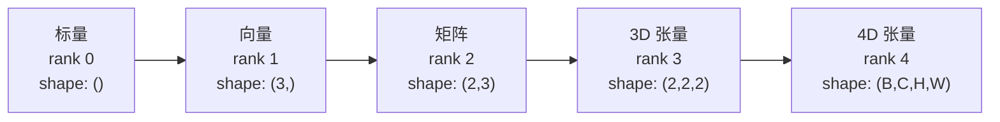
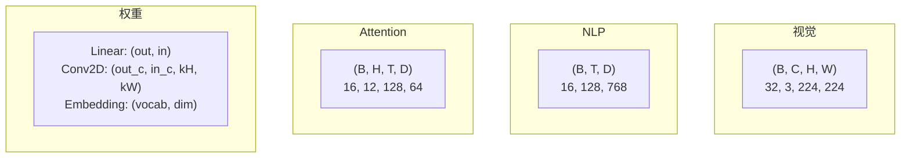
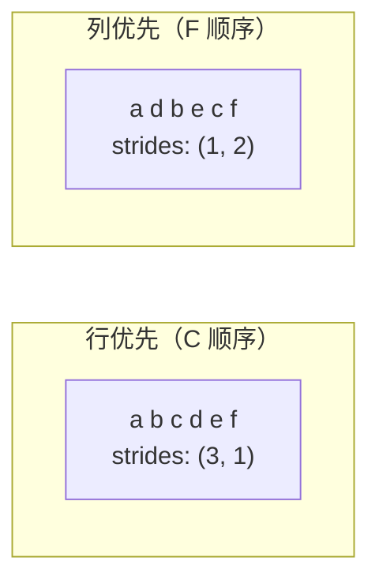
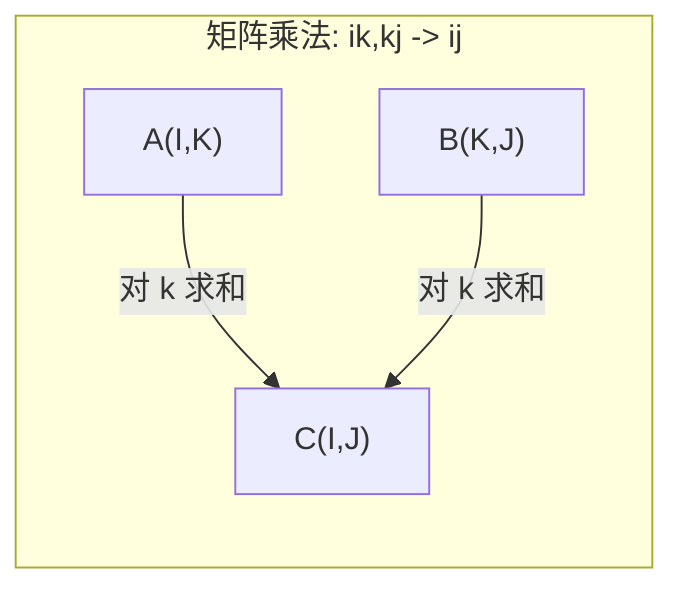

> 张量是数据和深度学习之间的通用语言。每张图片、每句话、每个梯度都通过张量流动。

## 学习目标

- 从零实现张量类：shape、strides、reshape、transpose 和逐元素运算
- 掌握 broadcasting 规则，在不同形状的张量之间操作而不复制数据
- 写 einsum 表达式做点积、矩阵乘法、外积和批量操作
- 跟踪多头注意力中每一步的精确张量形状

## 为什么要学这个

你搭了一个 Transformer，前向传播的代码看着挺干净。跑起来报错：`RuntimeError: mat1 and mat2 shapes cannot be multiplied (32x768 and 512x768)`。你盯着形状发呆。试了 transpose，现在说 `Expected 4D input (got 3D input)`。加了 unsqueeze，又报别的错。

Shape 错误是深度学习代码中最常见的 bug。概念上不难——每个操作都有形状契约——但错误会快速传播。Transformer 里有几十个 reshape、transpose、broadcast 连在一起，一个轴搞错就会连锁反应。更糟的是，有些 shape 错误根本不报错，而是在错误的维度上 broadcast 或 sum，悄悄产生垃圾结果。

掌握张量运算，shape 错误就变得一目了然。

## 核心概念

### 张量是什么

张量是多维数组，数据类型统一。维度数叫做**阶**（rank）。每个维度是一个**轴**（axis）。**Shape** 是一个元组，列出每个轴的大小。



总元素数 = 所有维度大小的乘积。Shape `(2, 3, 4)` 有 `2 × 3 × 4 = 24` 个元素。

### 深度学习中的张量形状

不同数据类型按惯例对应特定的张量形状。



PyTorch 用 NCHW（通道在前），TensorFlow 默认 NHWC（通道在后）。搞混布局会导致无声的速度下降或错误。

### 内存布局与 Stride

二维数组在内存中是一段连续的字节。**Stride** 告诉你沿每个轴移动一步要跳过多少个元素。



Transpose 不移动数据——它交换 stride，让张量变成**非连续**的（一行的元素在内存中不再相邻）。

### Broadcasting 规则

Broadcasting 让你对不同形状的张量做运算而不需要复制数据。从右边对齐形状。两个维度兼容的条件：相等，或其中一个是 1。维度少的那个在左边补 1。

```
张量 A：    (8, 1, 6, 1)
张量 B：       (7, 1, 5)
补齐 B：    (1, 7, 1, 5)
结果：      (8, 7, 6, 5)
```

### Einsum：万能张量运算

Einstein 求和用字母标记每个轴。出现在输入但不在输出中的轴被求和（收缩），两边都有的保留。



常用模式：
- `i,i->` 点积
- `i,j->ij` 外积
- `ii->` 迹
- `ij->ji` 转置
- `bij,bjk->bik` 批量矩阵乘法
- `bhtd,bhsd->bhts` 注意力分数

## 从零实现

### 第一步：张量存储和 Stride

```python
from functools import reduce

class Tensor:
    def __init__(self, data, shape=None):
        if isinstance(data, list):
            self._data, self._shape = self._flatten_nested(data)
        else:
            self._data = list(data)
            self._shape = shape or (len(data),)

        if shape is not None:
            total = reduce(lambda a, b: a * b, shape, 1)
            assert total == len(self._data), f"元素数不匹配: {len(self._data)} vs {shape}"
            self._shape = tuple(shape)

        self._strides = self._compute_strides(self._shape)

    @staticmethod
    def _compute_strides(shape):
        """行优先的 stride 计算"""
        if len(shape) == 0:
            return ()
        strides = [1] * len(shape)
        for i in range(len(shape) - 2, -1, -1):
            strides[i] = strides[i + 1] * shape[i + 1]
        return tuple(strides)

    @property
    def shape(self):
        return self._shape

    @property
    def ndim(self):
        return len(self._shape)
```

Shape `(3, 4)` 的 stride 是 `(4, 1)`——往下移一行跳 4 个元素，往右移一列跳 1 个。

### 第二步：Reshape、Squeeze、Unsqueeze

```python
def reshape(self, new_shape):
    """改变形状，不改变元素顺序"""
    # 处理 -1：自动推断一个维度
    if -1 in new_shape:
        total = len(self._data)
        known = reduce(lambda a, b: a * b, [s for s in new_shape if s != -1], 1)
        inferred = total // known
        new_shape = tuple(inferred if s == -1 else s for s in new_shape)
    return Tensor(self._data[:], shape=new_shape)

def squeeze(self, axis=None):
    """移除大小为 1 的轴"""
    if axis is not None:
        new_shape = tuple(s for i, s in enumerate(self._shape) if not (i == axis and s == 1))
    else:
        new_shape = tuple(s for s in self._shape if s != 1)
    return self.reshape(new_shape)

def unsqueeze(self, axis):
    """在指定位置插入大小为 1 的轴"""
    new_shape = list(self._shape)
    new_shape.insert(axis, 1)
    return self.reshape(tuple(new_shape))
```

Unsqueeze 对 broadcasting 至关重要——bias 向量 `(D,)` 加到批量 `(B, T, D)` 上，需要先 unsqueeze 成 `(1, 1, D)`。

### 第三步：Transpose 和 Permute

```python
def transpose(self, dim0, dim1):
    """交换两个轴"""
    perm = list(range(self.ndim))
    perm[dim0], perm[dim1] = perm[dim1], perm[dim0]
    return self.permute(perm)

def permute(self, order):
    """按指定顺序重排所有轴"""
    new_shape = tuple(self._shape[i] for i in order)
    # 实际实现需要重新排列数据
    # 这里简化为 NumPy 风格
    import numpy as np
    arr = np.array(self._data).reshape(self._shape)
    arr = arr.transpose(order)
    return Tensor(arr.flatten().tolist(), shape=new_shape)
```

Transpose 后张量在内存中不连续。PyTorch 中 `view` 会失败——用 `reshape` 或先 `.contiguous()`。

### 第四步：Broadcasting 实战（NumPy）

```python
import numpy as np

# 给每层输出加 bias（自动 broadcast）
activations = np.random.randn(4, 3)   # (batch=4, features=3)
bias = np.array([0.1, 0.2, 0.3])      # (3,) → broadcast 到 (4, 3)
result = activations + bias

# 对图片的每个通道做缩放
images = np.random.randn(2, 3, 4, 4)         # (B, C, H, W)
scale = np.array([0.5, 1.0, 1.5]).reshape(1, 3, 1, 1)  # broadcast
result = images * scale

# 外积通过 broadcasting
a = np.array([1, 2, 3]).reshape(-1, 1)   # (3, 1)
b = np.array([10, 20, 30, 40]).reshape(1, -1)  # (1, 4)
outer = a * b  # (3, 4)

# 成对距离（broadcasting 的经典应用）
points_a = np.random.randn(5, 2)   # 5 个二维点
points_b = np.random.randn(3, 2)   # 3 个二维点
# (5,1,2) - (1,3,2) → (5,3,2) → 求和 → (5,3)
diff = points_a[:, None, :] - points_b[None, :, :]
distances = np.sqrt((diff ** 2).sum(axis=-1))  # (5, 3) 距离矩阵
```

### 第五步：Einsum 运算

```python
import numpy as np

# 点积：i,i->
a = np.array([1.0, 2.0, 3.0])
b = np.array([4.0, 5.0, 6.0])
dot = np.einsum("i,i->", a, b)  # 32.0

# 矩阵乘法：ik,kj->ij
A = np.array([[1, 2], [3, 4], [5, 6]], dtype=float)
B = np.array([[7, 8, 9], [10, 11, 12]], dtype=float)
matmul = np.einsum("ik,kj->ij", A, B)

# 批量矩阵乘法：bij,bjk->bik
batch_A = np.random.randn(4, 3, 5)
batch_B = np.random.randn(4, 5, 2)
batch_mm = np.einsum("bij,bjk->bik", batch_A, batch_B)

# 外积：i,j->ij
outer = np.einsum("i,j->ij", a, b)

# 迹：ii->
trace = np.einsum("ii->", np.eye(4))  # 4.0
```

### 第六步：用 Einsum 写注意力机制

```python
B, H, T, D = 2, 4, 8, 16  # batch, heads, seq_len, head_dim
E = H * D  # embed_dim = 64

X = np.random.randn(B, T, E)
W_q = np.random.randn(E, E) * 0.02
W_k = np.random.randn(E, E) * 0.02
W_v = np.random.randn(E, E) * 0.02
W_o = np.random.randn(E, E) * 0.02

# 1. 线性投影：(B,T,E) @ (E,E) → (B,T,E)
Q = np.einsum("bte,ek->btk", X, W_q)  # Query
K = np.einsum("bte,ek->btk", X, W_k)  # Key
V = np.einsum("bte,ek->btk", X, W_v)  # Value

# 2. 分头：(B,T,E) → (B,T,H,D) → (B,H,T,D)
Q = Q.reshape(B, T, H, D).transpose(0, 2, 1, 3)
K = K.reshape(B, T, H, D).transpose(0, 2, 1, 3)
V = V.reshape(B, T, H, D).transpose(0, 2, 1, 3)

# 3. 注意力分数：(B,H,T,D) × (B,H,T,D)^T → (B,H,T,T)
scores = np.einsum("bhtd,bhsd->bhts", Q, K) / np.sqrt(D)

# 4. Softmax（沿最后一个轴）
def softmax(x, axis=-1):
    e = np.exp(x - x.max(axis=axis, keepdims=True))
    return e / e.sum(axis=axis, keepdims=True)
weights = softmax(scores, axis=-1)

# 5. 加权求和：(B,H,T,T) × (B,H,T,D) → (B,H,T,D)
attn_output = np.einsum("bhts,bhsd->bhtd", weights, V)

# 6. 合并头：(B,H,T,D) → (B,T,H,D) → (B,T,E)
concat = attn_output.transpose(0, 2, 1, 3).reshape(B, T, E)

# 7. 输出投影：(B,T,E) @ (E,E) → (B,T,E)
output = np.einsum("bte,ek->btk", concat, W_o)

print(f"输入: {X.shape} → 输出: {output.shape}")
```

每一步都是张量操作：投影（einsum 矩阵乘）、分头（reshape + transpose）、注意力分数（批量 einsum）、加权求和（批量 einsum）、合并头（transpose + reshape）、输出投影（einsum 矩阵乘）。

## 每种神经网络层的张量表示

| 操作 | 张量形式 | Einsum |
|-----|---------|--------|
| Linear 层 | `Y = X @ W.T + b` | `"bd,od->bo"` + bias |
| Attention QKV | `Q = X @ W_q` | `"btd,dh->bth"` |
| Attention 分数 | `Q @ K.T / √d` | `"bhtd,bhsd->bhts"` |
| Attention 输出 | `softmax(scores) @ V` | `"bhts,bhsd->bhtd"` |
| Batch Norm | `(X - μ) / σ × γ` | 逐元素 + broadcast |
| Softmax | `exp(x) / Σexp(x)` | 逐元素 + 规约 |

## 练习

1. **Reshape 往返。** 取 shape `(2, 3, 4)` 的张量，reshape 成 `(6, 4)` → `(24,)` → 再回到 `(2, 3, 4)`。验证每步元素顺序不变。
2. **实现 broadcasting。** 给 Tensor 类加 `broadcast_to(shape)` 方法，让大小为 1 的维度扩展到目标形状。测试 `(3, 1)` 和 `(1, 4)` 产生 `(3, 4)`。
3. **从零写 einsum。** 实现基础 `einsum(subscripts, *tensors)` 函数，至少支持：点积 `i,i->`、矩阵乘法 `ij,jk->ik`、外积 `i,j->ij`、转置 `ij->ji`。跟 `np.einsum` 对比结果。
4. **注意力形状追踪。** 写一个函数输入 `batch_size, seq_len, embed_dim, num_heads`，打印多头注意力每一步的精确形状。

## 术语表

| 术语 | 通俗说法 | 真正含义 |
|------|---------|---------|
| Tensor（张量） | "高维矩阵" | 多维数组，有统一类型、确定的 shape、stride 和操作 |
| Rank（阶） | "几维" | 轴的数量。矩阵是 rank 2，不是矩阵的秩 |
| Shape | "张量多大" | 元组，列出每个轴的大小。`(2, 3)` 是 2 行 3 列 |
| Stride | "内存怎么排" | 沿每个轴前进一步要跳过的元素数 |
| Broadcasting | "形状不一样也能算" | 严格规则：从右对齐，维度必须相等或有一个是 1 |
| Contiguous（连续） | "张量是正常的" | 元素在内存中按逻辑顺序连续存储，没有间隙或重排 |
| Einsum | "花式矩阵乘法" | 通用符号，一行表达任何张量收缩、外积、迹或转置 |
| View | "跟 reshape 一样" | 共享同一块内存但有不同 shape/stride 元数据的张量。对非连续数据会失败 |
| NCHW / NHWC | "PyTorch 格式 vs TensorFlow 格式" | 图像张量的内存布局惯例。NCHW 通道在空间维度前，NHWC 在后 |

---

## 自测题

:::quiz
question: 张量的 shape 描述的是什么？
options:
  - 列出每个轴大小的元组
  - 张量中元素的总数
  - 张量元素的数据类型
  - 张量的内存地址
correct: 0
explanation: Shape 是一个元组，列出每个轴的大小。比如 shape (2, 3, 4) 的张量在轴 0 有 2 个元素，轴 1 有 3 个，轴 2 有 4 个。
:::

:::quiz
question: PyTorch 中图片 batch 张量默认用什么布局？
options:
  - NHWC（batch, height, width, channels）
  - NCHW（batch, channels, height, width）
  - CHWN（channels, height, width, batch）
  - WHCN（width, height, channels, batch）
correct: 1
explanation: PyTorch 默认 NCHW（通道在前）布局。TensorFlow 默认 NHWC（通道在后）。搞混布局会导致无声错误或性能问题。
:::

:::quiz
question: Shape (8, 1, 6, 1) 和 (7, 1, 5) 的张量 broadcasting 后结果形状是什么？
options:
  - (8, 7, 6, 1)
  - (8, 1, 6, 5)
  - (8, 7, 6, 5)
  - Broadcasting 失败——形状不兼容
correct: 2
explanation: 从右对齐：(8,1,6,1) 和 (1,7,1,5)。维度兼容条件：相等或有一个是 1。结果取每个位置的最大值：(8, 7, 6, 5)。
:::

:::quiz
question: Einsum 表达式 'bhtd,bhsd->bhts' 中，索引 'd' 怎么了？
options:
  - 它作为新轴保留在输出中
  - 它被求和掉了（收缩），因为它出现在两个输入中但不在输出中
  - 它在两个张量之间 broadcast
  - 它在两个输入张量之间做了转置
correct: 1
explanation: 在 einsum 中，出现在输入但不在输出中的索引会被求和。索引 'd' 出现在 'bhtd' 和 'bhsd' 中但不在输出 'bhts' 中，所以被收缩（逐元素乘后求和）。
:::

:::quiz
question: 为什么在 PyTorch 中对转置后的张量调用 .view() 会失败？
options:
  - 转置后的张量数据类型改变了
  - 转置后张量在内存中不连续，而 view 要求连续内存布局
  - view 只能用于二维张量
  - 转置改变了元素总数
correct: 1
explanation: Transpose 交换 stride 但不移动数据，使张量变成非连续的。.view() 操作要求连续的内存布局。用 .reshape() 或先调用 .contiguous()。
:::
