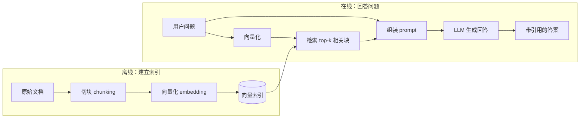

## 1.1 一次一本正经的胡说八道

先做一个小实验。随便打开一个大语言模型的对话框，问它一个你**确定它不可能知道**的问题——比如你们学校今年某门课的选课细则，或者你导师上个月刚挂到 arXiv 上的论文讲了什么。

大多数时候，模型不会说"我不知道"。它会用流畅、自信、结构工整的语言，给你一份看起来完全可信的回答：条款编号齐全的选课规则、有作者有年份的论文引用、甚至还有页码。唯一的问题是——**这些内容是编的**。条款不存在，论文标题是拼凑的，页码纯属虚构。

这个现象有一个专门的名字：**幻觉（hallucination）**。它不是某个模型的 bug，而是这一代大语言模型与生俱来的性质。要理解为什么，我们得先看清楚一件事：模型的"知识"到底存在哪里。

## 1.2 参数化知识：模型把世界记在了权重里

回忆一下语言模型在做什么：给定前面的文本，预测下一个 token 的概率分布。它在训练时读过海量的文本，把统计规律压缩进了几千亿个参数——权重矩阵里的浮点数——之中。当你问"水的沸点是多少"，模型并不是去某个数据库里**查**了一条记录，而是因为"水的沸点是 100"这个搭配在训练语料里出现得足够多，参数把这条规律记住了，于是在生成时它自然而然地把"100"排在了概率分布的前列。

这种存在参数里的知识，叫做**参数化知识（parametric knowledge）**。它有一个非常反直觉的特点：**模型没有"知道"与"不知道"的开关**。生成下一个 token 是一个永远会给出答案的过程——概率分布总是存在的，采样总能采出东西来。当你问的内容恰好在训练数据里高频出现，分布尖锐地集中在正确答案上，模型显得博学；当你问的内容训练数据里根本没有，分布并不会变成一片空白，而是退化成"什么样的文本**看起来像**这个问题的答案"——于是模型开始凭语言的统计惯性去补全，编出格式正确、内容虚构的回答。

用一句话概括：**幻觉不是模型在撒谎，而是插值在数据不覆盖的区域上的自然延伸**。理解了这一点，你就不会再问"怎么让模型不幻觉"这种无解的问题，而会问一个更有建设性的问题：**怎么让模型在回答时，手边有正确的资料可抄？**

## 1.3 三个结构性缺陷

在回答"怎么抄"之前，先把参数化知识的缺陷数清楚。它们不是工程瑕疵，而是这套机制的结构性问题，再大的模型也绕不过去。

**第一，知识有截止日期。** 训练一个前沿模型需要数月时间和巨额算力，训练数据在某个时间点被冻结，这就是所谓的 knowledge cutoff。之后世界上发生的一切——新闻、新论文、软件的新版本、今天的天气——模型一概不知。而重新训练一次的成本高到不可能为了"更新知识"而频繁进行。参数化知识天生是一张**过期地图**。

**第二，私有数据不在里面。** 模型的训练语料来自公开互联网。你的课程讲义、公司内部文档、实验记录、个人笔记——这些数据模型从来没见过，将来也不应该见到（把私有数据送去训练本身就是数据安全事故）。可偏偏，绝大多数真正有价值的问答场景，问的恰恰是私有数据："我们的报销流程是什么？""上次实验的参数设了多少？"参数化知识对此完全无能为力。

**第三，无法溯源，也无法定点修改。** 模型说"水的沸点是 100 摄氏度"，你问它"依据是什么"，它给不出一条可验证的出处——知识弥散在几千亿个参数里，没有任何一个参数对应"这条知识"。这带来两个后果：一是**不可验证**，你无法区分模型是在复述可靠来源还是在插值编造；二是**不可修改**，发现模型记错了一个事实，你没有办法像改数据库一样改掉那一条——微调可以整体调整行为，但无法做外科手术式的知识更新，还可能引起其他能力的退化。

:::callout 小结：参数化知识的边界
知识截止（无法更新）、私有数据缺席（无法覆盖）、弥散不可溯源（无法验证与修改）——这三个缺陷共同指向同一个方向：**有一类知识，就不该指望模型"记住"，而应该让模型在需要时"查到"**。
:::

## 1.4 最朴素的方案：把资料塞进上下文

好在这一代模型还有另一种完全不同的用知识方式。除了压在参数里的知识，模型还能利用**上下文窗口（context window）里的知识**：你在 prompt 里贴给它的任何文本，它都能在生成时直接参考。这种知识是即时的、可控的、可溯源的——你贴的什么它就依据什么。

于是最朴素的方案自然浮现：**把资料整个贴进 prompt**。问课程规则，就把整本学生手册贴进去；问论文内容，就把 PDF 全文贴进去。在很多场景下，这个方案完全够用——文档只有几页、问题一次性、你手头正好有这份文件。事实上，"先把资料给模型看，再让它回答"这个思想，正是本书全部内容的起点，后面的一切都只是在回答"资料太多时怎么办"。

那么资料太多时会发生什么？三件事。

**成本随长度线性增长。** 模型按 token 计费，一本几十万字的资料，每问一个问题都要完整付一遍钱（缓存技术能缓解重复部分的成本，但改变不了量级）。更实际的限制是上下文窗口本身有上限，资料超过上限就是物理性放不下。

**长上下文的注意力并不均匀。** 一系列被称为"大海捞针"（needle in a haystack）的实验测试了同一件事：把一条关键信息埋进一大段无关文本的不同位置，看模型能否找到并使用它。结果反复表明，信息放在上下文的开头和结尾时表现最好，埋在中部时明显退化——这个现象被称为 **lost in the middle**。新一代模型在这类测试上进步很大，但"上下文越长、单条信息被稀释得越厉害"的趋势依然存在。

**无关信息会污染回答。** 贴进去的资料里与问题无关的部分并不是中性的填充物。它们会分走注意力、引入干扰性的相似内容，甚至诱导模型引用错误的段落。资料不是越多越好——**恰好相关的少量资料，胜过大而全的一锅端**。

把这三条合起来，结论已经呼之欲出：既然全部塞进去又贵又低效，那就在塞之前**先挑一挑**——只把与问题最相关的那几段找出来，贴给模型。而"从大量文档里快速找出与查询最相关的片段"，恰好是一门发展了半个多世纪的成熟学科，叫做**信息检索（Information Retrieval, IR）**——对，就是搜索引擎背后的那门学问。

## 1.5 RAG：检索增强生成

把检索和生成接在一起，就得到了本书的主角。**检索增强生成（Retrieval-Augmented Generation, RAG）**：在让语言模型回答问题之前，先从外部知识库中检索出与问题相关的内容，把它们放进上下文，再让模型基于这些内容生成回答。

这个名字来自 Lewis 等人 2020 年的论文 *Retrieval-Augmented Generation for Knowledge-Intensive NLP Tasks*。原始论文里检索器和生成器是联合训练的一个整体模型，而今天大家说的 RAG 已经泛化成一种**架构模式**：检索器和生成器各自独立，用 prompt 松耦合地拼在一起。一条典型的 RAG 流水线长这样：

流水线分两段。**离线阶段**只做一次：把文档切成适当大小的片段（块，chunk），为每个块计算向量表示，存进索引。**在线阶段**每次提问都会执行：把问题也变成向量，在索引里找出最相似的 k 个块，连同问题一起组装成 prompt，交给模型生成回答。

如果要打一个比方：参数化知识是**闭卷考试**，全凭模型训练时背下的东西；RAG 是**开卷考试**——考题发下来，先翻书找到相关章节，再照着作答。开卷考试的好处一目了然：书可以随时换新版（知识可更新），可以带自己的笔记进场（私有数据），答案能标注页码（可溯源）。而代价是引入了一个新环节——**翻书的水平现在成了成绩的一部分**。翻错了页，照着错误的章节抄，答案照样是错的。本书第 2、3、4 章讲的，本质上都是"怎么把书翻对"。

## 1.6 2026 年：你其实每天都在用 RAG

如果这本书写于 2021 年，RAG 还是一个需要论证"为什么值得学"的研究方向。写于 2026 年，情况完全反过来了——**RAG 已经是你每天都在使用、只是未必意识到的基础设施**。

打开任何一个主流聊天助手，问一个时效性问题，它会先联网搜索再回答，答案末尾挂着来源链接——这是 RAG，知识库换成了整个互联网。让 ChatGPT 或 Claude "深度研究"一个课题，它会反复搜索、阅读、再搜索，最后交出一篇带几十条引用的报告——这是多轮的、由模型自主驱动的 RAG（第 5 章会专门讲这种 agentic 形态）。公司内部的知识库问答、客服机器人查产品手册、律师助手检索判例、医生查询用药指南——清一色是 RAG。甚至聊天助手的"记忆"功能——它记得你上个月说过的偏好——底层往往也是把历史对话存起来、在需要时检索出来，同样是 RAG 的变体。

这也是为什么 2026 年学 RAG 和 2020 年读那篇论文是两种完全不同的体验：当年它是一个模型架构上的创新；今天它是一门**系统工程**——原理不复杂，难在把检索、切块、重排、评估每个环节都做扎实。这正好也是本书的路线：第 2 章讲检索本身，第 3 章讲那些不起眼却决定成败的工程细节，第 4 章讲怎么科学地评估效果，第 5 章回到 2026 年的现实看 RAG 的演进与争论，第 6 章从零写代码，给你自己的资料库做一个能跑起来的问答机器人。

## 1.7 背景速览：读这本书需要什么

最后花一点篇幅对齐前置知识。如果你读过《人工智能与数学原理》的后几章，下面这些只是唤醒记忆；如果没有，记住结论也足以读完本书。

**Embedding：把语义压进几何空间。** 这是全书最重要的前置概念。一个 embedding 模型把一段文本映射成一个 $d$ 维向量（$d$ 通常是几百到几千），并且这个映射经过专门训练，使得**语义相近的文本，向量在空间中彼此靠近**。"如何申请退学"和"学籍注销办法"字面上几乎没有重合的词，但一个好的 embedding 模型会把它们映射到相近的位置。于是"找语义相关的文档"就变成了"找空间中相近的向量"——一个纯粹的几何问题。这一步转化是整个语义检索的地基，第 2 章会详细展开。

**注意力机制：一句话版本。** Transformer 里的注意力让每个 token 根据相关性对上下文中其他 token 加权取信息，$\mathrm{softmax}(QK^\top/\sqrt{d_k})\,V$ 这个公式你在前一本书里推导过。本书只在第 3 章讲重排序时用到它的一个直觉推论：**两段文本拼在一起过注意力，比各自独立编码再比较，能捕捉到细得多的相关性**——代价是慢得多。届时再展开。

**LLM 当黑盒。** 除此之外，本书对语言模型内部结构不做任何假设。它就是一个函数：输入一段文本（prompt），输出一段文本（回答），按 token 计费，通过 API 调用。RAG 的全部工作都发生在这个黑盒**之外**——这也正是它作为工程方案的优雅之处：不改模型一个参数，只改喂给模型的东西。

:::callout-tip 本章要点
- 幻觉是参数化知识在数据不覆盖区域上的自然延伸，无法根除，只能绕开。
- 参数化知识三缺陷：知识截止、私有数据缺席、不可溯源不可定点修改。
- 上下文中的知识即时、可控、可溯源，但"全部塞进去"受成本、lost in the middle 和上下文污染三重限制。
- RAG = 检索 + 生成：先从知识库找出相关片段，再让模型照着回答——开卷考试。
- 2026 年 RAG 已是基础设施；它的难点不在原理，在系统工程——这正是后面五章的内容。
:::
