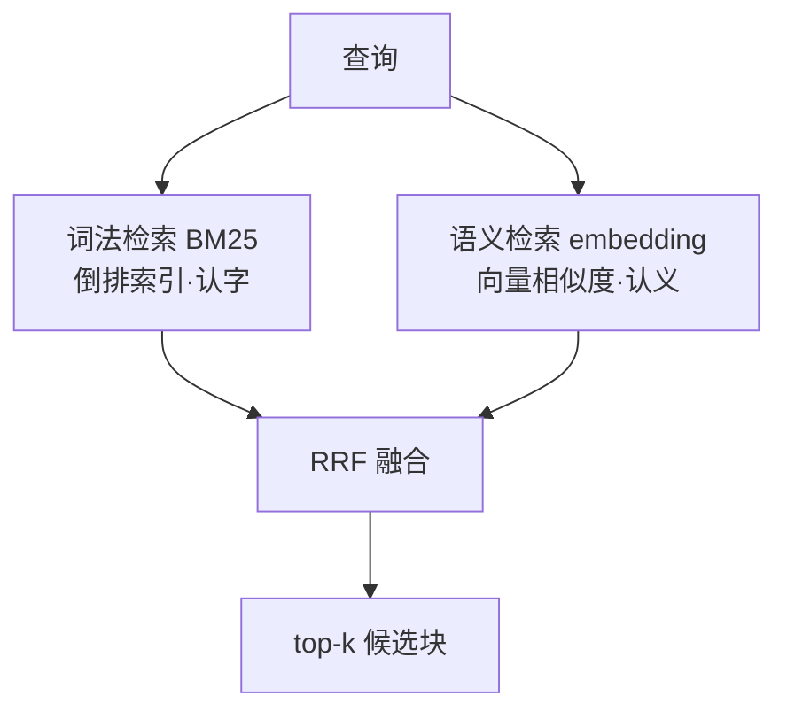

## 2.1 问题定义：在草堆里找那几根针

先把检索这件事定义清楚。给定一个**查询**（query，用户的问题）和一个**语料库**（corpus，切好块的全部文档，规模从几千到几十亿条不等），检索的任务是：按与查询的相关程度给语料库里的每一条打分，返回得分最高的 $k$ 条。所有检索系统——从 1970 年代的图书馆检索系统到 Google 再到 RAG 的检索层——做的都是这一件事，区别只在**"相关"怎么定义、怎么算得快**。

对"相关"的两种定义方式，把检索技术分成了两大家族：**词法检索**（lexical retrieval）认为查询和文档共享的**词**越多、越重要，就越相关；**语义检索**（semantic retrieval）认为查询和文档的**含义**越接近就越相关，哪怕用词完全不同。这两个家族一个发展了五十多年，一个是近十年 deep learning 的产物，而 2026 年生产系统的标准答案是：**两个都要**。本章按这个顺序讲。

## 2.2 词法检索：TF-IDF、BM25 与倒排索引

### 词频与逆文档频率

最直觉的相关性定义：查询里的词在文档里出现得越多，文档越相关。这就是**词频**（term frequency, TF）。但它立刻遇到一个问题——"的"、"是"、"了"在每篇文档里都大量出现，按词频排序会被这些废词淹没。

修正的思路同样直觉：一个词越是**只在少数文档里出现**，它的区分度就越高。"熵"只出现在几篇文档里，那么包含"熵"的文档对查询"熵"就非常相关；"的"出现在所有文档里，就不携带任何区分信息。这就是**逆文档频率**（inverse document frequency, IDF）。设语料库共 $N$ 篇文档，其中 $n(q)$ 篇包含词 $q$，一个常用的 IDF 形式是：

$$
\mathrm{IDF}(q) = \ln\!\left(\frac{N - n(q) + 0.5}{n(q) + 0.5} + 1\right)
$$

词越稀有，$n(q)$ 越小，IDF 越大。TF 和 IDF 相乘，就是经典的 **TF-IDF** 权重：既奖励"在这篇文档里出现多"，又奖励"在整个语料库里出现少"。

### BM25：五十年词法检索的集大成者

TF-IDF 还有两处不够精细，把它们修好，就得到了词法检索的事实标准 **BM25**（Best Matching 25，名字来自它是一系列实验公式中的第 25 号）：

$$
\mathrm{score}(D, Q) = \sum_{q_i \in Q} \mathrm{IDF}(q_i) \cdot \frac{f(q_i, D)\,(k_1 + 1)}{f(q_i, D) + k_1\left(1 - b + b\,\dfrac{|D|}{\mathrm{avgdl}}\right)}
$$

公式看着密，其实只在 TF-IDF 上做了两个修正，各对应一个参数：

**词频饱和（参数 $k_1$）。** 朴素 TF 是线性的：一个词出现 100 次，得分就是出现 10 次的 10 倍。这不合理——出现 10 次已经充分说明文档与这个词相关，再多出现 90 次不该再加多少分。BM25 的分式结构让词频的贡献**饱和**：当 $f(q_i, D) \to \infty$ 时，整个分式趋于 $k_1 + 1$，封顶了。$k_1$（通常取 1.2 到 2.0）控制饱和的快慢。

**长度归一化（参数 $b$）。** 长文档天然包含更多词，按裸词频排序会系统性偏向长文档。分母里的 $|D| / \mathrm{avgdl}$（文档长度除以平均长度）对长文档施加惩罚，$b$（通常取 0.75）控制惩罚力度：$b = 1$ 完全归一化，$b = 0$ 完全不管长度。

### 倒排索引：为什么词法检索快得不讲道理

BM25 的另一半优势在工程上。如果对每个查询都遍历全部文档算一遍分数，语料库大了根本撑不住。词法检索的解法是**倒排索引**（inverted index）：离线时建一张"词 → 包含它的文档列表"的映射表，就像书末的索引页。查询来了，只需取出查询词对应的几个文档列表、在它们的并集上算分——绝大多数文档连碰都不用碰。配合倒排索引，BM25 在亿级文档上做到毫秒级响应，这是它统治搜索引擎几十年的底气。

### 词法检索的天花板

但词法检索有一个原理性的盲区：**它只认字，不认意思**。查询"如何申请退学"，文档里写的是"学籍注销办法"——语义几乎相同，共享的实词却是零，BM25 给出的分数接近于零。同义词（"电脑"与"计算机"）、上下位词（"苹果手机"与"iPhone"）、跨语言、乃至同一个意思的不同句式，词法检索一概处理不了。这个问题在 IR 文献里叫**词汇失配**（vocabulary mismatch），修修补补的方案（同义词表、查询扩展）搞了几十年，都治标不治本。治本的方案要等到 embedding 出现。

:::callout BM25 的现代价值
别因为 BM25"古老"就轻视它。它精确匹配专有名词、代码标识符、型号编号的能力至今无可替代（"HTTP 429"就该字面命中"HTTP 429"，向量检索反而可能给你"HTTP 503"，因为语义太相近了）；它不需要训练、不需要调用模型、可解释、极快。2.5 节会看到，它在 2026 年的生产系统里活得很好。
:::

## 2.3 语义检索：把"找相关"变成"找相近"

### 从词到向量

第 1 章铺垫过语义检索的核心思想，现在正式展开。一个 **embedding 模型**把任意一段文本映射为 $d$ 维实向量：

$$
E: \text{文本} \longrightarrow \mathbb{R}^d
$$

关键不在映射本身（随便一个函数都能把文本变成向量），而在这个映射**被训练得让语义相近的文本落在相近的位置**。做到这一点的主流方法是**对比学习**（contrastive learning）：准备大量"相关文本对"（问题与它的答案、同一文档的相邻段落、译文对等），训练时让配对文本的向量相互拉近、让不相关文本的向量相互推远。常用的 InfoNCE 损失长这样：

$$
\mathcal{L} = -\log \frac{e^{\,\mathrm{sim}(q,\, d^+)/\tau}}{\sum_{d \in \{d^+,\, d^-_1, \ldots, d^-_n\}} e^{\,\mathrm{sim}(q,\, d)/\tau}}
$$

其中 $d^+$ 是与查询 $q$ 配对的正样本，$d^-_i$ 是负样本，$\tau$ 是温度参数。直觉上这就是一个分类任务：在一堆候选里，把"真正相关的那个"的相似度顶上去。在海量文本对上这样训练之后，模型学到的向量空间就自带了我们想要的性质——"退学申请"和"学籍注销"被大量语料中的共现模式拉到了一起，尽管它们没有一个字相同。

2026 年你几乎不需要自己训练 embedding 模型：商用 API（如 Voyage、OpenAI 的 embedding 端点）和开源模型（如 BGE 系列）都是拿来即用的，输入文本，返回向量。你需要理解的是怎么**用**这些向量。

### 余弦相似度

有了向量，"相关"就量化成了"相近"。最常用的度量是**余弦相似度**——两个向量夹角的余弦：

$$
\cos(\mathbf{u}, \mathbf{v}) = \frac{\mathbf{u} \cdot \mathbf{v}}{\lVert \mathbf{u} \rVert \, \lVert \mathbf{v} \rVert}
$$

取值范围 $[-1, 1]$，方向完全相同为 1，正交为 0。用夹角而不用欧氏距离，是因为我们关心的是向量的**方向**（语义内容）而非长度。实践中有一个人人都用的技巧：把所有向量预先归一化成单位长度（$\lVert \mathbf{v} \rVert = 1$），此后余弦相似度就退化成简单的**点积** $\mathbf{u} \cdot \mathbf{v}$——而一个查询向量对整个语料库矩阵的点积，就是一次矩阵乘向量运算，numpy 一行写完。第 6 章的实战代码正是这么做的。

于是语义检索的完整流程为：离线把每个文档块过一遍 embedding 模型、存下向量；在线把查询也变成向量，与所有文档向量算相似度，取 top-k。词汇失配问题就此消解——比较发生在语义空间里，字面重不重合根本不进入计算。

### 语义检索自己的软肋

公平起见，语义检索的弱点也要摆出来。其一，前面说过的**精确匹配能力差**：专名、编号、代码符号这类"一个字都不能差"的查询，向量空间里的"相近"反而成了干扰。其二，**一个向量装不下一整段话的全部**：embedding 把变长文本压成定长向量，本质是有损压缩，一段话谈了三件事，向量只能是三者的某种平均——这个问题与切块策略深度纠缠，留到第 3 章。其三，**领域外退化**：embedding 模型的"语义"来自训练语料，遇到训练时没见过的专业领域（小众学科术语、公司内部黑话），向量质量会明显下降。

## 2.4 向量检索的工程：从暴力扫描到 ANN 索引

### 先捅破一层窗户纸

"向量数据库"这个词在 2023 年前后被炒得神乎其神，仿佛是什么全新物种。捅破窗户纸：**向量检索最朴素的实现就是一次矩阵乘法**。把 $N$ 个文档向量摞成矩阵 $M \in \mathbb{R}^{N \times d}$，查询向量为 $\mathbf{q}$，那么 $M\mathbf{q}$ 一次算出全部相似度，排序取前 k。这叫**暴力检索**（brute-force / flat search），复杂度 $O(Nd)$，结果是**精确**的。

关键的数量级感觉：$N$ 是几万、$d$ 是一千出头时，$M\mathbf{q}$ 就是几千万次浮点乘加——现代 CPU 上**毫秒级**的事。也就是说，个人知识库、一门课的资料、一家小公司的文档这种规模，**numpy 加一个 .npy 文件就是完全体**，任何数据库都不需要。第 6 章会用行动证明这一点。

### 规模大了怎么办：近似最近邻

当 $N$ 到了千万、上亿，暴力扫描扛不住了，就需要**近似最近邻**（Approximate Nearest Neighbor, ANN）索引：牺牲一点点精确性（可能漏掉真正的 top-k 中的个别项），换取几个数量级的速度。两类主流思路值得知道名字和直觉：

**IVF（倒排文件索引）**：先把全部向量聚类成若干簇，查询时只在离查询最近的几个簇里做暴力检索。相当于先确定"这个问题大概属于哪几个片区"，再片区内细找。

**HNSW（分层可导航小世界图）**：把向量连成一张多层图，上层稀疏、下层稠密。查询从顶层入口出发，每一步跳向邻居中离查询更近的节点，逐层下沉、逐步逼近。像先看世界地图定位到城市，再看城市地图找到街道。HNSW 是 2026 年各类向量库的默认索引，查询复杂度约 $O(\log N)$。

所谓**向量数据库**（Milvus、Qdrant、Pinecone 这些名字你多少听过），本质就是：ANN 索引 + 元数据过滤（"只在 2024 年之后的文档里找"）+ 增删改查 + 持久化 + 分布式——是**围绕向量检索的一整套数据库工程**，而不是什么新的检索原理。什么时候需要它？向量多到内存装不下、需要频繁增删、多人并发访问——一句话，遇到**数据库问题**的时候。只是做检索，用不上。

## 2.5 混合检索：全都要，然后融合

回顾两大家族的攻防：BM25 精确但认字不认义，向量检索懂语义但抓不准专名。注意它们的失效场景**恰好互补**——这就是为什么 2026 年生产系统的标准配置是**混合检索**（hybrid search）：同一个查询，同时跑 BM25 和向量检索，再把两路结果融合成一个排名。

融合有个小障碍：BM25 分数和余弦相似度量纲完全不同，不能直接相加。最流行的解法干脆绕开分数，只用**排名**——**倒数排名融合**（Reciprocal Rank Fusion, RRF）：

$$
\mathrm{RRF}(d) = \sum_{r \in \text{各路检索}} \frac{1}{k + \mathrm{rank}_r(d)}
$$

文档 $d$ 在每一路检索里的名次为 $\mathrm{rank}_r(d)$（不在结果里就不贡献分数），$k$ 是平滑常数，约定俗成取 60。直觉：在**任何一路**名列前茅的文档都能拿到不错的融合分，在**多路同时**靠前的文档得分最高。RRF 简单、无需调参、效果稳健，是混合检索的默认选择。

至此，检索层的地图画完了：

但一个尖锐的问题还悬着：图里的"文档块"是从哪来的？一本书怎么切成块，切多大，从哪里下刀？这些看似琐碎的决定，实际效果上的影响常常**超过检索算法本身的选择**。这就是下一章的主题。

:::callout-tip 本章要点
- 检索 = 给定查询，从语料库按相关性取 top-k；两大家族对"相关"的定义不同：词法认字，语义认义。
- BM25 = TF-IDF + 词频饱和（$k_1$）+ 长度归一化（$b$），配倒排索引，快且擅长精确匹配；死穴是词汇失配。
- 语义检索靠对比学习训练的 embedding 把文本映射进向量空间，余弦相似度（归一化后即点积）度量相关性；死穴是专名匹配与有损压缩。
- 万级向量用 numpy 暴力检索即可（毫秒级）；ANN（HNSW/IVF）与向量数据库是**规模**问题的解，不是检索原理的升级。
- 两家族失效场景互补 → 混合检索 + RRF 融合是 2026 年的标准配置。
:::
