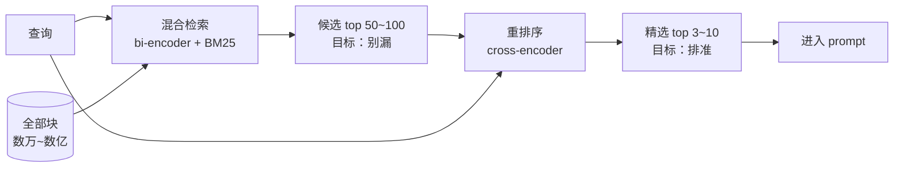

## 3.1 上限不在模型，在这些脏活里

如果给 RAG 各环节的"重要性"和"受关注度"各打一个分，会得到一张严重错位的表：模型选型人人关心，实际上生成模型早已不是瓶颈；而**切块**（chunking）——把文档剁成检索单元这件毫无技术光环的脏活——很少有人愿意多看一眼，却往往直接决定整套系统的上限。

道理不复杂。检索找的是块，模型读的也是块。如果一个关键定义在切块时被拦腰斩断，那么无论检索算法多精妙、生成模型多强大，流水线的每一个下游环节拿到的都是残缺的原料——**检索器找不全它，模型读不懂它**。经典的 garbage in, garbage out，只不过 garbage 是在预处理阶段被亲手制造出来的。本章讲的就是这些决定上限的工程细节：往哪里下刀（切块）、切完之后怎么补救（上下文增强）、粗筛之后怎么精选（重排序）、以及问题本身不给力时怎么办（查询改写）。

## 3.2 切块：往哪里下刀

### 一个根本的两难

先理解为什么切块天生是个两难问题，而不是"选个块大小"那么简单。块的大小同时影响两件事，而且方向相反：

**块太小，上下文丢了。** 把"因此该方法不适用"单独切成一块，检索到了也没用——"该方法"指什么？"因此"承接了什么论证？代词和逻辑连接词的指向全部悬空。模型拿到的是一句失去语境的话。

**块太大，语义糊了。** 回忆第 2 章：embedding 是有损压缩，一个定长向量表示一段变长文本。一个块里谈了三个主题，它的向量就只能是三个主题的某种平均——结果对**其中任何一个**主题的查询，这个块的相似度都不高不低，排不进 top-k。检索的分辨率被稀释了。同时，大块还会把大量无关内容一起带进 prompt，重演第 1 章讲过的上下文污染。

所以切块要在"块自身语义完整"和"块主题单一聚焦"之间找平衡。没有万能的块大小——常见的出发点是几百 token 一块，但真正的答案取决于文档类型和查询类型，**只能靠第 4 章的评估方法实测**。

### 从naive到结构化：四代切法

**固定长度切分**是最 naive 的方案：每 500 token 切一刀，块间保留 50-100 token 的**重叠**（overlap，缓解"关键句恰好骑在切点上"的问题）。实现五分钟，效果也就那样——它对文档结构完全视而不见，一刀下去管你是不是句子中间、段落中间、公式中间。

**递归分隔符切分**进了一步：按分隔符的优先级递归下刀——先试着按段落（`\n\n`）切，段落太长再按句子切，还太长再按词切。保住了"不从句子中间断开"的底线，是通用场景的合理默认值。

**语义切分**换了个思路：给每个句子算 embedding，相邻句子相似度高就归入同一块，相似度骤降处（话题转换点）下刀。切点跟着语义走而不是跟着字数走，代价是预处理要多付一遍 embedding 钱，且效果对阈值敏感。

**结构化切分**是最该优先考虑、却最常被忽略的：**如果文档本身有结构，就沿着结构切**。Markdown 有标题层级，教科书有章节小节，论文有 section，法律条文有条款编号——这些是作者亲手标注的语义边界，比任何算法猜出来的切点都准。按 `##`/`###` 标题切 Markdown，一个小节天然主题聚焦、语义完整，两难问题被文档作者提前替你解决了大半。第 6 章的实战语料是 Markdown 书稿，用的正是这一策略。

:::callout-warn 表格与代码：切块的重灾区
两类内容对切刀格外敏感。**表格**被从中间切断后，下半截脱离了表头，每个数字都失去了列名——检索到了也读不懂；**代码块**被切断则直接语法残废。稳妥的处理是把表格和代码块当作**原子单元**，宁可让块超长也不从中间下刀；更精细的做法是给表格的每一半都重复附上表头。这类细节正是"RAG 效果 80% 取决于数据预处理"这句工程界老话的由来。
:::

### 切块的失败案例学

一个具体例子把上面的抽象讨论钉牢。设想语料库里有这样一段（来自某教材）：

> 3.4 卡诺定理
> 在相同的高温热源与低温热源之间工作的一切热机中，可逆热机的效率最高，为 $\eta = 1 - T_2/T_1$。
> 这个结论的惊人之处在于：效率上限与工质完全无关。

固定 500 token 切分恰好在"为"字后断开。现在用户问"卡诺热机的效率公式是什么"：前一块包含"卡诺定理""可逆热机的效率最高"，语义高度相关，被检索到——但公式在下一块里；后一块只有一个孤零零的公式和"这个结论"，与查询的相似度反而不高，没进 top-k。最终模型拿着前一块诚实地回答："资料里提到了卡诺定理，但没有给出具体公式。"**每个环节都正常工作，整体却失败了**——这就是切块失误的典型症状：它不报错，只是默默让下游全部白忙。

## 3.3 切完之后：上下文增强

切块无论多小心，都在破坏一样东西：**块与文档整体的联系**。一个块自己不知道自己来自哪本书哪一章。2024 年之后，一系列"给块补上下文"的技巧成为标配，思路都不复杂：

**元数据前缀。** 最便宜的一招：把文档标题、章节路径拼在块文本的开头再做 embedding，比如 `《热学速通》 > 第三章 热力学第二定律与熵 > 3.4 卡诺定理\n【正文】`。这样即使正文里没提"热力学"，块向量里也带上了这层信息，同时模型引用时能报出准确出处。几行代码，收益显著，第 6 章会用。

**上下文检索（contextual retrieval）。** 更重的版本：离线时让一个 LLM 通读整篇文档，为**每个块**生成一两句"这个块在讲什么、处于文档什么位置"的说明，拼在块前再 embedding。相当于给每个块配了一段导语。Anthropic 在 2024 年的实验中报告这一技巧配合混合检索能把检索失败率降低近一半。代价是索引阶段要为每个块调一次模型——一次性成本，换在线检索质量，通常划算。

**小块检索、大块喂给模型（small-to-big）。** 一个巧妙的解耦：检索用小块（主题聚焦、匹配精准），但命中后把该小块**所在的父块或整个小节**交给模型（上下文完整）。检索分辨率和阅读完整性这对矛盾，通过"检索单元 ≠ 阅读单元"直接拆开——两头的好处都要。

## 3.4 重排序：粗筛与精选

### bi-encoder 的原理性天花板

第 2 章的向量检索有一个此前按下不表的结构性弱点。它的架构叫 **bi-encoder**（双塔编码器）：查询和文档**各自独立**编码成向量，两者唯一的交互是最后那一个点积。独立编码是它能规模化的原因——文档向量可以离线算好，在线只需编码查询——但也是它的天花板：**在整个编码过程中，文档不知道查询是什么**。它只能把自己压成一个"对所有可能查询通用"的向量，无法针对眼前这个具体问题突出相关细节。打个比方：这像让两个人各写一份自我介绍，然后仅凭比对介绍信判断他们是否聊得来——所有针对性的信息在压缩成介绍信时就丢掉了。

### cross-encoder：让查询和文档见面

**cross-encoder** 反其道而行：把查询和文档**拼接成一个序列**，一起送进 Transformer，输出一个相关性分数。回忆第 1 章铺垫的那个注意力直觉——现在用上了：拼接之后，注意力机制让查询里的每个 token 与文档里的每个 token 直接交互，"退学"能直接注意到"学籍注销"，模型在**看着问题读文档**。这种 token 级的细粒度匹配，是任何"先压缩成向量再比较"的方案原理上做不到的，所以 cross-encoder 的排序质量显著高于 bi-encoder。

代价同样刺眼：查询和文档拼在一起算，意味着**没有任何东西能离线预计算**。每来一个查询，每个候选文档都要完整跑一遍模型。拿它扫全库，等一个查询要等到天荒地老。

### 两阶段架构：各干各擅长的

一个快而糙（bi-encoder：能扫全库，排序糙），一个准而慢（cross-encoder：排序准，只能算少量）。工程上的答案顺理成章——**串起来**：

**第一阶段（召回）**：混合检索从全库粗筛出 top 50~100 个候选——目标是"别漏"，宁滥勿缺；**第二阶段（重排，reranking）**：cross-encoder 只对这几十个候选精细打分，重新排序，取 top 3~10 进 prompt——目标是"排准"。cross-encoder 的计算量被控制在几十次前向传播，延迟可控；而最终进入 prompt 的块质量由更强的模型把关。这套"召回 + 重排"两阶段架构不是 RAG 的发明——它是推荐系统和搜索引擎沿用了十几年的经典设计——RAG 只是又一次验证了它。实践中，加一个重排器通常是**性价比最高的单项改进**之一：不动索引、不动切块，接一个 rerank API（Cohere、Voyage 等都有现成服务）就能明显提升进入 prompt 的内容质量。

## 3.5 查询侧：问题本身也需要加工

流水线还剩最后一个常被遗忘的环节。前面所有优化都默认查询是给定的、不可更改的——但用户的原始提问常常**根本不适合直接拿去检索**。三种典型病症与对策：

**问题含糊 → 查询改写（query rewriting）。** 用户问"那个东西怎么弄"，检索器无从下手。让 LLM 先把问题改写得明确、补全省略的信息，再拿改写后的版本去检索。成本是多一次模型调用，换来检索输入的质量。

**对话中的省略 → 查询浓缩（query condensation）。** 多轮对话里用户会说"那第二种方法呢？"——单看这一句完全无法检索。解法是把对话历史和当前问题一起交给 LLM，浓缩成一个自包含的独立查询（"文中提到的第二种切块方法——递归分隔符切分——的具体做法是什么"）。任何对话式 RAG 产品，这一步都是必需品而非可选项。

**问答语体不对齐 → HyDE。** 一个思路清奇的技巧：问题和答案在 embedding 空间里往往并不相近（疑问句和陈述句的语体差异是真实存在的）。**HyDE**（Hypothetical Document Embeddings）的做法是：先让 LLM 对问题**凭空写一个假想的答案**——内容多半有幻觉，没关系——再用这个假答案的 embedding 去检索。因为假答案在**语体和用词**上更接近真实文档，检索反而更准。幻觉在这里没有害处：假答案只用于检索，不进入最终回答。用幻觉治幻觉，颇有点以毒攻毒的味道。

至此，从文档进库到片段出库的完整流水线已经搭齐：结构化切块 → 上下文增强 → 混合检索粗召回 → cross-encoder 重排 → 查询侧按需改写。每个环节都有明确的作用和代价。但一个更根本的问题浮出水面：这么多环节、这么多可调的旋钮——块大小、overlap、top-k、要不要重排、要不要 HyDE——**你怎么知道调了之后是变好了还是变坏了？**凭感觉试两个问题就下结论，是 RAG 工程里最大的陷阱。下一章解决这个问题。

:::callout-tip 本章要点
- 切块的根本两难：块小则上下文残缺，块大则语义稀释（embedding 是有损压缩）+ 上下文污染；文档自带结构时**沿结构切**是首选。
- 表格与代码按原子单元处理；切块失误不报错、只默默拉低全线效果，是最隐蔽的失败源。
- 上下文增强三板斧：元数据前缀（最便宜）、contextual retrieval（LLM 生成块导语）、small-to-big（检索单元与阅读单元解耦）。
- bi-encoder 独立编码可离线、能规模化但排序糙；cross-encoder 拼接后全注意力交互排序准但无法预计算——两阶段"召回 + 重排"让两者各展所长。
- 查询侧三病三治：含糊→改写，对话省略→浓缩成自包含查询，问答语体失配→HyDE。
:::
