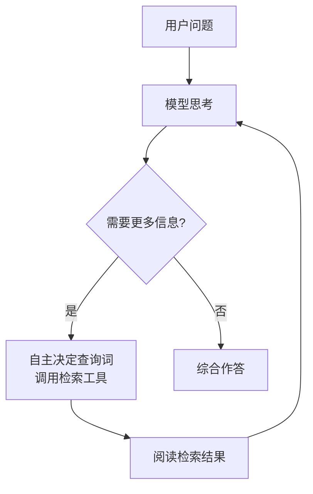

## 5.1 从单轮流水线到 Agentic 检索

前四章描述的 RAG 是一条**单轮流水线**：检索一次，把结果塞进 prompt，生成，结束。整个过程里模型是被动的——检索什么、检索几条，全由流水线的固定逻辑决定，模型只负责拿到什么读什么。

这个形态在 2026 年已经不是主流产品的形态了。变化的推手是**工具调用**（tool use）能力的成熟：现代模型可以在生成过程中决定调用外部工具、拿到结果、继续推理。一旦把"检索"做成一个工具交给模型，格局就变了——**检索从流水线的固定环节，变成了模型手里的一个可反复使用的动作**。这就是 **agentic 检索**（agentic retrieval / agentic RAG）：

与单轮 RAG 逐项对比，模型获得了四种此前没有的自由：**决定搜什么**——它可以把用户的含糊问题自行拆解改写成多个精准查询（第 3 章的查询改写不再是外挂环节，而是模型的内生行为）；**决定搜几轮**——第一轮结果不理想，换个关键词再来，直到够用为止；**决定要不要搜**——简单问题直接答，不浪费检索；**边读边调整**——读了第一批资料后发现新线索，顺着线索追下去。

你大概率已经用过它的产品化形态：各家聊天助手的"深度研究"（deep research）模式——给一个课题，模型自主搜索、阅读、再搜索，十几分钟后交出一篇带几十条引用的综述。那就是 agentic 检索开到最大档的样子。

代价同样明确：多轮检索意味着**延迟和 token 成本成倍增长**，且行为不再确定（同一个问题两次运行的检索轨迹可能不同），评估也更难——第 4 章的方法要扩展到"整条轨迹"的层面。所以单轮 RAG 并没有被淘汰：延迟敏感、问题模式固定的场景（客服、FAQ），单轮流水线依旧是正解。工程判断从"要不要 RAG"变成了"这个场景配多大的自主性"。

值得强调的是：**agentic 检索没有取代前四章，而是把前四章包了一层**。模型自主调用的那个"检索工具"，内部仍然是切块、embedding、混合检索、重排——底层检索质量差，模型只是更快地发现"搜不到"，然后在垃圾结果里多绕几圈。地基还是那个地基。

## 5.2 一个反例：编程助手为什么用 grep

按前四章的逻辑推演，AI 编程助手（Claude Code、Cursor 这些你可能天天在用的工具）检索代码库，理应给全部代码建向量索引、语义检索相关片段。但 2026 年的现实是：主流编程助手的第一方案是 **grep 加文件树导航**——正则/关键词搜索，配上"打开这个文件看看"的浏览动作。老掉牙的词法检索，为什么？

这个反例值得认真拆解，因为它揭示了选择检索方案的深层逻辑：

**代码的查询天然是精确匹配。** 找一个函数的定义和调用处，函数名就是唯一标识符——`parseConfig` 就是 `parseConfig`，一个字都不能差。这正是第 2 章说的词法检索的主场、语义检索的死穴："语义相近"的 `loadConfig`、`parseSettings` 恰恰是干扰项。

**代码自带结构，不需要猜。** 自然语言文档要靠切块和 embedding 去近似"语义单元"，而代码的结构是显式的：文件、模块、函数、import 关系。沿着 import 跳转，比任何向量相似度都准。

**代码库变得太快。** 向量索引是离线建的，而开发中的代码每分钟都在改。索引里的代码和磁盘上的代码永远存在时差，检索到过期版本比检索不到更危险。grep 永远搜的是**此刻磁盘上的真实内容**，零索引、零时差。

**agentic 多轮弥补了召回的不足。** grep 单次召回确实不如语义检索广——但编程助手是 agentic 的：第一次没搜到就换个词再搜，看了文件 A 发现线索再去搜文件 B。多轮的自适应把单轮召回的短板补上了。

这个案例的教益超出编程场景：**检索方案没有普适的优劣，只有与数据特性、查询特性、时效要求的匹配度**。数据精确结构化、查询是标识符、内容高频变化——词法 + 结构导航赢；数据是自然语言、查询是模糊语义、内容相对静态——向量检索赢。第 2 章讲的"两大家族各有主场"，在这里完成了最生动的注脚。

## 5.3 GraphRAG 与多跳：普通 RAG 答不了的两类问题

回到向量 RAG 自身，还有两类问题是它结构性答不好的，2026 年各有对应的扩展方案。

**全局性问题。** 问"这本书的核心论点是什么""这批财报共同反映了什么趋势"——这类问题的答案不在任何单个块里，而弥散在全部文档中。而 RAG 的基本假设恰恰是"答案存在于某几个块中"：无论 top-k 开多大，捞回来的都是碎片，让模型从 5 个碎片总结整本书，无异于盲人摸象。**GraphRAG**（微软 2024 年提出）的解法是把功课做在离线：用 LLM 通读语料，抽取实体和关系构建**知识图谱**，再对图谱做社区检测（community detection），把每个社区（一簇紧密关联的实体，对应语料的一个主题）预先生成**层级式摘要**。回答全局问题时，检索的不是原文块，而是这些不同层级的社区摘要——相当于预先做好了"从细节到主题"的地图，全局问题查地图，局部问题查街景。代价是索引阶段的大量 LLM 调用，语料一变还得增量更新，属于重资产方案。

**多跳问题。** 问"A 书里讲的注意力机制，和 B 书里讲的重排序有什么联系？"——回答它需要先检索 A 的注意力、再检索 B 的重排序、再综合推理，**一次检索原理上就够不着**。这叫**多跳推理**（multi-hop reasoning）。传统解法是把"检索→推理→再检索"写成固定流程（iterative retrieval），而 5.1 节之后你应该立刻意识到：agentic 检索天然就是多跳的——模型自己会拆解、分头检索、综合。事实上这正是 2026 年多跳问题的主流答案：与其设计精巧的多跳流水线，不如把检索工具交给一个足够强的模型。

## 5.4 长上下文之争：都能塞下了，还检索什么

现在直面这个绕不开的争论。2026 年，主流模型的上下文窗口已达百万 token 量级——足够塞进几本书。而且新一代模型在"大海捞针"测试上的表现远超 lost in the middle 论文的年代，长上下文的利用质量是实打实地提高了。于是一个尖锐的声音每隔几个月就热一次：**既然能把整个知识库塞进上下文，RAG 是不是死了？**

这个问题值得一个诚实的、不护短的回答。先承认长上下文阵营说对的部分：**在文档总量能装进窗口的场景下，直接全塞确实比 RAG 简单且效果常常更好**——没有切块损耗、没有检索失误，模型看到的是完整文档。一次性的"读这份合同回答问题"，别搭什么检索系统，塞进去就是了。第 1 章那个"朴素方案"，在它的适用范围内始终是正解，而这个适用范围确实在逐年扩大。

但把结论推广到"RAG 已死"，要跨过四道跨不过去的坎：

**规模的坎。** 百万 token 约合几十万汉字——几本书的量级。而企业知识库、论文库、法律判例库动辄千万上亿 token，差着两到四个数量级。窗口的增长追不上数据的增长，"全塞"对严肃的知识库规模在物理上就不成立。

**成本与延迟的坎。** 就算塞得下：token 是按量计费的，每一次提问都把百万 token 完整处理一遍，成本和首 token 延迟都高得离谱。**缓存**（prompt caching，把不变的长前缀在服务端缓存复用）能把重复部分的成本压下一个数量级，确实显著改善了"同一批文档反复问"的场景——但缓存有时效、文档一变就失效，且再便宜也贵过"根本不塞进来"。检索的本质是**把计算花在挑选上，省掉阅读无关内容的钱**，这笔账在大规模下永远成立。

**权限的坎。** 企业场景里不同用户对文档的访问权限不同。RAG 在检索层做权限过滤（只检索该用户可见的文档）自然而然；"全塞"则意味着要么为每种权限组合维护一份上下文，要么把用户无权看的内容也塞给模型——后者是安全事故。

**溯源的坎。** RAG 的答案天然可以标注"来自哪个文档哪一段"（检索结果就是证据链）；整库塞进去之后，模型说了什么就只能信什么，可验证性回到了纯参数化知识的水平。

所以 2026 年的工程共识不是二选一，而是**分层协作**：检索负责从海量数据里**选材**，长上下文负责**装下选出来的材料并用好它**。窗口变大改变的是"选多少"——从当年抠抠搜搜的 top-3×500 token，到如今可以豪爽地送进几十个大块甚至几篇完整文档（第 3 章 small-to-big 的思路顺势升级：检索定位到章节，整章喂给模型）。长上下文不是 RAG 的替代品，而是**让 RAG 的检索层可以更粗放、更宽容的解压阀**——检索不必再追求百发百中，捞回一批"大概率相关"的材料，剩下的甄别交给模型在窗口里完成。

## 5.5 RAG 的位置：从明星技术到基础设施

最后把五年的曲线连起来看。2020 年，RAG 是一篇论文里的模型架构；2023 年，它是生成式 AI 落地潮里最热的词，专门的"RAG 工程师"岗位一度出现；2026 年，热词的光环褪去，取而代之的是它**消失在了各种产品的底层**——联网搜索、企业知识库、深度研究、编程助手的代码检索、聊天助手的长期记忆，内核全是"检索 + 生成"，只是没人再逢人便说这是 RAG。

这条曲线在技术史上反复出现：一项技术真正成熟的标志，不是被谈论得最多，而是**成为默认组件、不再被单独谈论**。数据库如此，HTTP 如此，RAG 亦然。所以对"RAG 已死"的争论，最准确的回答或许是：**作为热词，它确实在死去；作为架构，它无处不在**。变的是形态——从固定流水线到 agentic 工具，从纯向量到混合、图谱、结构导航各取所需；不变的是那个朴素的内核，也就是第 1 章开卷考试的比喻：**让模型在回答之前，先拿到正确的资料**。

原理、工程、评估、现实——纸上的部分到此全部讲完。是时候把手弄脏了：下一章从第一行代码开始，给你自己的资料库搭一个完整的问答系统，把前五章的每一个概念都变成能跑的代码。

:::callout-tip 本章要点
- Agentic 检索 = 把检索做成工具交给模型：自主决定搜什么、搜几轮、要不要搜；深度研究模式是其产品形态。它包裹而非取代基础检索层。
- 编程助手用 grep 的启示：检索方案只有与数据/查询/时效特性的匹配度，没有绝对优劣——精确标识符 + 高频变化 + 显式结构的场景，词法与结构导航完胜向量。
- 全局性问题 → GraphRAG（离线建图谱 + 社区层级摘要）；多跳问题 → agentic 多轮检索已成主流解。
- 长上下文之争的诚实结论：能全塞的场景全塞更好且范围在扩大，但规模、成本延迟、权限、溯源四道坎决定了大规模场景仍需检索；终局是"检索选材 + 长上下文用材"的分层协作。
- RAG 正在以"热词死去、架构永生"的方式完成基础设施化。
:::
