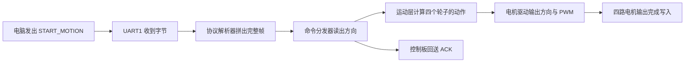
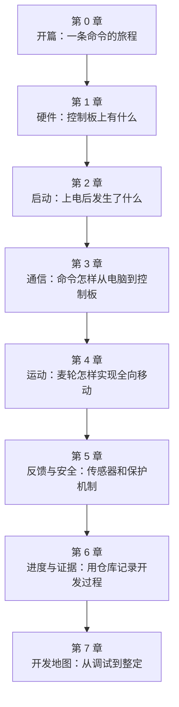

## 在开始之前

这本书要讲的，是一台机器人"从内部看"是怎样工作的。

你有没有想过：当你在电脑上点了一个"向前"按钮，机器人是怎样理解这个指令、然后真正转动轮子的？这背后涉及的并不只是"写一个程序"那么简单——它需要两台计算机配合、需要一套约定好的通信规则、需要把抽象的文字指令变成电机的转动。

这个领域有一个名字，叫**嵌入式（embedded systems）**。简单来说，嵌入式就是"把一台微型电脑塞进一个设备里，让它专门控制这个设备"。你身边的洗衣机、电梯、空调遥控器，里面都有这样的微型电脑在工作。我们这本书里的机器人控制板，也是一个嵌入式系统。

不用担心——**你不需要提前懂编程或电子电路**。每个术语在第一次出现时，我们都会用日常生活中的比喻来解释它。慢慢来，跟着这条命令一步一步走，你一定能看懂。

:::callout 🎯 本章你会学到
- 机器人里"上位机"和"下位机"分别是什么，它们怎样分工
- 一条"向前"命令从电脑到电机，中间会经过哪些步骤
- 为什么程序要分成好几层，每层各做什么
- 本书的整体结构和阅读方法
:::

## 调试台边的一次"向前"

先设想一个调试场景：机器人被牢牢固定在调试架上，四个轮子悬空，不会真的冲出去。上位机的调试界面已经打开，操作员正准备点击"向前"按钮。

现在问题来了：电脑说"向前"，机器人怎么听懂？"向前"这两个字并不能直接让轮子转起来——它需要被翻译、被传输、被检查、被拆解，最终才能变成电机的实际动作。这个过程，就是我们整本书要追踪的旅程。

这个场景就是我们阅读源码的入口。实际比赛时界面可能更复杂，实车动作也会受到场地、负载的影响，但在这里，我们只关注源码能够证明的旅程——从"电脑发出命令"一直到"电机开始转动"。

## 命令是怎样被传递的

当操作员点击按钮后，上位机软件会把"开始向前运动"这条语义编码成一串**字节（byte）**。

:::callout 💡 零基础小课堂：什么是字节？
一个字节就是一个 0 到 255 之间的数字。计算机之间传递信息时，所有内容——文字、命令、图片——最终都会变成一连串这样的数字。你可以把字节想象成一个个小积木块，电脑用不同的积木组合来表达不同的含义。
:::

这些字节会沿着**串口（serial port）**线进入控制板。

:::callout 💡 零基础小课堂：什么是串口？
串口就像两台设备之间的一根"对讲机连接线"。数据通过这根线，一个字节接一个字节地依次传送（所以叫"串"口——串成一串）。在我们的项目里，电脑（上位机）和控制板（下位机）就是通过串口来对话的。
:::

控制板收到字节后，会一边接收，一边检查：这串字节是不是一个完整的命令？有没有在传输中被干扰？命令号代表什么？需要几个参数？等一切核对无误，控制板才会认出"向前"这个方向，再把对应的控制量送到电机输出接口。到这里，源码能够证明的旅程已经从"通信"走到了"硬件**寄存器**（register，芯片内部的小格子，往里写数字就能控制硬件的行为）"。

这条命令在代码中的名字叫 `START_MOTION`。`start` 表示开始，`motion` 表示运动。它会让控制板持续输出 **PWM（一种控制电机转速的方式，第 1 章会详细讲）**，驱动四个轮子向前转动，直到 `STOP_MOTION` 命令到达，或者有新的命令改写当前输出。换句话说，`START_MOTION` 不是"走一步就停"，而是"进入向前的运动状态"，直到被明确停止或覆盖。

本书会一直跟着这条命令走。我们先看电脑和控制板如何分工，再认识 STM32、串口、电机和传感器这些"演员"，随后从上电启动走进中断、缓冲区、**协议（protocol，两台设备之间约好的通信规则，就像两个人事先商量好的暗号）**解析器、命令分发器和运动控制层。当最终走到四路电机输出被写入时，整个项目也会从一组看似零散的目录，变成一条连贯的故事线。

下面这张流程图展示的就是 `START_MOTION` 从电脑到电机的完整旅程。你不需要现在就记住每一步——它是我们的"阅读地图"，以后每次打开一个源文件，都可以回来看看：这条命令现在走到了图里的哪一步？

> **初学者小提示**：上面这张图是我们的"阅读地图"，不只是好看的插图。以后每次打开一个源文件，都可以问自己：这条命令现在走到了图里的哪一步？这样就不会迷失在细节里。

## 两台计算机，各自做擅长的事

机器人里常见两种角色：**上位机**和**下位机**。这两个名字描述的是分工关系，而不是某个固定的硬件型号。

:::callout 💡 零基础小课堂：上位机和下位机
想象一场战斗。**上位机（host computer）**就像"司令部"——它拿着地图，制定战略，决定部队往哪里走。**下位机（lower controller）**就像"前线执行者"——它在现场操控坦克，踩油门、打方向盘、紧急刹车。

司令部不需要自己开坦克，但它需要把命令准确传达给前线。前线不需要了解整场战役的全局，但它必须在几毫秒内完成每一个动作。两者各自做自己最擅长的事，合作才能顺畅。

在我们的机器人里：
- **上位机**可以是一台笔记本电脑、一个工控机，甚至一块性能较强的单板计算机。它负责界面、路径规划、视觉识别和任务安排。
- **下位机**通常是 STM32 这样的微控制器板。它靠近电机和传感器，负责按稳定的节奏收发数据、控制引脚和处理紧急动作。
:::

> **常见的疑问**：为什么不让上位机直接控制电机？
>
> 理论上可以，但实际上上位机运行的是通用操作系统，调度不够确定，一次操作可能经过几十毫秒甚至更久才真正影响到引脚。而机器人控制需要毫秒级甚至微秒级的响应——电机电流突变、编码器脉冲、急停信号都要求立刻处理。下位机专门干这件事，比上位机更可靠。

司令部说"向前"，前线执行者还要把这句话落实成许多细节：方向是否有效？车辆当前是否允许动作？四个轮子分别朝哪边转？输出多大的动力？什么时候停下？这些细节就是下位机**固件（firmware）**的工作内容。

:::callout 💡 零基础小课堂：什么是固件？
固件就是"住在芯片里的程序"。普通电脑上的程序面对的是文件、窗口和网络；固件直接面对的是电压、引脚、定时器和中断。它被烧录进芯片的存储空间里，上电后直接运行，不需要像普通软件那样先经过复杂的启动过程。你可以把固件想象成一台洗衣机里内置的控制程序——你看不到它，但它在默默指挥着一切。
:::

RoboGame 2026 当前仓库负责的正是这部分工作。根目录的 `README.md` 把它称为"机器人比赛下位机固件仓库"，目标包括接收上位机命令、执行底盘与机构动作，并按通信协议返回信息。

## STM32 是机器人的现场管家

这块控制板的核心是 STM32F407 系列微控制器。仓库中的 Keil 工程把目标设备写为 `STM32F407VE`，C50C 原理图上标出了 `F407VET6`。**微控制器（microcontroller，MCU）**是一颗适合控制现场设备的小型计算机，处理器、存储器和许多外设都放在同一颗芯片里。

可以把 MCU 想成场馆里的现场管家。串口来消息时，它会立刻接收；定时器到点时，它会更新控制节奏；编码器产生脉冲时，它可以记录轮子转了多少；程序要求改变 PWM 时，它会把结果送到电机驱动电路。它的价值来自稳定、及时和贴近硬件。你不需要给它配内存条、显卡和硬盘，它自己就能独立完成这些控制任务。

上位机和 STM32 之间传递的就是前面说过的字节。电脑里的 `START_MOTION` 最终也会变成若干字节。STM32 收到这些数字时，需要先判断哪里是开头、这是什么类型的消息、里面有几个参数、传输过程中有没有出错。完成这些检查以后，"数字"才恢复成"向前运动"这层含义。

这就像快递运输。寄件人不会把一句口头要求直接丢进货车，而会准备包装、地址、单号和封条。接收方先核对包装，再打开盒子取出真正的内容。通信协议就是双方共同遵守的打包方法。如果包装破损或者单号对不上，接收方就会拒收或者要求重发——对应到代码里，就是"校验失败"或"返回错误码"。

> **初学者小提示**：刚开始看协议代码时，不要急着理解每一个字段。先抓住三个问题：帧头是什么？命令号在哪里？校验是怎么做的？剩下的字段可以慢慢补。

## 一份原厂工程，长出一条新的业务主线

这个项目建立在 WHEELTEC 原厂工程之上。原工程已经带有 STM32 启动代码、FreeRTOS、串口、电机、编码器、OLED、蜂鸣器和 ICM20948 驱动，也包含多种车型与手柄控制相关的业务代码。可以说，原厂工程已经把"一辆车能跑起来"所需的基础设施都准备好了。Keil 工程当前目标名是 `Mec_Car`，编译宏中保留了 `MEC_CAR`，说明底盘目标采用麦轮车型。

比赛项目需要一套更清楚的命令链。仓库为此增加了 `LOWER_CONTROLLER/`，把新业务分成应用、协议、通信、运动、执行机构、传感器、板级配置和公共工具。原厂的 `HARDWARE/` 继续提供成熟的底层接口，新代码通过清楚的模块边界调用这些接口。

这样的结构像在已有厂房里重新规划生产线。供电、传送带和电机设备仍然可用，新生产线把"收订单、验订单、安排工位、完成加工、回报结果"分开。以后更换通信端口时，主要看 `TRANSPORT` 和 `BOARD`；修改麦轮动作时，主要看 `MOTION`；接入夹爪时，工作会落在 `ACTUATORS`。文件夹名称因此也成了阅读地图。

| 位置 | 初学者可以把它看成 | 当前作用 |
| --- | --- | --- |
| `USER/` | 大门与总电闸 | 上电入口、硬件初始化、创建任务 |
| `LOWER_CONTROLLER/APP/` | 调度台 | 运行主任务、分发命令、组织响应 |
| `LOWER_CONTROLLER/PROTOCOL/` | 翻译室 | 判断帧是否完整，读出命令和参数 |
| `LOWER_CONTROLLER/TRANSPORT/` | 收发室 | 通过 UART1 接收和发送字节 |
| `LOWER_CONTROLLER/MOTION/` | 底盘工位 | 把运动方向变成四轮输出 |
| `HARDWARE/` | 设备间 | 提供电机、编码器、IMU 等底层驱动 |

> **小结**：原厂代码像一台已经组装好的车，比赛新增的业务像是一套新的控制流程。`LOWER_CONTROLLER/` 负责把上位机的语言翻译成车辆动作，`HARDWARE/` 负责保证基础设备还能正常工作。

## 程序为什么要分层

在看代码的分层之前，我们先想一个日常生活中的例子：一家餐厅。

餐厅里有三类人：**服务员**负责和顾客沟通，记下点的菜；**厨师**负责按菜单做菜；**洗碗工**负责保证餐具干净可用。每个人只关心自己那部分工作。如果让服务员一边端盘子一边炒菜一边洗碗，餐厅很快就会乱套。

程序也是一样。假设串口接收函数一看到方向码，就直接改四个电机的寄存器——起初代码会很短，但加入 CAN 通信时，CAN 的接收函数也要理解电机接线；加入急停时，急停处理要同时面对通信细节和硬件寄存器。修改一个字段可能牵动很多文件，出了问题也很难定位。

所以当前工程让每层只回答一个清楚的问题，就像餐厅里的分工：

- `TRANSPORT`（收发室 → 服务员）："字节从哪里来，怎么可靠地收发"；
- `PROTOCOL`（翻译室 → 菜单）："这些字节能否组成合法消息，命令和参数是什么"；
- `APP`（调度台 → 前厅经理）："这条命令要交给谁处理，要不要回确认"；
- `MOTION`（底盘工位 → 厨师）："四个轮子怎样配合才能实现这个方向"；
- `HARDWARE`（设备间 → 灶台和餐具）："怎样写入真实引脚和定时器"。

这种分层还让排错更有方向。控制板完全收不到数据时，先检查 UART1 和中断；能收到帧却返回参数错误时，检查协议和参数长度；ACK 显示成功而轮子不动时，继续查看运动映射、电机方向脚和 PWM。每一层都像走廊里的一扇门，顺着命令经过的顺序逐个检查，问题会逐渐缩小。

> **初学者常见疑问**：分层会不会让代码变慢？
>
> 多一层函数调用确实会多花一点点时间，但现代 MCU 的时钟频率足够高，这点开销通常远小于通信延迟和电机响应时间。分层带来的可读性和可维护性收益要大得多。真正需要压榨性能的地方，比如 PWM 更新、编码器捕获，仍然可以直接操作硬件寄存器。

## 同一条命令，会换好几种模样

沿着主线阅读时，`START_MOTION` 会不断改变外观。在上位机界面里，它对应一次按钮操作；进入协议后，它成为命令号 `04` 和两个参数；进入 C 语言代码后，它成为**枚举**（enum，一组有名字的编号，比如用 `CMD_START_MOTION = 0x04` 代替数字 4）和**结构体**（struct，把几个相关的数据打包在一起的容器）与函数调用；进入运动层后，它成为四个轮位的正负输出；抵达硬件时，它最终表现为方向引脚的高低电平和 PWM 寄存器里的数值。

这些外观都在描述同一件事，只是每层关心的问题不同。协议层看到 `01` 时，把它解释成"向前"；运动层看到"向前"时，生成四轮组合；板级配置再把"左前轮"对应到电机 A。学习嵌入式项目的关键动作，就是追踪含义怎样从一层传到下一层。

| 阶段 | START_MOTION 的模样 | 关注点 |
| --- | --- | --- |
| 上位机界面 | 一次按钮点击 | 人机交互 |
| 通信字节流 | 命令号 `0x04` + 方向 + 速度 | 帧格式与校验 |
| APP/协议层 | 枚举值与结构体 | 命令分发与参数检查 |
| MOTION 层 | 四个轮子的目标速度/方向 | 麦轮运动学 |
| HARDWARE 层 | PWM 占空比 + 方向引脚电平 | 寄存器与电路 |

初读源码时，可以先抓住函数之间的接力。看到 `command_dispatcher_handle_frame()`，就去找它在哪里被调用；看到 `motion_start_motion()`，就继续寻找它怎样设置轮位；看到 `PWMA`，再回到电机头文件确认它对应哪个定时器通道。这样阅读会始终围绕一个具体问题展开，目录再多也有清楚方向。

后面的章节会在代码片段旁解释参数从哪里来、返回值去向何处。完整源码仍保留在仓库中，短片段负责照亮当前这一段路。读者掌握主线以后，再进入驱动细节、寄存器配置和控制算法，会更容易看出每段代码在整台机器人中的位置。

## 全书阅读地图

下面这张图展示了本书全部 8 章的内容安排。你可以把它当作一张导航图——随时回来看看自己读到了哪里，接下来要去哪里。

:::callout-tip 阅读建议
你不需要严格按顺序阅读。如果你对某个话题特别好奇，可以跳到对应章节。不过，第 0 章到第 3 章建立了许多基础概念，建议第一遍先按顺序读完这几章。
:::

## 本书怎样使用仓库证据

书中的配置和进度以 2026 年 7 月 14 日的仓库 `fc3ef5d` 为依据。启动过程来自 `USER/main.c` 与 `USER/system.c`，串口路径来自 `TRANSPORT` 和 `BOARD`，帧格式来自生成的协议代码，电机动作来自 `MOTION`。Keil 工程文件 `USER/WHEELTEC.uvprojx` 用来确认哪些新文件已经加入编译目标。

仓库已经接通 UART 接收、协议解析、命令分发、ACK 返回以及部分固定 PWM 运动命令。升降、夹爪、推杆、传感器抽象和闭环运动仍处在后续接入位置。编译、烧录和整车运行的实机记录还需要继续补入仓库。书里会把代码中已经存在的行为讲清楚，也会把等待验证的部分写明。

> **给初学者的阅读建议**：
>
> 1. 第一遍先通读本章，不用记代码路径，只建立"命令从电脑到电机"的整体印象。
> 2. 第二遍打开仓库，对照本章的目录表格，找到每个文件所在的位置。
> 3. 第三遍开始跟读具体函数，沿着 `START_MOTION` 的路径逐层深入。

现在，电脑一端已经准备发出 `START_MOTION`。在追赶这些字节之前，我们先看看它将要进入怎样的一块控制板。芯片、电机、编码器和 IMU 各自扮演什么角色，决定了后面的代码为什么会写成今天的样子。

## 本章新词

| 术语 | 英文 | 一句话解释 |
|------|------|-----------|
| 嵌入式 | Embedded Systems | 把一台微型电脑塞进设备里，让它专门控制这个设备 |
| 上位机 | Host Computer | 像司令部一样制定战略的计算机，负责界面、规划和决策 |
| 下位机 | Lower Controller | 像前线执行者一样操控硬件的控制板，负责实时控制 |
| 字节 | Byte | 一个 0 到 255 之间的数字，是计算机传递信息的基本单位 |
| 串口 | Serial Port | 两台设备之间的"对讲机连接线"，数据一个字节一个字节地依次传送 |
| 固件 | Firmware | "住在芯片里的程序"，直接控制电压、引脚和定时器 |
| 协议 | Protocol | 两台设备之间约好的通信规则，就像事先商量好的暗号 |
| PWM | Pulse Width Modulation | 一种控制电机转速的方式（第 1 章详细讲） |
| 寄存器 | Register | 芯片内部的小格子，往里写数字就能控制硬件的行为 |
| 微控制器 | Microcontroller (MCU) | 一颗适合控制现场设备的小型计算机，处理器和存储器集成在同一颗芯片里 |
| 枚举 | Enum | 一组有名字的编号，用名字代替容易记错的数字 |
| 结构体 | Struct | 把几个相关的数据打包在一起的容器 |
