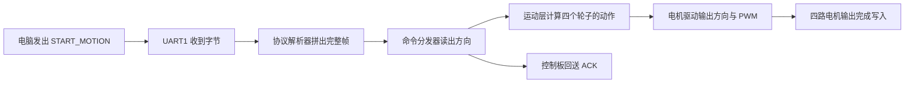

## 调试台边的一次“向前”

先设想一个调试场景：机器人固定在调试架上，四个轮子悬空；上位机准备发送一条“向前”命令。这个场景用来带领我们阅读源码，实际界面和实车动作以后续联调记录为准。

上位机把“开始向前运动”编码成一条命令。命令通过串口线进入控制板，控制板检查内容，认出方向，再把四路控制量送到电机输出接口。到这里，源码能够证明的旅程已经从通信走到了硬件寄存器。

这条命令在代码中的名字叫 `START_MOTION`。`start` 表示开始，`motion` 表示运动。它会让 PWM 输出持续保持，直到 `STOP_MOTION` 到达或新的命令改写输出。

本书会一直跟着这条命令。我们先看电脑和控制板如何分工，再认识 STM32、串口、电机和传感器，随后从上电走进中断、缓冲区、协议解析器、命令分发器和运动控制层。走到四路电机输出写入时，整个项目也会从一组目录变成一条连贯的故事。

## 两台计算机，各自做擅长的事

机器人里常见两种角色：**上位机（host computer）**和**下位机（lower controller）**。这两个名字描述的是分工关系。

上位机通常拥有更强的计算能力，适合处理界面、路径、视觉和任务安排。它像拿着地图的领航员，知道接下来要往哪里走。下位机靠近电机和传感器，适合按稳定的节奏收发数据、控制引脚和处理紧急动作。它像坐在驾驶位上的驾驶员，双手握着方向盘，双脚能够及时踩下踏板。

领航员说“向前”，驾驶员还要把这句话落实成许多细节：方向是否有效，车辆是否允许动作，四个轮子分别朝哪边转，输出多大的动力，什么时候停下。RoboGame 2026 当前仓库负责的正是这部分工作。根目录的 `README.md` 把它称为“机器人比赛下位机固件仓库”，目标包括接收上位机命令、执行底盘与机构动作，并按通信协议返回信息。

这里的“固件（firmware）”可以理解为住在控制板里的程序。普通电脑上的程序常常面对文件、窗口和网络；固件直接面对电压、引脚、定时器和中断。它一边要懂“向前”这样的业务含义，一边要知道哪一个寄存器会改变电机的 PWM。

## STM32 是机器人的现场管家

这块控制板的核心是 STM32F407 系列微控制器。仓库中的 Keil 工程把目标设备写为 `STM32F407VE`，C50C 原理图上标出了 `F407VET6`。 **微控制器（microcontroller，MCU）** 是一颗适合控制现场设备的小型计算机，处理器、存储器和许多外设都放在同一颗芯片里。

可以把 MCU 想成场馆里的现场管家。串口来消息时，它会立刻接收；定时器到点时，它会更新控制节奏；编码器产生脉冲时，它可以记录轮子转了多少；程序要求改变 PWM 时，它会把结果送到电机驱动电路。它的价值来自稳定、及时和贴近硬件。

上位机和 STM32 之间传递的是一个个**字节（byte）**。一个字节由 8 个二进制位组成，可以表示 `0` 到 `255`。电脑里的 `START_MOTION` 最终也会变成若干字节。STM32 收到这些数字时，需要先判断哪里是开头、这是什么类型的消息、里面有几个参数、传输过程中有没有出错。完成这些检查以后，“数字”才恢复成“向前运动”这层含义。

这就像快递运输。寄件人不会把一句口头要求直接丢进货车，而会准备包装、地址、单号和封条。接收方先核对包装，再打开盒子取出真正的内容。通信协议就是双方共同遵守的打包方法。

## 一份原厂工程，长出一条新的业务主线

这个项目建立在 WHEELTEC 原厂工程之上。原工程已经带有 STM32 启动代码、FreeRTOS、串口、电机、编码器、OLED、蜂鸣器和 ICM20948 驱动，也包含多种车型与手柄控制相关的业务代码。Keil 工程当前目标名是 `Mec_Car`，编译宏中保留了 `MEC_CAR`，说明底盘目标采用麦轮车型。

比赛项目需要一套更清楚的命令链。仓库为此增加了 `LOWER_CONTROLLER/`，把新业务分成应用、协议、通信、运动、执行机构、传感器、板级配置和公共工具。原厂的 `HARDWARE/` 继续提供成熟的底层接口，新代码通过清楚的模块边界调用这些接口。

这样的结构像在已有厂房里重新规划生产线。供电、传送带和电机设备仍然可用，新生产线把“收订单、验订单、安排工位、完成加工、回报结果”分开。以后更换通信端口时，主要看 `TRANSPORT` 和 `BOARD`；修改麦轮动作时，主要看 `MOTION`；接入夹爪时，工作会落在 `ACTUATORS`。文件夹名称因此也成了阅读地图。

| 位置 | 初学者可以把它看成 | 当前作用 |
| --- | --- | --- |
| `USER/` | 大门与总电闸 | 上电入口、硬件初始化、创建任务 |
| `LOWER_CONTROLLER/APP/` | 调度台 | 运行主任务、分发命令、组织响应 |
| `LOWER_CONTROLLER/PROTOCOL/` | 翻译室 | 判断帧是否完整，读出命令和参数 |
| `LOWER_CONTROLLER/TRANSPORT/` | 收发室 | 通过 UART1 接收和发送字节 |
| `LOWER_CONTROLLER/MOTION/` | 底盘工位 | 把运动方向变成四轮输出 |
| `HARDWARE/` | 设备间 | 提供电机、编码器、IMU 等底层驱动 |

## 程序为什么要分层

假设串口接收函数一看到方向码，就直接改四个电机的寄存器。起初代码会显得很短。后来加入 CAN 通信、距离运动、急停和闭环控制时，每一种通信方式都要理解电机接线，每一种运动功能也会夹杂帧格式。修改一个字段便可能牵动很多文件。

当前工程让每层只回答一个清楚的问题。`TRANSPORT` 关心“字节从哪里来”；`PROTOCOL` 关心“这些字节能否组成合法消息”；`APP` 关心“这条命令要交给谁”；`MOTION` 关心“四个轮子怎样配合”；`HARDWARE` 关心“怎样写入真实引脚和定时器”。

这种分层还让排错更有方向。控制板完全收不到数据时，可以先检查 UART1 和中断。能收到帧却返回参数错误时，可以检查协议和参数长度。ACK 显示成功而轮子不动时，可以继续查看运动映射、电机方向脚和 PWM。每一层都像走廊里的一扇门，顺着命令经过的顺序检查，问题会逐渐缩小。

## 同一条命令，会换好几种模样

沿着主线阅读时，`START_MOTION` 会不断改变外观。在上位机界面里，它可能对应一次按钮操作；进入协议后，它成为命令号 `04` 和两个参数；进入 C 语言代码后，它成为枚举、结构体与函数调用；进入运动层后，它成为四个轮位的正负输出；抵达硬件时，它最终表现为方向引脚的高低电平和 PWM 寄存器里的数值。

这些外观都在描述同一件事，只是每层关心的问题不同。协议层看到 `01` 时，把它解释成“向前”；运动层看到“向前”时，生成四轮组合；板级配置再把“左前轮”对应到电机 A。学习嵌入式项目的关键动作，就是追踪含义怎样从一层传到下一层。

初读源码时，可以先抓住函数之间的接力。看到 `command_dispatcher_handle_frame()`，就去找它在哪里被调用；看到 `motion_start_motion()`，就继续寻找它怎样设置轮位；看到 `PWMA`，再回到电机头文件确认它对应哪个定时器通道。这样阅读会始终围绕一个具体问题展开，目录再多也有清楚方向。

后面的章节会在代码片段旁解释参数从哪里来、返回值去向何处。完整源码仍保留在仓库中，短片段负责照亮当前这一段路。读者掌握主线以后，再进入驱动细节、寄存器配置和控制算法，会更容易看出每段代码在整台机器人中的位置。

## 本书怎样使用仓库证据

书中的配置和进度以 2026 年 7 月 14 日的仓库 `fc3ef5d` 为依据。启动过程来自 `USER/main.c` 与 `USER/system.c`，串口路径来自 `TRANSPORT` 和 `BOARD`，帧格式来自生成的协议代码，电机动作来自 `MOTION`。Keil 工程文件 `USER/WHEELTEC.uvprojx` 用来确认哪些新文件已经加入编译目标。

仓库已经接通 UART 接收、协议解析、命令分发、ACK 返回以及部分固定 PWM 运动命令。升降、夹爪、推杆、传感器抽象和闭环运动仍处在后续接入位置。编译、烧录和整车运行的实机记录还需要继续补入仓库。书里会把代码中已经存在的行为讲清楚，也会把等待验证的部分写明。

现在，电脑一端已经准备发出 `START_MOTION`。在追赶这些字节之前，我们先看看它将要进入怎样的一块控制板。芯片、电机、编码器和 IMU 各自扮演什么角色，决定了后面的代码为什么会写成今天的样子。
