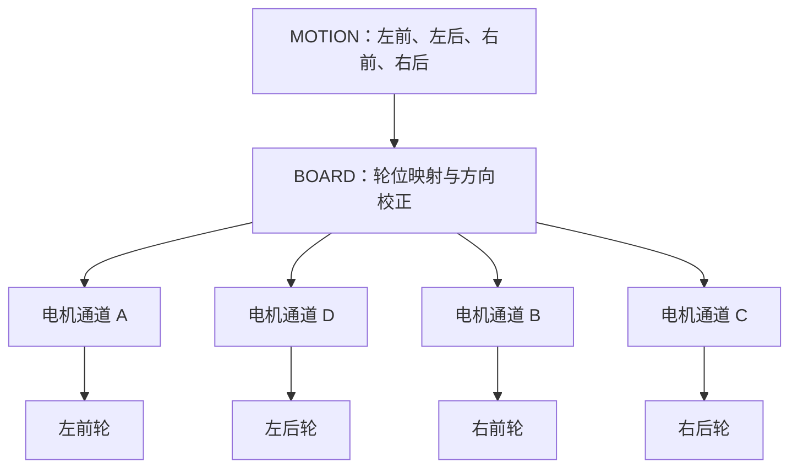

## 命令来到控制板门口

上一章里，电脑已经准备好一条 `START_MOTION`。在它变成四个轮子的动作之前，我们先沿着串口线走到控制板旁边。

一块控制板看上去布满芯片、插座和走线。初学者容易把它看成一整块难懂的黑盒。换一个角度，它更像机器人的身体：STM32 负责组织工作，串口负责听取消息，电机输出像肌肉，编码器与 IMU 提供感觉，蜂鸣器和 OLED 帮助人了解现场状态。每个部件只负责一小段任务，组合起来才完成一次运动。

仓库根目录有一份 C50C 原理图。图中主控标记为 `F407VET6`，Keil 工程的目标设备写成 `STM32F407VE`。这里的核心型号都指向 STM32F407 系列，工程按这个芯片系列选择启动文件、寄存器定义和下载算法。

## STM32F407：站在现场中央的指挥者

**STM32F407 微控制器（microcontroller，MCU）** 是一颗能够独立运行固件的芯片。它里面有处理器，也有串口、定时器、GPIO 等外设。GPIO 的全称是 General-Purpose Input/Output，中文常叫通用输入输出口。它像一排可以安排不同工作的门：有的门读取开关电平，有的门输出电机方向，有的门切换到串口或定时器功能。

微控制器很适合守在机器人现场。电脑发送消息的时刻无法精确预测，轮子反馈的脉冲也会不断到来。STM32 可以用 **中断（interrupt）** 及时处理这些事件。中断像服务台上的呼叫铃：铃响时，工作人员先接住眼前的紧急事项，再回到原来的工作。

项目启动时，`systemInit()` 会先设置中断优先级分组，再初始化延时、I²C、系统参数、串口、电机 PWM、ICM20948、蜂鸣器、使能按键、用户按键、OLED 和四路编码器。这段代码位于 `USER/system.c`，它相当于开馆前逐间亮灯和检查设备。

```c
UART1_Init(115200);
MiniBalance_PWM_Init(16799, 0);
ICM20948_Init();

EncoderA_Init();
EncoderB_Init();
EncoderC_Init();
EncoderD_Init();
```

这几行展示了硬件的主干。UART1 准备以 `115200` 波特率收发消息；定时器准备产生四路电机 PWM；IMU 完成初始化；A、B、C、D 四路编码器也都可以开始计数。初始化完成代表设备已经具备工作条件，各项数据何时进入新业务，还要由后面的任务安排。

## UART1：命令进入机器人的门

**UART（Universal Asynchronous Receiver/Transmitter，通用异步收发器）** 是一种常见串行通信方式。“串行”表示数据沿一条线路按时间顺序逐位通过，像一列单行行驶的小车。发送端和接收端提前约好速度与格式，就能把字节还原出来。

当前新协议选择 `USART1`。`LOWER_CONTROLLER/BOARD/board_uart_config.h` 负责选择通信端口，实际引脚定义位于 `HARDWARE/Inc/uartx.h`。当前启用的分支把发送脚配置为 PA9，把接收脚配置为 PA10；备用的 PB6、PB7 分支没有参与当前编译。`UART1_Init(115200)` 使用 8 位数据、1 个停止位、无奇偶校验和无硬件流控，常见写法是“115200，8N1”。`115200` 表示每秒传输的符号数量级，`8N1` 中的 8 表示八位数据，N 表示无校验，1 表示一个停止位。

`systemInit()` 还初始化了 UART3，这是原厂工程保留下来的硬件准备。新的比赛通信路径由 `LOWER_CONTROLLER/BOARD/board_uart_config.h` 选择，当前明确指向 UART1。这样阅读代码时就有一条清楚路线：寻找新命令，应当沿 UART1 进入 `TRANSPORT`。

## 电机输出：方向和力道分开表达

机器人想让直流电机转动，需要回答两个问题：往哪边转，以及给多大输出。

方向由成对的控制脚表达。以电机 A 为例，代码会设置 `AIN1` 和 `AIN2`。一高一低对应一个方向，电平交换后方向也随之改变。B、C、D 三路各有自己的方向脚。

力道使用 **PWM（Pulse Width Modulation，脉宽调制）** 表达。可以把它想成快速开关水龙头：在一个很短的周期里，打开时间越长，平均送出的能量越多。电机看到的是连续而快速的开关，机械惯性让输出表现得较为平滑。

当前 `MiniBalance_PWM_Init(16799, 0)` 让 TIM8 以 10 kHz 产生 PWM。计数范围从 `0` 到 `16799`，代码把满量程记为 `16800`。新运动层使用的固定值是 `3000`，它用于开环调试。 **开环控制（open-loop control）** 像蒙着眼睛把油门固定在一个位置：程序给出电机输出，却还没有根据实际轮速自动修正。

这也解释了 `gear` 参数当前的处境。`START_MOTION` 帧会带上档位，可 `motion_start_motion()` 里暂时用 `(void)gear` 表示它尚未参与计算。命令中的“微速、慢速、快速”已经有编码，实际输出仍统一使用固定 PWM 3000。后续加入档位表或闭环控制时，这个参数才会真正影响速度。

## 从寄存器到真实转矩

STM32 的引脚负责表达控制信号，电机驱动电路负责把信号变成能够带动电机的电流。这个关系像水龙头把手与水管：手柄给出开关和大小，真正输送水的是后面的管路。固件写入 `PWMA` 时，实际是在修改 TIM8 的比较寄存器；定时器随后在 PC9 引脚产生 PWM。A 路的 `AIN1`、`AIN2` 则位于 PB13 和 PB12，用来表达方向。

B、C、D 通道沿用同样结构，各自连接 TIM8 的另一个比较通道和一对方向脚。`motion_set_pwm()` 先依据数值正负设置方向，再把绝对值写入 PWM。于是 `+3000` 与 `-3000` 拥有相同输出幅度，旋转方向相反；`0` 会把 PWM 清零。这个简单约定让上层算法可以用带符号整数描述轮子。

实机调试时，软件数值、驱动供电、电机接线和轮子安装共同决定最终动作。板级映射与方向系数把这些现场差异收拢起来，运动层便能继续使用“左前轮向前”这样清楚的语言。

## 四个通道与四个轮位

电机驱动板把输出口叫作 A、B、C、D，运动算法更关心左前、左后、右前、右后。通道名描述电线接在哪里，轮位名描述电机位于车身哪里。板级配置负责在两套名称之间搭桥。

当前 `board_motion_config.h` 给出的映射如下：

| 车身轮位 | 电机通道 | 方向校正系数 |
| --- | --- | --- |
| 左前 | A | `+1` |
| 左后 | D | `-1` |
| 右前 | B | `-1` |
| 右后 | C | `+1` |

方向校正系数来自真实安装关系。同样写入正值时，镜像安装的电机可能让轮子朝相反方向转。配置层用 `+1` 或 `-1` 统一“车身向前”的含义。运动算法只需表达四个逻辑轮位应该怎样转，接线变化可以集中在板级文件中处理。

仓库中的 `MOTION/README.md` 曾保留过一份较早的默认映射说明，当前可执行配置以 `board_motion_config.h` 为准，也就是左前 A、左后 D、右前 B、右后 C。阅读工程时，头文件中的实际宏会进入编译，因此它是确认当前行为的直接依据。



## 编码器：让机器人知道轮子转了多少

**编码器（encoder）** 会随着电机或轮轴转动产生脉冲。它像安装在轮子旁边的计步器，程序统计脉冲的数量和方向，就能估计轮子转了多少、转得多快。

工程为 A、B、C、D 四路编码器分别使用定时器 TIM2、TIM3、TIM4 和 TIM5。`systemInit()` 已经调用四个初始化函数，底层读取接口是 `Read_Encoder()`。这些驱动为以后做速度闭环提供了基础。

**闭环控制（closed-loop control）** 会把目标与测量值反复比较。假设程序希望轮速为某个数值，编码器发现实际速度偏低，控制器就适当增加输出；实际速度偏高时，控制器再降低输出。这个过程像骑车时不断看路况并调整脚上的力。

当前新的 `MOTION` 仍使用固定 PWM，`SENSORS` 目录也把 `encoder_feedback.c` 列为后续文件。因此，硬件驱动已经在场，新业务层还需要把反馈接进运动控制。理解“已经初始化”和“已经参与控制”的区别，能让项目进度判断更准确。

## ICM20948：感受姿态变化

控制板还连接了 ICM20948。它是一颗 **IMU（Inertial Measurement Unit，惯性测量单元）**，中文常叫惯性测量单元。可以把它想成机器人内耳：加速度计感受直线方向的变化，陀螺仪感受旋转，磁力计提供与地磁方向有关的信息。

仓库的 ICM20948 驱动能够初始化器件与磁力计，也提供读取加速度、角速度和磁场数据的接口。读取结果存放在全局 `imu` 变量中。驱动还保留零漂设置与校准接口，因为传感器静止时也可能出现很小的偏移，像一只没有完全归零的秤。

新协议定义了 `GET_HEADING`，其中 heading 表示航向角。当前命令分发器会检查这条命令的 payload 格式，然后返回 `NOT_IMPLEMENTED`。`SENSORS` 规划中的 `heading.c` 将来会把底层 IMU 数据整理成稳定的航向接口，再交给应用层回传。硬件、驱动、业务接口沿着这条路线逐步连接。

## 从原厂小车到新的比赛业务

原厂 WHEELTEC 工程覆盖多种车型和交互方式。旧入口会创建运动控制、数据显示、LED、数据上报、IMU、手柄和自检等多项任务。当前 `USER/main.c` 已经换成一条更集中的入口：启动阶段只创建新的 `app_task`，旧 `BALANCE` 业务继续留在仓库中提供参考和底层来源。

这次改造保留了硬件能力，也让比赛逻辑拥有清晰边界。Keil 工程已经把 `app_main.c`、`command_dispatcher.c`、`response_sender.c`、协议生成代码、UART transport 和运动控制文件加入目标。编译宏 `MEC_CAR` 继续说明这是一台麦轮车，新的命令链开始承担实际业务入口。

现在，身体的主要部件已经认清。`START_MOTION` 将从 PA10 进入 UART1，STM32 会在收到一个字节时立即响应。它怎样在繁忙的程序中接住每个字节，又怎样等到整封“信”收齐后再打开，下一章会从上电和任务调度开始回答。
