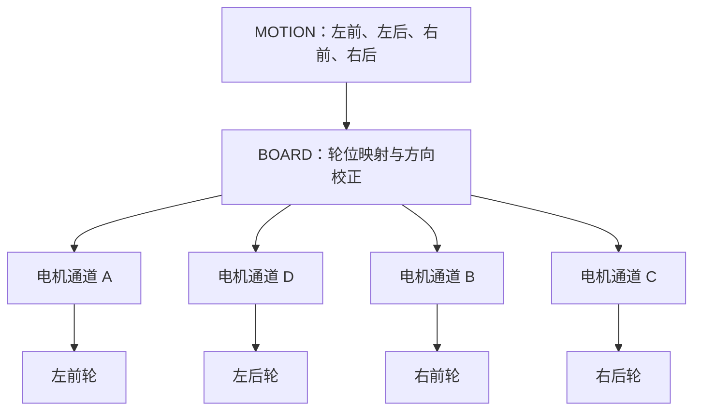

## 命令来到控制板门口

上一章里，电脑已经准备好一条 `START_MOTION`。在它变成四个轮子的动作之前，我们先沿着串口线走到控制板旁边。

一块控制板看上去布满芯片、插座和走线。初学者很容易把它看成一整块难懂的黑盒，甚至有些畏惧：这里一根线，那里一个电容，到底该从哪里看起？换一个角度，它其实更像机器人的身体：STM32 负责组织工作，串口负责听取消息，电机输出像肌肉，编码器与 IMU 提供感觉，蜂鸣器和 OLED 帮助人了解现场状态。每个部件只负责一小段任务，组合起来才完成一次运动。理解这个身体，不是为了记住每一块芯片的名字，而是为了知道：当电脑发来一条命令时，这条命令会经过哪些“器官”，最后怎样变成轮子转动。

仓库根目录有一份 C50C 原理图。图中主控标记为 `F407VET6`，Keil 工程的目标设备写成 `STM32F407VE`。这里的核心型号都指向 STM32F407 系列，工程按这个芯片系列选择启动文件、寄存器定义和下载算法。对初学者来说，只要记住：这块板子的“大脑”是 STM32F407，后面我们看到的串口、定时器、GPIO 都是它身上的外设。

> **小提示**：看原理图时不用一开始就把每一页都看懂。先找到主控芯片、电源部分、电机接口、串口接口，剩下的细节可以随着调试逐步补充。

## STM32F407：站在现场中央的指挥者

**STM32F407 微控制器（microcontroller，MCU）** 是一颗能够独立运行固件的芯片。它里面有处理器，也有串口、定时器、GPIO 等外设。你可以把它想象成一台高度集成的小型计算机：CPU 负责思考，闪存（Flash）负责记住程序，RAM 负责临时存放数据，而外设则负责和外界打交道。微控制器和普通电脑 CPU 的区别在于，它把“计算”和“控制”打包在了一起，而且非常重视实时性——外界事件来了，它需要在可预测的时间内做出反应。

GPIO 的全称是 General-Purpose Input/Output，中文常叫通用输入输出口。它像一排可以安排不同工作的门：有的门读取开关电平，有的门输出电机方向，有的门切换到串口或定时器功能。同一根引脚在不同配置下可以做完全不同的事情，这种灵活性是 STM32 强大的地方，也是初学者一开始容易迷糊的地方。好在工程里已经把引脚用途写进了初始化代码，我们只需要知道“这个引脚现在被配置成什么功能”，就可以继续往下读了。

微控制器很适合守在机器人现场。电脑发送消息的时刻无法精确预测，轮子反馈的脉冲也会不断到来。STM32 可以用 **中断（interrupt）** 及时处理这些事件。中断像服务台上的呼叫铃：平时工作人员做自己手里的事，铃响时，他先接住眼前的紧急事项，处理完再回到原来的工作。没有中断的话，程序就只能一直轮询“有没有新数据”，既浪费 CPU 时间，又可能错过关键时机。

项目启动时，`systemInit()` 会先设置中断优先级分组，再初始化延时、I²C、系统参数、串口、电机 PWM、ICM20948、蜂鸣器、使能按键、用户按键、OLED 和四路编码器。这段代码位于 `USER/system.c`，它相当于开馆前逐间亮灯和检查设备：先确定谁有优先权（中断分组），再按顺序把每个外设唤醒。这个顺序不是随便写的，例如 I²C 要在 ICM20948 之前准备好，串口要在命令进来之前打开，电机 PWM 要在任何运动指令下发之前配置好。

```c
UART1_Init(115200);
MiniBalance_PWM_Init(16799, 0);
ICM20948_Init();

EncoderA_Init();
EncoderB_Init();
EncoderC_Init();
EncoderD_Init();
```

这几行展示了硬件的主干。UART1 准备以 `115200` 波特率收发消息；定时器准备产生四路电机 PWM；IMU 完成初始化；A、B、C、D 四路编码器也都可以开始计数。初始化完成代表设备已经具备工作条件，但“具备条件”不等于“正在参与控制”。就像把乐器都调好了音，但乐曲什么时候开始演奏，还要看后面的指挥。各项数据何时进入新业务，还要由后面的任务安排。

> **初学者常见疑问**：为什么初始化函数的名字有的叫 `Init`，有的叫 `_Init`？这主要是代码风格问题，不同文件作者习惯不同。阅读时重点是看它初始化了哪个外设、用了哪个定时器、哪个引脚。

## UART1：命令进入机器人的门

**UART（Universal Asynchronous Receiver/Transmitter，通用异步收发器）** 是一种常见串行通信方式。“串行”表示数据沿一条线路按时间顺序逐位通过，像一列单行行驶的小车。发送端和接收端提前约好速度与格式，就能把字节还原出来。你可以把它想象成两个人隔着一段距离用手电筒打信号：双方先约定“快闪几下代表 1，慢闪几下代表 0，每分钟闪多少次”，这样即使只有一条光路，也能传递完整信息。

当前新协议选择 `USART1`。`LOWER_CONTROLLER/BOARD/board_uart_config.h` 负责选择通信端口，实际引脚定义位于 `HARDWARE/Inc/uartx.h`。当前启用的分支把发送脚配置为 PA9，把接收脚配置为 PA10；备用的 PB6、PB7 分支没有参与当前编译。换句话说，仓库里可能同时存在几条“路线”，但编译器只会把当前选中的那一条接进程序。这种设计方便以后换接口时不用大改代码。

`UART1_Init(115200)` 使用 8 位数据、1 个停止位、无奇偶校验和无硬件流控，常见写法是“115200，8N1”。`115200` 表示每秒传输的符号数量级，`8N1` 中的 8 表示八位数据，N 表示无校验，1 表示一个停止位。

> **小提示**：串口通信最重要的原则是两端的参数要一致。如果上位机发的是 115200，下位机也必须配成 115200；否则收到的就是乱码。奇偶校验和停止位也要对应。

`systemInit()` 还初始化了 UART3，这是原厂工程保留下来的硬件准备。新的比赛通信路径由 `LOWER_CONTROLLER/BOARD/board_uart_config.h` 选择，当前明确指向 UART1。这样阅读代码时就有一条清楚路线：寻找新命令，应当沿 UART1 进入 `TRANSPORT`。UART3 目前更像是一条备用通道，暂时不参与新的协议流程。初学者看到这种“旧代码还在、新代码另起炉灶”的情况不必慌张，大型仓库里很常见：保留旧功能是为了调试和参考，新功能则走自己的路径。

## 电机输出：方向和力道分开表达

机器人想让直流电机转动，需要回答两个问题：往哪边转，以及给多大输出。这两个问题在代码里是分开处理的，这种分离让上层逻辑可以很简单：先决定“这个轮子要向前还是向后”，再决定“用多大力气”。

方向由成对的控制脚表达。以电机 A 为例，代码会设置 `AIN1` 和 `AIN2`。一高一低对应一个方向，电平交换后方向也随之改变。B、C、D 三路各有自己的方向脚。这种“H 桥”控制方式直流电机里非常常见：两根线，一根给高电平、一根给低电平，电流朝一个方向流；把两根线的电平交换，电流就反向流动，电机也就反向转动。如果两根线电平相同，电机就会被短接制动，起到快速刹车的作用。

力道使用 **PWM（Pulse Width Modulation，脉宽调制）** 表达。可以把它想成快速开关水龙头：在一个很短的周期里，打开时间越长，平均送出的能量越多。电机看到的是连续而快速的开关，机械惯性让输出表现得较为平滑。PWM 的频率也很重要：频率太低，电机会明显“一顿一顿”，甚至发出嗡嗡声；频率太高，驱动电路的开关损耗又会增加。工程里把 PWM 频率定在 10 kHz，是一个在平滑性和效率之间比较常见的折中。

当前 `MiniBalance_PWM_Init(16799, 0)` 让 TIM8 以 10 kHz 产生 PWM。计数范围从 `0` 到 `16799`，代码把满量程记为 `16800`。新运动层使用的固定值是 `3000`，它用于开环调试。 **开环控制（open-loop control）** 像蒙着眼睛把油门固定在一个位置：程序给出电机输出，却还没有根据实际轮速自动修正。它的好处是简单、直接，方便先验证电机接线和方向是否正确；坏处是遇到地面阻力变化、电池电压下降时，速度会跟着波动。

这也解释了 `gear` 参数当前的处境。`START_MOTION` 帧会带上档位，可 `motion_start_motion()` 里暂时用 `(void)gear` 表示它尚未参与计算。命令中的“微速、慢速、快速”已经有编码，实际输出仍统一使用固定 PWM 3000。后续加入档位表或闭环控制时，这个参数才会真正影响速度。初学者看到这种“参数传进来但没用”的写法不要觉得奇怪，它通常意味着功能正在分期实现：协议先把位置占好，业务逻辑后面再填。

> **思考一下**：为什么先固定 PWM 3000，而不是直接根据 gear 算出不同速度？因为在大型电控代码里，通常要先确认“电机能转、方向正确、轮位映射没问题”，再逐步加入速度闭环和档位映射。一步做太多，出了问题反而不好定位。

## 从寄存器到真实转矩

STM32 的引脚负责表达控制信号，电机驱动电路负责把信号变成能够带动电机的电流。这个关系像水龙头把手与水管：手柄给出开关和大小，真正输送水的是后面的管路。固件写入 `PWMA` 时，实际是在修改 TIM8 的比较寄存器；定时器随后在 PC9 引脚产生 PWM。A 路的 `AIN1`、`AIN2` 则位于 PB13 和 PB12，用来表达方向。

这里可以再把关系理清楚一点：

1. 上层代码说“电机 A 输出 3000”；
2. `motion_set_pwm()` 根据正负号设置 PB13、PB12 的高低电平，决定方向；
3. 把数值的绝对值写入 TIM8 的比较寄存器；
4. TIM8 在 PC9 引脚上输出对应占空比的 PWM 波形；
5. 电机驱动板根据方向脚和 PWM 波形，向电机供电；
6. 电机转动，带动轮子。

B、C、D 通道沿用同样结构，各自连接 TIM8 的另一个比较通道和一对方向脚。`motion_set_pwm()` 先依据数值正负设置方向，再把绝对值写入 PWM。于是 `+3000` 与 `-3000` 拥有相同输出幅度，旋转方向相反；`0` 会把 PWM 清零。这个简单约定让上层算法可以用带符号整数描述轮子，而不需要关心每一根方向脚到底要怎么设。

实机调试时，软件数值、驱动供电、电机接线和轮子安装共同决定最终动作。板级映射与方向系数把这些现场差异收拢起来，运动层便能继续使用“左前轮向前”这样清楚的语言。换句话说，只要板级配置正确，上层算法写 `左前轮正转` 时，真正转起来的就是那个轮子，方向也是我们期望的方向。

## 四个通道与四个轮位

电机驱动板把输出口叫作 A、B、C、D，运动算法更关心左前、左后、右前、右后。通道名描述电线接在哪里，轮位名描述电机位于车身哪里。板级配置负责在两套名称之间搭桥。这个桥非常重要：如果接线和算法各说各话，车子很可能原地打转甚至朝反方向跑。

当前 `board_motion_config.h` 给出的映射如下：

| 车身轮位 | 电机通道 | 方向校正系数 |
| --- | --- | --- |
| 左前 | A | `+1` |
| 左后 | D | `-1` |
| 右前 | B | `-1` |
| 右后 | C | `+1` |

方向校正系数来自真实安装关系。同样写入正值时，镜像安装的电机可能让轮子朝相反方向转。配置层用 `+1` 或 `-1` 统一“车身向前”的含义。运动算法只需表达四个逻辑轮位应该怎样转，接线变化可以集中在板级文件中处理。

> **初学者常见疑问**：如果我把电机线接反了，或者方向系数写错了，会发生什么？最直观的现象是：程序让车往前跑，它却往后退；或者让车原地旋转，它却平移。调试时可以先让单个轮子以固定 PWM 正转，观察实际方向，再回头修正系数。通常不需要改运动算法，只需要改 `board_motion_config.h`。

仓库中的 `MOTION/README.md` 曾保留过一份较早的默认映射说明，当前可执行配置以 `board_motion_config.h` 为准，也就是左前 A、左后 D、右前 B、右后 C。阅读工程时，头文件中的实际宏会进入编译，因此它是确认当前行为的直接依据。文档可能会滞后，但编译进去的配置不会撒谎。当你发现车子行为和预期不符时，优先看代码里的宏定义，而不是只看 README。



这张图表达了一个分层思想：最上层是运动算法关心的逻辑轮位，中间是板级配置做的翻译，最下面是实际接线的电机通道。以后如果换一块驱动板，或者某根线需要重新插，只要改中间这层翻译，运动算法本身可以不动。

## 编码器：让机器人知道轮子转了多少

**编码器（encoder）** 会随着电机或轮轴转动产生脉冲。它像安装在轮子旁边的计步器，程序统计脉冲的数量和方向，就能估计轮子转了多少、转得多快。没有编码器的话，机器人就像一个闭着眼睛跑步的人：它知道自己在蹬腿，但不知道到底跑了多远、有没有跑偏。

工程为 A、B、C、D 四路编码器分别使用定时器 TIM2、TIM3、TIM4 和 TIM5。`systemInit()` 已经调用四个初始化函数，底层读取接口是 `Read_Encoder()`。这些驱动为以后做速度闭环提供了基础。编码器和定时器的配合方式是：编码器把脉冲送到定时器的外部输入脚，定时器内部的计数器随着脉冲增减。程序定期读取这个计数器，就能得到这段时间里轮子转过的角度。

**闭环控制（closed-loop control）** 会把目标与测量值反复比较。假设程序希望轮速为某个数值，编码器发现实际速度偏低，控制器就适当增加输出；实际速度偏高时，控制器再降低输出。这个过程像骑车时不断看路况并调整脚上的力：目标不是“蹬多狠”，而是“保持多快的速度”。闭环的好处是抗干扰能力强，电池电压下降、地面摩擦变化时，控制器会自动补偿。

当前新的 `MOTION` 仍使用固定 PWM，`SENSORS` 目录也把 `encoder_feedback.c` 列为后续文件。因此，硬件驱动已经在场，新业务层还需要把反馈接进运动控制。理解“已经初始化”和“已经参与控制”的区别，能让项目进度判断更准确。看到 `EncoderA_Init()` 被调用，只能说明编码器已经可以计数；真正用它去修正 PWM，还需要另一段闭环代码把目标和测量连起来。

> **小提示**：调试编码器时，可以先用手转动轮子，同时读取 `Read_Encoder()` 的返回值，确认：转动方向正确时数值增加，反方向转动时数值减少，停转时数值稳定。这一步验证通过，后续闭环才能可靠。

## ICM20948：感受姿态变化

控制板还连接了 ICM20948。它是一颗 **IMU（Inertial Measurement Unit，惯性测量单元）**，中文常叫惯性测量单元。可以把它想成机器人内耳：加速度计感受直线方向的变化，陀螺仪感受旋转，磁力计提供与地磁方向有关的信息。人靠内耳保持平衡，机器人则靠 IMU 感知自己的姿态。

- **加速度计**：测量三个轴上的加速度。静止时，它会感受到重力，因此可以大致判断哪边是“下”。
- **陀螺仪**：测量三个轴上的角速度。积分一段时间，可以估算出转过了多少角度。
- **磁力计**：测量地磁场方向，配合加速度计可以做姿态融合，得到更稳定的航向。

仓库的 ICM20948 驱动能够初始化器件与磁力计，也提供读取加速度、角速度和磁场数据的接口。读取结果存放在全局 `imu` 变量中。驱动还保留零漂设置与校准接口，因为传感器静止时也可能出现很小的偏移，像一只没有完全归零的秤。陀螺仪尤其容易有零漂：即使芯片完全不动，它也可能输出一个非零的角速度值。如果不做补偿，积分出来的角度会慢慢“跑掉”。

新协议定义了 `GET_HEADING`，其中 heading 表示航向角。当前命令分发器会检查这条命令的 payload 格式，然后返回 `NOT_IMPLEMENTED`。`SENSORS` 规划中的 `heading.c` 将来会把底层 IMU 数据整理成稳定的航向接口，再交给应用层回传。硬件、驱动、业务接口沿着这条路线逐步连接。这里又是一次“硬件已就绪，业务待补齐”的分期实现：IMU 已经在 `systemInit()` 里初始化好，但上层还没有把它包装成可直接查询航向的服务。

> **思考一下**：为什么航向角不直接读陀螺仪积分，而是需要专门的 `heading.c`？因为单个陀螺仪会漂移，磁力计可能受电机和金属干扰，加速度计在剧烈运动时也不可靠。实际工程中通常要用传感器融合算法，把三者的优势互补，才能得到一个既稳定又响应迅速的航向。

## 从原厂小车到新的比赛业务

原厂 WHEELTEC 工程覆盖多种车型和交互方式。旧入口会创建运动控制、数据显示、LED、数据上报、IMU、手柄和自检等多项任务。它像一辆功能齐全的样车：能跑、能显示、能用手柄遥控，但任务很多、边界也比较模糊。当前 `USER/main.c` 已经换成一条更集中的入口：启动阶段只创建新的 `app_task`，旧 `BALANCE` 业务继续留在仓库中提供参考和底层来源。

这次改造保留了硬件能力，也让比赛逻辑拥有清晰边界。Keil 工程已经把 `app_main.c`、`command_dispatcher.c`、`response_sender.c`、协议生成代码、UART transport 和运动控制文件加入目标。编译宏 `MEC_CAR` 继续说明这是一台麦轮车，新的命令链开始承担实际业务入口。麦轮（Mecanum wheel）的特点是除了前后滚动，还能通过四个轮子的速度组合实现横向平移和原地旋转，非常适合比赛场上快速变向。保留 `MEC_CAR` 宏，意味着底层运动学仍然按麦轮来组织。

> **小提示**：大型仓库重构时，常见策略是“先立新后破旧”。新的业务逻辑走新的入口和新的任务，旧代码先不删除，作为参考资料和 fallback。这样即使新逻辑还有 bug，也可以快速切回旧代码验证硬件是否正常。

## 小结

现在，身体的主要部件已经认清。

- **STM32F407** 是控制板的大脑，负责调度中断、管理外设、运行固件。
- **UART1（PA9/PA10）** 是电脑与控制板之间的通信门，`START_MOTION` 将从这里进入。
- **TIM8 和四路方向脚** 负责把带符号的电机输出变成真实的转矩。
- **板级配置** 把逻辑轮位映射到电机通道，并用 `+1`/`-1` 统一方向。
- **编码器（TIM2~TIM5）** 已经准备好测量轮子转速，为后续闭环打好基础。
- **ICM20948** 已经初始化，等待上层把航向接口实现出来。
- **新的 `app_task`** 成为程序入口，旧业务作为参考保留。

`START_MOTION` 将从 PA10 进入 UART1，STM32 会在收到一个字节时立即响应。它怎样在繁忙的程序中接住每个字节，又怎样等到整封“信”收齐后再打开，下一章会从上电和任务调度开始回答。
