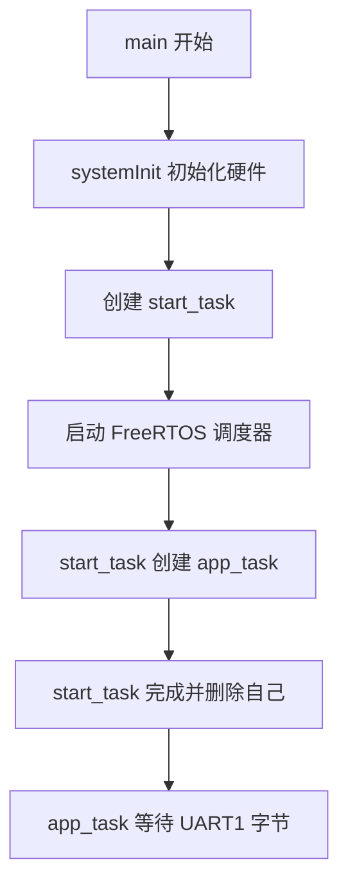
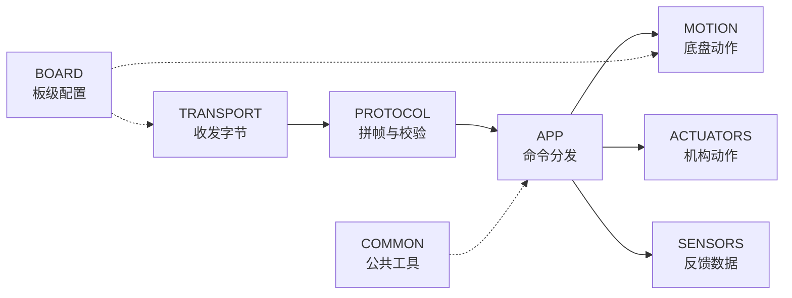

## 电源接通以后

按下电源键的那一刻，控制板上的 STM32 还什么都没做，电脑端的 `START_MOTION` 也还在屏幕上等待发送。对初学者来说，这个瞬间往往最容易被忽略，但它其实藏着整个程序的起点：处理器要先把自己和周围一圈设备都唤醒，然后进入一种能够长期、稳定、可预期运行的工作节奏。

第一次打开大型嵌入式工程的人，通常会被成百上千个 C 文件吓到，心里直打鼓："这么多代码，到底从哪看起？" 好消息是，真正决定程序从哪开始的故事入口往往非常朴素。处理器完成最底层的启动代码（启动文件里的汇编复位流程）之后，最终会跳进 `USER/main.c` 里的 `main()` 函数。在当前的下位机仓库里，`main()` 只干三件连贯的事：先初始化系统，再创建一个临时启动任务，最后把 FreeRTOS 调度器打开。

```c
int main(void)
{
    systemInit();

    xTaskCreate(start_task, "start_task", 512,
                NULL, 1, &StartTask_Handler);
    vTaskStartScheduler();
}
```

这里的 `xTaskCreate()` 是 FreeRTOS 提供的任务创建函数。它的参数从左到右依次是：任务函数 `start_task`、调试时显示的任务名称 `"start_task"`、分配给这个任务的栈大小 `512`、传给任务函数的参数 `NULL`、任务优先级 `1`，以及用来接收任务句柄的变量 `&StartTask_Handler`。

**任务句柄（task handle）** 可以把它理解成一张"工牌"：系统拿到这张工牌，就能在后续找到对应的任务，比如删除它、通知它，或者查询它的状态。`start_task` 在这里只负责搭把手，把真正的长期任务创建起来，所以工程也给它留了这张工牌，方便后面管理。

> **初学者小问：为什么 main 里不直接创建 `app_task`，还要绕一个 `start_task`？**
> 这是个好问题。在 FreeRTOS 里，调用 `vTaskStartScheduler()` 之前，调度器还没开始工作，所有代码都按普通顺序执行。`start_task` 的模式让启动过程有一个明确的"交接人"：它运行在调度器启动之后，可以在临界区里安全地创建其他关键任务，然后自己功成身退。这种写法在 FreeRTOS 工程里很常见，后面我们还会看到它的好处。

## systemInit：开馆前的设备检查

`systemInit()` 位于 `USER/system.c`。注意它运行的时间点：此时 FreeRTOS 调度器还没有启动，处理器仍然按照传统的顺序执行方式一行一行跑下去。因此，这里所有的硬件准备都是"串行"完成的，代码写到哪就执行到哪，不会被其他任务打断。

这就像是实验室每天开馆前的设备检查：先开总闸，再检查每一台仪器是否归位，最后才对外开放。如果顺序乱了，比如还没通电就去读传感器，结果往往不可预期。

函数先设置 NVIC 中断优先级分组。NVIC 是 STM32 的中断管家，优先级分组决定了当多个中断同时到来时，谁更重要、谁可以打断谁。接下来用 `delay_init(168)` 初始化延时模块，让它基于 168 MHz 的系统时钟计算延时。

再往后，代码依次初始化 I²C 与系统参数，然后打开 UART1 和 UART3，两个串口的波特率都设为 `115200`。UART1 会承载新协议，它是电脑和控制板之间新的"主通道"；UART3 则是已经准备好的另一条串口通道，可能用于调试、日志或者其他外设通信。

电机 PWM 随后以 `MiniBalance_PWM_Init(16799, 0)` 启动。这里的数字看起来有点奇怪，为什么不是 16800 而是 16799？因为 TIM8 的计数器是"从 0 数到 16799"，一共数了 16800 个刻度。把自动重装载值设为 16799，配合 168 MHz 的时钟和预分频设置，最终可以让 PWM 频率落在 10 kHz，而四个 PWM 通道的满量程对应 16800。这个数值在后面把"运动速度"换算成"PWM 占空比"时会再次遇到。

再往下，ICM20948（IMU 惯性测量单元）、蜂鸣器、使能按键、用户按键、OLED，以及 A 到 D 四路编码器依次初始化。每一件设备都像是控制板的一位员工，只有先完成入职培训，后面才能各司其职。

最后，`Buzzer_AddTask(1,100)` 把一次蜂鸣器提示请求加入队列。不过这里有一个小小的"伏笔"：新的任务链目前还需要周期调用 `Buzzer_task()` 才能执行这份请求。也就是说，仓库现状可以确认"请求已经入队"，但真正听到提示声，还要等任务调度接入并在实机上验证。这种"先登记、后执行"的设计在后面很多模块里都会看到。

原厂工程中其实还有更多的初始化内容：车型选择、机器人控制参数、四个 PI 控制器、自动回充、OLED 参数和 APP 参数等等。当前 `system.c` 把这些语句保留为注释。它们不是垃圾，而是旧业务的来路——读懂这些被注释掉的代码，能帮助我们理解这个仓库过去做了什么、现在为什么只保留一部分。这也说明新的主线目前聚焦于串口命令和固定 PWM 运动。后续如果接入闭环控制，新的控制参数会按照 `LOWER_CONTROLLER` 的模块边界重新安排，而不是简单地把旧代码重新打开。



## FreeRTOS：为持续工作安排时间

**FreeRTOS（Free Real-Time Operating System，自由实时操作系统）** 是下位机的任务管家。这里的"实时"不是指"跑得特别快"，而是强调"可预测地响应事件"。机器人控制对时间敏感：它可能需要长期等待电脑发来的命令，也可能同时读取传感器、更新控制输出、处理安全状态。如果所有事情都写在同一个死循环里，代码会迅速变得难以维护；FreeRTOS 的"任务"机制把这些持续工作分成若干条独立的流程，调度器再根据优先级和就绪状态安排处理器时间。

可以把调度器想象成实验室的值班表。假设小明在等快递，快递还没到时，他不需要一直盯着门口，而是可以暂时让出工作台，让其他同学先做实验；快递到达后，他再回来处理。处理器也是一样的逻辑：`vTaskDelay(1)`、队列等待、事件通知等机制都能让任务"暂时让出"处理器，等条件满足后再回来继续。

当前工程先创建一个短命的 `start_task`。它就像开门时的值班员：上班第一件事不是自己做实验，而是把长期岗位安排好。进入任务后，代码先调用 `taskENTER_CRITICAL()` 进入**临界区（critical section）**。

```c
taskENTER_CRITICAL();
xTaskCreate(app_task, "app", APP_STK_SIZE,
            NULL, APP_TASK_PRIO, NULL);
taskEXIT_CRITICAL();
vTaskDelete(NULL);
```

临界区可以理解为短时间"锁住调度室的门"。在临界区里，调度器暂时不会切换到其他任务，保证创建关键任务的过程保持连续，不会因为中断或其他任务插进来而导致状态混乱。创建完成后调用 `taskEXIT_CRITICAL()` 退出临界区，然后 `vTaskDelete(NULL)` 删除正在运行的 `start_task`。

这里的 `NULL` 指向当前任务本身。启动任务完成使命后，主动释放自己的调度位置，把长期工作交给 `app_task`。这种"自杀式启动"看起来有点悲壮，其实非常常见：它让启动过程干净利落，不留一个只跑一次的僵尸任务占用资源。

`APP_STK_SIZE` 当前为 `512`，`APP_TASK_PRIO` 当前为 `4`。也就是说，`app_task` 拥有一块 512 单位深度的私有栈，以及比启动任务更高的优先级。

旧版 `main.c` 曾经在这里创建 `Balance_task`、`show_task`、`led_task`、`data_task`、IMU、手柄和自检等多项原厂任务。2026 年 6 月 8 日的改造把入口集中到新的 `app_task`。这一步的好处是：比赛命令从此拥有单独而清楚的主线，不会因为旧业务同时抢占串口和电机而变得难以调试。这也解释了为什么现在看 `main.c` 会觉得"变轻了"——重活儿被挪到了 `LOWER_CONTROLLER` 内部，而 `main()` 只负责搭台子。

## 任务与普通函数有什么区别

普通函数通常由调用者进入，工作完成后返回原来的位置，调用栈也随之恢复。FreeRTOS 任务则不同：它拥有自己的栈和长期执行路径，调度器可以让它运行、等待、暂停，再从上次停下的位置继续。`app_task` 里的无限循环 `while (1)` 因此非常自然——接收命令本来就是控制板整个运行期间都要保持的岗位，而不是一件"做完就结束"的事。

栈可以想成任务自己的临时书桌。函数参数、局部变量和函数调用关系会在这里留下工作材料。`app_task` 里的 `parser` 与 `frame` 都摆放在这张书桌上，所以 `APP_STK_SIZE` 要为协议对象和函数调用保留足够的空间。当前值是 512，这里采用的是工程里 FreeRTOS 的栈深度单位。实际部署时，可以借助 FreeRTOS 的栈余量检查功能（比如 `uxTaskGetStackHighWaterMark()`）观察空间是否充足。如果发现栈水位逼近 0，就要考虑扩大栈大小或者减少局部变量。

> **初学者小问：栈不够会怎么样？**
> 栈溢出是嵌入式里非常典型又隐蔽的 bug。任务栈被写穿之后，可能破坏相邻任务的内存，表现为莫名其妙的 HardFault、变量被篡改、程序跑飞。养成定期检查栈水位的习惯，能帮你省下大量抓虫时间。

优先级则像值班安排中的响应顺序。`app_task` 的优先级是 4，启动任务是 1。较高优先级任务在就绪时会更早得到运行机会；而在等待字节期间，它又会主动让出处理器。合理的任务设计会让高优先级岗位快速完成一次工作，然后进入等待，为其他任务留下时间。反过来说，如果高优先级任务一直死循环不释放 CPU，低优先级任务就会"饿死"，系统看起来像卡死一样。

当前主线只有一个新应用任务。以后加入传感器采样、控制周期和安全监测时，可以根据实时要求决定采用独立任务、定时器回调，还是由一个任务统一调度。无论采用哪种形式，命令入口仍可以保持在 `app_task`，把解析完成的业务请求交给清楚的模块接口。这样即使系统变复杂，入口始终是清晰的。

## app_task：一直守在收发室旁边

`app_task()` 位于 `LOWER_CONTROLLER/APP/app_main.c`。函数一开始，会在自己的栈上准备三个重要变量：`parser` 保存协议解析的当前进度，`frame` 用来容纳一帧完整消息，`byte` 保存刚刚从串口取出的一个字节。布尔变量 `ready` 表示"一封完整消息是否已经拼好"。

```c
comm_parser_init(&parser);
if (!transport_uart_init()) {
    vTaskDelete(NULL);
    return;
}
```

`comm_parser_init()` 把解析器清空，并让它进入"等待第一个帧头字节"的状态。可以把它理解成把拼图的边框先摆好，后面每收到一个字节就往正确位置放一块。

`transport_uart_init()` 当前直接返回 `true`，因为 UART1 的真实硬件初始化已经在 `systemInit()` 中完成。这个接口看似多余，其实很有价值：以后如果 transport 层需要创建自己的队列、清空统计信息、检查端口状态，甚至切换到 DMA 接收，应用层的调用方式可以保持稳定。换句话说，这里为未来的扩展留了一道门，而应用层不需要知道门后面换了什么。

如果 `transport_uart_init()` 返回失败，任务会调用 `vTaskDelete(NULL)` 删除自己并返回。虽然当前实现不会失败，但这个判断体现了嵌入式里的一条好习惯：对可能失败的步骤做防御，避免带着错误状态继续跑。

准备结束后，任务进入 `while (1)`。这是一条长期循环，机器人运行多久，它就守候多久。它不像普通函数那样"做完就回家"，而是像收发室的值班员，一直坐在 UART 缓冲区旁边。

```c
while (1) {
    if (!transport_uart_receive_byte(&byte, portMAX_DELAY)) {
        continue;
    }

    if (comm_parser_process_byte(&parser, byte,
                                 &frame, &ready) != COMM_PARSE_OK) {
        continue;
    }

    if (ready) {
        command_dispatcher_handle_frame(&frame);
        ready = false;
    }
}
```

`portMAX_DELAY` 表示任务愿意一直等到有字节可取。当前 transport 的实现会查看环形缓冲区；缓冲区为空时调用 `vTaskDelay(1)`，过一个系统节拍再查看。等待期间，调度器可以运行其他就绪任务，CPU 不会被空转浪费。

每取到一个字节，任务就把它交给 `comm_parser_process_byte()`。解析器可能还在等待帧头，也可能正在收集头部、payload 或 CRC。只要消息还没收完，`ready` 就保持 `false`。版本错误、payload 过大或 CRC 错误会让函数返回对应错误，应用循环跳过这一轮，继续等待下一次输入。

当 `ready` 变成 `true`，`frame` 里已经有版本号、帧类型、序号、payload 长度和 payload 内容。应用层这时才调用 `command_dispatcher_handle_frame()`。字节运输与业务动作在这里完成交接：transport 只负责"把字节搬到门口"，protocol 负责"检查这封信是否完整"，APP 负责"根据信的内容办事"。

## 一次循环只推进一小步

`app_task` 每轮循环只取一个字节，这种写法与协议解析器非常合拍。假设一帧共有 14 个字节，循环会运行 14 次。前 13 次不断更新解析状态，第 14 次收到 CRC 的最后一个字节后，`ready` 才会变为真。

这种设计的妙处在于：任务无需提前知道串口会在什么时刻送完一帧，也无需把一次读取强行凑成固定长度。串口是流式通信，字节可能连续到达，也可能断断续续到达；逐字节处理让程序对 timing 的变化天然不敏感。

逐字节处理还允许相邻帧紧接着到达。第一帧处理完后，解析器已经回到等待帧头的状态，下一轮循环便能识别下一组 `AA 55`。消息中间即使暂停一小段时间，已收内容也会安全保存在 `parser` 中，后续字节到来后接着推进，而不会因为"等久了就忘了前面收到什么"而丢帧。

错误也在很小的范围内处理。某一帧的版本或 CRC 不合要求时，解析器复位，任务继续守候新的帧头。应用层得到的 `frame` 都经过完整性检查，命令分发器可以把注意力放在命令 ID 与参数上，不用再担心收到半截数据。通信噪声、帧格式校验和业务动作由此获得各自的处理位置，问题定位时也能更快缩小范围。

> **初学者小问：为什么不一次性读完整帧再处理？**
> 理论上可以，但嵌入式串口通常一次只收到少量字节，而且帧与帧之间可能紧挨着。如果硬要等满 14 个字节，可能会把下一帧的前几个字节也读进来，增加拆帧难度；如果设一个固定超时，又会让响应变慢。逐字节处理配合状态机，是一种简单、可靠、容易扩展的做法。

## 八个模块组成的新骨架

`LOWER_CONTROLLER` 把新业务分成八个目录。可以把它们想象成一个小型工厂的车间：命令先由 `TRANSPORT` 接收，相当于门卫把货车领进来；再由 `PROTOCOL` 整理成完整消息，相当于质检员检查货物清单；随后交给 `APP` 安排动作，相当于调度室下发工单。`MOTION` 承接底盘控制，`ACTUATORS` 和 `SENSORS` 将继续接入机构与反馈；`BOARD` 和 `COMMON` 为这条链提供配置与公共工具。下面的图展示了它们之间的数据流。



截至当前版本，`APP`、`PROTOCOL`、UART `TRANSPORT` 和 `BOARD` 已经进入编译与调用链，`MOTION` 接入了持续平移、持续旋转和停止。`ACTUATORS` 与 `SENSORS` 仍以 README 里的接口规划为主，`COMMON` 也等待实际公共代码。Keil 工程文件已经包含应用、协议、通信和运动层的 C 文件，这一点说明它们属于当前固件目标的一部分。

> **初学者小问：为什么 `BOARD` 和 `COMMON` 用虚线？**
> 虚线表示它们不像 `TRANSPORT -> PROTOCOL -> APP` 那样直接传递数据，而是作为"基础设施"被其他层依赖。比如 `BOARD` 提供板级引脚定义、时钟配置，`COMMON` 提供错误码、宏和工具函数。它们不参与主数据流，但没有它们，其他层就站不稳。

## 每层都守住自己的门

分层的价值会在修改时显现。串口中断把字节送入 transport，协议解析器检查并整理消息，命令分发器选择业务接口，运动层计算轮位输出，最后通过 `HARDWARE/motor` 的宏写入真实电机通道。每一层都有清楚的输入和输出，就像流水线上的每道工序只负责自己的环节。

这种边界使同一个 `START_MOTION` 可以被逐段检查：

- `app_task` 收不到字节时，重点落在串口中断与缓冲区；
- 解析器持续报 CRC 错误时，重点落在上下位机帧格式是否一致；
- 分发器返回 `BAD_PAYLOAD` 时，重点落在命令参数是否越界；
- ACK 成功后轮子状态异常时，重点落在运动映射与硬件输出。

如果没有这种分层，所有问题都会挤在同一个函数里，调试时就像在一团毛线里找线头。分层之后，每一层都守住自己的门，故障范围自然被限制住。

上电故事已经走到一个安静的画面：硬件完成初始化，FreeRTOS 正在运行，`app_task` 守着 UART 接收缓冲区。电脑现在送出 `START_MOTION` 的第一个字节。下一章将把时间放慢，观察它怎样经过 PA10、中断、环形缓冲区和协议状态机，最后重新变成一条可执行的命令。
