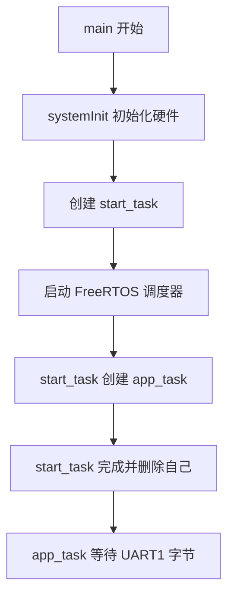
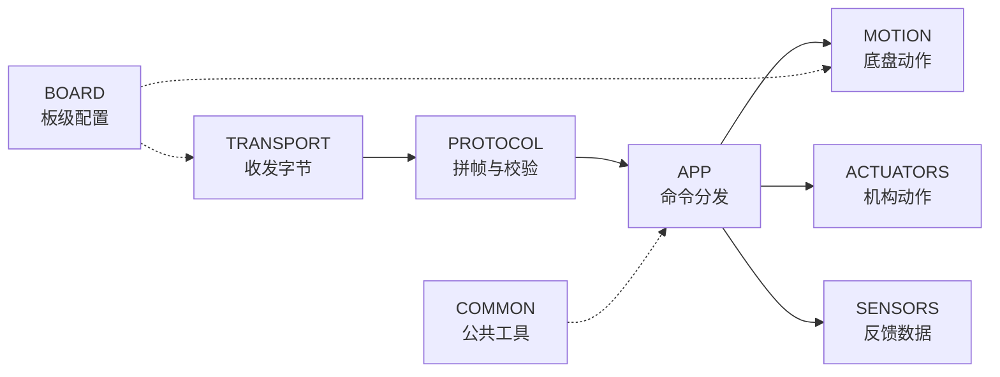

## 电源接通以后

控制板刚刚上电时，`START_MOTION` 还在电脑一端等待发送。STM32 先要把自己和周围设备准备好，随后进入一个能够长期运行的工作节奏。

初学者打开嵌入式工程，常会看到几百个 C 文件。真正的故事入口仍然很朴素。处理器完成底层启动后进入 `USER/main.c` 的 `main()`，当前主函数只做三件连贯的事：初始化系统，创建一个启动任务，开启 FreeRTOS 调度。

```c
int main(void)
{
    systemInit();

    xTaskCreate(start_task, "start_task", 512,
                NULL, 1, &StartTask_Handler);
    vTaskStartScheduler();
}
```

这里的 `xTaskCreate()` 用来创建任务。`start_task` 是任务函数，`"start_task"` 是调试时可见的名称，`512` 是工程为它安排的栈大小，`1` 是优先级，最后一个参数接收任务句柄。 **任务句柄（task handle）** 像一张任务的工牌，系统可以通过它找到对应任务。

## systemInit：开馆前的设备检查

`systemInit()` 位于 `USER/system.c`。它运行时，FreeRTOS 调度器还没有开始分配任务时间，因此这些硬件准备按代码顺序完成。

函数先设置 NVIC 中断优先级分组，再用 `delay_init(168)` 准备基于 168 MHz 系统时钟的延时。接下来初始化 I²C 与系统参数，然后打开 UART1 和 UART3，波特率都设为 `115200`。UART1 会承载新协议，UART3 仍是已经准备好的另一条串口通道。

电机 PWM 随后以 `MiniBalance_PWM_Init(16799, 0)` 启动。TIM8 的计数设置让 PWM 频率成为 10 kHz，四个通道的满量程为 16800。再往下，ICM20948、蜂鸣器、使能按键、用户按键、OLED，以及 A 到 D 四路编码器依次初始化。最后，`Buzzer_AddTask(1,100)` 把一次提示请求加入蜂鸣器队列。当前新任务链还需要周期调用 `Buzzer_task()` 才能执行这份请求，因此仓库现状可以确认“请求已入队”，提示声留待任务接入和实机验证。

原厂工程中还有车型选择、机器人控制参数、四个 PI 控制器、自动回充、OLED 参数和 APP 参数等初始化。当前 `system.c` 把这些语句保留为注释。它们展示了旧业务的来路，也说明新的主线目前聚焦于串口命令和固定 PWM 运动。后续接入闭环时，新的控制参数会按 `LOWER_CONTROLLER` 的模块边界重新安排。



## FreeRTOS：为持续工作安排时间

**FreeRTOS（Free Real-Time Operating System，自由实时操作系统）** 负责管理任务。这里的“实时”强调可预测地响应事件。机器人需要长期等待通信，也可能同时读取传感器、更新控制和处理安全状态。任务把这些持续工作分成若干条独立流程，调度器按优先级和就绪状态安排处理器时间。

可以把调度器想成实验室值班表。有人等待快递时，他暂时让出工作台；快递到达后，他再回来处理。这样处理器可以在等待期间照顾其他任务。`vTaskDelay(1)`、队列等待和事件通知都能形成这种“暂时让出”的节奏。

当前工程先创建一个短命的 `start_task`。它像开门时的值班员，只负责把长期岗位安排好。进入任务后，代码先调用 `taskENTER_CRITICAL()` 进入**临界区（critical section）**。临界区像短时间锁住调度室的门，保证创建关键任务的过程保持连续。

```c
taskENTER_CRITICAL();
xTaskCreate(app_task, "app", APP_STK_SIZE,
            NULL, APP_TASK_PRIO, NULL);
taskEXIT_CRITICAL();
vTaskDelete(NULL);
```

`APP_STK_SIZE` 当前为 `512`，`APP_TASK_PRIO` 当前为 `4`。创建完成后退出临界区，`vTaskDelete(NULL)` 删除正在运行的 `start_task`。这里的 `NULL` 指向当前任务。启动任务完成使命后释放自己的调度位置，长期工作交给 `app_task`。

旧版 `main.c` 曾经在这里创建 `Balance_task`、`show_task`、`led_task`、`data_task`、IMU、手柄和自检等多项原厂任务。2026 年 6 月 8 日的改造把入口集中到新的 `app_task`。这一步让比赛命令拥有单独而清楚的主线，也减少新旧业务同时争用串口和电机的机会。

## 任务与普通函数有什么区别

普通函数通常由调用者进入，工作完成后返回原来的位置。FreeRTOS 任务拥有自己的栈和长期执行路径，调度器可以让它运行、等待、暂停，再从上次停下的位置继续。`app_task` 里的无限循环因此很自然：接收命令本来就是控制板整个运行期间都要保持的岗位。

栈可以想成任务自己的临时书桌。函数参数、局部变量和调用关系会在这里留下工作材料。`app_task` 的 `parser` 与 `frame` 都放在这张书桌上，所以 `APP_STK_SIZE` 要为协议对象和函数调用保留空间。当前值是 512，采用的是工程里的 FreeRTOS 栈深度单位。实际部署时可以借助 FreeRTOS 的栈余量检查功能观察空间是否充足。

优先级则像值班安排中的响应顺序。`app_task` 的优先级是 4，启动任务是 1。较高优先级任务在就绪时更早得到运行机会，等待字节期间又会主动让出处理器。合理的任务设计会让高优先级岗位快速完成一次工作，然后进入等待，为其他任务留下时间。

当前主线只有一个新应用任务。以后加入传感器采样、控制周期和安全监测时，可以根据实时要求决定采用独立任务、定时器回调或由一个任务统一调度。无论采用哪种形式，命令入口仍可以保持在 `app_task`，把解析完成的业务请求交给清楚的模块接口。

## app_task：一直守在收发室旁边

`app_task()` 位于 `LOWER_CONTROLLER/APP/app_main.c`。函数开始时在自己的栈上准备三个重要变量：`parser` 保存协议解析进度，`frame` 用来容纳完整帧，`byte` 保存刚刚取出的一个字节。布尔变量 `ready` 表示一封完整消息是否已经拼好。

```c
comm_parser_init(&parser);
if (!transport_uart_init()) {
    vTaskDelete(NULL);
    return;
}
```

`comm_parser_init()` 把解析器清空，并让它进入“等待第一个帧头字节”的状态。`transport_uart_init()` 当前直接返回 `true`，因为 UART1 的真实硬件初始化已经在 `systemInit()` 中完成。这个接口仍然很有价值：以后 transport 需要创建队列、清空统计信息或检查端口时，应用层的调用方式可以保持稳定。

准备结束后，任务进入 `while (1)`。这是一条长期循环，机器人运行多久，它就守候多久。

```c
while (1) {
    if (!transport_uart_receive_byte(&byte, portMAX_DELAY)) {
        continue;
    }

    if (comm_parser_process_byte(&parser, byte,
                                 &frame, &ready) != COMM_PARSE_OK) {
        continue;
    }

    if (ready) {
        command_dispatcher_handle_frame(&frame);
        ready = false;
    }
}
```

`portMAX_DELAY` 表示愿意一直等到有字节可取。当前 transport 的实现会查看环形缓冲区；缓冲区为空时调用 `vTaskDelay(1)`，过一个系统节拍再查看。等待期间，调度器可以运行其他就绪任务。

每取到一个字节，任务就把它交给 `comm_parser_process_byte()`。解析器可能还在等待帧头，也可能正在收集头部、payload 或 CRC。只要消息还没收完，`ready` 就保持 `false`。版本错误、payload 过大或 CRC 错误会让函数返回对应错误，应用循环跳过这一轮，继续等待下一次输入。

当 `ready` 变成 `true`，`frame` 里已经有版本、帧类型、序号、payload 长度和 payload 内容。应用层这时才调用 `command_dispatcher_handle_frame()`。字节运输与业务动作在这里完成交接。

## 一次循环只推进一小步

`app_task` 每轮只取一个字节，这种写法与协议解析器很合拍。假设一帧共有 14 个字节，循环会运行 14 次。前 13 次不断更新解析状态，第 14 次收到 CRC 的最后一个字节后，`ready` 才会变为真。任务无需提前知道串口会在什么时刻送完一帧，也无需把一次读取强行凑成固定长度。

逐字节处理还允许相邻帧紧接着到达。第一帧处理完后，解析器已经回到等待帧头的状态，下一轮便能识别下一组 `AA 55`。消息中间暂停一小段时间时，已收内容保存在 `parser` 中，后续字节到来后接着推进。

错误也在很小的范围内处理。某一帧的版本或 CRC 不合要求时，解析器复位，任务继续守候新的帧头。应用层得到的 `frame` 都经过完整性检查，命令分发器可以把注意力放在命令 ID 与参数上。通信噪声、帧格式和业务动作由此获得各自的处理位置。

## 八个模块组成的新骨架

`LOWER_CONTROLLER` 把新业务分成八个目录。命令先由 `TRANSPORT` 接收，再由 `PROTOCOL` 整理成完整消息，随后交给 `APP` 安排动作。`MOTION` 承接底盘控制，`ACTUATORS` 和 `SENSORS` 将继续接入机构与反馈；`BOARD` 和 `COMMON` 为这条链提供配置与公共工具。下面的图展示了它们之间的数据流。



截至当前版本，`APP`、`PROTOCOL`、UART `TRANSPORT` 和 `BOARD` 已经进入编译与调用链，`MOTION` 接入了持续平移、持续旋转和停止。`ACTUATORS` 与 `SENSORS` 仍以 README 里的接口规划为主，`COMMON` 也等待实际公共代码。Keil 工程文件已经包含应用、协议、通信和运动层的 C 文件，这一点说明它们属于当前固件目标的一部分。

## 每层都守住自己的门

分层的价值会在修改时显现。串口中断把字节送入 transport，协议解析器检查并整理消息，命令分发器选择业务接口，运动层计算轮位输出，最后通过 `HARDWARE/motor` 的宏写入真实电机通道。每一层都有清楚的输入和输出。

这种边界使同一个 `START_MOTION` 可以被逐段检查。`app_task` 收不到字节时，重点落在串口中断与缓冲区；解析器持续报 CRC 错误时，重点落在上下位机帧格式；分发器返回 `BAD_PAYLOAD` 时，重点落在命令参数；ACK 成功后轮子状态异常时，重点落在运动映射与硬件输出。

上电故事已经走到一个安静的画面：硬件完成初始化，FreeRTOS 正在运行，`app_task` 守着 UART 接收缓冲区。电脑现在送出 `START_MOTION` 的第一个字节。下一章将把时间放慢，观察它怎样经过 PA10、中断、环形缓冲区和协议状态机，最后重新变成一条可执行的命令。
