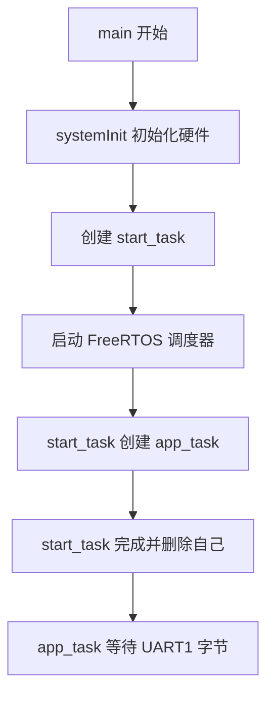
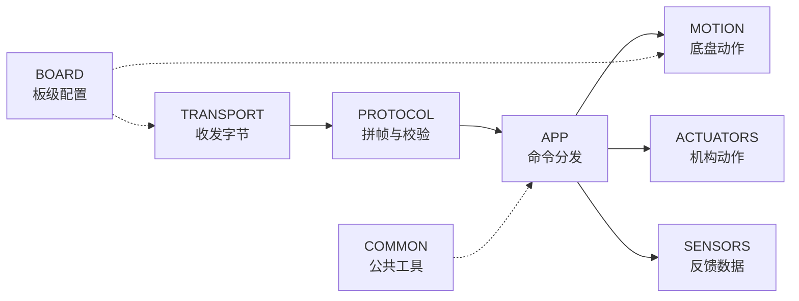

:::callout 🔄 上一章回顾
上一章我们认识了下位机的硬件：STM32 微控制器、电机驱动、编码器、IMU 等零件，以及它们在电路板上怎样连接。我们还第一次打开了 Keil 工程，看到了工程文件的大致结构。
:::

:::callout 🎯 本章你会学到
- 下位机上电后，程序从哪一行代码开始运行
- FreeRTOS 是什么，它怎样帮芯片"同时做好几件事"
- `systemInit()` 做了哪些硬件准备工作
- `app_task` 怎样守在串口旁边，一个字节一个字节地等待命令
- 八个代码模块各自负责什么
:::

## 电源接通以后

按下电源键的那一刻，控制板上的 STM32 还什么都没做，电脑端的 `START_MOTION` 也还在屏幕上等待发送。对初学者来说，这个瞬间往往最容易被忽略——但它其实藏着整个程序的起点。

处理器要先把自己和周围的设备都唤醒，然后进入一种能够长期、稳定运行的工作节奏。这就好比一家店铺每天开门营业前，要先开灯、开空调、检查收银机，一切就绪后才能开门迎客。

第一次打开大型嵌入式工程的人，通常会被成百上千个 C 文件吓到，心里直打鼓："这么多代码，到底从哪看起？"不用担心，真正决定程序从哪开始的入口其实非常简单。

处理器完成最底层的启动代码（启动文件里的汇编复位流程）之后，最终会跳进 `USER/main.c` 里的 `main()` 函数。在当前的下位机仓库里，`main()` 只干三件连贯的事：先初始化系统，再创建一个临时启动任务，最后把 FreeRTOS 调度器打开。

```c
int main(void)
{
    systemInit();                          // 第一步：初始化所有硬件

    xTaskCreate(start_task, "start_task",  // 第二步：创建一个临时启动任务
                512, NULL, 1,
                &StartTask_Handler);

    vTaskStartScheduler();                 // 第三步：启动 FreeRTOS 调度器，程序从此由调度器接管
}
```

这段代码只有三行调用，却构成了整个程序的骨架。接下来，我们一件一件地弄清楚它们分别在做什么。

## 一个芯片怎么同时做好几件事？

在看代码之前，我们先想一个问题：机器人需要同时做很多事——等待电脑发来的命令、读取传感器数据、控制电机转动、检查安全状态……但 STM32 只有一个处理器核心，它一次只能做一件事。那它怎么"同时"做这么多事呢？

答案是：**靠操作系统帮忙**。

:::callout 💡 零基础小课堂：什么是操作系统？
你的电脑之所以能一边播放音乐、一边打开浏览器、一边写文档，靠的就是**操作系统（Operating System，简称 OS）**在背后安排。操作系统的核心工作之一，就是把处理器的时间切成很多小片段，轮流分配给不同的程序，切换速度快到人类感觉不出来，看起来就像"同时在做好几件事"。
:::

我们的下位机用的操作系统叫 **FreeRTOS（Free Real-Time Operating System，自由实时操作系统）**。你可以把它想象成"芯片里的任务管理员"。

打个比方：一个员工同时应付多个客户。他不是把所有客户的事情同时做完，而是先帮客户 A 处理一会儿，然后暂停，转去帮客户 B，再转去帮客户 C……每个人都觉得自己在被服务，其实员工只有一个人。FreeRTOS 就是那个帮芯片安排"先服务谁、后服务谁"的管理员。

:::callout 💡 零基础小课堂："实时"是什么意思？
这里的"实时"不是指"特别快"，而是指"**可预测地响应**"。比如，如果传感器检测到机器人即将撞墙，系统必须在可预期的时间内做出反应，而不是"可能很快、也可能很慢"。FreeRTOS 的"实时"就是保证：该响应的事情，一定会在约定的时间内被处理到。
:::

在 FreeRTOS 的世界里，每一件持续要做的工作被称为一个**任务（Task）**。

:::callout 💡 零基础小课堂：什么是"任务"？
**任务**就是一个独立的工作岗位。比如"守着串口等命令"是一个任务，"定时读取传感器"是一个任务，"控制电机转速"也是一个任务。每个任务都有自己的代码、自己的临时存储空间，独立运行，互不干扰。FreeRTOS 的**调度器（Scheduler）**就像排班表，决定每个时刻该轮到哪个任务工作。
:::

## main() 里的三步曲

理解了 FreeRTOS 的基本概念，我们回到 `main()` 函数。它做的三件事分别是：

**第一步：`systemInit()`**——初始化所有硬件，下一节会详细讲。

**第二步：`xTaskCreate()`**——创建一个临时启动任务。这个函数是 FreeRTOS 提供的，专门用来创建新任务。它有六个参数，我们用一张表来逐个说明：

| 参数 | 值 | 含义 |
|------|-----|------|
| 任务函数 | `start_task` | 这个任务要执行的代码 |
| 任务名称 | `"start_task"` | 调试时显示的名字，方便你知道是哪个任务 |
| 栈大小 | `512` | 给这个任务分配多少临时工作空间（后面会解释"栈"） |
| 参数 | `NULL` | 不需要额外参数，所以填空 |
| 优先级 | `1` | 重要程度，数字越大越重要 |
| 句柄 | `&StartTask_Handler` | 任务的"工牌"，方便以后找到它 |

**任务句柄（Task Handle）** 可以理解成一张"工牌"：系统拿到这张工牌，就能在后续找到对应的任务，比如删除它、通知它，或者查询它的状态。

**第三步：`vTaskStartScheduler()`**——启动调度器。从这一刻起，程序不再按照普通的从上到下顺序执行，而是由 FreeRTOS 的调度器接管，按照优先级和就绪状态安排各个任务轮流运行。

> **初学者小问：为什么 `main()` 里不直接创建 `app_task`，还要绕一个 `start_task`？**
> 这是个好问题。在调用 `vTaskStartScheduler()` 之前，调度器还没开始工作，所有代码都按普通顺序执行。`start_task` 运行在调度器启动之后，可以在安全的环境下创建其他关键任务，然后自己功成身退。这种写法在 FreeRTOS 工程里很常见，后面我们会看到它的好处。

## systemInit：开馆前的设备检查

`systemInit()` 位于 `USER/system.c`。注意它运行的时间点：此时 FreeRTOS 调度器还没有启动，处理器仍然按照传统的顺序执行方式一行一行跑下去。所以这里所有的硬件准备都是"串行"完成的，代码写到哪就执行到哪，不会被其他任务打断。

这就像实验室每天开馆前的设备检查：先开总闸，再检查每一台仪器是否归位，最后才对外开放。如果顺序乱了，比如还没通电就去读传感器，结果往往不可预期。

`systemInit()` 里做了很多初始化步骤，我们用一张表来整理：

| 初始化步骤 | 函数/操作 | 作用 |
|-----------|----------|------|
| 中断优先级分组 | NVIC 分组设置 | 决定哪些事情更紧急，谁可以打断谁 |
| 延时模块 | `delay_init(168)` | 让程序能够精确等待，基于 168 MHz 系统时钟 |
| I²C | I²C 初始化 | 芯片之间的内部通信线路 |
| 系统参数 | 参数初始化 | 读取和设置系统运行所需的配置 |
| 串口 1 | `UART1, 115200` | 电脑和控制板之间的主通道（承载新协议） |
| 串口 3 | `UART3, 115200` | 备用串口通道，可用于调试或其他外设 |
| 电机 PWM | `MiniBalance_PWM_Init(16799, 0)` | 启动电机控制信号 |
| IMU | ICM20948 初始化 | 惯性测量单元，感受机器人的旋转和倾斜 |
| 蜂鸣器 | 蜂鸣器初始化 | 让控制板能发出提示音 |
| 使能按键 | 使能按键初始化 | 检测安全开关状态 |
| 用户按键 | 用户按键初始化 | 检测用户操作 |
| OLED 屏幕 | OLED 初始化 | 小屏幕，用于显示调试信息 |
| 编码器 A–D | 四路编码器初始化 | 安装在轮子上的"计步器"，测量转速 |

:::callout 💡 零基础小课堂：几个重要名词
- **NVIC（Nested Vectored Interrupt Controller）**：管理所有中断优先级的控制器，决定哪个中断更紧急。还记得上一章说的"中断就像手机来电"吗？NVIC 就是决定"两个电话同时打来，先接哪个"的管理员。
- **I²C（Inter-Integrated Circuit）**：一种让芯片之间互相通信的协议，就像办公室内部的对讲系统。控制板上的 STM32 通过 I²C 和 IMU 等芯片交换数据。
:::

关于电机 PWM 的数字 `16799`，这里解释一下：TIM8 的计数器是"从 0 数到 16799"，一共数了 16800 个刻度。配合 168 MHz 的时钟和预分频设置，最终让 PWM 频率落在 10 kHz，四个 PWM 通道的满量程对应 16800。这个数值在后面把"运动速度"换算成"PWM 占空比"时会再次遇到。

最后，`Buzzer_AddTask(1,100)` 把一次蜂鸣器提示请求加入队列。不过这里有一个小"伏笔"：真正听到提示声，还要等任务调度接入并在实机上验证。这种"先登记、后执行"的设计在后面很多模块里都会看到。

:::callout-tip 关于被注释掉的旧代码
原厂工程中还有更多初始化内容：车型选择、机器人控制参数、四个 PI 控制器、自动回充等等。当前 `system.c` 把这些语句保留为注释。它们不是垃圾，而是旧业务的来路——读懂这些被注释掉的代码，能帮助你理解这个仓库过去做了什么、现在为什么只保留一部分。后续如果接入闭环控制，新的控制参数会按照 `LOWER_CONTROLLER` 的模块边界重新安排，而不是简单地把旧代码重新打开。
:::



## start_task：搭好舞台就退场

`start_task` 就像开门时的值班员：上班第一件事不是自己做实验，而是把长期岗位安排好。进入任务后，代码先调用 `taskENTER_CRITICAL()` 进入**临界区（Critical Section）**。

:::callout 💡 零基础小课堂：什么是临界区？
想象你在开一个重要会议。为了不被打断，你把门锁上，等讨论完最关键的内容，再把门打开。临界区就是这样的"锁门时间"——在这段时间里，调度器暂时不会切换到其他任务，保证当前操作不被打断。用完之后必须"开门"（退出临界区），否则其他任务就永远没机会运行了。
:::

```c
taskENTER_CRITICAL();                  // 进入临界区：锁上门，不让调度器切换任务
xTaskCreate(app_task, "app",           // 在安全环境下创建长期任务 app_task
            APP_STK_SIZE,
            NULL, APP_TASK_PRIO, NULL);
taskEXIT_CRITICAL();                   // 退出临界区：开门，恢复正常调度
vTaskDelete(NULL);                     // 删除自己（NULL 表示"当前任务"），功成身退
```

创建完 `app_task` 后，`start_task` 调用 `vTaskDelete(NULL)` 删除自己。这里的 `NULL` 指向当前任务本身——启动任务完成使命后，主动释放自己的位置，把长期工作交给 `app_task`。这种"搭好舞台就退场"的写法非常常见，不会留一个只跑一次的任务白白占用资源。

`APP_STK_SIZE` 当前为 `512`，`APP_TASK_PRIO` 当前为 `4`。也就是说，`app_task` 拥有一块 512 单位深度的私有栈，以及比启动任务（优先级 1）更高的优先级。

:::callout-tip 旧版 main.c 曾经很"重"
旧版 `main.c` 曾在这里创建 `Balance_task`、`show_task`、`led_task`、`data_task`、IMU、手柄和自检等多项原厂任务。2026 年 6 月 8 日的改造把入口集中到新的 `app_task`，让比赛命令拥有单独而清楚的主线。这也解释了为什么现在看 `main.c` 会觉得"变轻了"——重活儿被挪到了 `LOWER_CONTROLLER` 内部，而 `main()` 只负责搭台子。
:::

## 任务与普通函数有什么区别

普通函数由调用者进入，工作完成后返回原来的位置。FreeRTOS 任务则不同：它拥有自己的栈和长期执行路径，调度器可以让它运行、等待、暂停，再从上次停下的位置继续。

`app_task` 里的无限循环 `while (1)` 因此非常自然——接收命令本来就是控制板整个运行期间都要保持的岗位，而不是一件"做完就结束"的事。

:::callout 💡 零基础小课堂：什么是"栈"（Stack）？
**栈（Stack）**可以用"一叠盘子"来理解。你往桌上摞盘子：最后放上去的那个，一定是最先被拿走的——这叫**后进先出**。程序里的栈也是这样：每次调用一个函数，就往栈上放一个"盘子"（保存参数、局部变量等临时数据）；函数结束后，这个"盘子"就被拿走。

每个 FreeRTOS 任务都有自己的栈，就像每个员工有自己的草稿纸。`app_task` 里的 `parser` 和 `frame` 等变量都放在这张"草稿纸"上，所以 `APP_STK_SIZE` 要为它们保留足够的空间。
:::

:::callout-warn ⚠️ 栈溢出：程序会崩溃！
如果一个任务的栈空间不够用了（比如局部变量太多、函数嵌套太深），就会发生**栈溢出（Stack Overflow）**——任务的数据"溢"出自己的区域，覆盖了其他内存。后果可能是程序崩溃（就像电脑蓝屏一样）、变量莫名其妙地变了值、或者系统行为完全不可预测。

养成定期检查栈余量的习惯（比如用 `uxTaskGetStackHighWaterMark()` 函数），能帮你省下大量排查问题的时间。如果发现栈余量接近 0，就要考虑扩大栈大小或者减少局部变量。
:::

**优先级**则像值班安排中的响应顺序。`app_task` 的优先级是 4，启动任务是 1。较高优先级任务在就绪时会更早得到运行机会；而在等待字节期间，它又会主动让出处理器。

合理的任务设计会让高优先级岗位快速完成一次工作，然后进入等待，为其他任务留下时间。反过来说，如果高优先级任务一直死循环不释放处理器，低优先级任务就会"饿死"，系统看起来像卡死一样。

当前主线只有一个新应用任务。以后加入传感器采样、控制周期和安全监测时，可以根据实时要求决定采用独立任务、定时器回调，还是由一个任务统一调度。无论采用哪种形式，命令入口仍可以保持在 `app_task`，把解析完成的业务请求交给清楚的模块接口。

## app_task：一直守在收发室旁边

`app_task()` 位于 `LOWER_CONTROLLER/APP/app_main.c`。函数一开始，会在自己的栈上准备几个重要变量：`parser` 保存协议解析的当前进度，`frame` 用来容纳一帧完整消息，`byte` 保存刚刚从串口取出的一个字节，布尔变量 `ready` 表示"一封完整消息是否已经拼好"。

```c
comm_parser_init(&parser);             // 把解析器清空，进入"等待帧头"状态
if (!transport_uart_init()) {          // 检查传输层是否初始化成功
    vTaskDelete(NULL);                 // 如果失败，删除自己，不带着错误继续跑
    return;                            // 退出函数
}
```

`comm_parser_init()` 把解析器清空，让它进入"等待第一个帧头字节"的状态。你可以把它理解成把拼图的边框先摆好，后面每收到一个字节就往正确位置放一块。

`transport_uart_init()` 当前直接返回 `true`，因为 UART1 的真实硬件初始化已经在 `systemInit()` 中完成。这个接口看似多余，其实为未来留了扩展空间：以后如果 transport 层需要创建自己的队列、清空统计信息、甚至切换到 **DMA（Direct Memory Access）** 接收——这是一种让硬件自己搬运数据的技术，不需要 CPU 亲自动手——应用层的调用方式都不需要改。

如果 `transport_uart_init()` 返回失败，任务会调用 `vTaskDelete(NULL)` 删除自己。虽然当前实现不会失败，但这个判断体现了嵌入式里的一条好习惯：对可能失败的步骤做防御，避免带着错误状态继续跑。

准备结束后，任务进入 `while (1)`——这是一个**永不结束的循环**。机器人运行多久，它就守候多久。它不像普通函数那样"做完就回家"，而是像收发室的值班员，一直坐在 UART 缓冲区旁边，随时准备接收新的字节。

```c
while (1) {                                      // 永不结束的循环：一直守候
    if (!transport_uart_receive_byte(&byte,       // 尝试从串口取一个字节
                                     portMAX_DELAY)) {
        continue;                                 // 没取到就跳过，继续等
    }

    if (comm_parser_process_byte(&parser, byte,   // 把字节交给协议解析器
                                 &frame, &ready)
        != COMM_PARSE_OK) {
        continue;                                 // 解析出错就跳过，继续等下一个字节
    }

    if (ready) {                                  // 一帧完整消息拼好了！
        command_dispatcher_handle_frame(&frame);   // 交给命令分发器去执行
        ready = false;                            // 重置标志，准备接收下一帧
    }
}
```

:::callout 💡 零基础小课堂：portMAX_DELAY 是什么？
`portMAX_DELAY` 是 FreeRTOS 定义的一个特殊值，表示"**愿意一直等下去，直到有数据可取**"。在等待期间，这个任务不会白白占用处理器——调度器会把处理器时间分配给其他就绪的任务。一旦有新字节到达，调度器会唤醒这个任务，让它继续工作。这样既不浪费处理器资源，又不会错过任何数据。
:::

每取到一个字节，任务就把它交给 `comm_parser_process_byte()`。解析器可能还在等待帧头，也可能正在收集头部、payload 或 CRC。只要消息还没收完，`ready` 就保持 `false`。版本错误、payload 过大或 CRC 错误会让函数返回对应错误码，循环跳过这一轮，继续等待下一个字节。

当 `ready` 变成 `true`，`frame` 里已经包含版本号、帧类型、序号、payload 长度和 payload 内容。应用层这时才调用 `command_dispatcher_handle_frame()`。字节运输与业务动作在这里完成交接：transport 只负责"把字节搬到门口"，protocol 负责"检查这封信是否完整"，APP 负责"根据信的内容办事"。

## 一次循环只推进一小步

`app_task` 每轮循环只取一个字节，这种写法与协议解析器非常合拍。假设一帧共有 14 个字节，循环会运行 14 次。前 13 次不断更新解析状态，第 14 次收到 CRC 的最后一个字节后，`ready` 才会变为真。

这种设计的妙处在于：任务无需提前知道串口会在什么时刻送完一帧，也无需把一次读取强行凑成固定长度。串口是流式通信，字节可能连续到达，也可能断断续续到达；逐字节处理让程序对 timing 的变化天然不敏感。

逐字节处理还允许相邻帧紧接着到达。第一帧处理完后，解析器已经回到等待帧头的状态，下一轮循环便能识别下一组 `AA 55`。消息中间即使暂停一小段时间，已收内容也会安全保存在 `parser` 中，后续字节到来后接着推进，不会因为"等久了就忘了前面收到什么"而丢帧。

错误也在很小的范围内处理。某一帧的版本或 CRC 不合要求时，解析器复位，任务继续守候新的帧头。应用层得到的 `frame` 都经过完整性检查，命令分发器可以把注意力放在命令 ID 与参数上，不用再担心收到半截数据。

> **初学者小问：为什么不一次性读完整帧再处理？**
> 理论上可以，但嵌入式串口通常一次只收到少量字节，而且帧与帧之间可能紧挨着。如果硬要等满 14 个字节，可能会把下一帧的前几个字节也读进来，增加拆帧难度；如果设一个固定超时，又会让响应变慢。逐字节处理配合状态机，是一种简单、可靠、容易扩展的做法。

## 八个模块组成的新骨架

`LOWER_CONTROLLER` 把新业务分成八个目录。可以把它们想象成一个小型工厂的车间：

- **TRANSPORT**（运输层）：相当于门卫，把外面送来的字节领进来。
- **PROTOCOL**（协议层）：相当于质检员，检查货物清单是否完整。
- **APP**（应用层）：相当于调度室，根据清单内容下发工单。
- **MOTION**（运动层）：承接底盘控制，让轮子动起来。
- **ACTUATORS**（执行机构层）：将来负责机械臂等机构的动作。
- **SENSORS**（传感器层）：将来负责反馈数据，比如距离、位置等。
- **BOARD**（板级配置层）：提供板级引脚定义、时钟配置等硬件相关信息，就像工厂的水电基础设施。
- **COMMON**（公共工具层）：提供错误码、宏和工具函数等大家都需要的"公共工具箱"。



> **初学者小问：为什么 `BOARD` 和 `COMMON` 用虚线？**
> 虚线表示它们不像 `TRANSPORT -> PROTOCOL -> APP` 那样直接传递数据，而是作为"基础设施"被其他层依赖。比如 `BOARD` 提供板级引脚定义和时钟配置，`COMMON` 提供错误码和工具函数。它们不参与主数据流，但没有它们，其他层就站不稳——就像工厂的水电系统，你平时看不见它，但少了它什么都干不了。

截至当前版本，`APP`、`PROTOCOL`、UART `TRANSPORT` 和 `BOARD` 已经进入编译与调用链，`MOTION` 接入了持续平移、持续旋转和停止。`ACTUATORS` 与 `SENSORS` 仍以 README 里的接口规划为主，`COMMON` 也等待实际公共代码。Keil 工程文件已经包含应用、协议、通信和运动层的 C 文件，说明它们属于当前固件目标的一部分。

## 每层都守住自己的门

分层的价值会在修改时显现。串口中断把字节送入 transport，协议解析器检查并整理消息，命令分发器选择业务接口，运动层计算轮位输出，最后通过 `HARDWARE/motor` 的宏写入真实电机通道。每一层都有清楚的输入和输出，就像流水线上的每道工序只负责自己的环节。

这种边界使同一个 `START_MOTION` 可以被逐段检查：

- `app_task` 收不到字节时，重点落在串口中断与缓冲区；
- 解析器持续报 CRC 错误时，重点落在上下位机帧格式是否一致；
- 分发器返回 `BAD_PAYLOAD` 时，重点落在命令参数是否越界；
- ACK 成功后轮子状态异常时，重点落在运动映射与硬件输出。

如果没有这种分层，所有问题都会挤在同一个函数里，调试时就像在一团毛线里找线头。分层之后，每一层都守住自己的门，故障范围自然被限制住。

---

上电故事已经走到一个安静的画面：硬件完成初始化，FreeRTOS 正在运行，`app_task` 守着 UART 接收缓冲区，等待第一个字节的到来。下一章将把时间放慢，观察电脑发出的 `START_MOTION` 怎样经过 PA10 引脚、中断、环形缓冲区和协议状态机，最后重新变成一条可执行的命令。

## 本章新词

| 术语 | 英文 | 一句话解释 |
|------|------|-----------|
| 操作系统 | Operating System (OS) | 管理硬件资源、安排程序运行顺序的系统软件 |
| FreeRTOS | Free Real-Time Operating System | 芯片里的任务管理员，帮程序同时做好几件事 |
| 任务 | Task | 一个独立的工作岗位，有自己的代码和存储空间 |
| 调度器 | Scheduler | 决定每个时刻该轮到哪个任务工作的"排班表" |
| 临界区 | Critical Section | 暂时"锁门"的代码区域，防止被其他任务打断 |
| 栈 | Stack | 每个任务自己的临时草稿纸，保存局部变量和调用信息 |
| 栈溢出 | Stack Overflow | 栈空间不够用导致数据溢出，可能让程序崩溃 |
| 任务句柄 | Task Handle | 任务的"工牌"，系统靠它找到对应任务 |
| 优先级 | Priority | 任务的重要程度，数字越大越优先被调度 |
| NVIC | Nested Vectored Interrupt Controller | 管理所有中断优先级的控制器 |
| I²C | Inter-Integrated Circuit | 一种让芯片之间互相通信的协议 |
| DMA | Direct Memory Access | 让硬件自己搬运数据的技术，不需要 CPU 亲自动手 |
| portMAX_DELAY | — | FreeRTOS 中表示"一直等到有数据"的特殊值 |
| 临时启动任务 | Start Task | 搭好舞台就退场的短命任务，负责创建长期任务 |
