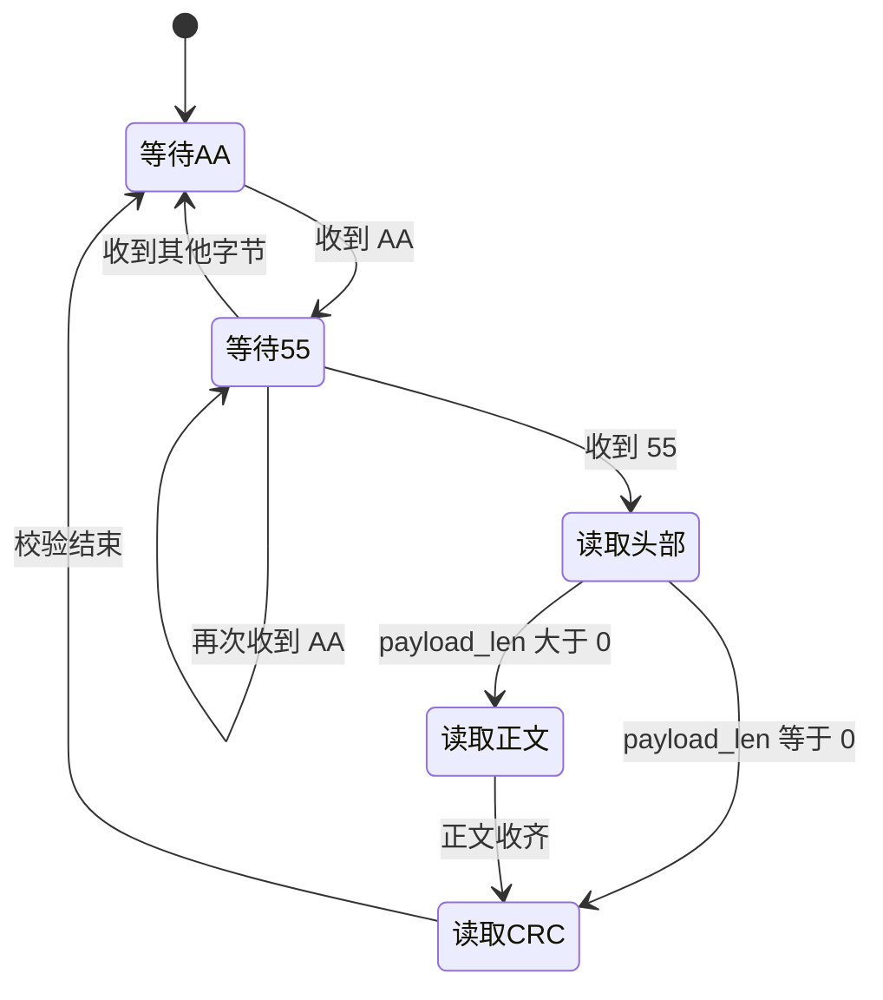

## 第一个字节抵达 PA10

故事从 `app_task` 的一次等待开始。

此时的下位机正在 FreeRTOS 中正常运行，`app_task` 已经完成了初始化，正循环等待新的命令帧。与此同时，上位机——可能是电脑上的调试助手，也可能是 RoboGame 主控程序——决定让机器人动起来。它把一条 `START_MOTION` 命令写入串口。

串口通信的本质是逐位发送的高低电平。电脑端的串口控制器按照约定的节奏把二进制数据转换成电信号，电信号沿着一根细细的导线（在开发板上通常就是 USB 转串口线）来到 STM32 的 `PA10` 引脚。`PA10` 是 STM32F407 上 `USART1` 的默认 RX 引脚，也就是串口接收端。

UART1 在本工程中的配置是 `115200` 波特率、8 位数据位、1 个停止位、无奇偶校验，简称 "8-N-1"。波特率 `115200` 表示每秒最多传输 115200 个比特位，实际每个字节大约需要 `1 / 11520 ≈ 87 微秒`。串口硬件会按照这个节奏对 `PA10` 上的电平进行采样，把连续的高低变化恢复成一个一个字节。

当一个新的字节被硬件接收并放入接收数据寄存器时，`USART1` 的 `RXNE` 标志位就会置位。`RXNE` 可以读作 **Receive Data Register Not Empty**，直译就是"接收数据寄存器不是空的"，换句话说就是"有新字节到了，快来取走"。

这时，STM32 会立即跳转到 `USART1_IRQHandler()`。**中断服务函数（Interrupt Service Routine，ISR）** 是硬件事件发生时 CPU 会立刻放下手头工作去执行的一段小程序。你可以把它想象成家里的门铃：门铃一响，不管主人正在做饭还是看电视，都会先跑去开门看一眼。这里"门铃"就是 `RXNE` 标志，"开门的人"就是中断服务函数。

```c
int USART1_IRQHandler(void)
{
    if (USART_GetITStatus(USART1, USART_IT_RXNE) != RESET) {
        transport_uart_rx_from_isr(
            (uint8_t)USART_ReceiveData(USART1));
    }
    return 0;
}
```

这段中断函数非常短，只干一件关键的事情：

1. 检查 `USART_IT_RXNE` 中断标志是否置位。
2. 如果确实收到了新字节，就通过 `USART_ReceiveData(USART1)` 把字节从硬件寄存器中读出来。
3. 立刻调用 `transport_uart_rx_from_isr()`，把字节交给 transport 层处理。

注意这里没有任何协议解析、没有任何电机控制，甚至连 CRC 计算都没有。中断只做"取字节、转交"这两件事。为什么要这么设计？因为中断的优先级很高，它执行期间会打断普通任务。如果中断里塞入太多逻辑，后面新的字节来的时候可能就来不及接收，导致丢数据。把中断做得尽可能短、尽可能快，是嵌入式串口接收的常用做法。

> **初学者常见疑问**：为什么一定要在中断里读数据？
>
> 因为 `RXNE` 标志被置位后，如果不及时读走 `USART_ReceiveData()`，下一个字节再来时可能会触发 **ORE（Overrun Error，溢出错误）**，新到的字节会被硬件丢掉。所以"收到即读"是串口中断的基本原则。读走之后，字节交给缓冲区，后续慢慢解析即可。

## 256 格的环形等候区

中断收到的字节不会立刻被 `app_task` 取走，而是先进入一个长度为 `256` 的数组 `s_rx_buffer`。这个数组和两个下标一起，共同构成一个**环形缓冲区（ring buffer）**，也常被称为"循环队列"。

你可以把它想象成一圈首尾相接的候车座位：有新的乘客（字节）来时，`head` 指向当前可以入座的位置；有乘客离开时，`tail` 指向下一个该离开的位置。座位一共有 256 个，从 `0` 编号到 `255`。当 `head` 走到 `255` 之后，下一个位置不是 `256`，而是绕回到 `0`。

```c
static volatile uint16_t s_rx_head = 0U;
static volatile uint16_t s_rx_tail = 0U;
static uint8_t s_rx_buffer[256];
```

这里有两个关键点：

- `s_rx_head` 由**中断**负责移动。每来一个有效字节，中断就把它写入 `s_rx_buffer[s_rx_head]`，然后 `head` 向前一格。
- `s_rx_tail` 由 **`app_task`（普通任务）** 负责移动。任务按自己的节奏读取 `s_rx_buffer[s_rx_tail]`，然后 `tail` 向前一格。

两边各处理一端，互不干扰，这就把"硬件要求快速响应"和"软件希望按节奏处理"之间的矛盾隔离开了。中断只管"接"，任务只管"取"，中间的缓冲区负责吸收两边的速度差。

具体写入时，代码会先计算 `head` 的下一个位置。如果下一个位置不等于 `tail`，说明缓冲区还有空位，当前字节可以安全写入；写入后 `head` 再真正前移。如果下一个位置等于 `tail`，说明缓冲区已经满了，当前实现会选择**保留已有字节、放弃新到的字节**。

```c
uint16_t next = next_index(s_rx_head);
if (next != s_rx_tail) {
    s_rx_buffer[s_rx_head] = byte;
    s_rx_head = next;
}
```

> **初学者常见疑问**：为什么缓冲区长度是 256，却只能存 255 个字节？
>
> 这是一个很经典的设计细节。环形缓冲区通常用一个元素位置来区分"空"和"满"。如果 `head == tail` 表示空，那么当缓冲区真正写满时，也必然是 `head == tail`，这就和"空"无法区分了。所以工程上常见的做法就是：缓冲区满的判断条件是 `next(head) == tail`，也就是再写一个就会撞上 tail。这样虽然浪费了 1 个格子，但换来了"空"和"满"判断的简单可靠。256 格的数组最多同时保存 255 个未读字节。
>
> 如果你在实际联调时发现串口有丢数据的情况，可以在满的时候增加一个溢出计数器，上位机或日志就能知道是否因为缓冲区太小而丢失了字节。

应用任务从另一端取数据时，代码同样很简单：

```c
if (s_rx_tail != s_rx_head) {
    *out_byte = s_rx_buffer[s_rx_tail];
    s_rx_tail = next_index(s_rx_tail);
    return true;
}
```

如果 `s_rx_tail == s_rx_head`，说明缓冲区暂时为空。`transport_uart_receive_byte()` 会进入阻塞等待，每隔一个 FreeRTOS 节拍检查一次。`app_task` 传入的是 `portMAX_DELAY`，表示会无限期等下去，直到新字节出现。新字节出现后，任务会按照"先进先出"的顺序逐个取走——先进缓冲区的字节先被解析，这保证了命令帧的字节顺序不会乱。

> **小结一下**：UART 中断像门口收快递的人，收到一个包裹（字节）就往环形缓冲区里放；`app_task` 像仓库管理员，按顺序从缓冲区取包裹去拆。缓冲区就是两者之间的小货架，解决"收件太快"和"拆件太慢"的节奏差异。

## 一封带封条的数字信件

串口本身只负责传送字节流，它并不知道"一条命令从哪里开始、到哪里结束"。想象一下你收到一条没有标点符号、没有段落分隔的长消息，根本分不清哪几句话是一组。因此，通信双方必须约定一种格式，把字节流切分成一帧一帧的消息。这种格式就叫**协议帧（protocol frame）**。

帧可以比喻成一封格式固定的信件：最外面有醒目的封套标记，中间有寄件信息和正文，末尾还有用于检查信件是否在运输中被损坏的封条。只有当一帧完整收到、封条核对无误，接收方才认为这是一条有效的命令。

当前工程中的帧格式由 `LOWER_CONTROLLER/PROTOCOL/firmware/comm_protocol.h` 定义，结构如下：

| 部分 | 长度 | 含义 |
| --- | ---: | --- |
| SOF | 2 字节 | 固定为 `AA 55`，标记一帧开始 |
| version | 1 字节 | 当前协议版本为 `01` |
| frame_type | 1 字节 | command、ACK、telemetry 或 heartbeat |
| seq | 2 字节 | 这一帧的序号，小端序 |
| payload_len | 2 字节 | payload 长度，小端序 |
| payload | 0～256 字节 | 命令或数据正文 |
| CRC | 2 字节 | 对 header 与 payload 的校验结果，小端序 |

### 各部分的作用

- **SOF（Start of Frame）**：帧起始标记，固定为 `AA 55`。你可以把它理解为信封外面统一印刷的醒目标识。解析器在茫茫字节流中看到这两个字，就知道"一封信件从这里开始了"。
- **version**：协议版本号。当前是 `01`。如果将来协议升级，可以通过版本号区分新旧消息，老版本的下位机可以拒绝不认识的版本。
- **frame_type**：帧类型。例如 `01` 表示命令帧，`02` 表示 ACK 响应帧，等等。它告诉接收方这帧里装的是什么类别的消息。
- **seq（sequence number）**：序号。它给每帧消息一个编号，上位机发送的命令有序号，下位机返回的 ACK 也包含这个序号，这样上位机就知道这个 ACK 是在回应哪一条命令。
- **payload_len**：正文长度。它告诉接收方后面要跟多少字节的 payload。
- **payload**：正文，真正的命令参数或数据。
- **CRC**：循环冗余校验，相当于信封封口处的校验印记。发送端根据 header + payload 的内容算出一个数值，接收端用同样的方法再算一次，两个结果一致就说明数据在传输中没有损坏。

帧头固定为 6 字节，也就是 `version`（1 字节）+ `frame_type`（1 字节）+ `seq`（2 字节）+ `payload_len`（2 字节）。

> **初学者容易混淆的地方**：这里有两个"256"。
>
> 一个是 UART transport 的接收数组 `s_rx_buffer[256]`，它是用来暂存串口收到的原始字节的。另一个是协议允许单帧 payload 最大为 256 字节。完整最大帧还要加上 2 字节 SOF、6 字节 header 和 2 字节 CRC，总长可达 `2 + 6 + 256 + 2 = 266` 字节。
>
> 这两个数字没有必然联系，只是恰好都是 256。缓冲区负责吸收"字节流"和"帧解析"之间的速度差，payload_len 负责描述单帧消息正文的大小。

## 状态机怎样拼出完整帧

字节流是连续不断的，解析器必须按照约定好的顺序一步步识别：`AA` → `55` → 6 字节 header → payload → 2 字节 CRC。这种按阶段处理输入的方法就叫**状态机（state machine）**。

你可以把状态机想象成门卫手里的收件流程卡：

1. 先看信封第一个标识；
2. 再看第二个标识；
3. 然后收固定长度的表头；
4. 接着按表头写明的长度收正文；
5. 最后核对封口处的校验印记。

只有每一步都走对了，才认为一封信件完整有效；任何一步出错，就回到最开始重新寻找下一个信件。

本工程的解析器共有五个阶段：



### 逐个阶段解释

- **等待 AA**：解析器在字节流中漫无目的地寻找 `AA`。收到 `AA` 后进入下一阶段。
- **等待 55**：已经看到 `AA`，期待下一个字节是 `55`。如果确实是 `55`，说明帧头开始，进入"读取头部"。如果再次收到 `AA`，则继续留在"等待 55"——这允许连续多个 `AA` 出现时仍能找准正确的开头。如果收到其他任何字节，则回到"等待 AA"重新寻找。
- **读取头部**：连续收齐 6 字节后，解析器就得到了 `version`、`frame_type`、`seq` 和 `payload_len`。
- **读取正文**：如果 `payload_len > 0`，就按这个长度继续收 payload；如果 `payload_len == 0`，直接跳过这个阶段去收 CRC。
- **读取 CRC**：收齐 2 字节 CRC 后，用 header + payload 重新计算 CRC，和收到的 CRC 比较。

6 字节头部收齐以后，程序需要把多字节字段按**小端序（little-endian）**还原。小端序是嵌入式和 x86 平台上很常见的一种字节排列方式：数值的低位字节放在前面，高位字节放在后面。

例如：

- 序号 `1` 在帧里写作 `01 00`；
- 长度 `4` 在帧里写作 `04 00`；
- 发送序号 `100` 在帧里写作 `64 00`。

解析器随后会做两个基本检查：

1. 协议版本是否为 `01`；
2. `payload_len` 是否超过 256 字节。

只要有一个检查不通过，解析器就会回到"等待 AA"状态，重新在字节流中寻找下一帧。

正文按照 `payload_len` 收齐后，解析器再读两个 CRC 字节。CRC 的全称是 **Cyclic Redundancy Check**，中文叫**循环冗余校验**。它本质上是一种根据数据内容算出来的"指纹"：发送端根据 header + payload 算出一个 16 位数值，接收端用同样的算法也算一次，两个"指纹"一致就认为数据没有损坏。

> **初学者常见疑问**：CRC 能纠错吗？
>
> 不能。CRC 只能**检测**数据是否在传输中发生了变化，它不能自动修复错误。如果 CRC 校验失败，接收端通常的做法是**丢弃这一帧**，等待上位机重发或发送错误响应。它像信封上的封条：封条破了，你知道信件可能被拆过，但封条本身不会帮你把信粘好。

本工程采用 `CRC-16/CCITT-FALSE`，初始值是 `0xFFFF`，多项式是 `0x1021`。计算范围从 `version` 字节开始，覆盖 6 字节 header 与完整 payload，SOF 不参与计算。接收到的 CRC 也按小端序读取。

版本错误、payload 过大、CRC 错误都会让解析器回到等待 `AA` 的状态。校验成功时，完整帧的内容被复制到 `comm_frame_t` 结构体中，`ready` 标志被设为 `true`。直到此刻，`app_task` 才会把这一帧交给命令分发器。

> **小结一下**：状态机就像拼乐高，必须严格按照说明书一步一步来。少一块、错一块，整盒就推倒重来。这种设计让解析器即使遇到噪声、丢字节、乱序等情况，也能尽快回到安全状态，重新寻找下一帧。

## 把 START_MOTION 拆成真实字节

前面讲的是通用帧格式。现在我们要把 `START_MOTION` 这条具体命令拆成真实字节，看看它长什么样。

命令帧的 `frame_type` 固定为 `01`。它的 payload 还有一层更细的包装：

| payload 位置 | 含义 |
| --- | --- |
| 第 1 字节 | 命令 ID |
| 第 2 字节 | 参数长度 |
| 后续字节 | 参数列表 |

也就是说，payload 不是直接把参数塞进去，而是先说明"我是谁（命令 ID）"、"我有几个参数"，然后再放参数。

`START_MOTION` 的命令 ID 为 `04`，参数长度固定为 `2`。两个参数分别是：

- 第一个参数：`direction`，运动方向。
- 第二个参数：`gear`，运动档位。

方向编码：

| 编码 | 含义 |
| --- | --- |
| `01` | 向前 |
| `02` | 向后 |
| `03` | 向左 |
| `04` | 向右 |

档位编码：

| 编码 | 含义 |
| --- | --- |
| `01` | 微速 |
| `02` | 慢速 |
| `03` | 快速 |

假设上位机发送序号为 `1`，要求机器人以"慢速"开始"向前"运动，那么完整帧可以写成：

```text
AA 55 | 01 01 01 00 04 00 | 04 02 01 02 | CF 93
  SOF |       header       |   payload   |  CRC
```

让我们从左到右逐字节读懂这 14 个字节：

- `AA 55`：帧起始标记，表示"一封信件从这里开始"。
- `01`（version）：协议版本为 1。
- `01`（frame_type）：这是一帧命令帧。
- `01 00`（seq）：命令序号为 1，小端序。
- `04 00`（payload_len）：payload 长度为 4 字节。
- `04`（cmd_id）：命令 ID 是 `04`，对应 `START_MOTION`。
- `02`（参数长度）：后面跟着 2 个参数。
- `01`（direction）：方向为向前。
- `02`（gear）：档位为慢速。
- `CF 93`（CRC）：对前面 header + payload 计算得到的 CRC 校验值，小端序，对应数值 `0x93CF`。

真实项目中，上位机不会手动掰这些字节，而是使用双方共享的协议生成代码来编码消息。但在这里把字节展开，是为了让你看清：代码里的每一个字段，最终都会落实在串口线上的一串 0 和 1 上。所谓"协议"，不过就是双方对这些 0 和 1 的约定。

## 分发器像一座接线台

完整帧经过状态机和 CRC 校验后，最终被送到 `command_dispatcher_handle_frame()`。这个函数就像一座旧式电话接线台：它先读出呼叫号码（命令 ID），再把线路接到对应的业务接口。

函数处理流程如下：

1. 先查看 `frame_type`。当前应用只把 `frame_type == 01` 的 command 帧交给命令处理函数。
2. 调用 `comm_decode_command_view()`，检查 payload 至少有两个字节（命令 ID + 参数长度），并确认"2 加参数长度"恰好等于整个 payload 长度。这一步防止 payload 长度和命令自称的参数长度不一致。
3. 读取 `cmd_id`，进入 `switch` 分支。

以 `START_MOTION` 为例：

```c
case COMM_CMD_START_MOTION: {
    comm_start_motion_args_t args;

    if (!comm_unpack_start_motion_args(frame, &args)) {
        response_send_ack(frame->seq, command.cmd_id,
                          RESPONSE_STATUS_BAD_PAYLOAD);
        break;
    }

    status = motion_start_motion(args.direction, args.gear) ?
        RESPONSE_STATUS_OK : RESPONSE_STATUS_BAD_PAYLOAD;
    response_send_ack(frame->seq, command.cmd_id, status);
    break;
}
```

这里又做了一层针对性核对：`comm_unpack_start_motion_args()` 会确认命令 ID 必须是 `04`，参数必须恰好有 2 字节。通过以后，`data[0]` 成为 `direction`，`data[1]` 成为 `gear`。

为什么要层层核对？因为这是嵌入式系统里很典型的"防御式编程"思想：每一层都假设上一层可能犯错，只有自己再检查一遍才放心。长度异常、参数个数不对的消息会被挡在运动动作之前，避免机器人因为收到一个坏命令而做出危险动作。

核对通过后，`motion_start_motion(args.direction, args.gear)` 被调用。当 `direction = 01`（向前）时，函数选择向前分支，把四个逻辑轮位都设为正的固定 PWM。当前固定值为 `3000`，档位参数虽然传入，但现阶段统一输出固定值，不区分快慢。运动层随后应用每个轮位的方向校正和 A、D、B、C 通道映射，再写入方向脚与 PWM 寄存器。

> **预告**：四个麦轮怎样靠不同的正负号组合实现前后、横移与旋转，会在下一章继续展开。现在你只需要知道：命令已经走到了"让电机转起来"的最后一层。

## ACK 沿原路返回

运动接口返回 `true` 时，分发器会发送一条状态为 `OK` 的 **ACK（acknowledgement，确认响应）**。ACK 就像快递签收单，告诉上位机"你发的这条命令我已经处理完了"。

ACK 帧的 payload 固定为 4 字节：

| 字节 | 含义 |
| --- | --- |
| 第 1～2 字节 | 被回应命令的序号（小端序） |
| 第 3 字节 | 被回应命令的 ID |
| 第 4 字节 | 处理状态 |

响应帧自己也有发送序号。在 `response_sender.c` 中，当前实现从 `100` 开始，每发送一帧就递增。这样上位机也可以区分下位机发出的不同响应。

如果前面的 `START_MOTION` 示例是控制板启动后处理的第一条响应，ACK 帧会是：

```text
AA 55 | 01 02 64 00 04 00 | 01 00 04 00 | 1F 76
  SOF |       header       |   payload   |  CRC
```

逐字节解读：

- `AA 55`：帧起始标记。
- `01`：协议版本。
- `02`：frame_type 为 ACK。
- `64 00`：下位机发送序号为 100（十进制），小端序。
- `04 00`：ACK payload 长度为 4 字节。
- `01 00`：回应的是上位机序号为 1 的命令。
- `04`：被回应的命令 ID 是 `START_MOTION`。
- `00`：状态为 OK，表示命令处理成功。
- `1F 76`：CRC 校验值，小端序。

`response_send_ack()` 编码完成后，会调用 `transport_uart_send_bytes()`；transport 再通过 `uart1_send()` 逐字节写入 `USART1`，并等待每个字节发送完成。于是 ACK 沿着和命令相反的方向，从 STM32 回到电脑。

> **重要提醒**：ACK 只能说明"帧校验通过、参数解析成功、命令分发成功、运动接口调用成功"这一整条软件链路走通了。它**不保证**机器人轮子一定在实物上按预期转动了。轮子的实际表现还会受到电源电压、电机驱动板、接线、安装方向、机械阻力、地面摩擦等因素影响。因此联调时一定要同时观察返回的 ACK 帧和机器人的真实动作。

## 命令已经走到车轮面前

现在我们把整条旅程串起来回看：

1. 电脑发送 14 个普通字节。
2. `USART1_IRQHandler()` 在 `PA10` 上迅速接住每一个字节。
3. `transport_uart_rx_from_isr()` 把字节放入 256 格环形缓冲区。
4. `app_task` 按节奏从缓冲区取字节，交给协议状态机。
5. 状态机在字节流中找到 `AA 55`，收齐 header、payload 和 CRC，核对无误后拼出一帧。
6. `command_dispatcher_handle_frame()` 读出 `cmd_id = 04`，进入 `START_MOTION` 分支。
7. `comm_unpack_start_motion_args()` 拆出 `direction = 01`、`gear = 02`。
8. `motion_start_motion()` 收到"向前、慢速"，把固定 PWM 写入四个轮子。
9. 响应模块把 ACK 帧送回电脑，上位机看到"序号 1 的命令已 OK"。

整个过程从一串冷冰冰的字节开始，最终变成电机驱动板上的 PWM 波形。

目前协议共定义了 17 条命令：`01` 到 `0F` 覆盖连通测试、底盘、航向和机构动作，`FE` 用于查询 payload 版本，`FF` 用于测试回环。其中 `PING`、版本查询、测试命令、持续平移、持续旋转和停止已经具有具体行为，其余命令已经能进入格式校验与状态响应，后续会逐步接上运动、传感器和执行机构。

这条 `START_MOTION` 还带着一个重要的使用约定：它是一个**持续运动命令**，必须由后续的 `STOP_MOTION` 来结束。当前软件链已经能够执行这两个入口，但命令超时保护、看门狗、使能状态检查和统一安全停止机制仍需继续接入。

理解了这个边界之后，我们便可以把目光移向车底，看看四个带斜滚子的麦轮，如何把四组正负 PWM 变成向前、横移和旋转。下一章见。
