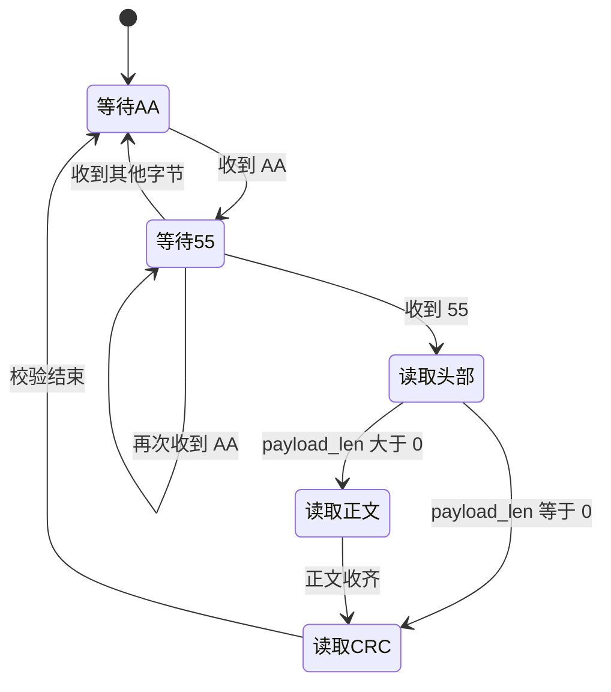

## 第一个字节抵达 PA10

`app_task` 已经开始等待。电脑把一条 `START_MOTION` 写入串口，电信号沿着接收线来到 STM32 的 PA10 引脚。

UART1 以 `115200` 波特率、8 位数据、1 个停止位、无奇偶校验的格式工作。串口硬件会按约定的节奏采样电平，把连续的高低变化恢复成一个字节。字节收好以后，USART1 的 RXNE 标志置位。RXNE 可以读作 Receive Data Register Not Empty，意思是“接收数据寄存器里有新内容”。

这时，STM32 进入 `USART1_IRQHandler()`。 **中断服务函数（Interrupt Service Routine，ISR）** 是硬件事件发生时立即执行的一小段程序，可以把它看成门铃响起后负责开门的人。

```c
int USART1_IRQHandler(void)
{
    if (USART_GetITStatus(USART1, USART_IT_RXNE) != RESET) {
        transport_uart_rx_from_isr(
            (uint8_t)USART_ReceiveData(USART1));
    }
    return 0;
}
```

这段中断函数只做一件关键工作：从 USART1 取出新字节，然后交给 `transport_uart_rx_from_isr()`。解析协议、判断方向、控制电机都留给普通任务。中断保持简短，后面的字节到来时就更容易及时接住。

## 256 格的环形等候区

中断收到的字节会进入一个长度为 `256` 的数组 `s_rx_buffer`。这个数组和两个下标一起构成**环形缓冲区（ring buffer）**。它像一圈首尾相接的候车座位：写入位置由 `head` 指示，读取位置由 `tail` 指示；走到第 255 格以后，下一个位置回到第 0 格。

```c
static volatile uint16_t s_rx_head = 0U;
static volatile uint16_t s_rx_tail = 0U;
static uint8_t s_rx_buffer[256];
```

中断负责移动 `head`，`app_task` 负责移动 `tail`。两边各自处理一端，可以让“迅速接住字节”和“按程序节奏解析字节”衔接起来。

写入前，代码先计算 `head` 的下一个位置。这个位置与 `tail` 不同时，当前字节写进数组，`head` 再向前移动。两者相同时，表示等候区已满，当前实现会保留缓冲区里的已有字节，并放弃新到的字节。

数组有 256 格，其中一格用于区分“空”和“满”，因此最多同时保存 255 个尚未读取的字节。这种设计代码很小，也很常见。后续实机联调可以加入溢出计数，让上位机或日志知道字节是否曾因缓冲区满而丢失。

应用任务从另一端取数据：

```c
if (s_rx_tail != s_rx_head) {
    *out_byte = s_rx_buffer[s_rx_tail];
    s_rx_tail = next_index(s_rx_tail);
    return true;
}
```

缓冲区暂时为空时，`transport_uart_receive_byte()` 每隔一个 FreeRTOS 节拍再检查一次。`app_task` 传入 `portMAX_DELAY`，因此它会持续等候。新字节出现后，任务按进入缓冲区的顺序逐个取走。

## 一封带封条的数字信件

串口只负责传送字节，它看不出一条消息从哪里开始。通信双方因此约定了**协议帧（protocol frame）**。帧像一只格式固定的信封：前面有醒目的封套标记，中间有寄送信息与正文，末尾有用于检查运输损伤的封条。

当前帧格式由 `LOWER_CONTROLLER/PROTOCOL/firmware/comm_protocol.h` 定义：

| 部分 | 长度 | 含义 |
| --- | ---: | --- |
| SOF | 2 字节 | 固定为 `AA 55`，标记一帧开始 |
| version | 1 字节 | 当前协议版本为 `01` |
| frame_type | 1 字节 | command、ACK、telemetry 或 heartbeat |
| seq | 2 字节 | 这一帧的序号，小端序 |
| payload_len | 2 字节 | payload 长度，小端序 |
| payload | 0～256 字节 | 命令或数据正文 |
| CRC | 2 字节 | 对 header 与 payload 的校验结果，小端序 |

SOF 是 Start of Frame 的缩写，中文可以叫帧起始标记。连续的 `AA 55` 像信封外面统一印刷的醒目标识，解析器在字节流中看到它，才开始收集后面的头部。

帧头固定为 6 字节，也就是 `version`、`frame_type`、`seq` 和 `payload_len`。`seq` 是 sequence number，中文叫序号。它给每封消息一个编号，ACK 可以借此说明自己回应的是哪一条请求。

这里的两个 256 容易混在一起。UART transport 的接收数组长度是 256，协议允许单帧 payload 最多 256 字节。完整最大帧还要加上 2 字节 SOF、6 字节 header 和 2 字节 CRC，总长可达 266 字节。应用任务会一边接收一边取走字节，缓冲区负责吸收两者之间的短时速度差。

## 状态机怎样拼出完整帧

**状态机（state machine）** 是一种按当前阶段处理输入的方法。可以把它想成门卫手里的收件流程卡：先找第一枚标记，再找第二枚标记，然后收固定长度的表头，接着按表头写明的长度收正文，最后核对封条。

解析器共有五个阶段：



解析器先等待 `AA`。随后收到 `55`，才进入读取头部。如果第二个字节再次是 `AA`，它继续等待 `55`，这样连续出现多个 `AA` 时仍有机会找到正确开头。收到其他数值时，它回到最初状态。

6 字节头部收齐以后，程序把多字节字段按 **小端序（little-endian）** 还原。小端序把数值的低位字节放在前面。例如序号 `1` 在帧里写作 `01 00`，长度 `4` 写作 `04 00`。解析器随后检查协议版本是否为 `01`，也检查 payload 是否超过 256 字节。

正文按照 `payload_len` 收齐后，解析器再读两个 CRC 字节。CRC 的全称是 Cyclic Redundancy Check，中文叫循环冗余校验。它像信封封口处的校验印记：发送端根据内容算出一个数，接收端用同样方法再算一次；两个结果一致，说明这段数据通过了当前校验。

工程采用 `CRC-16/CCITT-FALSE`，初始值是 `FFFF`，多项式是 `1021`。计算范围从 `version` 开始，覆盖 6 字节 header 与完整 payload，SOF 不参与计算。接收到的 CRC 也按小端序读取。

版本错误、payload 过大和 CRC 错误都会让解析器回到等待 `AA` 的状态。校验成功时，完整内容复制到 `comm_frame_t`，`ready` 被设为 `true`。`app_task` 直到此刻才把 frame 交给命令分发器。

## 把 START_MOTION 拆成真实字节

命令帧的 `frame_type` 是 `01`。它的 payload 还有一层简单包装：第一个字节是命令 ID，第二个字节是参数长度，后面才是参数。

`START_MOTION` 的命令 ID 为 `04`，参数长度固定为 `2`。第一个参数是方向 `direction`，第二个参数是档位 `gear`。方向编码中，向前为 `01`，向后为 `02`，向左为 `03`，向右为 `04`；档位编码中，微速为 `01`，慢速为 `02`，快速为 `03`。

假设上位机发送序号 `1`，要求机器人以“慢速”开始“向前”运动，完整帧可以写成：

```text
AA 55 | 01 01 01 00 04 00 | 04 02 01 02 | CF 93
  SOF |       header       |   payload   |  CRC
```

这 14 个字节可以从左到右读懂。`AA 55` 表示开始；第一个 `01` 是协议版本；第二个 `01` 表示 command；`01 00` 是序号 1；`04 00` 表示 payload 有 4 字节。payload 里的 `04` 是 `START_MOTION`，`02` 表示后面有两个参数，`01` 是向前，`02` 是慢速。最后的 `CF 93` 是前面 header 与 payload 算出的 CRC，小端序对应数值 `0x93CF`。

真实上位机应当使用双方共享的协议生成代码来编码消息。这里把字节展开，是为了看清每一层包装怎样对应代码字段。

## 分发器像一座接线台

完整帧到达 `command_dispatcher_handle_frame()` 后，函数先查看 `frame_type`。当前应用只把 command 帧交给命令处理函数。`comm_decode_command_view()` 再检查 payload 至少有两个字节，并确认“2 加参数长度”恰好等于整个 payload 长度。

随后，分发器读取 `cmd_id`，进入 `switch`。这座 **命令分发器（command dispatcher）** 像旧式电话接线台：它读出呼叫号码，再把请求接到对应业务接口。

```c
case COMM_CMD_START_MOTION: {
    comm_start_motion_args_t args;

    if (!comm_unpack_start_motion_args(frame, &args)) {
        response_send_ack(frame->seq, command.cmd_id,
                          RESPONSE_STATUS_BAD_PAYLOAD);
        break;
    }

    status = motion_start_motion(args.direction, args.gear) ?
        RESPONSE_STATUS_OK : RESPONSE_STATUS_BAD_PAYLOAD;
    response_send_ack(frame->seq, command.cmd_id, status);
    break;
}
```

`comm_unpack_start_motion_args()` 再做一次针对性核对：命令 ID 必须是 `04`，参数必须恰好有 2 字节。通过以后，`data[0]` 成为 `direction`，`data[1]` 成为 `gear`。这种层层核对让长度异常的消息停在业务动作之前。

`motion_start_motion()` 接到 `direction = 01` 后，选择向前分支，把四个逻辑轮位都设为正的固定 PWM。当前固定值为 `3000`，档位参数已经传入，现阶段统一输出固定值。运动层随后应用每个轮位的方向校正和 A、D、B、C 通道映射，再写入方向脚与 PWM 寄存器。四轮怎样靠不同正负组合实现前后、横移与旋转，会在下一章继续展开。

## ACK 沿原路返回

运动接口返回 `true` 时，分发器发送状态为 `OK` 的 **ACK（acknowledgement，确认响应）**。ACK 像收件回执，告诉上位机某条命令已经通过软件链路处理。

ACK 的 payload 固定为 4 字节：被回应命令的序号占 2 字节，命令 ID 占 1 字节，状态占 1 字节。响应帧还有自己的发送序号，`response_sender.c` 当前从 `100` 开始，每发送一帧就递增。

如果前面的示例是控制板启动后处理的第一条响应，ACK 帧会是：

```text
AA 55 | 01 02 64 00 04 00 | 01 00 04 00 | 1F 76
  SOF |       header       |   payload   |  CRC
```

`02` 表示 ACK 帧，`64 00` 是十进制发送序号 100，payload 中的 `01 00` 指回上位机命令序号 1，`04` 指向 `START_MOTION`，`00` 表示状态 OK。`response_send_ack()` 编码完成后调用 `transport_uart_send_bytes()`，transport 再通过 `uart1_send()` 逐字节写入 USART1，并等待每个字节发送完成。

ACK 说明帧校验、参数解析、命令选择和运动接口调用已经走通。轮子在实物上的表现还会受到电源、电机驱动、接线、安装方向与机械状态影响，因此联调记录需要同时观察返回帧和真实动作。

## 命令已经走到车轮面前

现在回看整段旅程，电脑发送的是 14 个普通字节。UART1 中断迅速接住它们，环形缓冲区把中断与任务连接起来，状态机找到 `AA 55` 并核对 CRC，分发器读出 `04 02 01 02` 的业务含义，运动层收到“向前、慢速”，响应模块再把 ACK 送回电脑。

协议当前共定义 17 条命令：`01` 到 `0F` 覆盖连通测试、底盘、航向和机构动作，`FE` 用于查询 payload 版本，`FF` 用于测试回环。`PING`、版本查询、测试命令、持续平移、持续旋转和停止已经具有具体行为，其余命令已能进入格式校验与状态响应，后续会逐步接上运动、传感器和执行机构。

这条 `START_MOTION` 还带着一个重要约定：持续运动由后续 `STOP_MOTION` 结束。当前软件链已经能够执行这两个入口，命令超时、看门狗、使能状态和统一安全停止仍需继续接入。理解这条边界之后，我们便可以把目光移向车底，看看四个带斜滚子的麦轮如何把四组正负号变成向前、横移和旋转。
