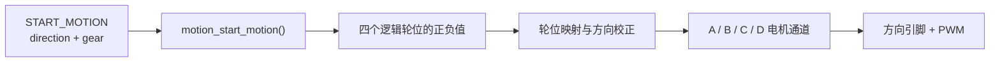

:::callout 🔄 上一章回顾
上一章我们追踪了一条 `START_MOTION` 命令的完整旅程：它从上位机出发，经过 USART1 串口中断、环形缓冲区、协议状态机的逐字节解析，最终被命令分发器拆开，取出了 `direction`（方向）和 `gear`（档位）两个参数。现在，这条命令即将交给运动控制层——真正让轮子转起来的地方。
:::

:::callout 🎯 本章你会学到
- 麦克纳姆轮（麦轮）为什么能让机器人横着走
- 四个轮子的正转/反转组合如何实现前进、后退、平移和旋转
- "逻辑轮位"和"电机通道"之间的映射与方向校正
- PWM 值如何控制电机转速
- 停止命令做了什么，以及为什么安全意识很重要
:::

## motion_start_motion：命令来到车轮前

上一章里，`START_MOTION` 已经穿过 USART1、接收缓冲区和协议解析器。命令分发器从协议载荷中拆出了两个参数：一个是 `direction`，表示"往哪个方向走"；另一个是 `gear`，表示"用哪个档位走"。现在，这条命令终于来到 `LOWER_CONTROLLER/MOTION/motion_controller.c`，准备把一句抽象的"向前"翻译成四个电机都能听懂的信号。

可以把底盘想象成一张桌子，四个电机就是抬桌子的四个人。领队喊"往前走"，四个人就一起往前迈步；领队喊"向左挪"，每个人需要根据自己站的位置调整用力方向——有人往前推，有人往后拉，桌子才能整体平移。桌子本身可听不懂"向左"这种话，它只知道四个角各自受到的力。

在麦轮底盘里，`motion_start_motion()` 就是这个"领队"。它负责把"整车动作"拆解成"每个轮子该怎么转"，再交给更底层的 PWM 驱动去执行。



命令分发器里的调用非常短，只有一行：

```c
// 调用运动函数，把方向和档位传进去
// 返回 true 表示方向有效 → 回复 OK
// 返回 false 表示方向无法识别 → 回复 BAD_PAYLOAD（载荷有误）
status = motion_start_motion(args.direction, args.gear) ?
    RESPONSE_STATUS_OK : RESPONSE_STATUS_BAD_PAYLOAD;
```

这里 `args.direction` 和 `args.gear` 都来自上位机发下来的协议载荷。运动函数返回 `true` 时，分发器就回复一个 ACK OK；如果方向值无法识别，运动函数会先把底盘停下来，再返回 `false`，分发器就会回复 BAD_PAYLOAD。

这种写法体现了很重要的一点：**通信层只负责"传话"和"回话"，真正让四个轮子怎么动的事情全部留在运动层处理**。为什么不在分发器里直接判断方向？因为那样会让通信代码里塞满电机细节；一旦换轮子、换底盘结构，通信层也得跟着改。把"命令"和"执行"分开，是大型嵌入式代码库里最常见的组织方式。

## 麦轮为什么能够横着走

### 普通轮子的局限

先想想普通轮子——比如自行车轮或汽车轮。它们只能沿着轮子滚动的方向前进或后退。想让车横着走？做不到，你只能先转弯再开过去。这就是普通轮子的局限：**运动方向被锁死在轮子滚动的方向上**。

但是在机器人比赛中，我们经常需要底盘能够灵活地向任意方向移动——前后、左右、甚至斜着走。怎么办呢？

### 麦轮：给轮子装上"斜滑轮"

这个项目使用的是**麦克纳姆轮（Mecanum wheel）**，简称**麦轮**。你可能见过超市购物车下面的万向轮——它可以朝任何方向滑动。麦轮的思路有点类似，但更巧妙。

:::callout 💡 零基础小课堂：麦克纳姆轮
麦轮看起来和普通轮子很像，但仔细看会发现：轮子外圈装了一排**斜着的小滚子**（通常倾斜 45°）。当电机驱动大轮转动时，地面对这些小滚子的反作用力不是纯粹的前后方向，而是**被分解成了前后和左右两个分量**。

你可以把它想象成穿着溜冰鞋站在地上：如果你的脚斜着用力蹬地，身体不会沿着脚的方向走，而是会往侧面滑——这就是力被分解的效果。麦轮上的小滚子就像一排微型"溜冰鞋"，让每个轮子都能产生侧向的力。
:::

单看一只麦轮，它产生的侧向分量会让车身有偏移趋势。但关键在于：**四只轮子按合适的方向一起转时，有些分量会互相抵消，有些分量则会叠加起来**。于是：

- 四个轮子同向转动 → 侧向分量互相抵消 → 车就向前或向后走；
- 对角线上的轮子反向配合 → 前后分量互相抵消 → 车就能横着平移；
- 左右两侧反向旋转 → 车就能在原地旋转。

这就是麦轮底盘的魔力：**不需要转向机构，只靠改变四个轮子的转动方向和速度，就能让车往任意方向移动**。不用担心记不住所有组合——下面的表格会帮你整理清楚。

## 四轮符号组合：整章的核心

代码里并没有先写一大串力学公式，而是直接保存了经过整理的四轮符号组合。在看表格之前，先搞清楚正号和负号的含义：

**从车顶往下看，正号（+）表示轮子向前滚，负号（-）表示轮子向后滚。** 数值大小（这里都是 3000）表示 PWM 控制量，也就是电机转速的强弱。

下面这张表是整章的核心，建议第一次看的时候对照实车位置多读几遍：

| 车身动作 | 左前 | 左后 | 右前 | 右后 |
| --- | ---: | ---: | ---: | ---: |
| 前进 | +3000 | +3000 | +3000 | +3000 |
| 后退 | -3000 | -3000 | -3000 | -3000 |
| 左移 | -3000 | +3000 | +3000 | -3000 |
| 右移 | +3000 | -3000 | -3000 | +3000 |
| 顺时针旋转 | +3000 | +3000 | -3000 | -3000 |
| 逆时针旋转 | -3000 | -3000 | +3000 | +3000 |

拿"前进"来说——四个轮子全部向前滚（全是 +），很好理解。再看"左移"——左前和右后是负号（向后滚），左后和右前是正号（向前滚），对角线上的轮子方向相反，前后分量互相抵消，侧向分量向左叠加，车就横着往左走了。

以向前命令为例，对应的源码非常直白：

```c
case COMM_ENUM_MOVE_DIRECTION_FORWARD:        // 方向 = 前进
    motion_set_wheel_pwm(+BOARD_MOTION_FIXED_PWM,  // 左前轮：正转（向前）
                         +BOARD_MOTION_FIXED_PWM,  // 左后轮：正转（向前）
                         +BOARD_MOTION_FIXED_PWM,  // 右前轮：正转（向前）
                         +BOARD_MOTION_FIXED_PWM); // 右后轮：正转（向前）
    return true;  // 返回 true，告诉分发器"方向有效"
```

`motion_set_wheel_pwm()` 的四个参数依次是左前、左后、右前、右后。注意，这里谈的是"机器人身上的位置"（左前、右后这样的名字），暂时还不关心电机线插在控制板的哪个接口（A、B、C、D）。

:::callout-tip 分层设计的好处
运动算法只关心"左前、右后"这样的位置名，不关心电机插在控制板的哪个接口。这个小小的分层非常有用：以后如果调整接线，只需修改板级配置，前进、后退、横移和旋转这些运动逻辑可以保持原样不动。
:::

> **初学者常见疑问**：为什么前进时四个轮子的符号完全相同？
> 因为这里的符号描述的是"从车身正上方看，轮子该往哪个方向转"。四个轮子都向前滚，车自然向前走。等到后面做轮位映射时，才会根据每个电机的实际安装方向决定要不要把符号翻过来。

## 轮位和电机接口之间的翻译

机器人装配完成后，四只轮子在车身上的位置是清楚的：左前、左后、右前、右后。但控制板上的接口却叫 A、B、C、D，和车身位置没有必然的对应关系——左前轮的电机线可能插在 A 口，也可能插在 D 口，这完全取决于实际接线。

当前的真实映射写在 `LOWER_CONTROLLER/BOARD/board_motion_config.h` 里：

| 逻辑轮位 | 电机通道 | 方向系数 |
| --- | --- | ---: |
| 左前轮 | A | +1 |
| 左后轮 | D | -1 |
| 右前轮 | B | -1 |
| 右后轮 | C | +1 |

方向系数可以理解为每个轮位旁边贴的一张"翻译卡"。同样是逻辑上的"正转"，由于电机安装朝向、减速箱方向或接线顺序不同，落到某个电机通道时可能需要翻成"反转"。当前左后轮和右前轮的方向系数是 `-1`，左前轮和右后轮是 `+1`。

以"前进"为例，运动层先给四个逻辑轮位各写入 `+3000`；应用方向系数并映射到接口后，结果会变成：

| 逻辑轮位 | 逻辑值 | 方向系数 | 电机通道 | 实际输出 |
| --- | ---: | ---: | --- | ---: |
| 左前轮 | +3000 | +1 | A | +3000 |
| 左后轮 | +3000 | -1 | D | -3000 |
| 右前轮 | +3000 | -1 | B | -3000 |
| 右后轮 | +3000 | +1 | C | +3000 |

可以看到，虽然运动层说的是"四个轮子都向前滚"，但实际送给 D 和 B 通道的却是负值——因为这两个电机的安装方向和逻辑方向相反，需要"翻译"一下。

随后 `motion_set_pwm()` 根据正负号设置每路电机的两个方向引脚，再把绝对值写入 `PWMA`、`PWMB`、`PWMC`、`PWMD`。源码里的乘法只有短短四行，却完成了非常关键的分层：

```c
// 逻辑值 × 方向系数 = 实际输出值
// 系数为 +1 时值不变；系数为 -1 时正负翻转
front_left  *= BOARD_MOTION_FRONT_LEFT_DIR;   // 左前轮：×(+1)，不变
rear_left   *= BOARD_MOTION_REAR_LEFT_DIR;    // 左后轮：×(-1)，正变负
front_right *= BOARD_MOTION_FRONT_RIGHT_DIR;  // 右前轮：×(-1)，正变负
rear_right  *= BOARD_MOTION_REAR_RIGHT_DIR;   // 右后轮：×(+1)，不变
```

这几行看起来只是乘以 `1` 或 `-1`，但它们把"车应该怎样走"和"电机实际怎样接"彻底隔开了。实机调试时，如果某只轮子转反了，最可能的做法不是去改前进或横移的运动组合，而是去板级配置里把对应的方向系数从 `+1` 改成 `-1`，或者反过来。

运动组合仍然表达"前进、后退、横移、旋转"这些直观概念，阅读代码的人也能继续按照车身方向思考，而不是被 A、B、C、D 这些接口名字绕晕。

> **初学者常见疑问**：方向系数 `-1` 是不是表示电机在"倒着接"？
> 可以这样理解，但更准确地说是"电机正转方向与逻辑正方向相反"。电机的正转方向由厂家、减速箱、安装面共同决定；代码里用一个系数把差异兜住，调试时只改一处宏定义即可。

## PWM 与占空比

还记得第 1 章讲过的 PWM 吗？它的中文是**脉宽调制**，英文是 **Pulse Width Modulation**——通过快速开关来控制电机的转速。开关打开的时间越长，电机得到的平均驱动就越强。

:::callout 💡 零基础小课堂：占空比
一个 PWM 周期里，"打开"时间占总时间的比例，叫做**占空比（Duty Cycle）**。比如一个周期是 100 毫秒，打开 18 毫秒、关闭 82 毫秒，占空比就是 18%。占空比越大，电机转得越快；占空比为 0 时，电机完全不转。
:::

系统启动时会调用：

```c
// 初始化 PWM 硬件
// 16799 是计数周期（0 到 16799，共 16800 个刻度）
// 0 是预分频值（不额外分频）
MiniBalance_PWM_Init(16799, 0);
```

一共有 16800 个刻度，所以仓库里把 `FULL_DUTYCYCLE` 写成 16800。当前板级固定值是 3000，大约占满量程的 18%（3000 ÷ 16800 ≈ 18%）。

不过要注意，这个比例描述的是"控制量"，不是车速；实际车速还会受到电池电压、地面摩擦、负载和电机个体差异的影响。

当前 `gear` 已经随命令进入 `motion_start_motion()`，函数开头有这样一行：

```c
(void)gear;  // 告诉编译器：这个参数我收到了，但现在还不用它
```

:::callout-tip 关于 (void)gear 的写法
如果你没学过 C 语言，这行可能看起来很奇怪。它的作用很简单：**告诉编译器"我知道有这个参数，暂时不用它，请不要报'未使用变量'的警告"**。这是 C 语言中一种常见的写法，不用担心，它不会产生任何实际效果。
:::

微速、慢速、快速三种档位在协议里已经有编码，但运动层目前统一输出 3000。以后如果接入档位表、速度闭环或者 PID，这个参数就有了落脚点。

> **为什么要先留一个档位参数却不实现？**
> 因为这是一个刚刚接手的代码仓库，作者选择先把"能走、能停、方向正确"跑通，再逐步加入速度分级。先把骨架搭稳，再填血肉，是调试大型项目时比较稳妥的节奏。

## 停止时发生了什么

上位机发来 `STOP_MOTION` 后，命令分发器会调用 `motion_stop()`。这个函数把四路 PWM 清零，同时把 A、B、C、D 的方向引脚也清零：

```c
void motion_stop(void)
{
    // 第一步：把四路 PWM 全部设为 0，电机失去驱动电压
    PWMA = 0;  // A 通道 PWM 清零
    PWMB = 0;  // B 通道 PWM 清零
    PWMC = 0;  // C 通道 PWM 清零
    PWMD = 0;  // D 通道 PWM 清零

    // 第二步：把方向引脚也清零，切断 H 桥电流路径
    AIN1 = 0;  // A 通道方向引脚 1 清零
    AIN2 = 0;  // A 通道方向引脚 2 清零
    /* B、C、D 方向引脚也在这里清零 */
}
```

把 PWM 设成 0，电机就没有了驱动电压；把方向引脚也设成 0，可以切断 H 桥（还记得第 1 章讲的"四个开关控制电流方向"吗？）两端的电流路径，让电机进入自由滑行或制动状态。

无效的平移方向和旋转方向同样会走到 `motion_stop()`，这样底盘在收到无法理解的方向码时就会回到停止状态，而不是继续执行上一个可能危险的命令。

:::callout-warn ⚠️ 安全警告：运动层没有内置超时自动停止
当前的 `START_MOTION` 设置 PWM 后，电机会一直保持这个输出，直到新的运动命令改写它，或者 `STOP_MOTION` 把它清零。换句话说，**如果上位机程序崩溃或者通信断开，而底盘又处在运动状态，轮子会一直转下去！**

这对初学者调试时要特别注意：
- 早期测试时一定要**把车轮架空**（用书本或盒子把车底盘垫起来）
- 随时准备**手动断电**（拔电池或关总开关）
- 不要让机器人在地面上无人看管地运行
:::

## 调试工具：motion_test_motor_channels_loop()

运动文件里还留有一个很实用的调试函数 `motion_test_motor_channels_loop()`。简单来说，它是一个**电机接线检查工具**：让 A、B、C、D 四个电机通道依次转动，方便你检查接线是否正确。

具体来说，它用 PWM 1200 让 A、B、C、D 四个通道依次运行一秒，最后停止两秒，再重新循环。在车轮悬空时运行这个函数，你可以逐个观察：A 通道转的时候，是哪个轮子在动？如果 A 通道运行时右前轮在转，而你的配置表说 A 应该是左前轮——那说明映射关系和预期不一样，需要调整接线或修改配置。

当前 `main.c` 创建的是 `app_task`，并没有调用这段通道测试循环，但它作为一个调试入口被保留了下来。

## 本章小结

至此，那条"向前移动"的命令已经走完了一条完整的链路：

1. 从 `START_MOTION` 协议载荷中取出方向和档位；
2. 在运动控制层把方向翻译成四个逻辑轮位的符号和 PWM；
3. 通过方向系数把逻辑轮位映射到 A、B、C、D 电机通道；
4. 最后写入方向引脚和 PWM 寄存器，四个轮子开始转动。

下一章会给这条控制链补上"眼睛"和"耳朵"——也就是传感器反馈和更完整的安全保护，让底盘不仅能动，还能知道自己是真的在往前走。

## 本章新词

| 术语 | 英文 | 一句话解释 |
|------|------|-----------|
| 麦克纳姆轮 / 麦轮 | Mecanum wheel | 轮子外圈装了一排 45° 斜向小滚子，让底盘可以横着走 |
| 占空比 | Duty Cycle | 一个 PWM 周期里"打开"时间占总时间的比例，控制电机转速 |
| 逻辑轮位 | Logical wheel position | 用"左前、左后、右前、右后"描述轮子在车身上的位置 |
| 电机通道 | Motor channel (A/B/C/D) | 控制板上的硬件接口编号，与逻辑轮位通过映射表对应 |
| 方向系数 | Direction coefficient | +1 或 -1，用来修正电机安装方向与逻辑方向之间的差异 |
| PWM 控制量 | PWM value | 写入硬件的数值，决定电机驱动的强弱（本章固定为 3000） |
| (void)变量名 | (void) cast | C 语言写法，告诉编译器"我知道有这个参数，暂时不用" |
