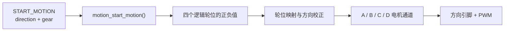

## motion_start_motion：命令来到车轮前

上一章里，`START_MOTION` 已经穿过 USART1、接收缓冲区和协议解析器。命令分发器从协议载荷中拆出了两个参数：一个是 `direction`，表示“往哪个方向走”；另一个是 `gear`，表示“用哪个档位走”。现在，这条命令终于来到 `LOWER_CONTROLLER/MOTION/motion_controller.c`，准备把一句抽象的“向前”翻译成四个电机都能听懂的信号。

可以把底盘想象成一张桌子，四个电机就是抬桌子的四个人。领队只会喊“往前走”“向左挪”这种整体指令，桌子本身可听不懂人话；四个人必须分别知道自己该往哪个方向、用多大力气推。在麦轮底盘里，`motion_start_motion()` 就是这个“领队”。它负责把“整车动作”拆解成“每个轮子该怎么转”，再交给更底层的 PWM 驱动去执行。



命令分发器里的调用非常短，只有一行：

```c
status = motion_start_motion(args.direction, args.gear) ?
    RESPONSE_STATUS_OK : RESPONSE_STATUS_BAD_PAYLOAD;
```

这里 `args.direction` 和 `args.gear` 都来自上位机发下来的协议载荷。运动函数返回 `true` 时，分发器就回复一个 ACK OK；如果方向值无法识别，运动函数会先把底盘停下来，再返回 `false`，分发器就会回复 BAD_PAYLOAD。

这种写法体现了很重要的一点：**通信层只负责“传话”和“回话”，真正让四个轮子怎么动的事情全部留在运动层处理**。初学者可能会想，为什么不在分发器里直接判断方向？因为那样会让通信代码里塞满电机细节；一旦换轮子、换底盘结构，通信层也得跟着改。把“命令”和“执行”分开，是大型嵌入式代码库里最常见的组织方式。

## 麦轮为什么能够横着走

这个项目使用的是麦克纳姆轮，英文叫 **Mecanum wheel**。普通轮子的主要滚动方向只能沿着车头前后，但麦轮外圈还有一排斜着安装的小滚子。你可以把它想象成一只鞋底上装了许多斜向小轮：大轮转动时，地面对车轮的反作用力会被分解成前后和左右两个方向。

单看一只麦轮，它产生的侧向分量会让车身有偏移趋势；但四只轮子按合适的方向一起转时，有些分量会互相抵消，有些分量则会叠加起来。于是：

- 四个轮子同向转动，车就向前或向后走；
- 左右两侧斜向分量重新组合，车就能横着平移；
- 左右两侧反向配合，车就能在原地旋转。

代码里并没有先写一大串力学公式，而是直接保存了经过整理的四轮符号组合。这里的正号和负号表示“逻辑轮位希望转动的方向”，数值大小表示 PWM 控制量。下面这张表是整章的核心，建议第一次看的时候对照实车位置多读几遍：

| 车身动作 | 左前 | 左后 | 右前 | 右后 |
| --- | ---: | ---: | ---: | ---: |
| 前进 | +3000 | +3000 | +3000 | +3000 |
| 后退 | -3000 | -3000 | -3000 | -3000 |
| 左移 | -3000 | +3000 | +3000 | -3000 |
| 右移 | +3000 | -3000 | -3000 | +3000 |
| 顺时针旋转 | +3000 | +3000 | -3000 | -3000 |
| 逆时针旋转 | -3000 | -3000 | +3000 | +3000 |

以向前命令为例，对应的源码非常直白：

```c
case COMM_ENUM_MOVE_DIRECTION_FORWARD:
    motion_set_wheel_pwm(+BOARD_MOTION_FIXED_PWM,
                         +BOARD_MOTION_FIXED_PWM,
                         +BOARD_MOTION_FIXED_PWM,
                         +BOARD_MOTION_FIXED_PWM);
    return true;
```

`motion_set_wheel_pwm()` 的四个参数依次是左前、左后、右前、右后。这里先谈的是“机器人身上的位置”，暂时还不关心电机线插在控制板的哪个接口。这个小小的分层非常有用：以后如果调整接线，只需修改板级配置，前进、后退、横移和旋转这些运动逻辑可以保持原样不动。

> **初学者常见疑问**：为什么前进时四个轮子的符号完全相同？
> 因为这里的符号描述的是“从车身正上方看，轮子该往哪个方向转”。四个轮子都向前滚，车自然向前走。等到后面做轮位映射时，才会根据每个电机的实际安装方向决定要不要把符号翻过来。

## 轮位和电机接口之间的翻译

机器人装配完成后，四只轮子在车身上的位置是清楚的：左前、左后、右前、右后。但控制板上的接口却叫 A、B、C、D，和车身位置没有必然的对应关系。当前的真实映射写在 `LOWER_CONTROLLER/BOARD/board_motion_config.h` 里：

| 逻辑轮位 | 电机通道 | 方向系数 |
| --- | --- | ---: |
| 左前轮 | A | +1 |
| 左后轮 | D | -1 |
| 右前轮 | B | -1 |
| 右后轮 | C | +1 |

方向系数可以理解为每个轮位旁边贴的一张“翻译卡”。同样是逻辑上的正转，由于电机安装朝向、减速箱方向或接线顺序不同，落到某个电机通道时可能需要翻成负转。当前左后轮和右前轮的方向系数是 `-1`，左前轮和右后轮是 `+1`。

以“前进”为例，运动层先给四个逻辑轮位各写入 `+3000`；应用方向系数并映射到接口后，结果会变成：

| 逻辑轮位 | 逻辑值 | 方向系数 | 电机通道 | 实际输出 |
| --- | ---: | ---: | --- | ---: |
| 左前轮 | +3000 | +1 | A | +3000 |
| 左后轮 | +3000 | -1 | D | -3000 |
| 右前轮 | +3000 | -1 | B | -3000 |
| 右后轮 | +3000 | +1 | C | +3000 |

随后 `motion_set_pwm()` 根据正负号设置每路电机的两个方向引脚，再把绝对值写入 `PWMA`、`PWMB`、`PWMC`、`PWMD`。源码里的乘法只有短短四行，却完成了非常关键的分层：

```c
front_left  *= BOARD_MOTION_FRONT_LEFT_DIR;
rear_left   *= BOARD_MOTION_REAR_LEFT_DIR;
front_right *= BOARD_MOTION_FRONT_RIGHT_DIR;
rear_right  *= BOARD_MOTION_REAR_RIGHT_DIR;
```

这几行看起来只是乘以 `1` 或 `-1`，但它们把“车应该怎样走”和“电机实际怎样接”彻底隔开了。实机调试时，如果某只轮子转反了，最可能的做法不是去改前进或横移的运动组合，而是去板级配置里把对应的方向系数从 `+1` 改成 `-1`，或者反过来。运动组合仍然表达“前进、后退、横移、旋转”这些直观概念，阅读代码的人也能继续按照车身方向思考，而不是被 A、B、C、D 这些接口名字绕晕。

> **初学者常见疑问**：方向系数 `-1` 是不是表示电机在“倒着接”？
> 可以这样理解，但更准确地说是“电机正转方向与逻辑正方向相反”。电机的正转方向由厂家、减速箱、安装面共同决定；代码里用一个系数把差异兜住，调试时只改一处宏定义即可。

## PWM 像快速开关

PWM 的中文是**脉宽调制**，英文是 **Pulse Width Modulation**。最简单的理解方式是一个开关在极短时间里反复打开和关闭：一个周期里，打开时间越长，电机得到的平均驱动就越强。人眼看调光灯时感到的是亮度变化，电机感受到的则是平均电压和转矩变化。

系统启动时会调用：

```c
MiniBalance_PWM_Init(16799, 0);
```

这里把 PWM 计数周期设为 16799，从 0 开始计数时一共有 16800 个刻度。因此仓库里把 `FULL_DUTYCYCLE` 写成 16800。当前板级固定值是 3000，大约占满量程的 18%。不过要注意，这个比例描述的是“控制量”，不是车速；实际车速还会受到电池电压、地面摩擦、负载和电机个体差异的影响。

当前 `gear` 已经随命令进入 `motion_start_motion()`，函数开头用 `(void)gear;` 表示“这个参数我先保留，暂时不用”。这是一种常见的写法，用来告诉编译器“我知道有这个参数，后面会用到，现在别报未使用警告”。微速、慢速、快速三种档位在协议里已经有编码，但运动层目前统一输出 3000。以后如果接入档位表、速度闭环或者 PID，这个参数就有了落脚点。

> **为什么要先留一个档位参数却不实现？**
> 因为这是一个刚刚接手的代码仓库，作者选择先把“能走、能停、方向正确”跑通，再逐步加入速度分级。先把骨架搭稳，再填血肉，是调试大型项目时比较稳妥的节奏。

## 停止时发生了什么

上位机发来 `STOP_MOTION` 后，命令分发器会调用 `motion_stop()`。这个函数把四路 PWM 清零，同时把 A、B、C、D 的方向引脚也清零：

```c
void motion_stop(void)
{
    PWMA = 0;
    PWMB = 0;
    PWMC = 0;
    PWMD = 0;

    AIN1 = 0;
    AIN2 = 0;
    /* B、C、D 方向引脚也在这里清零 */
}
```

把 PWM 设成 0，电机就没有了驱动电压；把方向引脚也设成 0，可以切断 H 桥两端的电流路径，让电机进入自由滑行或制动状态。无效的平移方向和旋转方向同样会走到 `motion_stop()`，这样底盘在收到无法理解的方向码时就会回到停止状态，而不是继续执行上一个可能危险的命令。

当前的持续运动还有一个很重要的特点：`START_MOTION` 设置 PWM 后，电机会一直保持这个输出，直到新的运动命令改写它，或者 `STOP_MOTION` 把它清零。换句话说，**运动层没有内置超时自动停止**。这对初学者调试时要特别注意：如果上位机程序崩溃或者通信断开，而底盘又处在运动状态，轮子会一直转下去。所以早期测试一定要把车轮架空，或者随时准备手动断电。

运动文件里还留有 `motion_test_motor_channels_loop()`。它用 PWM 1200 让 A、B、C、D 四个通道依次运行一秒，最后停止两秒，再重新循环。这个函数非常适合在车轮悬空时检查每个通道和接线是否正常：如果 A 通道运行时右前轮在转，说明映射关系和预期不一样。当前 `main.c` 创建的是 `app_task`，并没有调用这段通道测试循环，但它作为一个调试入口被保留了下来。

**本节小结**：至此，那条“向前移动”的命令已经走完了一条完整的链路：

1. 从 `START_MOTION` 协议载荷中取出方向和档位；
2. 在运动控制层把方向翻译成四个逻辑轮位的符号和 PWM；
3. 通过方向系数把逻辑轮位映射到 A、B、C、D 电机通道；
4. 最后写入方向引脚和 PWM 寄存器，四个轮子开始转动。

下一章会给这条控制链补上“眼睛”和“耳朵”——也就是传感器反馈和更完整的安全保护，让底盘不仅能动，还能知道自己是真的在往前走。
