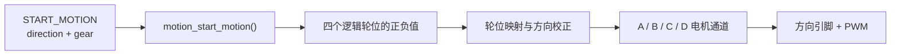

## motion_start_motion：命令来到车轮前

上一章里，`START_MOTION` 已经穿过 USART1、接收缓冲区和协议解析器。命令分发器拆出了两个参数：`direction` 表示移动方向，`gear` 表示档位。现在，它来到 `LOWER_CONTROLLER/MOTION/motion_controller.c`，准备把“向前”翻译成四个电机都能听懂的信号。

这一步很像四个人一起抬一张桌子。领队只会说“往前走”或者“向左挪”，桌子本身听不懂这些话。四个人必须分别知道自己该往哪个方向用力。麦轮底盘里的 `motion_start_motion()` 就是这位领队。



命令分发器里的调用很短：

```c
status = motion_start_motion(args.direction, args.gear) ?
    RESPONSE_STATUS_OK : RESPONSE_STATUS_BAD_PAYLOAD;
```

`args.direction` 和 `args.gear` 来自协议载荷。运动函数返回 `true`，分发器就回复 ACK OK；方向值无法识别时，运动函数先停下底盘，再返回 `false`。这样，通信层只负责传递命令和回复状态，四轮动作都留在运动层处理。

## 麦轮为什么能够横着走

这个项目使用的是麦克纳姆轮，英文叫 **Mecanum wheel**。普通轮子的主要滚动方向沿着车头前后，麦轮外圈还有一排斜着安装的小滚子。可以把它想成一只鞋底上装了许多斜向小轮：大轮转动时，地面对车轮的作用力会被分成前后和左右两个方向。

一只麦轮产生的侧向分量会让车身有偏移趋势。四只轮子按合适的方向一起转时，有些分量互相抵消，有些分量叠加起来。四轮同向配合，车向前；左右斜向分量重新组合，车可以横移；左右两侧反向配合，车就在原地旋转。

代码没有先写一大串力学公式。它直接保存了经过整理的四轮符号组合。这里的正号和负号表示逻辑轮位希望转动的方向，数值大小表示 PWM 控制量。

| 车身动作 | 左前 | 左后 | 右前 | 右后 |
| --- | ---: | ---: | ---: | ---: |
| 前进 | +3000 | +3000 | +3000 | +3000 |
| 后退 | -3000 | -3000 | -3000 | -3000 |
| 左移 | -3000 | +3000 | +3000 | -3000 |
| 右移 | +3000 | -3000 | -3000 | +3000 |
| 顺时针旋转 | +3000 | +3000 | -3000 | -3000 |
| 逆时针旋转 | -3000 | -3000 | +3000 | +3000 |

向前命令对应的源码很直白：

```c
case COMM_ENUM_MOVE_DIRECTION_FORWARD:
    motion_set_wheel_pwm(+BOARD_MOTION_FIXED_PWM,
                         +BOARD_MOTION_FIXED_PWM,
                         +BOARD_MOTION_FIXED_PWM,
                         +BOARD_MOTION_FIXED_PWM);
    return true;
```

`motion_set_wheel_pwm()` 的四个参数依次是左前、左后、右前、右后。这里先谈机器人身上的位置，暂时不关心电机线插在控制板的哪个接口。这个小小的分层很有用：以后调整接线，只需修改板级配置，前进和左移的运动逻辑可以继续保持原样。

## 轮位和电机接口之间的翻译

机器人装配完成后，四只轮子拥有清楚的位置，控制板上的插口则叫 A、B、C、D。当前真实映射写在 `LOWER_CONTROLLER/BOARD/board_motion_config.h`：

| 逻辑轮位 | 电机通道 | 方向系数 |
| --- | --- | ---: |
| 左前轮 | A | +1 |
| 左后轮 | D | -1 |
| 右前轮 | B | -1 |
| 右后轮 | C | +1 |

方向系数可以理解成每个轮位旁边的一张“翻译卡”。同样是逻辑上的正转，由于电机安装朝向、减速箱方向或接线顺序不同，落到某个电机通道时可能需要翻成负转。当前左后轮和右前轮的系数是 `-1`，左前轮和右后轮的系数是 `+1`。

向前时，运动层先给四个逻辑轮位各写入 `+3000`。应用方向系数并映射到接口后，A 得到 `+3000`，D 得到 `-3000`，B 得到 `-3000`，C 得到 `+3000`。随后 `motion_set_pwm()` 根据正负号设置每路电机的两个方向引脚，再把绝对值写入 `PWMA`、`PWMB`、`PWMC`、`PWMD`。

```c
front_left  *= BOARD_MOTION_FRONT_LEFT_DIR;
rear_left   *= BOARD_MOTION_REAR_LEFT_DIR;
front_right *= BOARD_MOTION_FRONT_RIGHT_DIR;
rear_right  *= BOARD_MOTION_REAR_RIGHT_DIR;
```

这几行看起来只是乘以 `1` 或 `-1`，它们把“车应该怎样走”和“电机实际怎样接”隔开了。某只轮子在实车上转反时，板级配置里的对应系数就是调试入口。运动组合仍然表达前进、后退、横移和旋转，阅读代码的人也能继续按照车身方向思考。

## PWM 像快速开关

PWM 的中文是**脉宽调制**，英文是 **Pulse Width Modulation**。它可以想成一个开关在极短时间内反复打开和关闭。一个周期里，打开时间越长，电机得到的平均驱动越强。人眼看调光灯时感到的是亮度变化，电机感受到的则是平均电压和转矩变化。

系统启动时调用：

```c
MiniBalance_PWM_Init(16799, 0);
```

这里把 PWM 计数周期设为 16799，从 0 开始计数时共有 16800 个刻度。因此仓库里的 `FULL_DUTYCYCLE` 写成 16800。当前板级固定值是 3000，大约占满量程的 18%。这个比例描述的是控制量，实际车速还会受到电池电压、地面摩擦、负载和电机差异影响。

当前 `gear` 已经随命令进入 `motion_start_motion()`，函数开头用 `(void)gear;` 表示暂时保留这个参数。微速、慢速、快速三种档位在协议里已有编码，运动层仍统一输出 3000。以后接入档位表或速度闭环时，这个参数就有了落脚点。

## 停止时发生了什么

上位机发来 `STOP_MOTION` 后，命令分发器调用 `motion_stop()`。函数把四路 PWM 清零，同时把 A、B、C、D 的方向引脚清零：

```c
void motion_stop(void)
{
    PWMA = 0;
    PWMB = 0;
    PWMC = 0;
    PWMD = 0;

    AIN1 = 0;
    AIN2 = 0;
    /* B、C、D 方向引脚也在这里清零 */
}
```

无效的平移方向和旋转方向也会走到 `motion_stop()`。这使底盘在收到无法理解的方向码时回到停止状态。当前的持续运动有一个很重要的特点：`START_MOTION` 设置 PWM 后，电机保持这个输出，直到新的运动命令改写它，或者 `STOP_MOTION` 将它清零。

运动文件里还留有 `motion_test_motor_channels_loop()`。它用 PWM 1200 让 A、B、C、D 依次运行一秒，最后停止两秒，再重新循环。这个函数适合在车轮悬空时检查通道和接线；当前 `main.c` 创建的是 `app_task`，没有调用这段通道测试循环。

至此，那条“向前移动”命令已经抵达四路电机输出：代码会写入方向引脚和 PWM 寄存器。轮子是否按预期转动，将由后续实机记录确认。下一章会给控制链补上眼睛、耳朵和更完整的安全保护。
