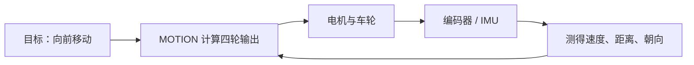

:::callout 🔄 上一章回顾
上一章我们跟着 `START_MOTION` 命令进入了运动控制层，看到了麦克纳姆轮底盘如何把"向前走"这样的整体指令拆解成四个电机各自的转向和转速。现在四个轮子已经转起来了——但机器人真的知道自己跑了多快、有没有跑偏吗？
:::

:::callout 🎯 本章你会学到
- 什么是开环控制和闭环控制，为什么闭环更可靠
- 编码器如何测量轮子转速和距离
- IMU（惯性测量单元）如何感知车身旋转和姿态
- 执行机构（升降、夹爪、推杆）的安全保护思路
- 命令超时、看门狗等安全机制为什么必不可少
:::

## 输出已经写下，接下来要知道动作结果

上一章里，`START_MOTION` 已经让程序向四路电机写入了固定的 PWM 值 3000。四路电机按照命令转了起来，底盘应该已经能够前后左右移动。

但如果我们只做到这一步，其实还没有真正"控制"住机器人——我们只是把油门踏板踩到了固定位置，至于车实际跑多快、有没有跑偏、有没有打滑，程序暂时一无所知。

### 开环控制："闭着眼睛开车"

这种"给出输出，然后持续保持"的方式叫**开环控制（Open-Loop Control）**。开环控制就像我们闭着眼睛推一辆小车：双手用了多大的力气是知道的，但小车实际走到哪儿、有没有偏方向、是不是撞上了障碍，都只能靠猜。

生活中也有很多开环例子：厨房里把燃气旋钮转到某个位置后等待三分钟，就是一种开环做法——火力大小已经给定，锅里的真实温度没有参与调节；如果锅底糊了或者水溢出来，炉子自己不会知道。

### 闭环控制："看着路开车"

机器人竞赛里，我们通常不希望机器人"盲开"。车身是否跑偏、轮子实际转速是多少、当前朝向是不是想要的朝向、机械结构是否走到了极限位置，这些信息最好都能回到控制程序里。

这种"把动作结果送回去，再影响下一次动作"的机制叫**反馈（Feedback）**。

:::callout 💡 零基础小课堂：什么是反馈？
反馈就像你洗澡时调节水温的过程：你先拧旋钮调大热水（这是**输出**），然后用手感受水流的温度（这是**反馈**），如果水太烫就往冷水方向拧一点（这是**修正**）。

这个"输出 → 感受 → 修正 → 再输出"的循环，就是反馈的核心思想。机器人也是一样：给电机一个转速，通过传感器测量实际效果，再根据差距调整输出。
:::

当控制器不断比较"我想要的状态"和"我测到的状态"，再根据差距调整输出时，这个循环就叫**闭环控制（Closed-Loop Control）**。闭环控制能大大提高机器人的稳定性和精度，也是后续从"能动"走向"可控"的关键。



当前工程已经保留了产生反馈所需的底层硬件驱动，比如编码器定时器、IMU 初始化等。新的 `SENSORS` 层仍在搭建中，因此这些信号还没有进入 `motion_start_motion()` 的控制循环。也就是说：现在我们能输出，也能读传感器，但"读了之后用来修正输出"这一步还没接上。

> **初学者常见疑问**：开环控制是不是就没用？
>
> 并不是。开环控制结构简单、响应快，在很多不需要精确跟踪目标的场景下完全够用。比如让底盘简单跑一段、让指示灯闪烁、让蜂鸣器发声，都不需要反馈。只有当我们要精确控制速度、位置、角度，或者环境干扰比较大（比如轮子打滑、地面不平）时，才需要引入闭环。

## 编码器：给车轮装上"计步器"

### 为什么需要知道轮子转了多少？

要让闭环跑起来，控制器必须知道一个关键信息：**每个轮子实际转了多快**。只有知道了实际转速，才能和目标转速做比较，然后决定是加大油门还是减小油门。

想象你在跑步机上运动：屏幕显示你当前的速度是 5 km/h，而你设定的目标是 8 km/h，于是你加快步伐。这里的"速度显示屏"就扮演了反馈的角色。对机器人来说，扮演这个角色的就是**编码器（Encoder）**。

### 编码器是怎么工作的？

编码器通常安装在电机轴或者轮轴上，随着转动产生一串电脉冲。它的效果很像自行车码表里的磁铁：车轮每转过一小段距离，计数器就多记一次。固定时间内的脉冲数可以帮助我们估算当前速度，累计脉冲数可以帮助我们估算已经走过的距离。

为什么速度和距离都能从脉冲算出来？可以这么理解：编码器每转一圈会输出固定数量的脉冲，比如 500 个或 1000 个；而车轮转一圈走多远，又由轮胎直径决定。于是：

- **速度** ≈ 单位时间内的新增脉冲数 × 每个脉冲对应的轮周长；
- **距离** ≈ 累计脉冲数 × 每个脉冲对应的轮周长。

这样一来，控制器就知道"我给出了 3000 的 PWM，实际轮子转得够不够快"，然后再决定下一周期是加大 PWM 还是减小 PWM。

### 编码器的初始化和读取

`USER/system.c` 在上电初始化时依次调用 `EncoderA_Init()`、`EncoderB_Init()`、`EncoderC_Init()` 和 `EncoderD_Init()`。四个接口分别使用 STM32 的不同定时器来计数脉冲。底层读取接口位于 `HARDWARE/encoder.c`：

```c
// 读取编码器脉冲数的函数
// 参数 e：选择哪个编码器（A、B、C 或 D）
short Read_Encoder(ENCODER_t e)
{
    // 读取定时器当前的计数值，转换为 short 类型（有正负号）
    Encoder_TIM = (short)ENCODER_A_TIM->CNT;
    // 读完之后立即把计数器清零，为下一次读取做准备
    ENCODER_A_TIM->CNT = 0;
    // 返回这段时间内的新增脉冲数
    return Encoder_TIM;
}
```

代码按传入的 A、B、C、D 选择对应定时器。读出计数后，它把计数器清零，下一次读取就得到下一个时间片里的新增脉冲。上面的片段只展示了 A 通道，完整函数对四个通道采用同样的处理。

### 几个新手常问的细节

这里有几个细节值得新手注意：

**为什么读完要清零？** 因为定时器里的 CNT 是累计值。如果不定期清零，计数会越来越大，最后溢出，读取时反而算不出"这段时间内新增了多少脉冲"。每次读取后清零，下一次读到的就是"从上一次到现在"的新增量，方便直接计算瞬时速度。

**编码器读数的单位是什么？** 读出来的是脉冲数，还不是米每秒。后面需要乘以"每个脉冲对应多少毫米"这个换算系数，才能得到工程师更关心的速度和位移。

:::callout 💡 零基础小课堂：正交编码模式
你可能会好奇：编码器怎么知道轮子是正转还是反转？

实际电机驱动里通常会用定时器的**正交编码模式（Encoder Interface Mode）**。简单来说，编码器有 A、B 两根信号线，硬件会自动根据这两根线的信号先后顺序来判断轮子是正转还是反转，计数会相应地增加或减少。你不需要在软件里手动判断方向，**硬件自动帮你搞定了**。

如果只用单相脉冲（只有一根信号线），方向就需要额外通过电机方向引脚来推断。
:::

### 让编码器数据真正参与控制

要让这些数字真正参与运动控制，还需要先约定好几件事：

1. **读取周期**：多久读一次编码器？10 ms？20 ms？周期越短响应越快，但计算量也越大。
2. **脉冲与轮周的换算关系**：一个脉冲对应轮子走了多少毫米？这取决于编码器分辨率、减速比和轮胎直径。
3. **正负方向**：程序里"正方向"对应车身前进还是后退？四个轮子是否统一？
4. **异常值处理**：如果某次读数突然跳到一个离谱的值（比如计数器异常翻转、轮子打滑空转），程序要不要过滤？

随后 `SENSORS/encoder_feedback.c` 可以提供稳定接口，`MOTION` 再用它调节四路 PWM。当前 `SENSORS/README.md` 已经写下这个接口方向，但实际的 `encoder_feedback.c` 尚待创建。也就是说：硬件驱动有了，数据换算和上层接口还需要新人一点点补齐。

> **初学者常见疑问**：四个轮子各有一个编码器，是不是每个都要单独调？
>
> 是的。真实机器人四个轮子的机械特性很难完全一致：轮胎气压不同、地面摩擦力不同、电机个体差异都会影响实际转速。即使给四个电机相同的 PWM，它们的速度也未必一样。所以闭环控制时，通常会分别读取四个编码器，再分别对每一路做速度补偿，这样车身才不容易跑偏。

## IMU：感受车身的转动

### 编码器够了吗？为什么还需要 IMU？

编码器能告诉我们每个轮子转了多少，但车身整体朝哪个方向、转了多少度，还需要另一双"眼睛"。

> **初学者常见疑问**：为什么需要 IMU，不是有四个编码器吗？
>
> 编码器只能测轮子的转动，不能测车身整体的转动。一个典型例子是机器人打滑：轮子明明在转，但车身没有按照预期移动。再比如机器人在原地旋转，四个轮子转速相同但方向相反，编码器读数很对称，但车身到底转了多少度，最好由陀螺仪直接给出。IMU 和编码器通常是互补关系：编码器测轮子局部运动，IMU 测车身整体姿态，两者融合才能得到更可靠的全局状态。

### 九轴 IMU 里有什么？

工程中的 **ICM20948** 是一颗九轴**惯性测量单元（Inertial Measurement Unit，简称 IMU）**。你可以把它想象成机器人的"内耳"——人靠内耳感受旋转和倾斜，机器人靠 IMU 感受同样的东西。它把三种传感器集成在了一颗芯片里：

- **加速度计（Accelerometer）**：感受线性加速度，就像我们坐车时体会到的"推背感"。它可以用来判断机器人是否在移动、是否受到碰撞，也可以在静止时辅助判断姿态。
- **陀螺仪（Gyroscope）**：感受角速度，就像人内耳对旋转的感觉。积分角速度可以得到角度变化，用来估算机器人转了多少度。
- **磁力计（Magnetometer）**：感受地磁场方向，就像指南针。它可以提供绝对的朝向参考，弥补陀螺仪长时间积分会漂移的问题。

> **初学者常见疑问**：九轴 IMU 的"九轴"是什么意思？
>
> 三轴加速度计 + 三轴陀螺仪 + 三轴磁力计 = 9 轴。这里的"轴"指的是测量维度，分别对应 X、Y、Z 三个方向。

### 零漂：传感器的"体重秤没归零"

系统启动时会调用 `ICM20948_Init()`。底层驱动可以读取加速度和角速度，也提供静止状态下的零漂校准函数 `ICM20948_Calibrate_ZeroOffset()`。

**零漂（Zero Offset）**是什么概念呢？想象一台体重秤，你还没站上去，它就显示 0.3 公斤。这台秤"没有归零"。如果你直接读数，每次称重都会多出 0.3 公斤。

陀螺仪也有同样的问题：在完全静止时，理论上读数应该是 0，但实际上由于传感器本身误差，它可能会一直输出一个很小的非零值。如果不扣掉这个偏差，积分出来的角度就会越来越偏，俗称"漂移"。**校准就是先把静止时的这个固定偏差测出来，后面每次读取都减去它**——就像你先在空秤上记下 0.3，以后每次称重都减去 0.3。

默认校准参数是采样 100 次、每次间隔 5 毫秒，完整过程约 500 毫秒；当前初始化只加载默认零漂值，没有自动执行这段阻塞校准。所谓"阻塞校准"，就是校准时程序停下来专门干这一件事，其他任务暂时不跑。500 毫秒对比赛启动来说不算长，但如果系统里同时跑着通信任务，直接阻塞可能会丢掉几帧数据。所以后续是否改成非阻塞校准、是否在启动时自动执行，需要根据任务调度策略再决定。

### 传感器融合：多个"眼睛"比一个更准

编码器和 IMU 各有优缺点。编码器精度高但怕打滑，陀螺仪不怕打滑但会漂移，磁力计有绝对方向但容易受铁质物体干扰。

:::callout 💡 零基础小课堂：传感器融合
想象你在一个陌生的城市找路：你同时打开了纸质地图和手机 GPS。地图告诉你大致方向，GPS 告诉你精确位置，两个一起看比只看一个更准确、更不容易走错。

**传感器融合（Sensor Fusion）**就是类似的思路——同时使用多个传感器的数据，综合判断机器人的真实状态，比只依赖一个传感器更可靠。
:::

协议中已经有 `GET_HEADING`，其中 heading 指车头朝向角。当前命令分发器会检查这条命令的载荷格式，然后回复 `NOT_IMPLEMENTED`。也就是说：协议层面已经为"查询朝向"留好了位置，但真正的朝向计算还没有实现。`SENSORS/heading.c`、周期读取、姿态融合和 heading telemetry 都属于后续接线工作。初始化成功说明硬件入口已经准备好，朝向角仍需要从原始传感器数据一步步计算出来。

## 执行机构：机器人的"手和手臂"

### 除了底盘，还有什么会动？

底盘负责移动，升降机构、夹爪和推杆负责操作物体。这些装置统称为**执行机构（Actuator）**——你可以把它理解为机器人的"手和手臂"。如果把底盘看成机器人的腿，夹爪就可以看成手，升降机构则像手臂。

腿和手面对的危险也不同：底盘主要关注车速与碰撞，升降和夹爪还要关注行程终点、卡住和夹持力度。

### 协议为执行机构准备的命令

协议为这组机构准备了六条命令：

- `MOVE_LIFT_TO_HEIGHT`：把升降机构移动到指定高度；
- `SET_LIFT`：设置升降机构的运动方向或速度；
- `STOP_LIFT`：停止升降机构；
- `SET_GRIPPER`：设置夹爪开合状态；
- `START_PUSHROD`：启动推杆；
- `STOP_PUSHROD`：停止推杆。

生成的协议代码已经能够拆出高度、方向、档位和开合状态。命令分发器目前在参数正确时回复 `NOT_IMPLEMENTED`，意思是"命令格式我看懂了，但具体执行逻辑还没写"。`LOWER_CONTROLLER/ACTUATORS/` 目录中保存的是设计说明，`lift.c`、`gripper.c` 和实际控制接口仍待加入工程。

### 限位开关：机械结构的"安全边界"

执行机构常用**限位开关（Limit Switch）**来保护自己。它像电梯到达最高层时碰到的行程开关，告诉控制器机械结构已经走到边界。没有限位开关的话，升降机构可能会一直向上顶，导致电机堵转、结构损坏，甚至烧毁驱动板。

限位开关通常安装在机械行程的两端：

- **上限位**：升到顶时触发，告诉程序"不要再往上了"；
- **下限位**：降到底时触发，告诉程序"不要再往下了"。

`SENSORS/README.md` 规划了 `limit_switch.c`，`ACTUATORS/README.md` 也把限位、超时保护和安全停止列为职责。当前仓库还没有这些实现文件，实机接线与有效电平也需要后续记录。

:::callout 💡 零基础小课堂：常开触点和常闭触点
限位开关有两种常见接法：

- **常开触点（Normally Open，NO）**：平时断开，触发时接通。
- **常闭触点（Normally Closed，NC）**：平时接通，触发时断开。

在安全相关的场景中，**常闭触点更安全**。为什么？因为如果接线松了或者断了，常闭触点的信号也会断开——和"触发"时的状态一样，程序会认为限位被触发了，从而停下动作。而如果用常开触点，断线时程序以为"没有触发"，机构就会继续运动，可能造成损坏。

简单记：**常闭更安全，因为断线时能被发现。**
:::

> **初学者常见疑问**：夹爪夹东西是不是也要力反馈？
>
> 理想情况下是的，但简单实现往往先用时间或位置做粗控制。比如夹爪闭合后保持一段时间，或者用电流判断电机是否堵转来间接估计夹持力。电流突增通常意味着夹爪已经夹到东西、电机被卡住。更精细的力控需要额外的力传感器或电流环，这通常超出入门阶段的需求。

## 当前安全链已经走到哪里

安全保护可以看成沿命令旅程设置的多道门。每一道门都在某个环节检查"这件事现在能不能做"，如果不能，就拦下来或者停下来。当前代码已经有几道门，也有清楚的待建位置。

| 环节 | 当前代码中的行为 | 通俗解释 |
| --- | --- | --- |
| 协议帧 | 检查协议版本、载荷长度上限 256 字节和 CRC；错误帧不会进入命令分发 | 信封格式不对的信直接退回，不拆开看 |
| 命令参数 | 生成的解码函数检查参数长度；错误参数回复 `INVALID_ARGS` | 信拆开后发现内容不合规，回复"看不懂" |
| 运动方向 | 无效的平移或旋转方向会调用 `motion_stop()` | 收到不认识的方向指令，宁可停下也不乱跑 |
| 输出幅度 | 固定 PWM 为 3000，低于 16800 的满量程 | 油门只踩到不到五分之一，不会猛冲 |
| 主动停止 | `STOP_MOTION` 把四路 PWM 和方向引脚清零 | 收到"停车"命令，立刻松油门拉手刹 |
| 使能开关 | PE4 输入已经由 `EnableKey_Init()` 初始化，APP 读取与联锁仍待接入 | 一个物理拨动开关，像汽车的启动钥匙，还没接进程序 |
| 通信超时 | 持续运动命令的超时停止仍待接入 | 还没实现"长时间没收到指令就自动停车" |
| 看门狗 | 应用层的初始化与定期喂狗仍待接入 | 还没实现"程序卡死时自动重启" |
| 限位与急停状态 | `SENSORS`、`ACTUATORS` 和计划中的 `robot_state.c` 将承接这些状态 | 机械到达边界或按下急停按钮的处理还在规划中 |

:::callout-warn ⚠️ 重要安全警告：持续运动没有超时保护
当前 `START_MOTION` 写入 PWM 后，**输出会一直保持，直到新命令覆盖它或 `STOP_MOTION` 到达**。

这意味着，如果串口线松动、上位机崩溃退出、或者通信链路出现短暂中断，机器人可能会继续按之前的命令一直跑下去，程序自己却浑然不觉。对于一辆几百克到几公斤的机器人来说，**这在比赛现场是非常危险的**。

这就是为什么"命令超时"和"看门狗"是必须尽早实现的安全特性。
:::

### 命令超时："外卖超时自动取消订单"

**命令超时（Command Timeout）**是业务逻辑层面的保护。你可以把它想象成点外卖：平台规定如果骑手 45 分钟还没送到，订单自动取消。

它的思路很简单：控制器记录最后一条有效运动命令到达的时刻，然后周期性检查"距离上次有效命令过去了多久"。如果超过约定时间还没有收到新的有效命令，就主动调用 `motion_stop()` 把底盘停下来。

这个超时时间需要结合上位机发送频率和整车测试确定：太短会导致正常通信也频繁停车，太长则失去保护作用。当前仓库没有给出可直接采用的数值，后续需要结合实测来选。

### 看门狗："需要定时签到的值班室"

**看门狗（Watchdog）**是硬件层面的保护。想象一个需要工作人员定时签到的值班室：每隔一段时间，值班人员必须去签到机上打卡，说明"我还在正常工作"。如果超过规定时间没人签到，值班室就会自动拉响警报。

程序正常运行时不断"喂狗"（相当于签到），任务卡死后签到停止，硬件便触发复位（重启单片机）。看门狗通常用来应对程序跑飞、死循环、中断异常等软件故障。

:::callout 💡 零基础小课堂：IWDG 和 WWDG
工程包含 STM32 的两种看门狗库头文件：

- **IWDG（Independent Watchdog，独立看门狗）**：由独立的低速时钟驱动，即使主时钟出问题也能工作。它只管"超时没喂就复位"，用法最简单。
- **WWDG（Window Watchdog，窗口看门狗）**：不仅要求"别太晚喂"，还要求"别太早喂"——必须在一个时间窗口内喂狗才算正常。它能检测出更多类型的程序异常。

当前业务代码中还没有看门狗初始化与喂狗调用，因此它处在待接入阶段。
:::

> **初学者常见疑问**：看门狗和命令超时有什么区别？
>
> 命令超时是业务逻辑层面的保护：程序还在跑，只是没收到新命令，于是主动停车。看门狗是硬件层面的保护：程序本身可能卡死了，看门狗发现没人喂狗，就强制重启单片机。两者解决的问题不同，通常都要做。

### 使能开关：PE4 引脚上的物理钥匙

使能开关也处在相似位置。`EnableKey_Init()` 已把 **PE4** 配置为上拉输入——这里的 PE4 是控制板上编号为 PE4 的引脚，连接着一个物理开关。宏 `EN` 可以读取这个引脚的状态，从而知道开关是打开还是关闭。

你可以把它想象成汽车的启动钥匙：钥匙没插进去，发动机就不应该启动。新的 `app_task` 当前只等待串口字节，没有读取 `EN` 并控制运动许可。后续把使能、急停、通信在线状态统一放入机器人状态中，所有会产生机械动作的入口都能检查同一份许可。这种"统一状态、统一检查"的设计能避免不同模块各管各的，最后出现漏洞。

原厂 `BALANCE` 业务保存了低电压、自检、急停和命令丢失的处理思路，当前 Keil 目标把这些文件留作参考。新的 `APP`、`MOTION`、`SENSORS` 和 `ACTUATORS` 将重新接入限位、急停、命令超时和看门狗，形成比赛业务自己的安全状态。

## 从"能转"走向"可控"

下一段开发需要让反馈和安全先形成小闭环。这个"小闭环"不需要一次性做完美，而是可以先从最基础的部分开始：

1. **编码器稳定读取**：先把四个编码器的原始读数通过 `SENSORS/encoder_feedback.c` 转换成可理解的速度值，打印到串口或者通过 telemetry 发回上位机，确认数据合理。
2. **速度闭环**：编码器数据可信后，固定的 PWM 3000 就可以逐渐变成目标速度。四个轮子的实测速度参与调节，车身跑偏时控制器有机会修正。
3. **IMU 朝向可用**：陀螺仪数据校准、积分、融合之后，按角度旋转和 `GET_HEADING` 才能获得可靠的数据来源。
4. **执行机构接入**：升降、夹爪与推杆接入时，限位、超时和停止应当与动作代码同时出现——不要等"能动"了再补"安全"。

仓库已经保留底层接口和模块规划，下一步是把它们接进新的业务链。整车烧录、轮子实转和比赛场地测试将通过后续记录补齐；本书此处采用源码能够确认的动作范围。

那条 `START_MOTION` 已经在软件里走完从命令到电机输出的第一段旅程。接下来，我们把镜头拉远，沿着 Git 历史看看这条主线怎样从原厂工程中生长出来，也看看整个项目走到了哪里。

## 本章新词

| 术语 | 英文 | 一句话解释 |
|------|------|-----------|
| 开环控制 | Open-Loop Control | 只管输出不看结果的控制方式，像闭着眼睛开车 |
| 闭环控制 | Closed-Loop Control | 不断把结果反馈回来修正输出的控制方式，像看着路开车 |
| 反馈 | Feedback | 把动作结果送回控制器，用来修正下一次动作 |
| 编码器 | Encoder | 安装在轮轴上的"计步器"，通过脉冲计数测量转速和距离 |
| 正交编码模式 | Encoder Interface Mode | 硬件自动根据两路信号判断轮子正转还是反转 |
| 惯性测量单元 | IMU (Inertial Measurement Unit) | 集成加速度计、陀螺仪、磁力计的芯片，感受旋转和倾斜 |
| 零漂 | Zero Offset | 传感器在静止时输出的小偏差，需要校准扣除 |
| 传感器融合 | Sensor Fusion | 综合多个传感器的数据来判断状态，比只看一个更准 |
| 执行机构 | Actuator | 机器人用来操作物体的部件，如升降、夹爪、推杆 |
| 限位开关 | Limit Switch | 安装在机械行程两端的开关，防止结构超出安全范围 |
| 常开触点 | Normally Open (NO) | 平时断开、触发时接通的开关接法 |
| 常闭触点 | Normally Closed (NC) | 平时接通、触发时断开的开关接法，断线时更安全 |
| 命令超时 | Command Timeout | 长时间没收到新命令就自动停车的保护机制 |
| 看门狗 | Watchdog | 程序定时"签到"，不签到就硬件强制重启的保护机制 |
| 独立看门狗 | IWDG (Independent Watchdog) | 由独立时钟驱动的看门狗，超时未喂就复位 |
| 窗口看门狗 | WWDG (Window Watchdog) | 必须在指定时间窗口内喂狗的看门狗，能检测更多异常 |
