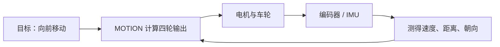

## 输出已经写下，接下来要知道动作结果

`START_MOTION` 已经让程序向四路电机写入 PWM 3000。此时的控制很像闭着眼睛推一辆小车：双手在用力，动作结果还没有回到控制程序。车身是否跑偏、轮子实际多快、是否到达目标，都要由传感器回答。

这种“给出输出，然后持续保持”的方式叫**开环控制**，英文是 **open-loop control**。厨房里把燃气旋钮转到某个位置后等待三分钟，就是一种开环做法；火力大小已经给定，锅里的真实温度没有参与调节。

机器人常常需要**反馈**，英文是 **feedback**。反馈像人的眼睛和耳朵，它把动作造成的结果送回控制器。控制器不断比较“我想要的状态”和“我测到的状态”，再调整输出，这个循环叫**闭环控制**，英文是 **closed-loop control**。



当前工程已经保留了产生反馈所需的底层硬件驱动。新的 `SENSORS` 层仍在搭建中，因此这些信号还没有进入 `motion_start_motion()` 的控制循环。

## 编码器记录车轮走过的刻度

编码器的英文是 **encoder**。它通常随着电机轴转动并产生一串电脉冲，效果很像自行车码表里的磁铁：车轮每转过一小段，计数器就多记一次。固定时间内的脉冲数可以帮助估计速度，累计脉冲数可以帮助估计距离。

`USER/system.c` 在上电初始化时依次调用 `EncoderA_Init()`、`EncoderB_Init()`、`EncoderC_Init()` 和 `EncoderD_Init()`。四个接口分别使用 STM32 的定时器计数。底层读取接口位于 `HARDWARE/encoder.c`：

```c
short Read_Encoder(ENCODER_t e)
{
    Encoder_TIM = (short)ENCODER_A_TIM->CNT;
    ENCODER_A_TIM->CNT = 0;
    return Encoder_TIM;
}
```

代码按传入的 A、B、C、D 选择对应定时器。读出计数后，它把计数器清零，下一次读取就得到下一个时间片里的新增脉冲。上面的片段只展示了 A 通道，完整函数对四个通道采用同样的处理。

要让这些数字参与运动，需要先约定读取周期、脉冲与轮周的换算关系、正负方向和异常值处理。随后 `SENSORS/encoder_feedback.c` 可以提供稳定接口，`MOTION` 再用它调节四路 PWM。当前 `SENSORS/README.md` 已经写下这个接口方向，实际的 `encoder_feedback.c` 尚待创建。

## IMU 感受车身的转动

车轮计数能描述各个电机的转动，车身朝向还需要另一双“眼睛”。工程中的 ICM20948 是一颗九轴**惯性测量单元**，英文是 **Inertial Measurement Unit，IMU**。它集合了加速度计、陀螺仪和磁力计。加速度计像人感受到的推背感，陀螺仪像内耳对旋转的感觉，磁力计则提供类似指南针的方向信息。

系统启动时会调用 `ICM20948_Init()`。底层驱动可以读取加速度和角速度，也提供静止状态下的零漂校准函数 `ICM20948_Calibrate_ZeroOffset()`。默认校准参数是采样 100 次、每次间隔 5 毫秒，完整过程约 500 毫秒；当前初始化只加载默认零漂值，没有自动执行这段阻塞校准。

协议中已经有 `GET_HEADING`，其中 heading 指车头朝向角。当前命令分发器会检查这条命令的载荷格式，然后回复 `NOT_IMPLEMENTED`。`SENSORS/heading.c`、周期读取、姿态融合和 heading telemetry 都属于后续接线工作。初始化成功说明硬件入口已经准备好，朝向角仍需要从原始传感器数据一步步计算出来。

## 升降、夹爪和推杆是另一组手脚

底盘负责移动，升降机构、夹爪和推杆负责操作物体。这些装置统称**执行机构**，英文是 **actuator**。可以把底盘看成机器人的腿，把夹爪看成手，升降机构则像手臂。腿和手面对的危险也不同：底盘关注车速与碰撞，升降和夹爪还要关注行程终点、卡住和夹持力度。

协议为这组机构准备了六条命令：`MOVE_LIFT_TO_HEIGHT`、`SET_LIFT`、`STOP_LIFT`、`SET_GRIPPER`、`START_PUSHROD` 和 `STOP_PUSHROD`。生成的协议代码已经能够拆出高度、方向、档位和开合状态。命令分发器目前在参数正确时回复 `NOT_IMPLEMENTED`，`LOWER_CONTROLLER/ACTUATORS/` 中保存的是设计说明，`lift.c`、`gripper.c` 和实际控制接口仍待加入工程。

执行机构常用**限位开关**，英文是 **limit switch**。它像电梯到达最高层时碰到的行程开关，告诉控制器机械结构已经走到边界。`SENSORS/README.md` 规划了 `limit_switch.c`，`ACTUATORS/README.md` 也把限位、超时保护和安全停止列为职责。当前仓库还没有这些实现文件，实机接线与有效电平也需要后续记录。

## 当前安全链已经走到哪里

安全保护可以看成沿命令旅程设置的多道门。当前代码已经有几道门，也有清楚的待建位置。

| 环节 | 当前代码中的行为 |
| --- | --- |
| 协议帧 | 检查协议版本、载荷长度上限 256 字节和 CRC；错误帧不会进入命令分发 |
| 命令参数 | 生成的解码函数检查参数长度；错误参数回复 `INVALID_ARGS` |
| 运动方向 | 无效的平移或旋转方向会调用 `motion_stop()` |
| 输出幅度 | 固定 PWM 为 3000，低于 16800 的满量程 |
| 主动停止 | `STOP_MOTION` 把四路 PWM 和方向引脚清零 |
| 使能开关 | PE4 输入已经由 `EnableKey_Init()` 初始化，APP 读取与联锁仍待接入 |
| 通信超时 | 持续运动命令的超时停止仍待接入 |
| 看门狗 | 应用层的初始化与定期喂狗仍待接入 |
| 限位与急停状态 | `SENSORS`、`ACTUATORS` 和计划中的 `robot_state.c` 将承接这些状态 |

这里有一个需要牢记的现状：`START_MOTION` 写入 PWM 后，输出会一直保持，直到新命令覆盖它或 `STOP_MOTION` 到达。串口线松动或上位机退出时，当前 APP 没有依据“最后一次有效命令的时间”自动停止底盘。

这类保护通常叫**命令超时**，英文是 **command timeout**。控制器记录最后一条有效运动命令到达的时刻，周期性检查经过了多久。超过约定时间后调用 `motion_stop()`。具体超时时间需要结合上位机发送频率和整车测试确定，当前仓库没有给出可直接采用的数值。

**看门狗**的英文是 **watchdog**。它像需要工作人员定时签到的值班室：程序正常运行时不断“喂狗”，任务卡死后签到停止，硬件便触发复位。工程包含 STM32 的 IWDG、WWDG 库头文件，当前业务代码中还没有看门狗初始化与喂狗调用，因此它处在待接入阶段。

使能开关也处在相似位置。`EnableKey_Init()` 已把 PE4 配置为上拉输入，宏 `EN` 可以读取引脚。新的 `app_task` 当前只等待串口字节，没有读取 `EN` 并控制运动许可。后续把使能、急停、通信在线状态统一放入机器人状态中，所有会产生机械动作的入口都能检查同一份许可。

原厂 `BALANCE` 业务保存了低电压、自检、急停和命令丢失的处理思路，当前 Keil 目标把这些文件留作参考。新的 `APP`、`MOTION`、`SENSORS` 和 `ACTUATORS` 将重新接入限位、急停、命令超时和看门狗，形成比赛业务自己的安全状态。

## 从“能转”走向“可控”

下一段开发需要让反馈和安全先形成小闭环。编码器能够稳定读取后，固定的 PWM 3000 就可以逐渐变成目标速度；四个轮子的实测速度参与调节，车身跑偏时控制器有机会修正。IMU 朝向可用后，按角度旋转和 `GET_HEADING` 才能获得可靠的数据来源。升降、夹爪与推杆接入时，限位、超时和停止应当与动作代码同时出现。

仓库已经保留底层接口和模块规划，下一步是把它们接进新的业务链。整车烧录、轮子实转和比赛场地测试将通过后续记录补齐；本书此处采用源码能够确认的动作范围。

那条 `START_MOTION` 已经在软件里走完从命令到电机输出的第一段旅程。接下来，我们把镜头拉远，沿着 Git 历史看看这条主线怎样从原厂工程中生长出来，也看看整个项目走到了哪里。
